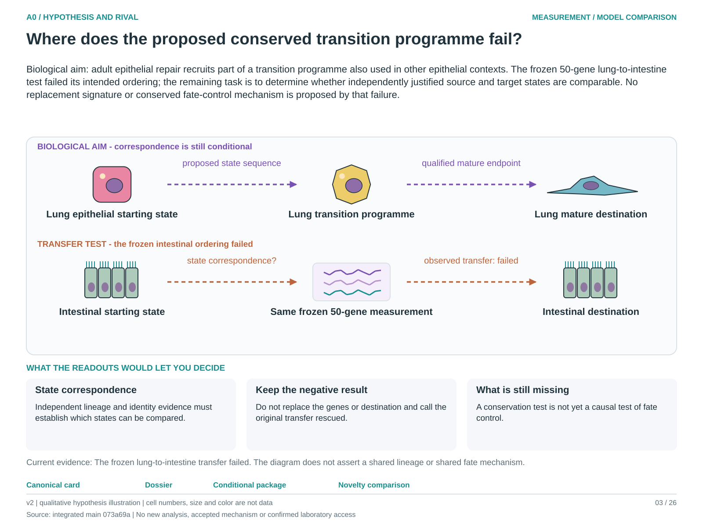

# A0: literature context and hypothesis schematic

Reviewed 3 October 2026. This note connects published findings to the current proposed question. It is a bounded synthesis, not novelty clearance or scientific acceptance.

## Published starting point

Transition-associated RNA and developmental epithelial states are established starting points. Shared genes make correspondence plausible, but do not establish the same state or fate across organs.

| Primary source | Inspected locator and access record |
|---|---|
| [Strunz 2020](https://www.nature.com/articles/s41467-020-17358-3) | Krt8-associated repair transition; abstract and source identification. [Access / prior review](../../docs/research_dossiers/review_2026-10-03/SOURCES.md#s05) |
| [Guo 2019](https://www.nature.com/articles/s41467-018-07770-1) | Neonatal epithelial subtype results. [Access / prior review](../../docs/research_dossiers/review_2026-10-03/SOURCES.md#s04) |

Sources above reuse the named review unless the update ledger explicitly records a fresh inspection. Published-source evidence and reanalysis of the same material are not independent replication.

## Repository observation

The frozen 50-gene lung programme failed the specified intestinal intermediate-minus-mature contrast: the three-mouse median was negative and only one mouse was positive. This is a failed operational transfer, not a direct experiment on conserved function. The original stop remains in force.

Exact current result locators:

- [RQ_Specified/A0_conserved_epithelial_transition_program/README.md](README.md)
- [RQ_Specified/A0_conserved_epithelial_transition_program/reports/PILOT_V1_RESULTS.md](reports/PILOT_V1_RESULTS.md)
- [RQ_Specified/A0_conserved_epithelial_transition_program/reports/SOURCE_RECOVERY.md](reports/SOURCE_RECOVERY.md)
- [docs/research_dossiers/followup_2026-10-03/NOVELTY.md](../../docs/research_dossiers/followup_2026-10-03/NOVELTY.md)

## What this question could add

A0 can test where a fixed measurement transports and where biological correspondence fails. Its failed intestinal transfer is information about the boundary; a new mechanism is not required to make that boundary useful.

## Current hypothesis and rival

Biological aim: adult epithelial repair recruits part of a transition programme also used in other epithelial contexts. The frozen 50-gene lung-to-intestine test failed its intended ordering; the remaining task is to determine whether independently justified source and target states are comparable. No replacement signature or conserved fate-control mechanism is proposed by that failure.

**Strongest rival:** The target populations are not comparable biological transitions; sampling time or coverage obscures the intended contrast; alternatively the proposed cross-tissue specificity is absent.

## What the comparison would teach

An independently justified state comparison could delimit where the original transfer question applies. Re-scoring the same data after changing genes or labels would test a new, exposed hypothesis and cannot rescue the frozen result.

## Hypothesis schematic

[Editable hypothesis schematic](schematics/hypothesis_v2.svg). Original explanatory artwork. Dashed arrows denote the labelled proposal or rival; shapes, colours and cell counts are qualitative, not observations. The three readout cards explain which uncertainty a measurement could resolve. Missing features/endpoints remain marked.

A0–A23 artwork is preserved from the checked v2 atlas at source revision `073a69a758f25f988ecc18402477efa268c00927`. Its full hypothesis was compared with the current dossier. Later literature and scope context are supplied by this note.

## Next literature check

Planned query (not reported as newly executed): `conserved epithelial transition lung intestine independent lineage state correspondence 2025 2026`. Expand to synonyms, nearest source references/citations and conflicting results using the [literature workflow](../../docs/LITERATURE_WORKFLOW.md). Recheck the exact population, comparison, timing, unit and endpoint before making a stronger contribution claim.

**Current unresolved specification:** The existing transfer test cannot distinguish absence of a conserved function from an invalid cross-tissue state or endpoint correspondence. Neither possibility licenses post hoc signature rescue.

**Interpretation limit:** The negative transfer restricts this signature and contrast; it neither proves absence of all conserved epithelial biology nor supplies a lung maturation predictor.

[Current dossier](../../docs/research_dossiers/A0.md) · [All-question context index](../../docs/research_dossiers/literature_context_2026-10-03/README.md)
