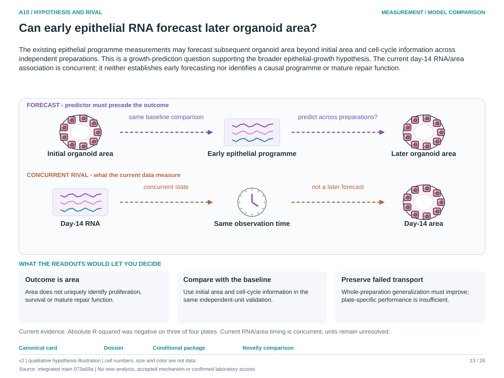

# A10: literature context and hypothesis schematic

Reviewed 3 October 2026. This note connects published findings to the current proposed question. It is a bounded synthesis, not novelty clearance or scientific acceptance.

## Published starting point

The published epithelial niche screen connects perturbations and organoid outcomes. A same-time molecular association is already close to that source result.

| Primary source | Inspected locator and access record |
|---|---|
| [Nabhan 2026](https://doi.org/10.1073/pnas.2606113123) | Fig. 4/S7F and niche context; local primary PDF audit. [Access / prior review](../../docs/research_dossiers/NOVELTY_SPECIFICITY_APPLICATION_2026-10-03.md) |

Sources above reuse the named review unless the update ledger explicitly records a fresh inspection. Published-source evidence and reanalysis of the same material are not independent replication.

## Repository observation

Residual-growth scores improved the descriptive baseline, but absolute predictive R-squared was negative on three of four plates. Target and plate are entangled and independent preparation identities remain unresolved.

Exact current result locators:

- [RQ_Specified/A10_organoid_growth_outcome/README.md](README.md)
- [RQ_Specified/A10_organoid_growth_outcome/reports/FOLLOWUP_RESULTS.md](reports/FOLLOWUP_RESULTS.md)
- [docs/research_dossiers/qualification_2026-10-03/RESULTS.md](../../docs/research_dossiers/qualification_2026-10-03/RESULTS.md)
- [docs/research_dossiers/followup_2026-10-03/NOVELTY.md](../../docs/research_dossiers/followup_2026-10-03/NOVELTY.md)
- [docs/research_dossiers/followup_2026-10-03/METADATA.md](../../docs/research_dossiers/followup_2026-10-03/METADATA.md)

## What this question could add

An early, fixed measurement that forecasts later area in independent preparations could add transportable prediction. Area remains a growth endpoint; it cannot establish mature AT1 identity or repair function.

## Current hypothesis and rival

The existing epithelial programme measurements may forecast subsequent organoid area beyond initial area and cell-cycle information across independent preparations. This is a growth-prediction question supporting the broader epithelial-growth hypothesis. The current day-14 RNA/area association is concurrent; it neither establishes early forecasting nor identifies a causal programme or mature repair function.

**Strongest rival:** The association is concurrent growth state, plate/target confounding, area measurement or a preparation-specific effect.

## What the comparison would teach

An early predictor that improves unit-level held-out area prediction beyond the same baseline supports transport. Failure on whole-preparation holdout weakens it. Preserve negative absolute R-squared on three of four plates; organoid area cannot distinguish proliferation, survival and lumen changes by itself.

## Hypothesis schematic

[Editable hypothesis schematic](schematics/hypothesis_v2.svg). Original explanatory artwork. Dashed arrows denote the labelled proposal or rival; shapes, colours and cell counts are qualitative, not observations. The three readout cards explain which uncertainty a measurement could resolve. Missing features/endpoints remain marked.

A0–A23 artwork is preserved from the checked v2 atlas at source revision `073a69a758f25f988ecc18402477efa268c00927`. Its full hypothesis was compared with the current dossier. Later literature and scope context are supplied by this note.

## Next literature check

Planned query (not reported as newly executed): `alveolar organoid early molecular prediction later area independent preparation 2025 2026`. Expand to synonyms, nearest source references/citations and conflicting results using the [literature workflow](../../docs/LITERATURE_WORKFLOW.md). Recheck the exact population, comparison, timing, unit and endpoint before making a stronger contribution claim.

**Current unresolved specification:** The result has not demonstrated transport to independent preparations, temporal prediction or a mechanistic contribution to growth.

**Interpretation limit:** Organoid area is not repair capacity, mature fate or a direct count of productive descendants.

[Current dossier](../../docs/research_dossiers/A10.md) · [All-question context index](../../docs/research_dossiers/literature_context_2026-10-03/README.md)
