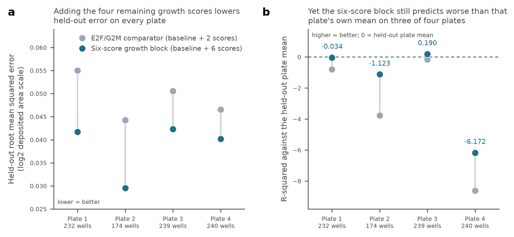

# A10 endpoint consolidation: what is measured, when, and in which unit

## 1. Purpose and status

**Documentation consolidation, 28 September 2026. Nothing is rescored.** This
report collects, in one place, what the A10 endpoint measures, when it is
measured relative to the RNA, what the plate and target layout allows, and what
remains unknown about preparation identity. Every number below is copied from a
tracked document or table in this package and cited to its path. No model was
fitted, no matrix was rescored, no dataset was searched, and no claim grade,
register wording or frozen contract text was changed. The consolidation answers
the A10 item of the [development proposal](../../../docs/audits/2026-09-28-rq-development-proposal/PROPOSAL.md)
("align the claim with timing and units") and the A10 row of the
[gap-fill ledger](../../../docs/roadmap_runs/2026-09-28-gap-fill/RESULTS.md).
Historical reports keep their dates, numbers and interpretations.

## 2. What the endpoint measures, and when

The imaging readout is an organoid-size statistic of a well, not a cell-level or
animal-level measurement.

- **Primary endpoint.** "mean organoid area at day 14, conditional on mean
  organoid area at day 7", with organoid count and organoid area proportion
  declared secondary ([config/a10_outcome_contract.json](../config/a10_outcome_contract.json),
  `outcome`). The same endpoint is stated in [RATIONALE.md](../RATIONALE.md)
  ("The fixed primary endpoint is day-14 mean area conditional on day-7 mean
  area") and in [PLAN.md](../PLAN.md), stage 2.
- **Scales.** Primary analyses use `log2(deposited day14 area + 1)` with
  `log2(deposited day7 area + 1)`; the prespecified sensitivity uses the
  untransformed deposited values, with "no physical units or unlogged area
  interpretation" inferred ([config/a10_followup_models.json](../config/a10_followup_models.json),
  `outcome_scales`).
- **Timing of the imaging.** Imaging supplies organoid count, mean area and
  area proportion at days 7 and 14 ([RATIONALE.md](../RATIONALE.md)).
- **Timing of the RNA.** The RNA libraries are day-14. The recovered methods
  record "Day-7/day-14 imaging, day-14 RNA and SAM processing", with the
  consequence that "A10 RNA remains concurrent with the later area endpoint"
  ([P1_SCREEN_DESIGN.md](../../../docs/roadmap_runs/2026-09-27/P1_SCREEN_DESIGN.md)).
  The same point is stated in the earlier fits: "Expression and outcome are both
  from day 14, so nothing here bears on prediction"
  ([STAGE3_FIT_REPORT.md](STAGE3_FIT_REPORT.md), [STAGE4_REVISED_REPORT.md](STAGE4_REVISED_REPORT.md)).
- **What "baseline imaging" is.** In the follow-up specification the baseline is
  three features: the day-7 deposited area statistic, the epithelial read
  fraction, and `log2(epithelial library total + 1)`
  ([config/a10_followup_models.json](../config/a10_followup_models.json),
  `baseline_features`). Only the first is imaging; the other two are RNA
  composition and depth proxies, described in
  [FOLLOWUP_RESULTS.md](FOLLOWUP_RESULTS.md) as "RNA proxies, not direct cell
  counts". The day-7 image is the only measurement in the baseline that is
  genuinely earlier than the endpoint, and it is itself post-perturbation
  ([RATIONALE.md](../RATIONALE.md)).
- **What the deposited number is not.** GEO "describes mean area, count and
  covered fraction but provides no physical area units or transformation
  definition", and `area * count / coverage` is not a fixed quantity, so no
  conversion to total cell mass or physical area is inferred
  ([FOLLOWUP_DESIGN_REPORT.md](FOLLOWUP_DESIGN_REPORT.md)). Coverage is derived
  from bounding-box unions
  ([P1_SCREEN_DESIGN.md](../../../docs/roadmap_runs/2026-09-27/P1_SCREEN_DESIGN.md)).
  Area can change without proportional changes in cell number
  ([RATIONALE.md](../RATIONALE.md)).
- **Segmentation.** All 1,883 imaging rows carry the same `SAM1` segmentation
  label; that label alone does not establish shared acquisition or calibration
  ([FOLLOWUP_RESULTS.md](FOLLOWUP_RESULTS.md);
  [tables/followup_v1/diagnostic_segmentation.tsv](../tables/followup_v1/diagnostic_segmentation.tsv)).
- **Resolution of the concurrent RNA.** Across 886 libraries the median read
  fractions that are not assigned to a single species are 0.034 ambiguous,
  0.112 both and 0.069 neither, so about a fifth of reads are unassigned; this
  bounds how cleanly the epithelial and fibroblast transcriptomes separate and
  is why composition covariates are mandatory
  ([STAGE1_IDENTITY_AUDIT.md](STAGE1_IDENTITY_AUDIT.md)).

## 3. Plate and target dependence

| Quantity | Value | Source |
|---|---|---|
| Plates | 4 | [FOLLOWUP_DESIGN_REPORT.md](FOLLOWUP_DESIGN_REPORT.md) |
| Deposited plate-replicate groups | 15 with RNA, of 16 combinations | [STAGE1_IDENTITY_AUDIT.md](STAGE1_IDENTITY_AUDIT.md), [tables/preparation_units.tsv](../tables/preparation_units.tsv) |
| RNA libraries | 886 | [STAGE1_IDENTITY_AUDIT.md](STAGE1_IDENTITY_AUDIT.md) |
| Wells in the completed area analysis | 885 | [STAGE3_FIT_REPORT.md](STAGE3_FIT_REPORT.md) |
| Perturbation targets | 203 | [FOLLOWUP_DESIGN_REPORT.md](FOLLOWUP_DESIGN_REPORT.md) |
| Targets occurring on more than one plate | 4 (MECOM, RNF43, TIGIT, TDTOMATO) | [FOLLOWUP_DESIGN_REPORT.md](FOLLOWUP_DESIGN_REPORT.md), [tables/followup_v1/diagnostic_target_overlap.tsv](../tables/followup_v1/diagnostic_target_overlap.tsv) |
| Wells per plate, primary plate-shift evaluation | 232 / 174 / 239 / 240 | [tables/followup_v1/model_absolute_performance.tsv](../tables/followup_v1/model_absolute_performance.tsv) |

Targets per plate are 53 / 54 / 53 / 51 with all targets, and 51 / 52 / 51 / 49
after removing the over-replicated target and TDTOMATO. In that reduced layout
only MECOM is common to plates 1 and 2 and only RNF43 is common to plates 1 and
4; every other plate pair shares no target, and plate 3 shares none with any
other plate ([tables/followup_v1/diagnostic_target_overlap.tsv](../tables/followup_v1/diagnostic_target_overlap.tsv),
summarized in [FOLLOWUP_DESIGN_REPORT.md](FOLLOWUP_DESIGN_REPORT.md)).

**Consequence for plate handling.** A target-adjusted four-plate contrast is not
identifiable in this design, and that model was pruned rather than fitted
([FOLLOWUP_DESIGN_REPORT.md](FOLLOWUP_DESIGN_REPORT.md),
[FOLLOWUP_RESULTS.md](FOLLOWUP_RESULTS.md)). Two evaluations were used instead,
both frozen before fitting in
[config/a10_followup_models.json](../config/a10_followup_models.json):

1. **Within-group.** Leave one of the 15 deposited plate-replicate groups out,
   centring predictors and outcome within each group including the held-out
   group's own observed mean. The contract states this "deliberately retains the
   original within-observed-group estimand; it is not unseen-group prediction".
2. **Plate shift.** Leave one entire plate out, with no plate or target
   indicators and no outcome centring; all centring and scaling parameters are
   learned on training plates only. The contract calls this "joint plate/target
   distribution transport, not prospective forecasting because RNA is concurrent".

Descriptive plate differences exist but do not explain the fit differences:
median deposited day-14 area is 8.345 / 8.342 / 8.763 / 8.787 and median
epithelial RNA fraction 0.746 / 0.699 / 0.789 / 0.762 across plates 1-4; target
mix and unmeasured preparation remain rivals
([FOLLOWUP_DESIGN_REPORT.md](FOLLOWUP_DESIGN_REPORT.md)).

## 4. Preparation identity

**The four repeat wells are not four independent preparations.** The recovered
supplementary methods state that four replicate Transwells receive aliquots of a
common cell-Matrigel mixture, with the explicit consequence "Do not count the
four repeat labels as four independently prepared cultures"
([P1_SCREEN_DESIGN.md](../../../docs/roadmap_runs/2026-09-27/P1_SCREEN_DESIGN.md)).
The same record notes same-patient passage-3 fibroblasts as "a protocol-level
restriction, not a sample-level donor/lot crosswalk", and documents recombinant
EGF in regular medium (Fig. S5). This is consistent with the repository's
standing rule that organoids from one preparation and libraries from the same
pool do not increase independent n
([MC1](../../../docs/RQ_MEASUREMENT_CONTRACTS.md#mc1)).

**What the 886 GEO sample records resolve.** They carry explicit library IDs
that match the RNA libraries one to one through the `Library name:` description
field rather than through human-readable titles, they reproduce the 885 eligible
imaging joins, and they expose cell type, genotype and batch
([FOLLOWUP_DESIGN_REPORT.md](FOLLOWUP_DESIGN_REPORT.md),
[FOLLOWUP_RESULTS.md](FOLLOWUP_RESULTS.md)). The deposit's only design field on
a sample record is the batch label, for example `batch: plate1-1`
([STAGE1_IDENTITY_AUDIT.md](STAGE1_IDENTITY_AUDIT.md)).

**What they do not resolve.** "No sample-level preparation, isolation, animal,
donor or fibroblast-lot identifiers were found", and the common processing text
describes RNA preparation and species assignment, not a sample-to-preparation
crosswalk ([FOLLOWUP_RESULTS.md](FOLLOWUP_RESULTS.md),
[FOLLOWUP_DESIGN_REPORT.md](FOLLOWUP_DESIGN_REPORT.md)). This is a bounded
statement about inspected public metadata, not proof that the information is
unobtainable. The source caption reports four replicates per gene but does not
map libraries to independent preparations
([FOLLOWUP_RESULTS.md](FOLLOWUP_RESULTS.md)).

**What is still missing, specifically.**

- A per-library preparation and fibroblast-lot crosswalk. The A10 row of the
  [gap-fill ledger](../../../docs/roadmap_runs/2026-09-28-gap-fill/RESULTS.md)
  names a "Preparation/guide/image-calibration map" as the evidence needed.
- Well-specific editing efficiency. The layout has three guide columns but no
  measure of editing success; the transcript diagnostic (58 of 76 testable genes
  reduced when targeted) is a limited consistency check against pooled other
  targets, not verification of every edit
  ([FOLLOWUP_DESIGN_REPORT.md](FOLLOWUP_DESIGN_REPORT.md),
  [STAGE3_FIT_REPORT.md](STAGE3_FIT_REPORT.md), [RATIONALE.md](../RATIONALE.md)).
  Thirty tdTomato libraries lack guide-design rows
  ([P1_SCREEN_DESIGN.md](../../../docs/roadmap_runs/2026-09-27/P1_SCREEN_DESIGN.md)),
  which matches the 30 libraries of one target absent from the design table in
  the stage 1 join ([STAGE1_IDENTITY_AUDIT.md](STAGE1_IDENTITY_AUDIT.md)).
- Imaging calibration and the transformation behind the deposited statistic
  (section 2).
- An external cohort. The recorded search found no public dataset pairing
  well-level RNA with measured organoid growth under perturbation, which leaves
  the internal preparation structure as the only validation route
  ([PUBLIC_DATA_SEARCH.md](PUBLIC_DATA_SEARCH.md)).

**Replication structure that remains, and its limits.** One target appears in 87
libraries and another in 30, against four for most; the over-replicated target
dominated a pooled fit until it was handled explicitly
([STAGE1_IDENTITY_AUDIT.md](STAGE1_IDENTITY_AUDIT.md),
[STAGE3_FIT_REPORT.md](STAGE3_FIT_REPORT.md)). A post-fit source check
identifies TIGIT as the authors' in-plate control
([FOLLOWUP_RESULTS.md](FOLLOWUP_RESULTS.md)). One plate-replicate group
(plate2-rep1) has imaging but no RNA, which is why 15 of 16 combinations enter
([tables/preparation_units.tsv](../tables/preparation_units.tsv)).

## 5. Two claims that must stay distinct

**(a) Concurrent association.** Do measured epithelial RNA programmes add
information about organoid size conditional on baseline imaging and the recorded
design? This is the question the proposal nominates as A10's current question
([PROPOSAL.md](../../../docs/audits/2026-09-28-rq-development-proposal/PROPOSAL.md)).
Both the day-14 RNA and the day-14 area are measured at the same time, so any
result is an association at one time point conditional on an earlier image, not
an effect and not a forecast.

**(b) Prospective prediction.** Would the measured programmes predict a later
outcome? The proposal states the requirement: "Future prediction requires
earlier predictors, an appropriate baseline and specified absolute-performance
evaluation"
([PROPOSAL.md](../../../docs/audits/2026-09-28-rq-development-proposal/PROPOSAL.md)),
and the gap-fill ledger's A10 row asks the question to be chosen explicitly:
"choose concurrent association versus future prediction, then
independent-preparation calibration and absolute performance"
([RESULTS.md](../../../docs/roadmap_runs/2026-09-28-gap-fill/RESULTS.md)).

**Which claim the completed analyses bear on.** All of them bear on (a) only.
[PLAN.md](../PLAN.md) refuses forecasting outright ("No claim of forecasting.
Expression and outcome are both from day 14"). Stage 3 and stage 4 repeat the
same limit. The plate-shift evaluation, despite holding out an entire plate, is
transport across a joint plate and target-distribution shift, not forecasting,
because the RNA is still concurrent with the endpoint
([config/a10_followup_models.json](../config/a10_followup_models.json),
[FOLLOWUP_RESULTS.md](FOLLOWUP_RESULTS.md)). Nothing in the completed work bears
on (b), and no part of this consolidation moves A10 towards (b).

## 6. Relative gains reported alongside absolute performance

All values below are the primary setting on the inherited `log2` scale, copied
from the tracked follow-up tables.

**Relative error reduction of the six-score growth block beyond the nominated
E2F/G2M block** (`remaining_over_proliferation`): pooled 0.0484316573153 within
groups (positive in 11 of 15 groups; equal-fold mean 0.0283842604038) and pooled
0.369550263632 under plate shift (positive in all 4 plates)
([tables/followup_v1/model_comparisons.tsv](../tables/followup_v1/model_comparisons.tsv)).
The corresponding per-plate reductions are 0.425826248892 (plate 1),
0.554745123501 (plate 2), 0.299212980905 (plate 3) and 0.254935809302 (plate 4)
([tables/followup_v1/model_fold_comparisons.tsv](../tables/followup_v1/model_fold_comparisons.tsv)).
[FOLLOWUP_RESULTS.md](FOLLOWUP_RESULTS.md) reports the pooled pair as 4.84% and
36.96%.

**Full growth block over baseline** (`full_growth_over_baseline`): pooled
0.0684145041146 within groups (positive in 8 of 15 groups; equal-fold mean
0.010189723873) and pooled 0.423867618254 under plate shift, positive on all
four plates at
0.401488862991, 0.557229715612, 0.366716943184 and 0.43559783088, reported as
40.15%, 55.72%, 36.67% and 43.56%
([tables/followup_v1/model_comparisons.tsv](../tables/followup_v1/model_comparisons.tsv),
[tables/followup_v1/model_fold_comparisons.tsv](../tables/followup_v1/model_fold_comparisons.tsv),
[FOLLOWUP_RESULTS.md](FOLLOWUP_RESULTS.md)).

**Per-plate held-out error and absolute R-squared**, from
[tables/followup_v1/model_absolute_performance.tsv](../tables/followup_v1/model_absolute_performance.tsv).
`R-squared` here is computed against the held-out plate's own mean; that mean
enters only this diagnostic denominator and is not used to generate predictions
([FOLLOWUP_RESULTS.md](FOLLOWUP_RESULTS.md)).

| Held-out plate | Wells | Model | Held-out RMSE | R-squared against held-out mean |
|---|--:|---|--:|--:|
| 1 | 232 | baseline | 0.0538996147236 | -0.728408484575 |
| 1 | 232 | baseline+proliferation (E2F/G2M) | 0.0550300758839 | -0.80167018317 |
| 1 | 232 | baseline+six growth scores | 0.0416986292652 | -0.0344717273173 |
| 2 | 174 | baseline | 0.0443586137347 | -3.79531785248 |
| 2 | 174 | baseline+proliferation (E2F/G2M) | 0.0442346765816 | -3.76855922609 |
| 2 | 174 | baseline+six growth scores | 0.029516659042 | -1.1232242493 |
| 3 | 239 | baseline | 0.0531822123984 | -0.278467103557 |
| 3 | 239 | baseline+proliferation (E2F/G2M) | 0.0505559540291 | -0.155317569148 |
| 3 | 239 | baseline+six growth scores | 0.0423219173372 | 0.190368444608 |
| 4 | 240 | baseline | 0.0534919134552 | -11.7074630519 |
| 4 | 240 | baseline+proliferation (E2F/G2M) | 0.0465570683002 | -8.62617691228 |
| 4 | 240 | baseline+six growth scores | 0.040186711619 | -6.17211971079 |

The six-score block has lower held-out error than the E2F/G2M comparator on all
four plates, and its absolute R-squared is negative on three of the four; only
plate 3 is positive, at 0.190368444608. A negative value means worse squared
error than the held-out plate's observed mean. The two readings are not in
conflict and neither cancels the other: the relative gains support added
information within this screen, while the absolute values show that substantial
calibration and transport error remains
([FOLLOWUP_RESULTS.md](FOLLOWUP_RESULTS.md)).

Two further weighting facts belong next to the headline percentages. Within
groups the nominated proliferation block alone gives a pooled 0.0209999071039
but an equal-group mean of -0.014555483575, and it reaches only 0.0196149648913
on the untransformed scale, below the declared 0.02 descriptive margin; for the
full growth block the equal-group mean is 0.010189723873 against the pooled
0.0684145041146
([tables/followup_v1/model_comparisons.tsv](../tables/followup_v1/model_comparisons.tsv),
[FOLLOWUP_RESULTS.md](FOLLOWUP_RESULTS.md)). The 2% margin is "a pragmatic
descriptive threshold, not a physical or clinically meaningful effect margin",
and the percentages use a reference-error metric that is not the original
delta-R-squared ([config/a10_followup_models.json](../config/a10_followup_models.json),
[FOLLOWUP_RESULTS.md](FOLLOWUP_RESULTS.md)).

**Figure A10-F.** Per-plate held-out performance of the nominated E2F/G2M
comparator and the six-score growth block, primary setting, inherited log2
scale. (a) Held-out root mean squared error; the six-score block is lower on all
four plates. (b) R-squared against the held-out plate's own mean; the six-score
block is negative on plates 1, 2 and 4 and positive only on plate 3. Points are
deposited plates, not established independent preparations. Plotted table:
[tables/followup_v1/model_absolute_performance.tsv](../tables/followup_v1/model_absolute_performance.tsv).
Script: [scripts/plot_followup_plate_performance.py](../scripts/plot_followup_plate_performance.py);
run record: [figures/A10_F_followup_plate_performance.run.json](../figures/A10_F_followup_plate_performance.run.json).

## 7. The C49 correction and what a significance cutoff bounds

The 28 September gap-fill records, under the A10 row and in its documentation
section, that "C49's approximate rho 0.43 significance cutoff is no longer
presented as a bound on absent effects", with no claim grade changed
([RESULTS.md](../../../docs/roadmap_runs/2026-09-28-gap-fill/RESULTS.md)).

What that cutoff does: it describes the approximate correlation magnitude that
the design in question would have had to reach for its test to be declared
significant at its sample size. It is a property of the test and the number of
units, and it locates where a detection threshold sits.

What it does not do: it is not a confidence bound, it does not exclude
correlations below its value, and it therefore cannot support a statement that
an effect is absent or is smaller than some size. An observed non-significant
estimate with a detection threshold near rho 0.43 is uninformative about
everything weaker than that threshold, which is why the previous wording was
corrected rather than the underlying number changed. The repository rule is the
same: "Positive nonsignificant estimates do not establish absence. Equivalence
needs a stated useful-effect margin and suitable precision"
([RESEARCH_ARCHITECTURE.md](../../../docs/RESEARCH_ARCHITECTURE.md), rule 5;
[MC1](../../../docs/RQ_MEASUREMENT_CONTRACTS.md#mc1)).

This matters for A10 because A10's own comparisons supply no p-values, no
confidence intervals and no BH procedure, by explicit design while the units are
unresolved ([FOLLOWUP_RESULTS.md](FOLLOWUP_RESULTS.md),
[config/a10_followup_models.json](../config/a10_followup_models.json),
[FOLLOWUP_PLAN.md](../FOLLOWUP_PLAN.md)). A10 therefore cannot make absence
claims of any kind: the negative fibroblast increment of -0.0154 is a
specification-dependent point estimate, and "No confidence bound establishes
precise absence of a fibroblast contribution"
([STAGE4_REVISED_REPORT.md](STAGE4_REVISED_REPORT.md), register card A10). A
below-margin or negative increment is not evidence of no biological role.

## 8. ENDPOINT STATEMENT

**For reuse by A1, A8 and A14.** A10's endpoint is the deposited day-14 mean
organoid area statistic of a single Transwell well, evaluated conditional on the
same well's deposited day-7 mean area, on the inherited `log2(deposited area +
1)` scale with an untransformed sensitivity; the deposited statistic has no
physical area units and no deposited transformation definition, and area can
change without a proportional change in cell number. Its timing is concurrent
with, not later than, the RNA it is related to: imaging is at days 7 and 14 and
the RNA libraries are day-14, so the day-7 image is the only genuinely earlier
measurement in the design, and it is itself post-perturbation. The biological
unit actually available is the well: 885 analysed wells sit in 15 deposited
plate-replicate groups across four plates, the four repeat wells of a target are
aliquots of one common cell-Matrigel mixture, and no deposited field maps a
library to an isolation, animal, donor or fibroblast lot, so no level of this
design has been shown to supply independent preparations. Accordingly this
endpoint licenses statements of the form "epithelial RNA programmes measured at
day 14 carry information about day-14 organoid size beyond day-7 size and
recorded composition, within this screen", including transport of that
association to a held-out plate under a joint plate and target shift; and it does
not license treating organoid area as a mature outcome, because it measures size
and morphology rather than total tissue production, viable-cell yield, mature
AT1 identity or function, or repair in a living lung. Because predictor and
outcome are measured at the same time and in the same well, this endpoint cannot
serve as the later outcome of an early-feature-to-later-outcome test: such a test
needs predictors measured before the outcome, a baseline appropriate to that
comparison, a specified absolute-performance evaluation, and units that are
independent preparations. A1, A8 and A14 may cite A10 as a measured, non-RNA,
concurrent growth endpoint with an unresolved biological unit; they may not cite
it as an independently replicated mature-fate, lineage-yield or repair outcome,
and they may not treat its held-out plate results as evidence that any programme
predicts a later outcome.

## 9. What this consolidation refuses to do

- **It does not expand any model.** No block, score, pathway or interaction was
  added, and the pruning decisions recorded in
  [FOLLOWUP_RESULTS.md](FOLLOWUP_RESULTS.md) and
  [FOLLOWUP_DESIGN_REPORT.md](FOLLOWUP_DESIGN_REPORT.md) stand.
- **It does not promote repair prediction.** The completed analyses bear on
  concurrent association only (section 5); organoid area is not mature AT1 fate,
  tissue yield or in vivo repair.
- **It does not resolve units by assumption.** Preparation identity is a missing
  fact ([RATIONALE.md](../RATIONALE.md)); it is not settled here by relabelling
  wells, replicate indices or plates as preparations, and the split-mixture
  ceiling from [P1_SCREEN_DESIGN.md](../../../docs/roadmap_runs/2026-09-27/P1_SCREEN_DESIGN.md)
  is retained.
- **It does not change frozen text.** No claim grade, register-card wording,
  contract, historical number or dated report was edited; the figure in section
  6 presents values already tracked in `tables/followup_v1/`.

## 10. Sources

| Document or table | Used for |
|---|---|
| [README.md](../README.md) | Current status, the four-target and 886-record summary, prohibitions |
| [RATIONALE.md](../RATIONALE.md) | Endpoint definition and limits, concurrency, unit statement, per-unit heterogeneity |
| [PLAN.md](../PLAN.md) | Frozen outcome and baseline, holdout rule, refusal of forecasting claims |
| [FOLLOWUP_PLAN.md](../FOLLOWUP_PLAN.md) | Diagnostic-first sequence, no fabricated BH procedure |
| [reports/STAGE1_IDENTITY_AUDIT.md](STAGE1_IDENTITY_AUDIT.md) | Join counts, batch-only sample field, read-assignment medians, per-target replication |
| [reports/STAGE3_FIT_REPORT.md](STAGE3_FIT_REPORT.md) | 885 wells and 15 units, transcript-reduction check, concurrency limit |
| [reports/STAGE4_REVISED_REPORT.md](STAGE4_REVISED_REPORT.md) | Revised increments, no precise-absence bound, unchanged limits |
| [reports/FOLLOWUP_DESIGN_REPORT.md](FOLLOWUP_DESIGN_REPORT.md) | Target/plate overlap, SAM1 rows, absent preparation fields, plate medians, guide columns |
| [reports/FOLLOWUP_RESULTS.md](FOLLOWUP_RESULTS.md) | Pooled percentages, per-plate gains, R-squared table, metric caveats, TIGIT control |
| [reports/PUBLIC_DATA_SEARCH.md](PUBLIC_DATA_SEARCH.md) | Absence of an external validation cohort |
| [config/a10_outcome_contract.json](../config/a10_outcome_contract.json) | Primary and secondary endpoints, evaluation and decision rules |
| [config/a10_followup_models.json](../config/a10_followup_models.json) | Baseline features, blocks, outcome scales, two evaluations, 2% margin scope |
| [tables/preparation_units.tsv](../tables/preparation_units.tsv) | 15 groups with RNA; plate2-rep1 imaging without RNA |
| [tables/followup_v1/diagnostic_target_overlap.tsv](../tables/followup_v1/diagnostic_target_overlap.tsv) | Targets per plate and shared targets before and after removal |
| [tables/followup_v1/diagnostic_segmentation.tsv](../tables/followup_v1/diagnostic_segmentation.tsv) | Segmentation label and imaging rows per plate and day |
| [tables/followup_v1/model_comparisons.tsv](../tables/followup_v1/model_comparisons.tsv) | Pooled and equal-fold relative error reductions, positive-fold counts |
| [tables/followup_v1/model_fold_comparisons.tsv](../tables/followup_v1/model_fold_comparisons.tsv) | Per-plate relative error reductions |
| [tables/followup_v1/model_absolute_performance.tsv](../tables/followup_v1/model_absolute_performance.tsv) | Per-plate wells, RMSE and R-squared; the plotted table for figure A10-F |
| [docs/roadmap_runs/2026-09-27/P1_SCREEN_DESIGN.md](../../../docs/roadmap_runs/2026-09-27/P1_SCREEN_DESIGN.md) | Split-mixture wells, fibroblast protocol, EGF, imaging/RNA timing, coverage definition |
| [docs/roadmap_runs/2026-09-28-gap-fill/RESULTS.md](../../../docs/roadmap_runs/2026-09-28-gap-fill/RESULTS.md) | C49 wording correction; A10 row of the evidence ledger |
| [docs/audits/2026-09-28-rq-development-proposal/PROPOSAL.md](../../../docs/audits/2026-09-28-rq-development-proposal/PROPOSAL.md) | The A10 item this consolidation implements |
| [docs/RQ_MEASUREMENT_CONTRACTS.md](../../../docs/RQ_MEASUREMENT_CONTRACTS.md#mc1) | MC1 unit rules and the A10 outcome-gate line; MC5 programme-validation rule |
| [docs/RESEARCH_ARCHITECTURE.md](../../../docs/RESEARCH_ARCHITECTURE.md) | Shared rule on nonsignificant estimates and equivalence |
| [RESEARCH_QUESTIONS.md](../../../RESEARCH_QUESTIONS.md#a10) | A10 register card wording, quoted without change |
