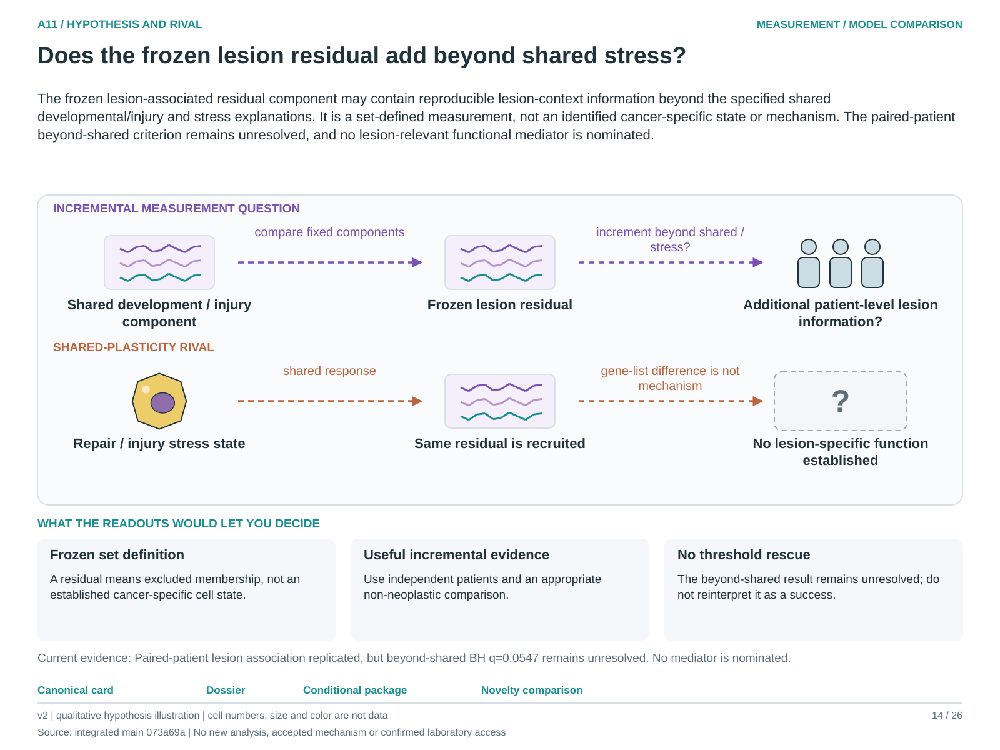

# A11: literature context and hypothesis schematic

**7 October refresh:** [current comparison and targeted primary-source review](../../docs/portfolio_extensions/2026-10-07/g1_epithelial/LITERATURE.md), with [executed results and capacity qualification](../../docs/portfolio_extensions/2026-10-07/g1_epithelial/RESULTS.md). The fixed genes remain unchanged; no novelty or untouched validation claim is made.

Reviewed 3 October 2026. This note connects published findings to the current proposed question. It is a bounded synthesis, not novelty clearance or scientific acceptance.

## Published starting point

Cancer plasticity and regenerative/stress programmes are established. The closest recent comparison strengthens shared stress as a rival to a lesion-specific interpretation.

| Primary source | Inspected locator and access record |
|---|---|
| [Marjanovic 2020](https://pmc.ncbi.nlm.nih.gov/articles/PMC7745838/) | HPCS result and author-signature provenance. [Access / prior review](../../docs/research_dossiers/followup_2026-10-03/NOVELTY.md) |
| [Chan 2026](https://www.nature.com/articles/s41586-025-09985-x) | Fig. 5c–e and Extended Data 11–12. [Access / prior review](../../docs/research_dossiers/followup_2026-10-03/NOVELTY.md) |

Sources above reuse the named review unless the update ledger explicitly records a fresh inspection. Published-source evidence and reanalysis of the same material are not independent replication.

## Repository observation

Lesion association replicated across eight patients, but the beyond-shared test remained unresolved at q = 0.0547. The three-donor acute-injury comparison did not establish injury specificity.

Exact current result locators:

- [RQ_Specified/A11_lesion_programme_addition/README.md](README.md)
- [RQ_Specified/A5_A11_shared_component_contract/reports/REVISED_TEST_RESULTS.md](../A5_A11_shared_component_contract/reports/REVISED_TEST_RESULTS.md)
- [RQ_Specified/A11_lesion_programme_addition/reports/ACUTE_INJURY_RESULTS.md](reports/ACUTE_INJURY_RESULTS.md)
- [docs/research_dossiers/qualification_2026-10-03/A11_PRECEDENTS.md](../../docs/research_dossiers/qualification_2026-10-03/A11_PRECEDENTS.md)
- [docs/research_dossiers/followup_2026-10-03/NOVELTY.md](../../docs/research_dossiers/followup_2026-10-03/NOVELTY.md)

## What this question could add

A11 initially asks what a fixed disjoint residual measures beyond the shared component. Useful replication or incremental information would not create a new cell state; worthwhile biological novelty remains provisional.

## Current hypothesis and rival

The frozen lesion-associated residual component may contain reproducible lesion-context information beyond the specified shared developmental/injury and stress explanations. It is a set-defined measurement, not an identified cancer-specific state or mechanism. The paired-patient beyond-shared criterion remains unresolved, and no lesion-relevant functional mediator is nominated.

**Strongest rival:** The signal is generic stress/plasticity, composition or uncertain baseline adjustment rather than a lesion-specific programme.

## What the comparison would teach

A stable patient-level increment against the frozen shared/stress comparison could support measurement utility. Comparable recruitment in matched non-neoplastic injury or no increment favors shared plasticity. Preserve the beyond-shared BH q=0.0547 result; this comparison cannot establish causal lesion specificity.

## Hypothesis schematic

[Editable hypothesis schematic](schematics/hypothesis_v2.svg). Original explanatory artwork. Dashed arrows denote the labelled proposal or rival; shapes, colours and cell counts are qualitative, not observations. The three readout cards explain which uncertainty a measurement could resolve. Missing features/endpoints remain marked.

A0–A23 artwork is preserved from the checked v2 atlas at source revision `073a69a758f25f988ecc18402477efa268c00927`. Its full hypothesis was compared with the current dossier. Later literature and scope context are supplied by this note.

## Next literature check

Planned query (not reported as newly executed): `HPCS regenerative stress programme residual lesion signature independent nonneoplastic comparator 2026`. Expand to synonyms, nearest source references/citations and conflicting results using the [literature workflow](../../docs/LITERATURE_WORKFLOW.md). Recheck the exact population, comparison, timing, unit and endpoint before making a stronger contribution claim.

**Current unresolved specification:** The evidence does not yet identify a component with robust contextual specificity and an independently measured biological consequence.

**Interpretation limit:** A lesion score cannot establish malignant identity, transformation, lineage origin or clinical risk.

[Current dossier](../../docs/research_dossiers/A11.md) · [All-question context index](../../docs/research_dossiers/literature_context_2026-10-03/README.md)
