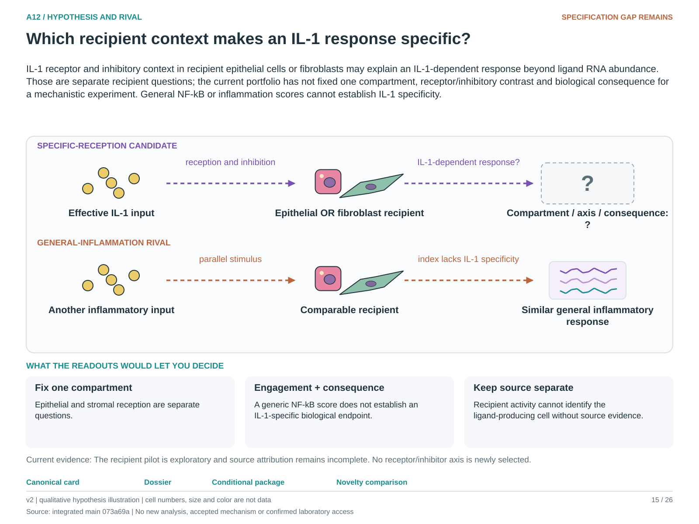

# A12: literature context and hypothesis schematic

Reviewed 3 October 2026. This note connects published findings to the current proposed question. It is a bounded synthesis, not novelty clearance or scientific acceptance.

## Published starting point

IL-1-dependent epithelial transitions and fibroblast exposure effects already show that responding compartments matter.

| Primary source | Inspected locator and access record |
|---|---|
| [Choi 2020](https://pmc.ncbi.nlm.nih.gov/articles/PMC7487779/) | Fig. 7 and Discussion. [Access / prior review](../../docs/research_dossiers/NOVELTY_SPECIFICITY_APPLICATION_2026-10-03.md) |
| [Ciminieri 2023](https://pmc.ncbi.nlm.nih.gov/articles/PMC12042164/) | Fig. 1 and Results; fibroblast pre-exposure and organoid growth. [Access / prior review](../../docs/research_dossiers/NOVELTY_SPECIFICITY_APPLICATION_2026-10-03.md) |

Sources above reuse the named review unless the update ledger explicitly records a fresh inspection. Published-source evidence and reanalysis of the same material are not independent replication.

## Repository observation

The recipient index improved epithelial prediction in twelve patients while fibroblast results were unstable. Unassigned sources account for roughly 52–72% of IL1B, limiting a macrophage-only source interpretation.

Exact current result locators:

- [RQ_Specified/A12_recipient_context/README.md](README.md)
- [docs/research_dossiers/followup_2026-10-03/NOVELTY.md](../../docs/research_dossiers/followup_2026-10-03/NOVELTY.md)

## What this question could add

Fix the recipient compartment and one IL-1-specific functional response at comparable input. This can distinguish recipient context from supply, while a generic disease-associated predictor remains insufficient.

## Current hypothesis and rival

IL-1 receptor and inhibitory context in recipient epithelial cells or fibroblasts may explain an IL-1-dependent response beyond ligand RNA abundance. Those are separate recipient questions; the current portfolio has not fixed one compartment, receptor/inhibitory contrast and biological consequence for a mechanistic experiment. General NF-kB or inflammation scores cannot establish IL-1 specificity.

**Strongest rival:** The index tracks general inflammatory state, cell composition or another stimulus rather than specific IL-1 reception.

## What the comparison would teach

A recipient-context effect under a qualified IL-1-dependent contrast supports specific reception. The same response without IL-1 dependence favors a general inflammatory marker. Source-attribution uncertainty and a generic pathway score cannot identify which cells delivered the active input.

## Hypothesis schematic

[Editable hypothesis schematic](schematics/hypothesis_v2.svg). Original explanatory artwork. Dashed arrows denote the labelled proposal or rival; shapes, colours and cell counts are qualitative, not observations. The three readout cards explain which uncertainty a measurement could resolve. Missing features/endpoints remain marked.

A0–A23 artwork is preserved from the checked v2 atlas at source revision `073a69a758f25f988ecc18402477efa268c00927`. Its full hypothesis was compared with the current dossier. Later literature and scope context are supplied by this note.

## Next literature check

Planned query (not reported as newly executed): `IL1 recipient epithelial fibroblast context specific functional response matched input`. Expand to synonyms, nearest source references/citations and conflicting results using the [literature workflow](../../docs/LITERATURE_WORKFLOW.md). Recheck the exact population, comparison, timing, unit and endpoint before making a stronger contribution claim.

**Current unresolved specification:** The endpoint is insufficiently IL-1-specific, and source assignment is incomplete; ligand RNA versus recipient competence is not a causal decomposition.

**Interpretation limit:** A transcript-based receptor index does not establish receptor activity, and NFkB-associated RNA cannot identify the responsible ligand.

[Current dossier](../../docs/research_dossiers/A12.md) · [All-question context index](../../docs/research_dossiers/literature_context_2026-10-03/README.md)
