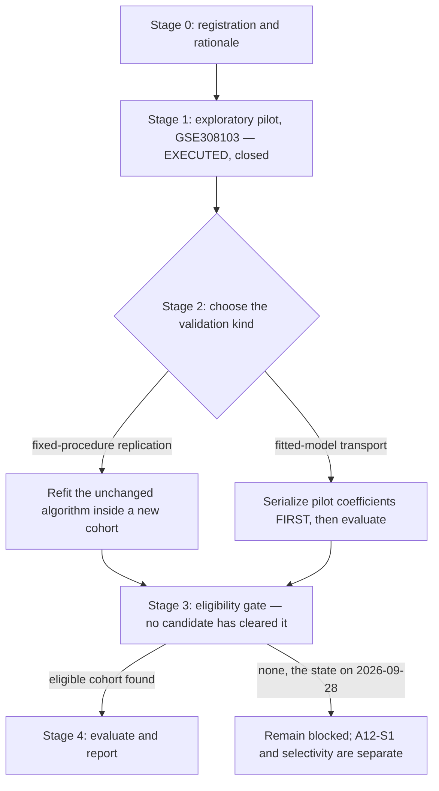

# A12 analysis plan: the pilot is closed, and validation must choose its own kind

Written 28 September 2026 over completed work. The runnable conditional comparison on GSE308103
is finished and is not rerun. This plan records what is frozen, the one decision a future
validation has to make before it starts, and the gate that no candidate cohort has cleared.

## Structure

## Stage 1: what is frozen and closed

The [pilot specification](../../docs/roadmap_runs/2026-09-27-followthrough/A12_pilot_specification.json)
was committed before scores and fits and is not amended. Its frozen elements: the patient unit as
a LUAD-minus-normal paired difference; the broad assigned macrophage source and its
monocyte-derived fraction; the AT2 primary and alveolar-fibroblast secondary recipients at a
50-cell floor and confidence 0.2; the equal-weight recipient index over IL1R1/IL1RAP against
IL1R2/IL1RN/SIGIRR; the 197-gene predictor-disjoint TNF/NF-kB endpoint at a 0.7 coverage floor;
ridge alpha=1 with train-only centering and scaling and an unpenalized intercept; and the primary
comparison of the joint model against source-plus-TNF on identical held-out patients.

[Results and their limits](../../docs/roadmap_runs/2026-09-27-followthrough/A12_PILOT.md).
The comparison is closed: **it is not rerun, retuned, or re-specified on this cohort.** Adding a
term, changing the index weights, or moving the floor after seeing these numbers would produce a
different analysis wearing this one's name.

## Stage 2: the decision a validation must make before it opens any data

The pilot stored **leave-one-patient-out predictions, not one deployable fitted model.** That
fact forces a choice, and the two options answer different questions:

| | Fixed-procedure replication | Fitted-model transport |
|---|---|---|
| What it tests | the unchanged algorithm at a new training size | whether the pilot's own coefficients predict elsewhere |
| What must happen first | nothing beyond the eligibility gate | fit the unchanged feature sets once to all twelve pilot AT2 pairs; serialize training means, SDs, intercepts and coefficients; hash and **commit them before** external outcomes are opened |
| What it cannot claim | that the pilot's fit generalizes | that the procedure works at other sample sizes |
| Evidence status | descriptive replication at 10-45 pairs | a genuine external test of one frozen model |

**No such serialized fit exists.** It was deliberately not manufactured for the three ineligible
candidates, because fitting it after seeing which cohorts fail would let candidate properties
influence the frozen parameters. A future session choosing transport must serialize first.

## Stage 3: the eligibility gate, frozen before any candidate was opened

The [prospective gate specification](external_validation_20260928/config/prospective_gate_specification.json)
was committed at `f3950253` before external scoring. Its ordered conditions: an independent human
untreated primary LUAD cohort with same-patient normal tissue and no pilot overlap; unchanged AT2
correspondence in **both** arms plus broad assigned macrophages with an identifiable
monocyte-derived fraction; a paired source-and-recipient intersection at the 50-cell floor; raw
count and full-library normalization comparability with at least 70% endpoint-gene coverage and
every predictor component present; and at least ten eligible pairs for exploratory replication.

**Prohibited changes**, from the frozen specification: substituting tumour-labelled epithelium for
AT2; reference mapping that uses the tested predictor or outcome genes; new alpha or module
tuning; a changed mixture definition; normalized expression without raw full-library
comparability.

**State on 28 September 2026.** Three candidates were audited and all three fail on units and
states before any outcome was opened — Kim's tumour arms hold zero AT2-labelled cells, Laughney
caps at four pairs, Wu has no normal arm
([recovery report](external_validation_20260928/reports/RECOVERY_REPORT.md),
[ledger](external_validation_20260928/tables/candidate_gate_ledger.json)). These rejections stand
under this estimand. The audit does not establish that no eligible cohort exists.

**On the 46-patient figure.** It is a planning calculation for fixed-model paired losses
(`t(.975,45)/sqrt(46) = 0.296963` between-patient loss SD), not biological power, not an effect
threshold, and not an equivalence margin. Ordinary paired-t uncertainty must never be applied to
overlapping leave-one-patient-out fold losses.

## Stage 4: report, if an eligible cohort is ever admitted

Report all baselines including the training mean, absolute errors, and calibration, without
outcome-driven relabelling or tuning. State which of the two validation kinds was performed. A
result may change A12's readiness row and may add a negative result; it may not add a graded
claim row without the owner's decision.

## What this plan refuses to do

- To rerun, retune or extend the conditional comparison on GSE308103.
- To relax any rejected gate, or to admit a cohort by relabelling tumour epithelium as AT2.
- To describe fixed-procedure replication as validation of the pilot's fitted model, or the
  reverse.
- To treat the recipient index as receptor occupancy, or the endpoint as IL-1-specific activation.
- To make an unconditional claim about macrophage source dominance while
  [A12-S1](reports/A12_S1_SOURCE_IDENTITY_MAP.md) is open.
- To read the three failed gates as evidence against a recipient-context contribution.

## Order of work

1. Keep the pilot closed. Its value is that it was specified before it was fitted.
2. If external validation is wanted, **choose the kind first** and, for transport, serialize and
   commit the all-pilot fit before opening any cohort.
3. Search for an eligible cohort under the unchanged gate; record a dated negative result if none
   clears.
4. Selectivity and source identity are separate questions and are not answered by any further
   model on this cohort: IL-1 specificity needs a selective perturbation, and source attribution
   needs the A12-S1 identity evidence.