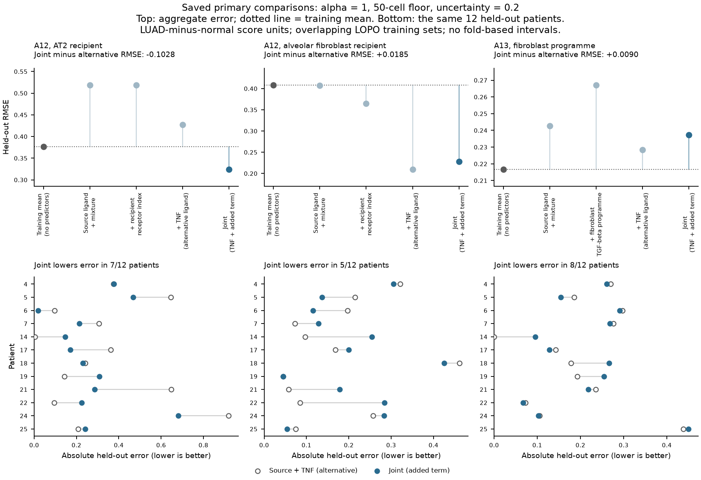
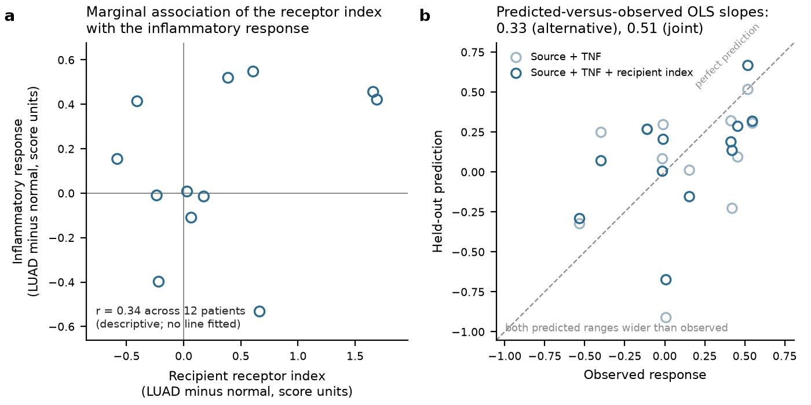

# A12 rationale: why the recipient, and why this endpoint

Written 28 September 2026 over completed exploratory work. Nothing here rescores or refits. The
question's one measured result is an exploratory twelve-patient prediction pilot on reused data;
this document states what motivates it, what its index and endpoint actually are, why the parent
IL-1 question connects to a general inflammatory readout, and what the three failed cohort gates
do and do not establish.

## The proposition, stated so it can fail

The same ligand does not produce the same response everywhere, because the receiving cell's
capacity to receive or restrain the signal varies. If that is right, then RNA describing a
recipient's receptor and inhibitor complement should carry information about that recipient's
inflammatory response beyond what the source's ligand output and the source mixture already
carry. Stated to fail: fix the source terms and an alternative ligand, add the recipient index,
and held-out prediction does not improve.

The biological interest is not prediction. It is that a control point in the recipient, rather
than in the source, would change where an intervention should act — and would explain why
epithelial cells in nominally similar inflammatory environments enter transitional states to
different degrees.

## What was measured, exactly

**Unit and contrast.** The patient, as a LUAD-minus-matched-normal paired difference, repeated
libraries pooled. Twelve patients of GSE308103 pass the primary 50-cell floor in all required
compartments.

**Source.** The broad **assigned** macrophage compartment, plus the fraction of those cells
labelled monocyte-derived. "Assigned" is load-bearing and is the reason A12-S1 exists; see
[the source-identity map](reports/A12_S1_SOURCE_IDENTITY_MAP.md).

**Recipient index.** An equal-weight difference of means: `IL1R1, IL1RAP` minus
`IL1R2, IL1RN, SIGIRR`, in log2(1+full-library CPM). It is an operational summary of receptor
against decoy and antagonist RNA. It is not receptor occupancy, not surface protein, and not a
biophysical model of competition; the weights are equal because nothing in the data justifies
other weights, not because equality is biologically motivated.

**Endpoint.** The MSigDB TNF/NF-kB hallmark, with IL1A, IL1B and TNF removed so the outcome
shares no gene with a predictor; 193 of 197 frozen genes are assayed, and absent genes are
dropped rather than zero-filled or alias-rescued.

## Why a general inflammatory endpoint, when the parent question is about IL-1

This is the design choice most open to objection, so it is stated plainly rather than defended
by omission.

The parent question asks about IL-1 reception. The endpoint measures general inflammatory
transcription, which IL-1, TNF and several other inputs all drive. The endpoint is therefore
**not IL-1-specific**, and a positive result cannot show that the recipient index acts through
IL-1.

Three reasons the choice is still the right one for this pilot. First, an IL-1-specific readout
does not exist in observational RNA: the transcriptional footprints of IL-1 and TNF signalling
overlap substantially, and separating them needs a selective perturbation, not a cleverer gene
list. Second, the comparator absorbs the most important confusion available: the primary contrast
adds the recipient index to a model that *already contains TNF*, so an improvement is an
improvement over the leading alternative ligand rather than over an empty model. Third, gene
disjointness removes the one artefact that would otherwise guarantee a positive result — scoring
the same genes on both sides.

What remains unaddressed by all three: shared normalization, within-compartment composition, the
reference annotation, and disease-dependent confounding that paired differencing does not remove.
Those are rivals, not caveats.

## The result, and the shape of it

**Figure A12-F01. The recipient index lowers held-out error in the epithelium, does not in
fibroblasts, and the related fibroblast programme raises aggregate error at the primary settings.** Held-out RMSE at the
primary settings (ridge alpha=1, 50-cell floor, confidence 0.2), twelve paired patients per
panel, plotted from
[A12_model_metrics.csv](../../docs/roadmap_runs/2026-09-27-followthrough/A12_model_metrics.csv)
and [A13_model_metrics.csv](../../docs/roadmap_runs/2026-09-27-followthrough/A13_model_metrics.csv).
The upper row summarizes model RMSE; the lower row pairs absolute errors for joint and
source-plus-TNF on the same held-out patients, using the saved
[A12](../../docs/roadmap_runs/2026-09-27-followthrough/A12_heldout_predictions.csv) and
[A13 predictions](../../docs/roadmap_runs/2026-09-27-followthrough/A13_heldout_predictions.csv). (a) A12 with AT2 as recipient: 0.4271 to 0.3244, an MSE improvement of
0.07723, with 7 of 12 patients individually better and prediction Q2 of 0.2569 against the
training-mean baseline. (b) A12 with alveolar fibroblasts: 0.2098 to 0.2283, worse by 0.00810
MSE, and the direction changes under the ridge and confidence sensitivities. (c) A13's fibroblast
TGF-beta programme: 0.2283 to 0.2373, worse by 0.004181, and worse in every eligible
predeclared sensitivity. Despite the worse aggregate error, 8 of 12 A13 patients improve;
5 of 12 improve in the A12 fibroblast arm. Counting improvements alone ignores their magnitudes.
No error bars are drawn because leave-one-patient-out fold losses share
training observations and are dependent; no interval or p value is computed from them. Twelve
patients support a small exploratory prediction calculation, not a population claim.

Two features of the ladder matter more than the aggregate comparison.

**The source model alone is worse than predicting the training mean** in the AT2 panel (0.5189
against 0.3763). So the improvement attributed to the recipient index is measured against a
comparator that itself needed TNF to become useful, and "adds information beyond source RNA" is a
statement about a particular three-term model, not about source RNA in general.

**In A13's panel no nonconstant model beats the training mean at the primary alpha**
(best fitted RMSE 0.2283 versus 0.2167). At alpha=10 the alternative does beat that mean
(0.2113), while the joint model does not (0.2174); the added programme still worsens error.
The primary comparison is a weak instrument for deciding whether a programme contributes,
which is why A13's closure is recorded as "no predictive reason to prefer it" rather than
as evidence against fibroblast involvement.

### The twelve patients themselves

**Figure A12-F03. The receptor index has a modest marginal association, while saved predictions
span a wider range than the observations.** Twelve paired patients, AT2 recipient, primary
settings, plotted from [A12_model_inputs.csv](../../docs/roadmap_runs/2026-09-27-followthrough/A12_model_inputs.csv)
and [A12_heldout_predictions.csv](../../docs/roadmap_runs/2026-09-27-followthrough/A12_heldout_predictions.csv).
(a) The receptor index against inflammatory response, both LUAD-minus-normal differences;
Pearson r = 0.34 is descriptive, without an interval or p value. (b) Saved held-out predictions
against observations, with the identity line. Their range widths are 1.4275 (alternative) and
1.3410 (joint), compared with 1.0800 observed: the previous caption's range-compression claim
was false. Descriptive OLS slopes of **prediction on observation** are 0.33 and 0.51; these are
not slopes from a refitted predictive model, and they do not by themselves locate failures at
the extremes. Figure F01 now exposes each patient's errors directly. With twelve reused units,
external transport and IL-1-specific interpretation remain unestablished.

## Why the epithelial and fibroblast recipients behave differently

The honest answer is that this design cannot tell us. Three explanations are live and the pilot
does not separate them: alveolar fibroblasts may genuinely have less receptor-context variation
that matters for this endpoint; the fibroblast arm's own inflammatory score may be noisier at
these cell counts; or the fibroblast alternative model is already so good (0.2098 against a
0.4085 mean) that little residual variance remains for an added term to explain. The third is
the most mundane and is not excluded.

## Rivals

1. **Shared inflammation.** A single disease-associated inflammatory axis moves the source terms,
   the recipient index and the endpoint together. Paired differencing removes patient-level
   offsets, not a shared disease axis. This is the leading rival.
2. **Composition within the compartment.** The AT2 label spans states; the index and the endpoint
   could both track a shifting mixture rather than a per-cell property.
3. **Shared normalization.** Predictor and outcome use the same full-library denominator, so a
   library-size artefact can couple them even with disjoint genes.
4. **Reference annotation.** The AT2 and fibroblast labels are healthy-reference candidate labels,
   and their correspondence to the tested states has not been independently adjudicated.
   Healthy-reference AT2 labels do not validate malignant-cell identity.
5. **Assigned-source conditionality.** The source is the assigned macrophage compartment; cells
   without confident labels carry most of the recovered IL1B RNA
   ([map](reports/A12_S1_SOURCE_IDENTITY_MAP.md)). The source term is therefore conditional on an
   annotation decision, and this is a rival to the source side of every model here.
6. **Two high-leverage patients.** Five feature sets and a fixed ridge on twelve paired units will
   show numerical differences between nested models as a matter of course, and here the index's
   marginal association is concentrated in two patients (index 1.691 and 1.658 against a next
   highest of 0.664; r falls from 0.34 to -0.02 without them). That the ordering held at alphas
   0.1 and 10, at the 30-cell floor and at confidence 0.3 is a robustness description over the
   same units, not an independent replication, and it does not address the leverage.
7. **RNA is not reception.** Receptor and inhibitor transcript abundance need not track surface
   protein, complex assembly or occupancy. Unresolvable in this data.

## What the three failed external gates establish

Nothing biological, and this needs saying because a "failed validation" is easily misread. Kim
(GSE131907) has ten paired patients and **zero tumour-arm cells labelled AT2**, so the fixed
recipient state does not exist in one arm. Laughney (GSE123902) has only four normal specimens,
capping pairs at four before any state gate. Wu (GSE148071) is 42 primary-tumour biopsies with
no separate normal arm. All three fail on **units and states, not on outcomes** — no expression
matrix was opened and no score was computed
([recovery report](external_validation_20260928/reports/RECOVERY_REPORT.md)).

The pilot result is therefore unreplicated rather than contradicted, and the bounded audit does
not show that no eligible cohort exists.

## What is genuinely open

Whether recipient receptor and inhibitor context contributes to inflammatory response at all,
beyond this one cohort and this one endpoint. Whether any such contribution is IL-1-specific —
which needs a selective perturbation, not a further RNA model. Whether the source attribution
survives resolving the unlabelled IL1B-carrying cells. And whether the epithelial-versus-
fibroblast asymmetry is biological or a residual-variance artefact.

## Connections and boundaries

- **A13** shares this cohort, this normalization and this fit, and asks a different question: it
  adds a fibroblast TGF-beta programme rather than a recipient index, against an epithelial
  transitional-proxy outcome rather than an inflammatory one. Its
  [rationale](../A13_fibroblast_beyond_macrophage_il1b/RATIONALE.md) records why its negative
  result does not bear on A12's positive one.
- **A12-S1** owns the identity of the unlabelled IL1B-carrying cells and is a prerequisite for
  any unconditional statement about the source, in A12 or A13.
- **A9** owns receptor competence in fibroblasts for AREG; A12's index is the same kind of
  construct for IL-1 and inherits the same RNA-is-not-reception limit.
- **A14** owns reception as a perturbation and recovery as an outcome. A12 is observational and
  its endpoint is an inflammatory RNA response, not recovery.
- **A2** and **A15** own the source side of the epithelium-to-fibroblast axis; A12 does not
  reinterpret their measurements.

Measurement contracts: [MC1](../../docs/RQ_MEASUREMENT_CONTRACTS.md#mc1) for units, confounding
and endpoints; [MC3](../../docs/RQ_MEASUREMENT_CONTRACTS.md#mc3) for state and source identity;
[MC4](../../docs/RQ_MEASUREMENT_CONTRACTS.md#mc4) for ligand-receptor representation;
[MC5](../../docs/RQ_MEASUREMENT_CONTRACTS.md#mc5) for programme dependence and validation.