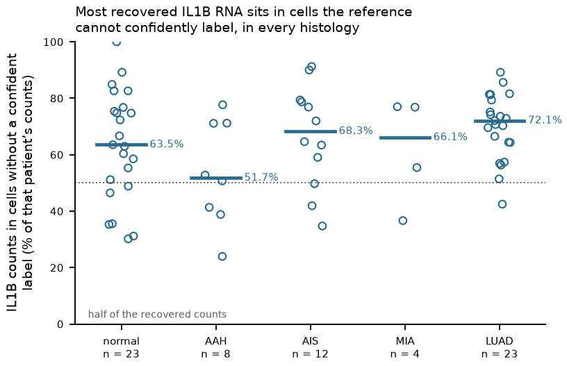

# A12-S1 evidence map: which cells account for the IL1B RNA

Written 28 September 2026 as a single evidence map for the enabling source-identity question,
linked from [A12](../RATIONALE.md) and
[A13](../../A13_fibroblast_beyond_macrophage_il1b/RATIONALE.md). It assembles existing
measurements and adds none. The question is registered on the
[A12-S1 card](../../../RESEARCH_QUESTIONS.md#a12-s1) with its
[annotation contract](../../../docs/RQ_MEASUREMENT_CONTRACTS.md#a12-s1).

## The question, and why it is a prerequisite rather than a curiosity

Both A12 and A13 use the **assigned** macrophage compartment as their IL-1 source. If most of the
IL1B RNA in the tissue sits in cells that the reference cannot confidently label, then every
statement of the form "macrophages are the source" is conditional on an annotation decision, and
the size of that conditionality is what this map quantifies.

An unconfident label is not a new cell type. The question asks what those cells are, not whether
to name them.

## What is measured

**Figure A12-F02. In every histology, the median patient has more than half of recovered IL1B
counts in cells without a confident finest-level label.** One point per patient, from
[IL1B_source_fractions.csv](../../../Research%20Article/gate2_C3_yu_lee_choi_min_2026/trials/u5_human_sources/IL1B_source_fractions.csv)
at the primary 0.2 uncertainty cutoff; bars are medians, annotated. Patient counts are normal 23,
AAH 8, AIS 12, MIA 4, LUAD 23. Medians: normal 63.5%, AAH 51.7%, AIS 68.3%, MIA 66.1%, LUAD
72.1%. These are **patient-level fractions of recovered counts among recovered cells** — not
pooled cohort fractions, not a tissue-composition correction, and not a secretion measurement.
The spread is wide and the small groups (MIA, n=4) carry no distributional claim.

Supporting numbers, from the
[annotation review](../../../Research%20Article/gate2_C3_yu_lee_choi_min_2026/trials/u5_human_full/ANNOTATION_REVIEW.md)
and the [source report](../../../Research%20Article/gate2_C3_yu_lee_choi_min_2026/trials/u5_human_sources/REPORT.md):

| Quantity | Value |
|---|---|
| QC nuclei in the frozen mapping | 555,480 |
| Retained at primary uncertainty <= 0.2 | 308,646 (55.6%) |
| Retained at the 0.3 sensitivity | 362,208 (65.2%) |
| Reference-model genes measured per library | 1,731 of 2,000 (86.55%) |
| Median patient-level label retention, normal / AAH / AIS / MIA / LUAD | 67.2% / 67.9% / 64.5% / 66.0% / 50.6% |
| Raw count parity checks against the retained source panel | 150 of 150 library/cutoff checks agree exactly |

Retention is lowest in LUAD (50.6%), which is also where the unlabelled IL1B fraction is highest
(72.1%). Those two facts are not independent, and that coupling is itself worth recording: the
histology where source attribution matters most for A12 is the one where the annotation retains
fewest cells.

## The candidate explanations, and what each would predict

None is established. They are listed with the observation that would separate them, because the
repository's architecture rule applies: if no available measurement can distinguish them, the
next step is a measurement rather than another analysis.

1. **Genuine macrophages below the confidence threshold.** Would predict coherent multi-marker
   myeloid support in the unlabelled cells — C1QA, C1QB, CD68, TYROBP, CSF1R at detection rates
   comparable to the mapped macrophages (92.7-97.0%, 92.5-96.8%, 93.7-97.4%, 90.1-94.5%,
   74.2-83.5% respectively in mapped cells). **Not yet measured in the unlabelled population.**
   This is the cheapest discriminating check available and it has not been run.
2. **Mixed or doublet profiles.** Would predict simultaneous lineage-marker support at
   intermediate levels. The mapped populations already show substantial cross-lineage RNA — SFTPC
   is detected in 60.6-78.2% of mapped fibroblasts and 71.8-92.6% of mapped macrophages — so a
   marker table alone cannot separate this from explanation 3.
3. **Ambient background.** Would predict IL1B in unlabelled cells tracking library-level soup
   rather than any cell's own profile. The deposit's filtered matrices limit what can be
   estimated here, the same limitation A16's ambient control ran into.
4. **A state the reference lacks.** Would predict an internally coherent phenotype with its own
   marker pattern, reproducible across patients. This is the only explanation that would motivate
   a new biological hypothesis, and it is also the one most easily manufactured by a relaxed
   threshold.
5. **Low-information cells.** Would predict low complexity and depth in the unlabelled
   population, making the label uncertainty a measurement property rather than a biological one.

**What does not count as evidence**, per the annotation contract: a UMAP cluster, and a relaxed
confidence cutoff. The 0.3 sensitivity measures dependence on filtering; it does not resolve
identity. Neither does a matching label name — the recovery audit's macrophage synonym counts
were admitted as a diagnostic proxy and explicitly not as a validated mapping.

## Consequences for A12 and A13, stated as they must appear

- Both questions' source terms are **conditional on assignment**, and neither may state
  unconditional macrophage source dominance while this question is open.
- Unlabelled cells must not be silently excluded from a claim about total source. Excluding them
  is a modelling decision with a stated magnitude — the medians above — not a neutral filter.
- Revised RNA attribution would still not measure secreted protein. IL1RN, IL1R2 and SIGIRR
  describe antagonist and decoy context; NLRP3, PYCARD, CASP1 and GSDMD are RNA measurements of
  processing components and cannot establish inflammasome assembly, cleavage, release or mature
  IL-1beta protein.
- Resolving identity could move source attribution in either direction — strengthening the
  macrophage source, weakening it, or distributing it. The A12 pilot's recipient-side result
  would be unaffected either way, since its index and endpoint are both measured in the recipient.

## The evidence gate

Identity evidence must be **independent of the tested IL1B expression** — markers, mapping
provenance, complexity and depth diagnostics, and appropriate background information — and
unsupported identities stay unknown. Until then A12-S1 is retained as an enabling question and
the strong source interpretations in A12 and A13 are qualified.

The immediate unblocked next step is explanation 1's check: the multi-marker profile of the
unlabelled IL1B-carrying cells against the mapped populations, in the existing matrices, with no
relabelling. That is a specification to be frozen rather than a result, and it has not been run.