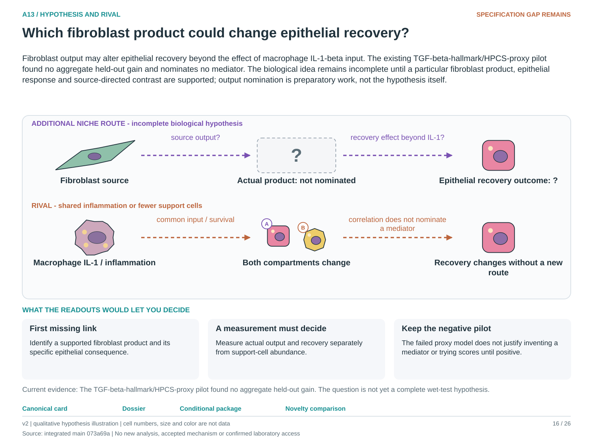

# A13: literature context and hypothesis schematic

Reviewed 3 October 2026. This note connects published findings to the current proposed question. It is a bounded synthesis, not novelty clearance or scientific acceptance.

## Published starting point

Fibroblast exposure can alter epithelial organoid growth; epithelial IL-1 transitions are also established. These findings motivate asking what fibroblasts add to a macrophage/IL-1 account.

| Primary source | Inspected locator and access record |
|---|---|
| [Ciminieri 2023](https://pmc.ncbi.nlm.nih.gov/articles/PMC12042164/) | Fig. 1 and Results; fibroblast pre-exposure and organoid growth. [Access / prior review](../../docs/research_dossiers/NOVELTY_SPECIFICITY_APPLICATION_2026-10-03.md) |
| [Choi 2020](https://pmc.ncbi.nlm.nih.gov/articles/PMC7487779/) | Fig. 7 and Discussion. [Access / prior review](../../docs/research_dossiers/NOVELTY_SPECIFICITY_APPLICATION_2026-10-03.md) |

Sources above reuse the named review unless the update ledger explicitly records a fresh inspection. Published-source evidence and reanalysis of the same material are not independent replication.

## Repository observation

The twelve-triad pilot using a fibroblast TGF hallmark and epithelial HPCS proxy worsened RMSE; all models performed poorly against baseline. It did not test feedback or establish that every fibroblast niche programme is uninformative.

Exact current result locators:

- [RQ_Specified/A13_fibroblast_beyond_macrophage_il1b/README.md](README.md)
- [RQ_Specified/A13_fibroblast_beyond_macrophage_il1b/reports/COVERAGE_RESULTS.md](reports/COVERAGE_RESULTS.md)
- [docs/research_dossiers/followup_2026-10-03/NOVELTY.md](../../docs/research_dossiers/followup_2026-10-03/NOVELTY.md)

## What this question could add

Name a fibroblast output and a distinct epithelial recovery endpoint before proposing an added route. The unfavourable incremental proxy result stays visible; the literature supplies candidate reasoning, not evidence for an unnamed mediator.

## Current hypothesis and rival

Fibroblast output may alter epithelial recovery beyond the effect of macrophage IL-1-beta input. The existing TGF-beta-hallmark/HPCS-proxy pilot found no aggregate held-out gain and nominates no mediator. The biological idea remains incomplete until a particular fibroblast product, epithelial response and source-directed contrast are supported; output nomination is preparatory work, not the hypothesis itself.

**Strongest rival:** Inflammation independently drives both compartments; fibroblast abundance or survival changes total support; the selected transcript score does not measure the relevant output.

## What the comparison would teach

A source-directed change in a nominated product linked to a separately validated epithelial recovery endpoint could support the additional niche route. Effects explained only by fibroblast depletion or shared inflammation leave activity-specific attribution unresolved. The negative proxy pilot must not be relabeled a mediator discovery.

## Hypothesis schematic

[Editable hypothesis schematic](schematics/hypothesis_v2.svg). Original explanatory artwork. Dashed arrows denote the labelled proposal or rival; shapes, colours and cell counts are qualitative, not observations. The three readout cards explain which uncertainty a measurement could resolve. Missing features/endpoints remain marked.

A0–A23 artwork is preserved from the checked v2 atlas at source revision `073a69a758f25f988ecc18402477efa268c00927`. Its full hypothesis was compared with the current dossier. Later literature and scope context are supplied by this note.

## Next literature check

Planned query (not reported as newly executed): `fibroblast secreted product alveolar epithelial recovery beyond macrophage IL1 functional`. Expand to synonyms, nearest source references/citations and conflicting results using the [literature workflow](../../docs/LITERATURE_WORKFLOW.md). Recheck the exact population, comparison, timing, unit and endpoint before making a stronger contribution claim.

**Current unresolved specification:** The failed TGF-hallmark/HPCS proxy model does not identify a fibroblast output that changes epithelial recovery beyond shared inflammatory context. No mediator is presently nominated by this dossier.

**Interpretation limit:** The failed model is neither a feedback test nor evidence against all fibroblast contributions; a new score cannot retroactively rescue it.

[Current dossier](../../docs/research_dossiers/A13.md) · [All-question context index](../../docs/research_dossiers/literature_context_2026-10-03/README.md)
