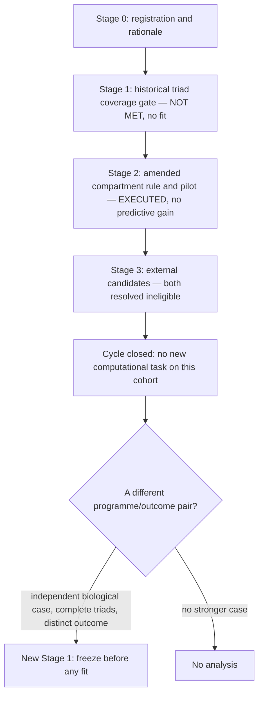

# A13 analysis plan: this cycle is closed, and reopening needs a case rather than a search

Written 28 September 2026 over completed work. The fixed predictor-outcome pair on GSE308103 has
been tested and did not improve held-out prediction. This plan records what is closed, the two
resolved external candidates, and the conditions a different pair would have to satisfy before
any new computation is justified.

## Structure

## Stage 1: the historical coverage gate, preserved

The [triad coverage specification](config/a13_triad_coverage_spec.json) was committed before any
count existed, and the [coverage result](reports/COVERAGE_RESULTS.md) records that the gate was
not met and no fit was produced. It used each donor's largest single macrophage label. That
specification and its decisions are preserved unchanged and are **not** the gate the executed
pilot cleared.

## Stage 2: the amended pilot, executed and closed

The [pilot specification](../../docs/roadmap_runs/2026-09-27-followthrough/A13_pilot_specification.json)
was frozen before scores. Its amendment is explicit: broad assigned macrophages as source, fixed
AT2 and fixed alveolar-fibroblast labels, checked as a **triad intersection** rather than as
separate compartment totals, giving twelve paired patients at the 50-cell floor.

Frozen elements: the HPCS-without-ADI-or-operational-markers outcome module (91 mouse genes, 73
human mappings, 72 assayed); the TGF-beta hallmark predictor minus TGIF1 (53 frozen, 52 assayed);
mean log2(1+full-library CPM) scores as LUAD-minus-normal paired differences; A12's ridge
procedure at alpha=1 with train-only standardization; and the primary comparison of joint against
source-plus-TNF on identical held-out patients.

[Result and its limits](../../docs/roadmap_runs/2026-09-27-followthrough/A13_PILOT_AND_COVERAGE.md):
the primary comparison worsens by 0.004181 MSE and worsens in every eligible sensitivity.

**This cycle is closed.** The pair is not retested, retuned or extended on this cohort. No
substitute module is screened against this outcome, and no threshold, floor or label is adjusted
after seeing these numbers.

## Stage 3: the two named external candidates, resolved

Both were resolved on design, before any expression download or fit:

| Candidate | Finding | Decision |
|---|---|---|
| [GSE233844](https://www.ncbi.nlm.nih.gov/geo/query/acc.cgi?acc=GSE233844) | primary design is PBMCs, not lung tissue | cannot supply a lung AT2/fibroblast/macrophage triad; the earlier title-based candidacy is withdrawn |
| [GSE122960](https://www.ncbi.nlm.nih.gov/geo/query/acc.cgi?acc=GSE122960) | author annotation recovered from the paper-linked cell browser: 76,070 cells, 16 subjects; the 17th GEO record is a separate cryobiopsy. Under exact author AT2 Cells / Fibroblasts / Macrophages labels, **3 of 16** subjects pass the 50-cell floor across all diagnoses (Donor 5, Donor 7, PM-ILD); **2** restricting to donor/IPF, with no represented IPF subject passing | below the ten-subject floor; no large count-matrix download or fit justified |

At floors 30 and 100 the all-diagnosis totals are 9 and 0. The
[external pre-count specification](../../docs/roadmap_runs/2026-09-27-followthrough/A13_external_coverage_specification.json)
was written before counting; the exported column-spelling correction, which happened after the
first attempt refused before producing any count, is recorded there.

These are **availability failures, not biological evidence.** They bound what this cohort family
can support and say nothing about fibroblast contributions.

## What a new cycle would require, frozen now so it cannot be relaxed

All five, simultaneously, before any fit:

1. **An independently motivated programme.** Nominated on biological grounds — a specific
   fibroblast state or mechanism with a reason to act on the chosen epithelial outcome — and named
   in writing before any score is computed. A module chosen because it performed well on these
   data is disqualified.
2. **A distinct outcome.** Either a non-RNA epithelial readout, or a stated argument for why an
   RNA proxy suffices for the specific claim. The HPCS proxy is not reused as though it measured
   plasticity.
3. **Complete comparable triads** in units sufficient for the comparison, with the compartment
   rule fixed in advance and identical across arms.
4. **An evaluation not used to choose the programme.** Held-out loss is declared with its
   comparator, and a meaningful-difference margin is set before outcomes are inspected if any
   equivalence or absence claim is intended.
5. **Source conditionality declared.** While
   [A12-S1](../A12_recipient_context/reports/A12_S1_SOURCE_IDENTITY_MAP.md) is open, any
   macrophage source term is stated as assignment-conditional.

## What this plan refuses to do

- To retest, retune or extend the closed pair on GSE308103.
- To screen alternative fibroblast modules against this outcome and report the best one.
- To describe the null as a zero effect, an equivalence result, or evidence against fibroblast
  contributions to epithelial plasticity.
- To treat TGF-beta pathway RNA as active TGF-beta, or the HPCS proxy as lineage potential.
- To reopen either resolved external candidate by relaxing the subject floor or the label rule.
- To read patient-level error votes (eight of twelve) as overturning the aggregate loss.

## Order of work

1. Leave the cycle closed. It is a recorded negative with a preserved specification, which is the
   form a null should take.
2. If the niche question is to be pursued, produce the biological case for a specific programme
   and outcome first. That is reading and reasoning, not computation.
3. Only with that case, and a cohort meeting condition 3, freeze a new Stage 1 and seek
   authorization.