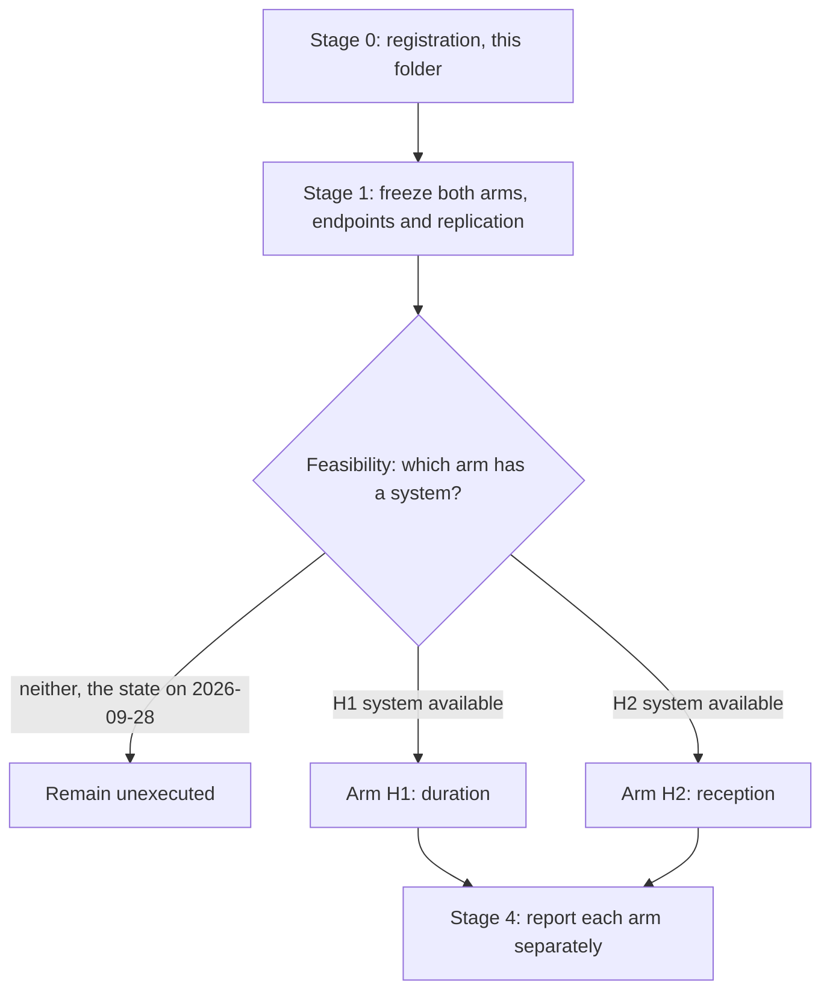

# A14 analysis plan: two arms, frozen before either is run

Written 28 September 2026, before any A14 endpoint exists. A14 needs an experiment, not a
dataset, so this plan fixes the two arms, their controls and their decision rules now — while
nothing has been observed — and states the feasibility conditions each requires. No stage can run
on data currently in the repository.

## Structure

The two arms are independent. Either may become feasible first and neither waits for the other.

## Stage 0: registration, which is what this folder contains

The question, its [rationale](RATIONALE.md), this plan and the
[contract](config/a14_question_contract.json). A14 is already in the canonical register, so this
folder adds no identifier; it replaces a card-only presence with a workspace. No endpoint scored,
no dataset opened for A14, no claim row.

## Stage 1: freeze both arms before either runs

### Arm H1, duration

| Element | Specification |
|---|---|
| Unit | the animal, or an independently prepared culture; repeat wells of one mixture are one unit |
| Arms | transient exposure, sustained exposure at matched intensity, and time-matched never-exposed controls |
| Withdrawal | verified, with target engagement measured after withdrawal rather than assumed |
| Primary outcome | mature-cell yield per unit after a fixed post-withdrawal interval |
| Co-primary safeguards | viability per unit, and traced descendants where a lineage label exists |
| Intervals | comparable post-withdrawal intervals across arms, fixed in advance |
| Decision | a recovery difference after verified withdrawal supports H1; a precise absence weakens it; failed engagement or no post-withdrawal observation is inconclusive |

### Arm H2, reception

| Element | Specification |
|---|---|
| Unit | the animal, or an independently prepared culture containing both compartments |
| Arms | epithelial-specific IL1R1 perturbation, fibroblast-specific IL1R1 perturbation, and unperturbed control, all under one fixed exposure and withdrawal schedule |
| Control requirement | direct epithelial reception controlled rather than varied alongside the fibroblast manipulation |
| Primary outcome | mature-cell yield per unit, as in H1, so the two arms share an outcome definition |
| Co-primary safeguards | engagement in the perturbed compartment, and compartment composition |
| Decision | an outcome change under fibroblast-specific intervention with epithelial reception controlled supports H2; a precise absence weakens it; failed engagement is inconclusive |

### Common to both arms

At least three independent units per arm, with unit identities recorded. Endpoints, contrasts and
replication are fixed here and not chosen after data exist. A macrophage-source arm is added only
if separating source effects is an explicit aim, as the
[design schematic](../../analysis/figures/rq/README.md#a14) records; it is not part of either
hypothesis as specified.

**What Stage 1 may not conclude.** Nothing. It is a specification.

## Stage 2: feasibility, and the state of it

Each arm requires a system, not a deposit.

**H1 requires** a preparation in which IL-1beta exposure can be started and stopped, the same
preparation followed afterwards, and mature output and viability measured per unit.

**H2 requires** compartment-specific IL1R1 perturbation with verified engagement, in a system
containing both compartments, under a fixed exposure.

**State on 28 September 2026.** Neither system is available in this repository's evidence. The
shared
[outcome inventory](../A1_transitional_epithelial_state_distinction/reports/A1_A8_A14_OUTCOME_INVENTORY.md)
records A14's requirement as row O28 and finds it unavailable, and row O29 records that no EdU,
BrdU or label-retention assay is named anywhere in the surveyed A1 evidence. That survey covered
the A1 documents rather than the public archives or the group's own capability, so this is a
statement about what has been examined and not a claim that the experiment is infeasible.

## Stage 3: execution, not authorized

Execution requires the experiment to be performed and a separate owner authorization. Neither arm
is authorized, and no computational task is queued for A14.

## Stage 4: report and register

Each arm is reported separately, with its own decision applied to its own rule; a result in one
arm does not update the other's readiness. The register effect is bounded in advance: an executed
arm may change the A14 readiness row in
[RESEARCH_QUESTIONS.md](../../RESEARCH_QUESTIONS.md#a14) and may add a negative result, and may
not add a graded claim row without the owner's decision. A negative or inconclusive arm is
written up and kept.

## What this plan refuses to do

- To read loss of a transitional RNA score as recovery, in either arm.
- To run one experiment whose arms vary exposure duration and receiving compartment together.
- To claim withdrawal without measured post-withdrawal engagement.
- To treat receptor or inhibitor RNA, in A12, A13 or elsewhere, as measured reception.
- To count repeat wells from one mixture as independent preparations, or to relax the three-unit
  floor.
- To present an anticipated response curve as a result, as the design schematic's own caption
  requires.
- To extend either result to malignant transformation.

## Order of work

1. Keep both arms frozen as written; they cost nothing to hold and they are the value A14
   currently has.
2. Determine which arm is feasible first, in the group's own hands or a collaborator's. That is a
   capability question rather than a data-search question.
3. If an arm becomes feasible, seek authorization for it alone and report it against its own
   decision rule.