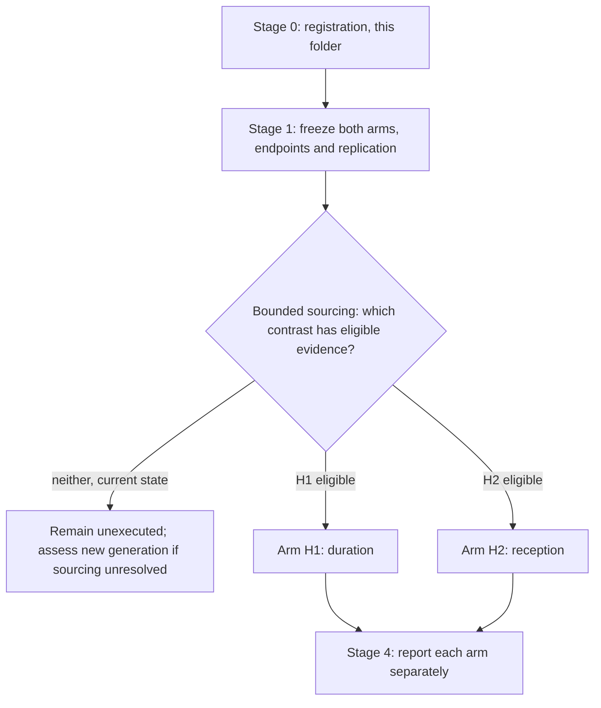

# A14 analysis plan: two decisions, specified before outcome inspection

Written 28 September 2026; corrected 29 September 2026. A14 requires evidence from the specified
withdrawal and reception contrasts. Eligible existing or author-provided data may supply that
evidence; new generation is considered if bounded sourcing remains unresolved. This plan fixes
the hypotheses and controls before outcome inspection and identifies specifications still needed
before analysis. No A14 endpoint has been scored, and no eligible dataset has been identified in
the reviewed repository evidence.

## Structure

The decisions are independent. Either may become feasible first and neither waits for the other.
A joint design is allowed when its actual contrasts and replication support each hypothesis;
this does not make its observations statistically independent.

## Stage 0: registration, which is what this folder contains

The question, its [rationale](RATIONALE.md), this plan and the
[contract](config/a14_question_contract.json). A14 is already in the canonical register, so this
folder adds no identifier; it replaces a card-only presence with a workspace. No endpoint scored,
no dataset opened for A14, no claim row.

## Stage 1: freeze each arm before it runs

### Arm H1, duration

| Element | Specification |
|---|---|
| Unit | the animal, or an independently prepared culture; repeat wells of one mixture are one unit |
| Arms | transient exposure, sustained exposure at matched intensity, and time-matched never-exposed controls |
| Withdrawal | verified, with target engagement measured after withdrawal rather than assumed |
| Primary outcome | mature-cell yield per unit after a fixed post-withdrawal interval |
| Co-primary safeguards | viability per unit, and traced descendants where a lineage label exists |
| Intervals | comparable post-withdrawal intervals across arms, fixed in advance |
| Decision | a meaningful decrease after sustained versus transient exposure supports H1 under the prespecified uncertainty rule; a reliable meaningful increase contradicts its direction; otherwise a precise absence of a meaningful decrement weakens it; an imprecise estimate, failed engagement or missing post-withdrawal observation is inconclusive |
| Decision specification still to freeze | define the contrast as sustained minus transient recovery; fix the meaningful-decrement threshold and uncertainty rule before inspecting outcomes |
| Interpretation limit | viability must address toxicity; without lineage evidence, mature yield does not establish recovery of the originally transitional cells |

### Arm H2, reception

| Element | Specification |
|---|---|
| Unit | the animal, or an independently prepared culture containing both compartments |
| Arms | epithelial-specific IL1R1 perturbation, fibroblast-specific IL1R1 perturbation, and unperturbed control, all under one fixed exposure and withdrawal schedule |
| Control requirement | direct epithelial reception controlled rather than varied alongside the fibroblast manipulation |
| Primary outcome | mature-cell yield per unit, as in H1, so the two arms share an outcome definition |
| Co-primary safeguards | engagement in the perturbed compartment, and compartment composition |
| Decision | an outcome change under fibroblast-specific intervention with epithelial reception controlled supports H2; a precise absence weakens it; failed engagement is inconclusive |

### Common to both arms

At least three independent units per arm, with unit identities recorded. Endpoints, contrasts and
replication requirements must be fixed before inspecting outcomes; the three-unit floor does
not establish adequate precision for either decision. Meaningful-effect thresholds and
uncertainty rules remain to be specified. A joint design must supply identifiable duration
contrasts at fixed receiving conditions and reception contrasts at fixed exposure, the relevant
controls, and sufficient independent units for each. It must account for interactions and shared
units rather than infer separate effects from a contrast that changes both factors inseparably.
A macrophage-source arm is added only
if separating source effects is an explicit aim, as the
[design schematic](../../analysis/figures/rq/README.md#a14) records; it is not part of either
hypothesis as specified.

**What Stage 1 may not conclude.** Nothing. It is a specification.

## Stage 2: bounded sourcing and feasibility

Each hypothesis requires eligible evidence, whether already collected or generated later.

**H1 requires** documented exposure and verified withdrawal, comparable subsequent observation,
and mature output and viability measured in identified independent biological units, with the
specified duration contrast and controls.

**H2 requires** compartment-specific IL1R1 perturbation with verified engagement, in a system
containing both compartments, under a fixed exposure and withdrawal schedule, with mature output,
unit identities and controlled direct epithelial reception.

**State on 29 September 2026.** No eligible dataset has been identified for either hypothesis in
the reviewed repository evidence. The
shared
[outcome inventory](../A1_transitional_epithelial_state_distinction/reports/A1_A8_A14_OUTCOME_INVENTORY.md)
records the unresolved design requirement as O28. O2/O3 already document mature and genetically
lineage-labelled endpoints, but do not establish the required A14 linkage and contrasts. O29's
assay-documentation limit concerns EdU/BrdU/label retention; it does not negate genetic lineage
evidence. The survey covered A1 documents, not a public-archive search under these conditions.

Before sourcing, record the sources to examine, query scope and stopping rule. Screen existing
deposits, supporting metadata and any available author-provided data against the same endpoint,
timing, contrast and biological-unit requirements, separately for H1 and H2. Record accepted,
rejected and unresolved candidates with reasons. Missing metadata may remain an author-data
request item. If this bounded review identifies no eligible evidence, report the remaining gaps
and assess the feasibility of new data generation without claiming global absence or infeasibility.

## Stage 3: execution, not authorized

No A14 analysis or new experiment is queued by these documentation corrections. Execution first
requires an eligible dataset and completed decision specifications for the selected hypothesis.
The existing requirement for owner authorization before an A14 experiment remains; an existing
dataset can satisfy the evidence requirement without a new experiment.

## Stage 4: report and register

Each arm is reported separately, with its own decision applied to its own rule; a result in one
arm does not update the other's readiness. The register effect is bounded in advance: an executed
arm may change the A14 readiness row in
[RESEARCH_QUESTIONS.md](../../RESEARCH_QUESTIONS.md#a14) and may add a negative result, and may
not add a graded claim row without the owner's decision. A negative or inconclusive arm is
written up and kept.

## What this plan refuses to do

- To read loss of a transitional RNA score as recovery, in either arm.
- To infer separate duration and reception effects from inseparable contrasts that change both
  factors together; joint designs must establish identifiability, controls and replication.
- To claim withdrawal without measured post-withdrawal engagement.
- To treat receptor or inhibitor RNA, in A12, A13 or elsewhere, as measured reception.
- To count repeat wells from one mixture as independent preparations, or to relax the three-unit
  floor.
- To present an anticipated response curve as a result, as the design schematic's own caption
  requires.
- To extend either result to malignant transformation.

## Order of work

1. Preserve the separate hypotheses and complete the meaningful-effect and uncertainty rules
   before outcome inspection.
2. Conduct the bounded sourcing review for eligible existing or author-provided evidence;
   assess H1 and H2 independently, including any identifiable joint design.
3. If sourcing remains unresolved, identify the exact gaps and assess new-generation feasibility.
   Keep both hypotheses unexecuted until their evidence and decision requirements are met.
4. Report any subsequently executed hypothesis against its own decision rule; either may
   advance without waiting for the other.
