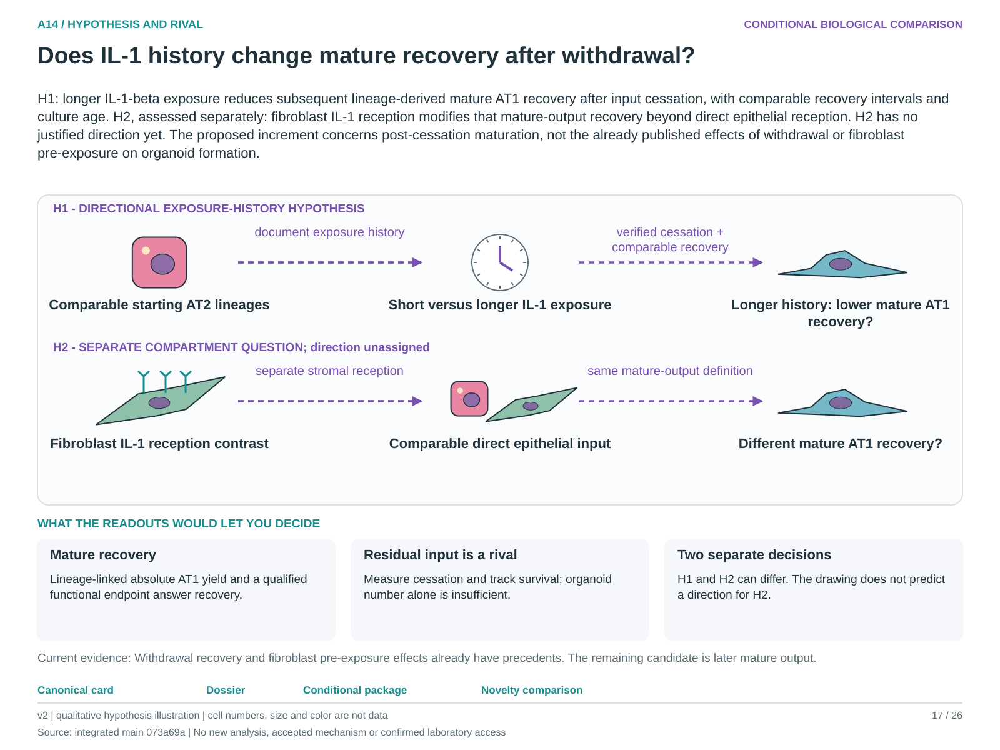

# A14: do exposure duration and fibroblast IL-1 reception separately determine recovery?

<!-- current-rq-framing:start -->
## Current biological hypothesis and novelty boundary — 3 October 2026

H1: longer IL-1-beta exposure reduces subsequent lineage-derived mature AT1 recovery after input cessation, with comparable recovery intervals and culture age. H2, assessed separately: fibroblast IL-1 reception modifies that mature-output recovery beyond direct epithelial reception. H2 has no justified direction yet. The proposed increment concerns post-cessation maturation, not the already published effects of withdrawal or fibroblast pre-exposure on organoid formation.

**What is already known, and what remains:** Choi establishes withdrawal recovery; Ciminieri already tests fibroblast IL-1 pre-exposure and organoid growth. The candidate increment is linked mature AT1 recovery after verified cessation with compartment attribution, not generic history or niche involvement. [Primary-source comparison](../../docs/research_dossiers/NOVELTY_SPECIFICITY_APPLICATION_2026-10-03.md#a14).

**What the measurements would decide:** Lower absolute mature output after the longer history, despite verified cessation, favors H1; comparable recovery weakens it. A separate fibroblast-reception contrast at comparable epithelial input addresses H2. Record lineage yield, survival and mature function; organoid number or a falling transitional score cannot distinguish recovery, death and replacement.

**Current disposition:** Narrowed post-cessation outcome; novelty provisional. This revision specifies proposed work; scientific acceptance, model access and assay qualification remain pending.

| Evidence and implementation | Current boundary |
|---|---|
| Biological unit and endpoint | Lineage-defined epithelium and characterized fibroblasts nested in identified donors/animals. Each primary contrast concerns mature descendants per starting AT2 input; H1 and H2 retain separate decisions and a declared testing family. |
| Current evidence and limit | Withdrawal-associated recovery is already published. Existing data do not qualify the exact compartment/input-history-to-mature-output comparison or autonomous memory. |
| Next decision / hold | Review is deferred and M10 retains the linkage hold. Reopen for source-qualified exposure/cessation, viability and traced output; an inseparable change in exposure and reception cannot identify either contrast. |

**Read in this order:** [current evidence](../../docs/research_dossiers/followup_2026-10-03/OUTCOMES.md),
[development dossier](../../docs/research_dossiers/A14.md),
[conditional hypothesis package](../../docs/research_dossiers/packages_2026-10-03/A14.md).
Source-mapping closeout: [M10 and reopening conditions](../../docs/research_dossiers/source_mapping_closeout_2026-10-03/README.md).
[Deferred work](../../docs/research_dossiers/REMAINING_WORK.md) and
[execution requirements](../../docs/RESEARCH_GOVERNANCE.md) govern any later
analysis. Draft completion does not establish assay validity, resource access,
meaningful effects, precision or scientific acceptance. Existing numerical
results and original plans below retain their recorded scope.
<!-- current-rq-framing:end -->

<!-- literature-visual-context:start -->
## Literature context and visual hypothesis

[What previous findings contribute, what remains, and what the readouts would decide](LITERATURE_CONTEXT.md).

*Explanatory proposal, not measured results. Read the linked context and caption; arrows do not certify a mechanism or novelty.*
<!-- literature-visual-context:end -->

## Organizing biological question

> Do exposure duration and fibroblast IL-1 reception separately determine
> recovery after withdrawal?

If alveolar epithelial cells are held in an IL-1-driven transitional state and the
signal is then withdrawn, do they recover mature identity and function — and does
that depend on how long they were exposed, and on whether neighbouring fibroblasts
received the signal too? The question matters because shared RNA cannot
distinguish reversible repair from persistent dysfunction, which is the difference
between successful regeneration and remodelling.

**This workspace carries two hypotheses with separate decisions.** They are kept
apart deliberately: either can hold without the other. Separate experiments or
a joint design can qualify if each contrast is identifiable and independently
supported; changing both factors in an inseparable contrast cannot answer either.

**Read first:** [question card](../../RESEARCH_QUESTIONS.md#a14),
[rationale](RATIONALE.md), [plan](PLAN.md),
[design schematic](../../analysis/figures/rq/README.md#a14).

## Evidence and analysis history

**Status, 29 September 2026: registered; the design is unexecuted; nothing
computed for A14.** This folder was created on the owner's instruction to give A14
its own workspace rather than a card alone. It adds no new question identifier, no
claim row and no grade, and it does not change the register card.

A14 has never had a result. It is a mechanistic follow-up to the repair-versus-
persistence question, not an existing withdrawal-fate finding, and published
tracing informs its design without replacing the required withdrawal contrasts.
Its schematic is in the register's cross-question gallery
([A14 panels](../../analysis/figures/rq/README.md#a14)); its outcome panels
require eligible measured data, and no anticipated response curve is presented as a result.

## The two hypotheses in one sentence each

- **H1, duration.** Longer IL-1beta exposure reduces mature epithelial recovery
  after verified withdrawal, compared with transient exposure of the same
  intensity.
- **H2, reception.** Fibroblast IL-1 reception modifies epithelial recovery beyond
  direct epithelial reception of the same signal.

They share an outcome family but retain separate contrasts. H1 varies the exposure
and holds receiving conditions fixed; H2 holds the exposure fixed and varies which
compartment can receive it. A joint design must preserve those contrasts and assess
any interaction without pooling incompatible conditions. The [rationale](RATIONALE.md)
gives each its own population, outcome, rival and decision, and the [plan](PLAN.md)
gives each its own arm.

H1 requires a meaningful decrease in recovery after longer exposure. A reliable
reverse effect contradicts that direction; a precise absence of a meaningful
decrement weakens it; imprecision or failed observation/engagement checks is
inconclusive. The meaningful-effect and uncertainty rules must be fixed before
outcomes are inspected. Viability and lineage evidence still bound any recovery claim.

## What it stands on, and what that is worth

It stands on the IL-1 work in neighbouring questions, none of which is a recovery
result. A12's exploratory 12-patient pilot found that recipient receptor and
inhibitor RNA improved held-out prediction of an inflammatory RNA response while
its fibroblast increment was unstable
([A12](../A12_recipient_context/README.md)); A13's amended pilot found no
aggregate held-out gain from a fibroblast programme, with RMSE moving from 0.2283
to 0.2373 ([A13](../A13_fibroblast_beyond_macrophage_il1b/README.md)). Both are
RNA-context results in human cross-sections. Neither measures reception, neither
involves withdrawal, and neither bears on recovery. They motivate H2's compartment
question and they cannot answer it.

## Register readiness: eligible withdrawal evidence is the blocking input

The shared
[outcome inventory](../A1_transitional_epithelial_state_distinction/reports/A1_A8_A14_OUTCOME_INVENTORY.md)
records A14's requirement as row O28. **No eligible dataset has been identified in
the reviewed evidence** for either hypothesis: measured mature output must be
linked to verified withdrawal, the relevant contrast and independent biological
units, with viability and lineage evidence bounding interpretation. Mature and
genetically lineage-labelled endpoints already exist in O2/O3; those records do
not by themselves supply A14's required design. O29 concerns documented
EdU/BrdU/label-retention assays and must not be used to erase genetic lineage
evidence. The earlier
[gap-fill ledger](../../docs/roadmap_runs/2026-09-28-gap-fill/RESULTS.md)
records the unresolved endpoint gate, not global absence of mature measurements.

A bounded search of existing sources or author-provided data may satisfy either
contract. No public-archive search under these eligibility conditions has yet been
completed. New data generation becomes a candidate only if compatible existing
evidence remains unidentified; all routes retain the same endpoint and unit requirements.

## Layout

| Path | Role |
|---|---|
| [RATIONALE.md](RATIONALE.md) | Each hypothesis with its own population, outcome, rival and decision; conditions for separate or joint designs |
| [PLAN.md](PLAN.md) | Stage 0 registration, the two frozen arms, feasibility conditions and what execution would require |
| [config/a14_question_contract.json](config/a14_question_contract.json) | Machine-readable scope, the two decision rules, prohibitions, and the declaration that nothing is scored |
| [A12 recipient context](../A12_recipient_context/README.md), [A13 fibroblast increment](../A13_fibroblast_beyond_macrophage_il1b/README.md) | The IL-1 RNA-context results that motivate H2 without answering it |
| [A1 outcome inventory](../A1_transitional_epithelial_state_distinction/reports/A1_A8_A14_OUTCOME_INVENTORY.md) | Shared endpoint sourcing; A14's requirement is row O28 |

## Six things a later session must not do

1. **Do not report loss of a transitional RNA score as recovery.** It cannot
   distinguish maturation, reversion, death or replacement. This is the register
   card's own boundary and the single most likely misreading of any future result.
2. **Do not infer separate effects from inseparable contrasts** that change
   exposure duration and receiving compartment together. A joint design is eligible
   only when each hypothesis has identifiable contrasts, controls and independent units.
3. **Do not treat A12's or A13's RNA-context results as evidence about reception.**
   Receptor or inhibitor RNA is not measured reception, and neither pilot involved
   withdrawal.
4. **Do not count repeat wells split from one cell mixture as independent
   preparations.** A2's recovered methods establish why that fails.
5. **Do not claim withdrawal without verifying it.** Residual exposure is a named
   rival, and target engagement must be measured alongside the outcome.
6. **Do not extend any recovery result to malignant transformation.** Neither
   hypothesis bears on it.
