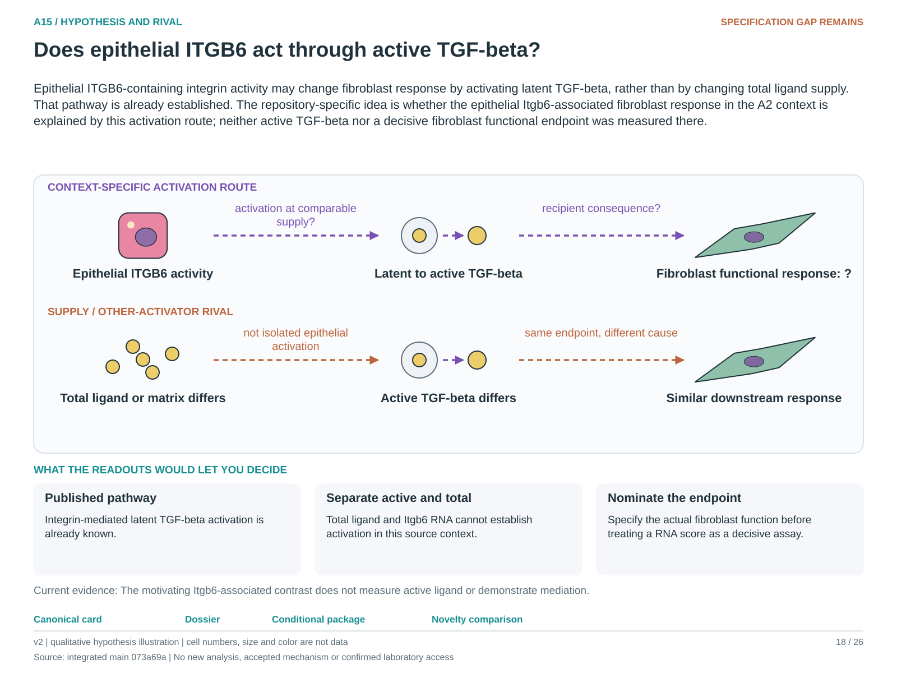

# A15: literature context and hypothesis schematic

Reviewed 3 October 2026. This note connects published findings to the current proposed question. It is a bounded synthesis, not novelty clearance or scientific acceptance.

## Published starting point

Epithelial alpha-v-beta-6 activation of latent TGF-beta is an established mechanism. A15 should explicitly build on it instead of rediscovering it from receptor RNA.

| Primary source | Inspected locator and access record |
|---|---|
| [Munger 1999](https://pubmed.ncbi.nlm.nih.gov/10025398/) | Primary record/abstract, integrin activation of latent TGF-beta. [Access / prior review](../../docs/research_dossiers/review_2026-10-03/SOURCES.md#s12) |

Sources above reuse the named review unless the update ledger explicitly records a fresh inspection. Published-source evidence and reanalysis of the same material are not independent replication.

## Repository observation

The Itgb6 side branch is observational and technically confounded by split wells and position. The 28 September normalization correction supersedes the earlier double-depth-normalized result; the parent mechanism remains blocked.

Exact current result locators:

- [RQ_Specified/A15_epithelial_integrin_tgfb_activation/README.md](README.md)
- [RQ_Specified/A15_epithelial_integrin_tgfb_activation/reports/RIVAL2_RESULTS.md](reports/RIVAL2_RESULTS.md)
- [docs/research_dossiers/followup_2026-10-03/NOVELTY.md](../../docs/research_dossiers/followup_2026-10-03/NOVELTY.md)

## What this question could add

A context-qualified activity comparison could attribute activation to an epithelial route versus another source. The relevant context, functional consequence and owner review remain open; this is not a new general pathway.

## Current hypothesis and rival

Epithelial ITGB6-containing integrin activity may change fibroblast response by activating latent TGF-beta, rather than by changing total ligand supply. That pathway is already established. The repository-specific idea is whether the epithelial Itgb6-associated fibroblast response in the A2 context is explained by this activation route; neither active TGF-beta nor a decisive fibroblast functional endpoint was measured there.

**Strongest rival:** Differences reflect total ligand, another activator, matrix context, recipient composition or technical depth/preparation effects.

## What the comparison would teach

A source-attributable change in active TGF-beta and the nominated recipient response at comparable latent supply would favor activation. Supply-only change or a response independent of the activation contrast favors rivals. Itgb6 RNA, total TGF-beta and a fibroblast RNA score cannot substitute for active ligand and function.

## Hypothesis schematic

[Editable hypothesis schematic](schematics/hypothesis_v2.svg). Original explanatory artwork. Dashed arrows denote the labelled proposal or rival; shapes, colours and cell counts are qualitative, not observations. The three readout cards explain which uncertainty a measurement could resolve. Missing features/endpoints remain marked.

A0–A23 artwork is preserved from the checked v2 atlas at source revision `073a69a758f25f988ecc18402477efa268c00927`. Its full hypothesis was compared with the current dossier. Later literature and scope context are supplied by this note.

## Next literature check

Planned query (not reported as newly executed): `epithelial ITGB6 latent TGFbeta activation context functional fibroblast rival`. Expand to synonyms, nearest source references/citations and conflicting results using the [literature workflow](../../docs/LITERATURE_WORKFLOW.md). Recheck the exact population, comparison, timing, unit and endpoint before making a stronger contribution claim.

**Current unresolved specification:** Active ligand, total ligand, epithelial integrin context and fibroblast response have not been measured in an identifiable comparison.

**Interpretation limit:** Itgb6 RNA, ligand RNA and a TGF response score do not individually identify the activation mechanism.

[Current dossier](../../docs/research_dossiers/A15.md) · [All-question context index](../../docs/research_dossiers/literature_context_2026-10-03/README.md)
