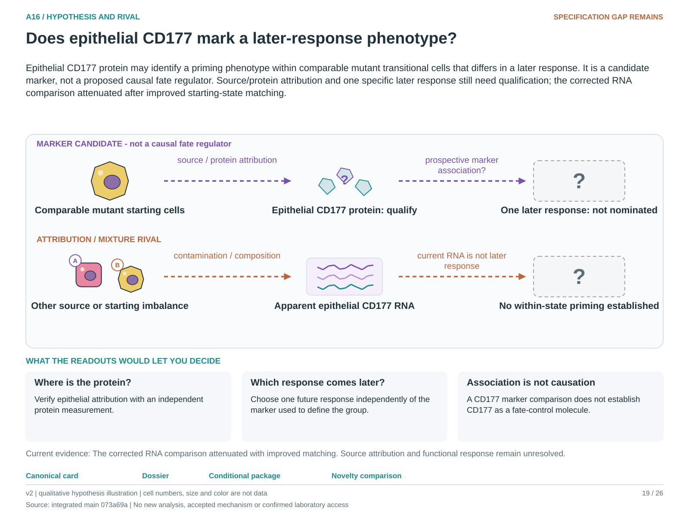

# A16: literature context and hypothesis schematic

Reviewed 3 October 2026. This note connects published findings to the current proposed question. It is a bounded synthesis, not novelty clearance or scientific acceptance.

## Published starting point

The source already describes mutant epithelial plasticity and a CD177-associated mixed state. A CD177-positive transcriptomic pattern is not itself a new programme.

| Primary source | Inspected locator and access record |
|---|---|
| [England 2025](https://doi.org/10.1016/j.stem.2025.01.011) | Clonal evidence and mutant-state plasticity; abstract/source audit. [Access / prior review](../../docs/research_dossiers/review_2026-10-03/SOURCES.md#s08) |

Sources above reuse the named review unless the update ledger explicitly records a fresh inspection. Published-source evidence and reanalysis of the same material are not independent replication.

## Repository observation

Corrected Stage 1 analysis attenuated the association and left residual imbalance. Current evidence does not establish intrinsic priming, complete exclusion of contamination or later fate.

Exact current result locators:

- [RQ_Specified/A16_cd177_state_attribution/README.md](README.md)
- [RQ_Specified/A16_cd177_state_attribution/reports/STAGE1_RESULTS.md](reports/STAGE1_RESULTS.md)
- [docs/research_dossiers/followup_2026-10-03/NOVELTY.md](../../docs/research_dossiers/followup_2026-10-03/NOVELTY.md)

## What this question could add

Confirm epithelial protein attribution and one independent prospective response. That could qualify a useful marker; it would not establish CD177 as the molecule controlling fate.

## Current hypothesis and rival

Epithelial CD177 protein may identify a priming phenotype within comparable mutant transitional cells that differs in a later response. It is a candidate marker, not a proposed causal fate regulator. Source/protein attribution and one specific later response still need qualification; the corrected RNA comparison attenuated after improved starting-state matching.

**Strongest rival:** Expression marks another cell source, technical contamination, unequal starting states or an already active response.

## What the comparison would teach

Confirmed epithelial protein followed by a later response difference within comparable baseline states supports marker utility. Disappearance after source or state control favors contamination or mixture. Endpoint RNA differences alone do not show priming, and CD177 perturbation would ask a different causal question.

## Hypothesis schematic

[Editable hypothesis schematic](schematics/hypothesis_v2.svg). Original explanatory artwork. Dashed arrows denote the labelled proposal or rival; shapes, colours and cell counts are qualitative, not observations. The three readout cards explain which uncertainty a measurement could resolve. Missing features/endpoints remain marked.

A0–A23 artwork is preserved from the checked v2 atlas at source revision `073a69a758f25f988ecc18402477efa268c00927`. Its full hypothesis was compared with the current dossier. Later literature and scope context are supplied by this note.

## Next literature check

Planned query (not reported as newly executed): `CD177 epithelial protein prospective lineage response lung mixed state 2025 2026`. Expand to synonyms, nearest source references/citations and conflicting results using the [literature workflow](../../docs/LITERATURE_WORKFLOW.md). Recheck the exact population, comparison, timing, unit and endpoint before making a stronger contribution claim.

**Current unresolved specification:** Protein-level attribution and a subsequent independently measured phenotype in matched mutant states are missing.

**Interpretation limit:** A corrected association is not proof of cell-intrinsic priming, absence of contamination or a lineage advantage.

[Current dossier](../../docs/research_dossiers/A16.md) · [All-question context index](../../docs/research_dossiers/literature_context_2026-10-03/README.md)
