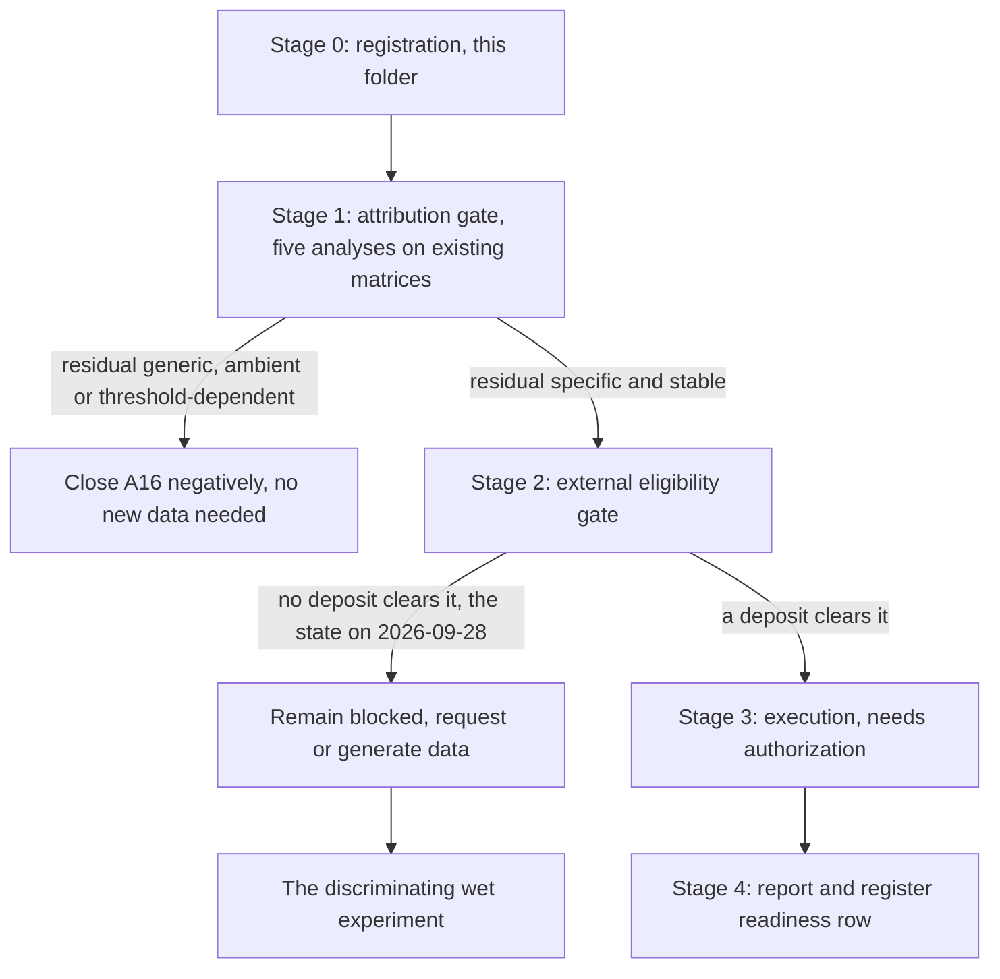

# A16 analysis plan: what has to be fixed before anything is computed

> **State on 28 September 2026, after execution.** Stage 1 ran in the frozen order (C3 and C4, then
> C1, C2 and C5) and neither closed the question nor reached the permitted positive conclusion; the
> [integration review](reports/INTEGRATION_REVIEW.md) withdrew the stronger exclusions and a
> [corrected C1](correction_20260928/reports/CORRECTED_C1_REPORT.md) then executed the neighbourhood
> amendment on one fixed population per library. Order-of-work item 4 has therefore been reached:
> the next action is not another analysis on these matrices but the Stage 2 data gate or the
> discriminating experiment. The stage definitions below are the frozen plan and are unchanged; the
> current argument is the [rationale amendment](RATIONALE.md#amendment-28-september-2026-the-rationale-as-successive-evidence-states).

Written 28 September 2026, before any A16 endpoint has been run. The exposure is disclosed and is not
small: the founding within-subcluster result was seen first, and Stage 1 reuses the same matrices. So
Stage 1 is an **amendment with full prior exposure**, not independent confirmation, and its value is
one-directional — it can close the question, not establish it.

## Structure

Stage 1 is the only stage that can run now. It is deliberately arranged so that the cheap outcome is
the negative one.

## Stage 0: registration, which is what this folder contains

The question, its rationale, this plan, the frozen contract and the recorded data search. No endpoint
scored, no dataset opened for A16, no claim row. If the owner rejects the question, the folder is
removed and the lead is recorded as a findings entry under the England package, which keeps the
observation without keeping a register identifier.

## Stage 1: the attribution gate, frozen before execution

**Unit.** The sequencing library. Two libraries carry the contrast (GSM7890835, GSM7890836) and every
estimate is reported per library, never pooled. No animal identities were deposited, so no
population inference is available and none is claimed.

**Population.** Cells passing the frozen transitional gate (Cldn4, Ndrg1, Sox9, at least two of three
detected) in the round-2 Experiment-1 embedding.

**Endpoint family.** The seven frozen endpoints from the founding contrast: priming-associated RNA,
AT2 identity, AT1 identity, Itga2, the shared and lesion disjoint remodelling modules, and cycling.
**Priming-associated RNA is the primary endpoint** because it is the only one that survived
conditioning; the others are reported for consistency and are not promoted if they move.

**Floors.** At least 30 cells per side of any contrast, as in the founding work. A stratum below the
floor is reported as "not assessed", never merged upward and never rescued by lowering the floor.

### A16-C1: continuous neighbourhood matching

Replace discrete subclusters with position itself. For each Cd177-positive transitional cell, take its
k nearest neighbours in the round-2 integrated embedding that are Cd177-negative and in the same depth
stratum, and form a matched difference; aggregate with weights that do not let one positive cell
dominate. Report k across a small prespecified range so the answer is not a choice of k.

*Estimand.* Weighted mean matched difference in the primary endpoint, per library.
*What would change what.* If the matched difference falls inside the C3 null band, the residual is
composition at a scale finer than the round-2 clusters, and A16 closes. If it stays outside, position
as measured does not explain it.

### A16-C2: resolution ladder

Repeat the founding within-subcluster contrast across a ladder of clustering resolutions, recording at
each the pooled within-subcluster primary effect and the number of subclusters that clear the floor.

*Estimand.* The trend of the within-subcluster effect against resolution.
*What would change what.* Monotone decay toward zero favours finer-scale composition. A plateau
favours a component that is not positional at any resolution the data can resolve. A ladder that runs
out of testable subclusters before it decides is reported as underpowered, which is a real outcome
here given the cell counts.

### A16-C3: detection-matched gene null

The specificity anchor, and the analysis most likely to close the question. Draw control genes matched
to Cd177 on detection rate and mean expression **within the transitional gate**, and run each through
the identical pipeline: marginal contrast, within-subcluster contrast, and C1 matching.

*Estimand.* Cd177's primary effect as a quantile of the control-gene distribution, per library and per
analysis.
*What would change what.* If Cd177 sits in the central mass, the persistence is generic gradient
behaviour, the premise of A16 collapses, and the England interpretation is tightened rather than
overturned — the phenotype was already reported as largely compositional. Only an extreme-tail
position keeps A16 open.

### A16-C4: ambient neutrophil-origin control

Cd177 is a neutrophil surface protein and the priming module is inflammation-associated. Test whether
Cd177 detection within the transitional gate co-varies with an ambient and neutrophil panel (the
frozen immune panel plus Retnlg), and whether conditioning on that panel removes the residual.

*Estimand.* The primary effect before and after conditioning on the neutrophil panel score, per
library, plus the association between Cd177 detection and that score.
*What would change what.* If conditioning removes the residual, the effect is contamination and A16
closes negatively. This bears on the RNA side only: the source's CD177 claims rest on
immunofluorescence and sorted organoids, which this cannot touch.
*Known weakness.* The deposit holds filtered matrices with no empty droplets, so ambient RNA cannot be
estimated properly. A within-cell panel is a weaker instrument, and a negative result here does not
exclude contamination.

### A16-C5: threshold and marker-quality sensitivity

Recompute C1 with the positive call at Cd177 ≥ 1, ≥ 2 and ≥ 3 UMIs, and at the thinned-depth
equivalents, reporting the cell counts that survive each.

*Estimand.* Sign and magnitude of the primary effect across thresholds.
*What would change what.* Sign changes across thresholds mean the split is an arbitrary cut on a
continuum and no RNA-based attribution is possible; the question then waits entirely on protein.

### What Stage 1 may not conclude

No result in Stage 1 establishes that Cd177 marks a cell-intrinsic programme, because conditioning
shrinks the estimate under both rivals. The permitted positive conclusion is narrower and must be
worded as such: *a component of the priming association is not explained by position as measured
here, is specific to Cd177 among detection-matched genes, and is not removed by the available ambient
control.* That wording is the ceiling.

## Stage 2: the external eligibility gate, frozen before any candidate is opened

A deposit is eligible only if it satisfies all five conditions **simultaneously**. The purpose of
freezing them now is that a later session cannot relax the readout requirement to obtain a testable
dataset.

1. **CD177 measured as protein** and used for prospective separation — sorting, or spatial protein
   with single-cell resolution. RNA detection alone is not separation.
2. **A measured outcome on the separated fractions**: EdU or BrdU incorporation, Ki67 protein, clone
   or colony growth, organoid formation, or a lineage label. A cycling RNA score is not an outcome.
3. **Transitional-state assignment by an independent rule**, either the frozen gate or an author
   label with a stated definition, so the comparison is within state rather than across states.
4. **Biological replication at the animal or donor level**, at least three independent units per arm,
   with unit identities deposited.
5. **Enough transcriptome to establish position**, so that separated cells can be compared within a
   neighbourhood rather than across the landscape.

**Stop rules.** If conditions 1 to 3 do not co-occur, no transfer is attempted and the search is
recorded as a negative result. A deposit meeting 1 and 2 but failing 4 may be used for a descriptive,
explicitly non-inferential transfer, labelled as such, and may not change the readiness row.

**State on 28 September 2026.** No candidate clears conditions 1 and 2 together; see
[reports/PUBLIC_DATA_SEARCH.md](reports/PUBLIC_DATA_SEARCH.md). GSE253461 and GSE316244 are partially
eligible for the positional part of the question only, and neither carries a sorted-CD177 arm with an
outcome.

## Stage 3: execution, not yet authorized

Stage 1 needs the owner to retain the question and authorize execution; it reuses the England
processed matrices and needs no new download. Stage 2 cannot execute at all, because nothing clears
the gate. Two owner decisions are therefore pending, and they are separate: retain or reject A16, and
authorize or withhold Stage 1.

## Stage 4: report and register

One report per executed stage, with a run record carrying input hashes, the script hash and the seed.
The register effect is bounded in advance: Stage 1 may change the A16 readiness row in
[RESEARCH_QUESTIONS.md](../../RESEARCH_QUESTIONS.md#a16) and may add a negative result, and may not
add a graded claim row. A closed-negative outcome is written up as such and kept, not deleted.

## The discriminating experiment, for completeness

Sort surface CD177-positive and CD177-negative cells from within a Cldn4/Ndrg1/Sox9 transitional gate
in the same animals, from a comparable neighbourhood, and measure EdU or Ki67 protein and short-term
clone growth on both fractions. The founding work already fixes the prediction: enrichment for primed,
identity-retaining cells and **not** for more cycling ones. A result in which CD177-positive cells
divide more would contradict our reading and support the source's.

## What this plan refuses to do

- To compute a directional trajectory, a velocity or a pseudotime on these matrices. The source ran no
  computational trajectory, and the deposit holds no spliced or unspliced layers.
- To treat the England reanalysis as external validation of itself.
- To use the Il1r1-deletion Cd177 decrease (about −4 log2 units within the AT2 state) as evidence about
  attribution. That is a composition-and-expression change under a genotype perturbation, and it does
  not speak to whether the marker carries cell-intrinsic information.
- To pool libraries, relax floors, swap gates, or add endpoints after seeing Stage 1 output.

## Order of work

1. Owner decision: retain or reject A16.
2. If retained, authorize Stage 1 and run C3 and C4 **first** — the two analyses that can close the
   question — then C1, C2 and C5 only if the residual survives them.
3. Report, and update the readiness row.
4. If the residual survives Stage 1, the next action is not another analysis: it is the data request
   or the experiment, since Stage 1's ceiling has then been reached.
