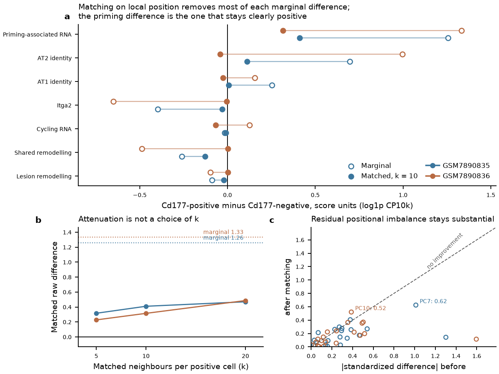
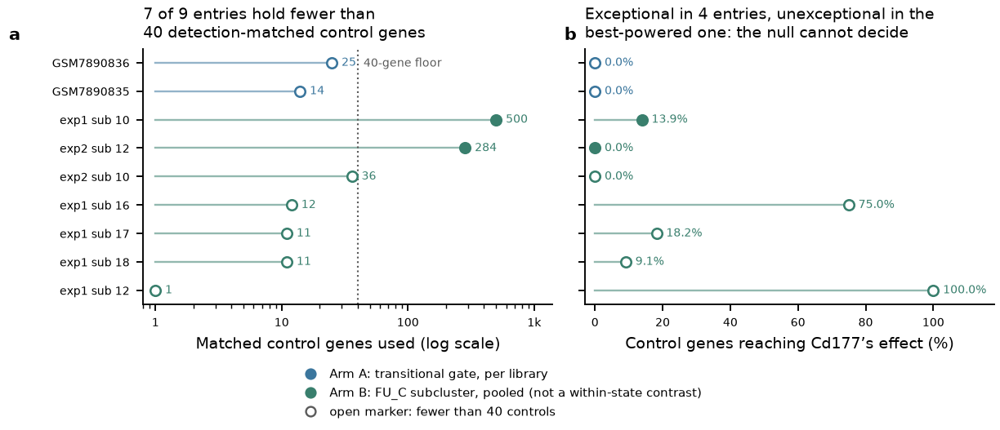
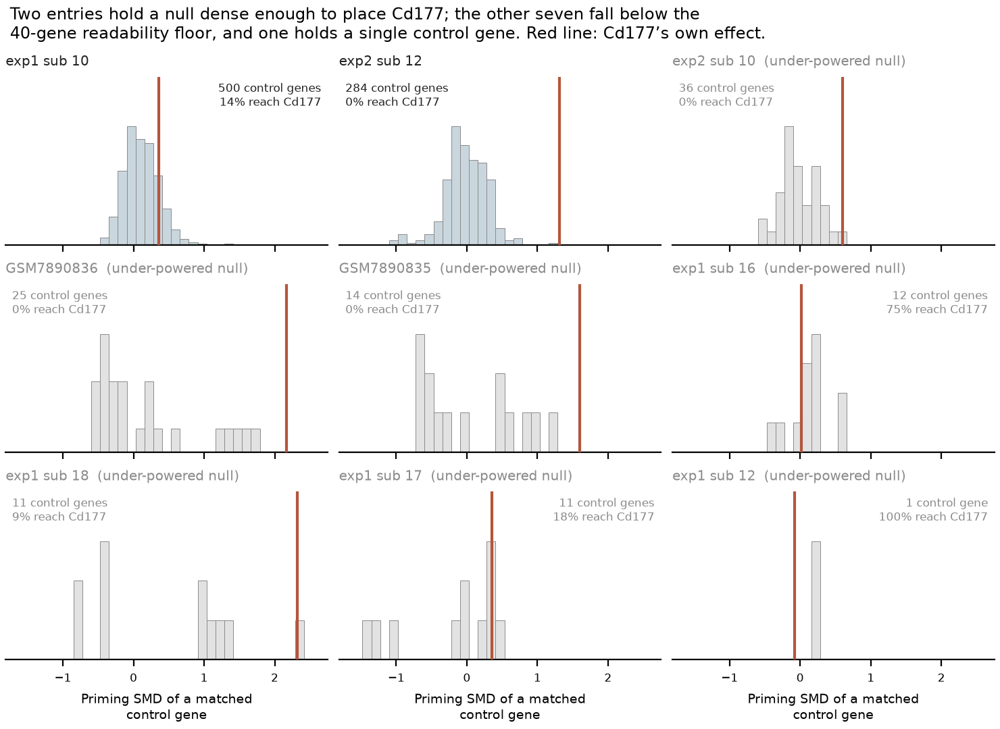
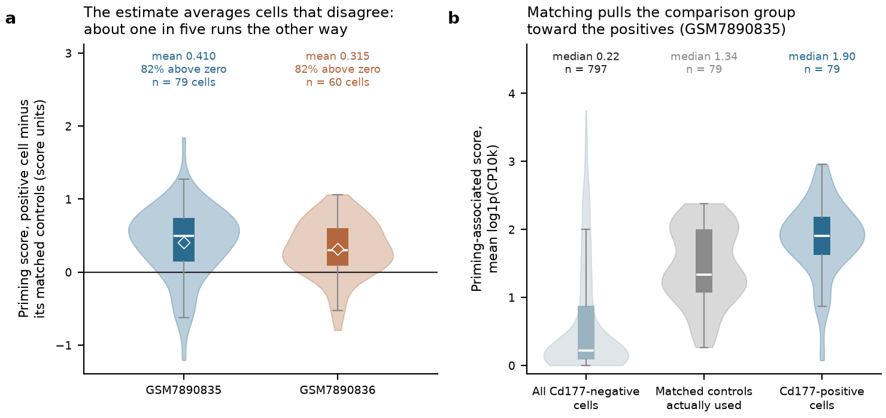
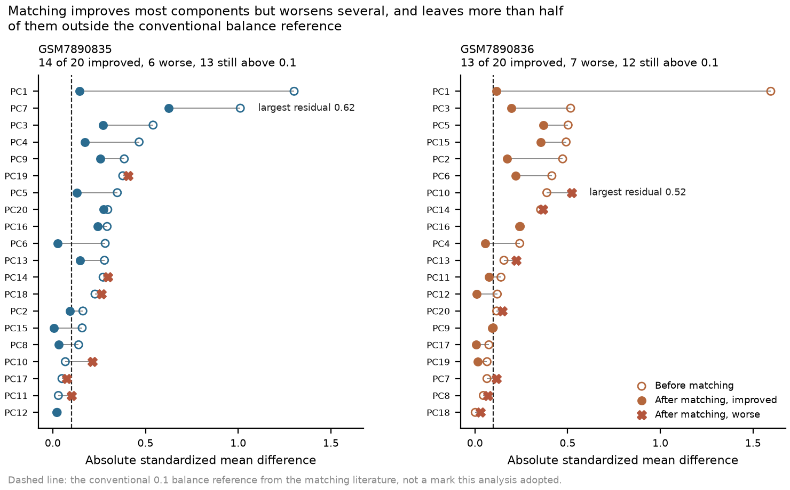

# A16 rationale: why marker attribution is its own question

## The proposition, stated so it can fail

Cd177 detection in a transitional alveolar cell carries information about that cell beyond the
information carried by its position in the transcriptional landscape. Stated to fail: hold position
fixed, and Cd177-positive and Cd177-negative cells become indistinguishable on every frozen endpoint,
because Cd177 was a coordinate all along.

Two readings, and both predict the marginal association that motivates the question:

- **Intrinsic.** A priming programme operates in individual cells, Cd177 is part of it or is
  co-regulated with it, and a cell's Cd177 status therefore predicts its behaviour among neighbours
  that look otherwise alike.
- **Positional.** The primed, identity-retaining region of the landscape expresses Cd177, and a
  cell's Cd177 status is a noisy readout of where it sits. Conditional on position it adds nothing.

Neither is a straw man, and the difference is not semantic. Under the intrinsic reading, sorting on
CD177 enriches for a cell property and the marker is a handle. Under the positional reading, sorting
on CD177 enriches for a region and the marker is a coordinate; an experiment that compares sorted
fractions is then comparing neighbourhoods, and any difference it finds is a difference between
regions of the landscape that was already visible without sorting.

## What the England work supports, and exactly how far it goes

The founding numbers are in the [England follow-up](../../Research%20Article/gate2_C2_england_2025/RESULTS_FOLLOWUP.md)
and belong to that package. Three things about them bound this question.

They rest on **one marker measured as RNA in two libraries**. The primary contrast exists only in
GSM7890835 (79 positive against 799 negative) and GSM7890836 (60 against 598); every other library in
the deposit has too few Cd177-positive transitional cells. Two libraries from the same experiment are
not two biological replicates, and no animal identities were deposited.

They are **not depth artefacts**, which is worth stating because it is the first thing to suspect
with a low-detection marker. Seven associations keep their sign under every depth-control method
available in both libraries, and residualisation on log depth and detected genes retains 87 to 159
per cent of each effect. The frozen four-method rule returned "inconclusive" only because 3,000-UMI
thinning drops one library to 26 positive cells, below the pre-set 30-cell floor.

They are **largely compositional**. Within-subcluster conditioning flips Itga2 positive in 5 of 7
testable subclusters and spreads AT2 identity from −0.36 to +1.27. Only priming-associated RNA
persists, in 5 of 7 subclusters. So the honest summary of the founding work is: the CD177 phenotype is
real, is not a depth artefact, and is mostly a statement about where Cd177-positive cells sit — with
one component unexplained by the clustering used.

That unexplained component is the whole of A16, and it is a single residual in a seven-endpoint
family, computed at one clustering resolution, on a module that overlaps neutrophil biology.

## Why RNA co-variation cannot settle it, and what can

The reason this question needs a design rather than another analysis: conditioning on position
reduces the estimate under **both** hypotheses. Under the positional reading it should fall to zero;
under the intrinsic reading it should fall too, because position and an intrinsic programme are
correlated. A smaller number after conditioning is therefore not a verdict, and this is why the
project's architecture rule applies directly — if no possible result of a calculation can distinguish
the stated rivals, stop at feasibility rather than compute it.

What the existing matrices can still decide is narrower and genuinely decisive in one direction. They
can establish that the residual is **not** worth a question: if a typical gene matched to Cd177 on
detection and expression shows the same residual, the persistence is generic; if the residual tracks
a neutrophil and ambient panel, it is contamination; if it inverts across detection thresholds, the
marker cannot support attribution at all. Each of those closes A16 negatively without new data. None
of them can close it positively, which is the asymmetry recorded in the plan.

What would decide it positively is prospective separation: take cells from the **same neighbourhood**,
separate them on CD177 protein, and measure what they then do. That is a wet experiment, and the
prediction is already on record from the founding work — enrichment for primed, identity-retaining
cells and **not** for more cycling ones, since the cycling association is the one endpoint that
disagrees between the two libraries.

## Rivals

1. **Finer-scale composition.** The residual is position, at a scale below the round-2 clusters.
   Addressed by continuous neighbourhood matching and a resolution ladder; if the effect decays
   monotonically with resolution, this rival wins.
2. **Generic gradient behaviour.** Any gene with Cd177's detection profile would show the same
   residual, because a marginal gradient leaves a within-cluster remainder. Addressed by the
   detection-matched gene null; this is the rival most likely to be correct.
3. **Ambient neutrophil RNA.** Cd177 is a neutrophil surface protein, and Lcn2, Lrg1 and Retnla are
   inflammation-associated, so soup from neutrophils co-varies with both. A residual would then have
   no cell state behind it. Addressed by the ambient-origin control. Filtered matrices without empty
   droplets limit this check to within-cell panels, which is a real weakness of the available data.
4. **A detection threshold masquerading as a population.** Cd177 UMIs in positives run 1 to 53 with
   no break, so "positive" is an arbitrary cut on a continuum. Addressed by threshold sensitivity.
5. **Library-specific biology or handling.** The two libraries disagree on cycling; whatever causes
   that could also inflate the priming residual in one of them. Per-library reporting only, never
   pooled.
6. **State-definition dependence.** The transitional gate captures a subset of author-labelled
   transitional cells, and a different gate would sample a different neighbourhood. The gate is
   frozen and not varied; this rival is disclosed rather than tested.
7. **RNA is not protein.** Surface CD177 availability, not transcript detection, is what any sorting
   experiment would act on, and the two need not agree. Unresolvable here.

## Connections and boundaries

- **A8** owns the maturation component and the mature AT1 endpoints. A16 does not ask what the primed
  state matures into.
- **A11** owns lesion-associated programmes against shared plasticity. A16 uses the frozen disjoint
  modules only as endpoints, and adds nothing to that partition.
- **A1** owns the regulatory distinction between RNA-similar transitional states. A16 is narrower: one
  marker, one attribution, and no chromatin or regulatory layer.
- **A4** owns the lineage question. Nothing here traces a cell, and nothing here licenses a direction.
- **A17** owns the clone-dynamics simulation from the same source paper; the two share a package of
  origin and no data or estimand.

The sibling relationship worth naming explicitly: A16 is an attribution question about a marker,
which is the same shape as the enabling source-identity work under A12-S1 — useful because several
questions would otherwise each assume the marker means what it appears to mean.

---

# Amendment, 28 September 2026: the rationale as successive evidence states

Everything above this line is the Stage 0 rationale as written before any A16 endpoint was computed.
It is preserved unedited as planning history. It is no longer the current argument. Stage 1 ran on
the owner's authorization the same day, the [integration review](reports/INTEGRATION_REVIEW.md)
then withdrew the stronger exclusions in the [original Stage 1 report](reports/STAGE1_RESULTS.md),
and a separately frozen [corrected C1 comparison](correction_20260928/reports/CORRECTED_C1_REPORT.md)
executed the neighbourhood amendment on one fixed population per library. This section records what
each of those states changed in the argument, which statements above are superseded or qualified,
and how the question now reads. It adds no analysis, no claim row and no grade change. The frozen
[contract](config/a16_question_contract.json) and the [population erratum](reports/STAGE1_ERRATUM.md)
are hash-verified by `scripts/verify_stage1_evidence.py` and are not modified by this amendment.

## The current question

*Within comparable mutant transitional cells, what can be attributed to a CD177-associated
priming RNA phenotype, and what remains unresolved about state mixture, detection and contamination?*

This replaces the intrinsic-versus-positional dichotomy as the operative question. The dichotomy is
kept above because it explains the design decision that still governs A16 — conditioning on position
shrinks the estimate under both readings, so no calculation on these matrices can decide between them
— but it is not a question Stage 1 could answer, and the [register card](../../RESEARCH_QUESTIONS.md#a16)
now states that a stable intrinsic programme and a neighbourhood-associated phenotype can coexist.
The reframed question asks only what the existing evidence attributes and what it leaves open.

## Four evidence states

| State | Documents | What it established | What it could change |
|---|---|---|---|
| 0. Registration | this rationale (above), [PLAN.md](PLAN.md), the frozen contract | The design: Stage 1 one-directional, five analyses, permitted positive conclusion capped by contract wording | Nothing yet computed; the readiness row read "blocked" |
| 1. Stage 1 executed | [STAGE1_RESULTS.md](reports/STAGE1_RESULTS.md), [STAGE1_ERRATUM.md](reports/STAGE1_ERRATUM.md), `tables/stage1/` | C3 inconclusive; C1 positive residuals in 8 of 9 entries at k=10; C2 non-monotone on three resolutions; C4 and C5 reported as exclusions (prose later withdrawn); two-arm population amendment recorded before execution | Readiness row moved from "blocked" to "partly measured and inconclusive"; no claim row permitted |
| 2. Integration review | [INTEGRATION_REVIEW.md](reports/INTEGRATION_REVIEW.md) | C4 does not exclude ambient RNA; C5 does not exclude detection/depth artefacts; C1 was not the frozen neighbourhood test; C2 changes eligibility and weights, not only resolution; C3 control abundance is not power; the two arms do not nest the original population | Superseded the stronger prose of State 1 without changing any number; readiness unchanged |
| 3. Corrected C1 | [CORRECTED_C1_REPORT.md](correction_20260928/reports/CORRECTED_C1_REPORT.md), specification committed at `e1d46b4f` before outcomes | On the fixed per-library transition population with 660 grouping, gate and outcome genes excluded before normalization, local 20-PC neighbourhoods and same-library, same-depth-quartile matching: priming raw difference 1.255829 → 0.409807 (GSM7890835, 79/797 cells) and 1.331844 → 0.315110 (GSM7890836, 60/596 cells) at k=10; residual maximum PC imbalance 0.62495 and 0.52100 | Completed C1's computational amendment on exposed data; cannot change biological status, specificity or contamination verdicts |

None of States 1–3 can add a graded claim or establish a mechanism. Only Stage 2 of the plan — a
deposit clearing all five eligibility conditions — or the discriminating experiment can.

## Figures for the amendment

Two panels are rendered from tracked tables by
[scripts/plot_amendment_figures.py](scripts/plot_amendment_figures.py), with input, script and
output hashes in [figures/figure_run.json](figures/figure_run.json). They plot saved columns and
estimate nothing; they exist because the two things this amendment turns on — how much of the
association survives conditioning, and why the specificity test could not decide — are both
comparisons across nine entries that a table renders less legibly than a plot.

**Figure A16-F01. Matching on local position removes most of each marginal difference; the priming
difference is the one that stays clearly positive, and positional imbalance is not removed.**
Corrected C1 on one fixed transitional population per library (GSM7890835: 79 Cd177-positive of
876 cells; GSM7890836: 60 of 656). (a) Marginal and matched raw differences at k=10 for all seven
frozen endpoints, in score units of mean log1p(full-library CP10k). (b) The predeclared k
sensitivity for the primary endpoint against its marginal value. (c) Per-PC |standardized
difference| before against after matching, 20 PCs per library; the worst residual PC is
labelled. Plotted from
[effects.csv](correction_20260928/tables/corrected_c1/effects.csv) and
[PC_balance.csv](correction_20260928/tables/corrected_c1/PC_balance.csv). Neighbours are drawn
within the same library and depth quartile in a local 20-PC space fitted after excluding 660
grouping, gate and outcome genes. These raw differences share no scale with the C3 SMD null and
are not compared with it. The change from marginal to matched is not a fraction of signal
explained, and the residuals in (c) are why neither persistence nor attenuation attributes the
effect to a cell property.

**Figure A16-F02. The specificity null is too sparsely populated to decide: Cd177 exceeds every
sampled control in four entries and sits inside the null in the best-powered one.** C3
detection-matched gene null for the priming endpoint, nine descriptive entries. (a) Matched
control genes used per entry, log scale, against the 40-gene readability floor; seven entries fall
below it. (b) Percentage of each entry's control genes reaching Cd177's effect. Open markers mark
entries below the floor; exp1 sub 12's 100% is a single control gene, and exp1 sub 18's 9.1% is
one of eleven. Arm B entries pool libraries within an experiment and use all `primary_include`
cells rather than the transition gate, so they are diagnostics of the earlier result and not
within-state contrasts ([population erratum](reports/STAGE1_ERRATUM.md)). Plotted from
[A16_C3_matched_gene_null.csv](tables/stage1/A16_C3_matched_gene_null.csv). Cd177 is detected in
about 9% of transitional cells but carries 1 to 53 UMIs where detected, which is why matching on
detection and expression together leaves so few controls; widening the bands after seeing this
would be a disclosed post-hoc relaxation, not the frozen C3.

### The evidence behind those two summaries

The question these three panels serve is whether Cd177 marks a distinct primed sub-state of the
alveolar epithelial compartment, or whether Cd177-positive cells simply sit where priming is
already high. Each panel is drawn in the display its analysis type is normally reported in.
Rendered by [scripts/plot_evidence_distributions.py](scripts/plot_evidence_distributions.py),
which asserts recomputation against the archived tables before drawing; hashes in
[figures/figure_run_distributions.json](figures/figure_run_distributions.json).

**Figure A16-F03. Cd177 is not exceptional among genes matched to it, and in most units the test
could not have shown that it was.** *What to look for:* where the red line (Cd177's own priming
effect) falls inside each grey distribution of effects from genes matched to Cd177 on detection
and expression. *What it shows:* in the only well-populated null — exp1 sub 10, 500 control
genes — Cd177 sits inside the distribution, with 14% of matched control genes reaching or
exceeding it. A gene whose association with priming were specific to it should sit in the tail.
It does not. *Why the rest cannot decide it:* seven of nine units hold fewer than 40 control
genes and one holds a single gene, so their histograms are a handful of bars and the percentage
beside them is a fraction with a denominator in single or low double digits — not a null a value
can be placed in. The single-gene entry, exp1 sub 12, is Pclaf, whose effect (+0.203) is above
Cd177's (-0.077); that is what its "100% reach Cd177" means. *Biological reading:* the
specificity of Cd177 to a primed state is **untested here, not refuted** — the one interpretable
unit gives no support for specificity, and the remaining units are silent. Plotted from
[A16_C3_control_gene_detail.csv](tables/stage1/A16_C3_control_gene_detail.csv) and
[A16_C3_matched_gene_null.csv](tables/stage1/A16_C3_matched_gene_null.csv). Arm B entries pool
libraries within an experiment and are not within-state contrasts.

**Figure A16-F04. Cd177-positive cells are not uniformly primed, and the cells they are compared
against are themselves primed.** *What to look for in (a):* how much of each violin lies below
the zero line. *What it shows:* the reported effect is a mean over cells that disagree — 82% of
Cd177-positive cells score above their own matched controls in both libraries, so roughly one in
five scores below. The compartment is not a uniformly primed population with a sharp boundary;
it is a graded one in which Cd177 positivity and high priming coincide in most cells but not all.
*What to look for in (b):* the gap between the left violin and the middle one. *What it shows:*
the matched controls actually used (median 1.34) sit far above the Cd177-negative pool they were
drawn from (median 0.22) and close to the positives (median 1.90). *Biological reading:* this is
the mechanism of the attenuation from 1.256 to 0.410. Matching selects negative cells that
already occupy the primed region of the local space, so the corrected estimate asks a narrower
and more informative question — whether Cd177 adds anything **beyond** being in that region — and
the residual 0.410 is the answer to that narrower question, not a diminished version of the
original one. Plotted from
[cell_outcomes.csv](correction_20260928/tables/corrected_c1/cell_outcomes.csv),
[matched_edges.csv](correction_20260928/tables/corrected_c1/matched_edges.csv) and
[effects.csv](correction_20260928/tables/corrected_c1/effects.csv); the means are the reported
0.409807 and 0.315110, reproduced to 1e-12.

**Figure A16-F05. The comparison is better balanced than the raw contrast but is not
position-free, so the residual effect cannot be read as intrinsic to Cd177.** *What to look for:*
how far the filled markers (after matching) sit from zero, and where a cross replaces a circle.
*What it shows:* the dominant axis of transcriptional position, PC1, is brought under control in
both libraries (1.30 to 0.15; 1.60 to 0.11) — the crude contrast's main confounder is removed.
But 13 of 20 components in GSM7890835 and 12 of 20 in GSM7890836 remain above the conventional
0.1 reference, the largest residuals being PC7 at 0.62 and PC10 at 0.52, and matching made 6 and
7 components **worse** (crosses) — PC10 in GSM7890836 rose from 0.39 to 0.52. Worsening on
unmatched axes is expected when matching on a 20-dimensional space with 79 and 60 positives.
*Biological reading:* whatever primed programme the residual 0.410 reflects, the positive and
comparison cells still differ in transcriptional position along several axes, so the estimate
remains a contrast between cells in *partly different states* rather than a clean
same-state comparison. This is the most concrete statement available of why C1 supports
association and not attribution, and it is why the closure gate is a prospective CD177 sort with
the state assignment made before the priming readout, not a further reweighting of these data.
The 0.1 line is the matching literature's convention, not a threshold this analysis adopted.
Plotted from [PC_balance.csv](correction_20260928/tables/corrected_c1/PC_balance.csv); maxima
agree with [matching_quality.csv](correction_20260928/tables/corrected_c1/matching_quality.csv).

## Claim-by-claim ledger: statements above that later evidence superseded or qualified

| Statement in the Stage 0 text | Status | Superseding or qualifying evidence |
|---|---|---|
| The question is a choice between an intrinsic and a positional reading; "Cd177 was a coordinate all along" is the failure condition | **Superseded as the operative question**; retained as the design argument | Register card: the two readings can coexist. PLAN.md, "What Stage 1 may not conclude": conditioning shrinks the estimate under both. Proposal wording adopted above |
| 79 positive against 799 negative and 60 against 598 cells | **Qualified** | Actual `primary_include` and `gate_transition` flags give 876 and 656 fixed cells, i.e. 79/797 and 60/596; the founding prose's 878 and 658 do not override the inclusion flags (corrected C1 report) |
| "They are not depth artefacts", with residualization "retaining 87 to 159 per cent of each effect" | **Superseded** | SMD ratios do not measure a percentage of biological signal retained (register card; integration review, correction 1). FU_A's frozen four-method verdict is inconclusive because one thinning arm has 26 positive cells. C5 thins the marker call while outcomes stay full-depth, and all four thinned-depth rows in the two primary libraries fail the 30-cell floor (integration review, correction 2). Current wording: directions are preserved under the *available full-depth* adjustments; complete depth control was not achieved |
| "They are largely compositional": Itga2 flips positive in 5 of 7 subclusters, AT2 identity spreads −0.36 to +1.27, only priming persists in 5 of 7 | **Qualified** | Those numbers come from FU_C, which pools libraries within each experiment and uses all `primary_include` cells, not the transition gate (STAGE1_ERRATUM.md, Arm B; integration review, correction 6). They are a diagnostic of the old result, not a within-state conditioning. The within-population statement is now supplied by the corrected C1 secondary endpoints: AT2 identity 0.695824 → 0.112045 and 0.997005 → −0.042701, Itga2 −0.397238 → −0.030124 and −0.651080 → −0.004508, while priming stays 0.409807 and 0.315110 |
| The matched-gene null, the ambient control and the threshold sensitivity "each close A16 negatively without new data" | **Qualified** | In principle still true; in practice none of the three could. C3: Cd177 exceeds every sampled control in 4 of 9 entries but sits inside the null in the best-powered unit (Experiment-1 subcluster 10, 500 controls), and 7 of 9 entries have fewer than 40 matched controls because Cd177 is detected in about 9% of transitional cells yet carries 1–53 UMIs where detected. C4: the within-cell neutrophil panel cannot estimate ambient RNA in filtered matrices; the reported Spearman compares *detection*, not UMI abundance, with the panel. C5: bounded to full-depth cutoffs. The instruments were too weak to close, which is "inconclusive", not "negative" |
| Rival 1, finer-scale composition, "if the effect decays monotonically with resolution, this rival wins" | **Open; qualified** | C2's three persisted resolutions give non-monotone weighted effects, but eligibility, represented populations and weights change with resolution (integration review, correction 4). Corrected C1 attenuates the priming residual by roughly two thirds and leaves maximum PC imbalance above 0.5, so position as measured explains much, not all, and the remainder is not shown to be non-positional |
| Rival 2, generic gradient behaviour, "the rival most likely to be correct" | **Open; unchanged** | C3 inconclusive for control-gene scarcity. In Experiment-1 subcluster 18 the median matched control shows +0.963 against Cd177's +2.323, but the median control SMD is not an additive decomposition (integration review, correction 5) |
| Rival 3, ambient neutrophil RNA, "addressed by the ambient-origin control" | **Open; the State 1 exclusion is withdrawn** | Conditioning retains 87–139% of the effect, but a low panel correlation or a remaining adjusted effect does not test every contamination source (integration review, correction 1). The Stage 0 text's own "known weakness" paragraph was correct |
| Rival 4, detection threshold, "addressed by threshold sensitivity" | **Bounded, not excluded** | Directions are stable across 1/2/3-UMI cuts at full depth; thinned-depth rows fail the floor. The Stage 1 prose "detection-threshold artefact is excluded" is superseded |
| Rival 5, library-specific biology; report per library, never pooled | **Retained and applied** | Corrected C1 fits each library separately and matches within library. The two libraries agree in direction on priming and disagree on cycling (0.125699 → −0.068290 in GSM7890836; −0.015371 → −0.009126 in GSM7890835). Two libraries from one experiment remain two libraries, not two animals |
| Rival 6, state-definition dependence; "disclosed rather than tested" | **Unchanged** | The gate was not varied. The two-arm amendment compared different populations rather than conditioning one (integration review, correction 6) |
| Rival 7, RNA is not protein; "unresolvable here" | **Unchanged** | No deposit clears eligibility conditions 1 and 2 together ([PUBLIC_DATA_SEARCH.md](reports/PUBLIC_DATA_SEARCH.md)) |
| "What would decide it positively is prospective separation", with the prediction that CD177-sorted cells enrich for primed, identity-retaining cells and *not* for more cycling ones | **Retained; unchanged** | The falsifying observation is unchanged: CD177-positive cells dividing more would contradict this reading and support the source's. Cycling RNA after matching is near zero in both libraries, which is consistent with the "not cycling" half of the prediction but is not a measurement of proliferation |
| Connections and boundaries (A8, A11, A1, A4, A17, A12-S1) | **Unchanged** | — |

## What a reader should now be able to identify

- **Biological premise.** Within the England mutant transitional compartment, Cd177 RNA detection
  co-varies with a priming-associated module (Lcn2, Lrg1, Retnla, Ptgs1) and with retained AT2/AT1
  identity, and inversely with Itga2 and remodelling RNA. The source paper reads CD177 as marking a
  reversible, proliferative mutant state; our reading is that it marks a primed, identity-retaining
  position, with a residual not yet attributed.
- **Main rival.** Generic gradient behaviour: any gene with Cd177's detection profile would leave a
  similar within-neighbourhood residual. Ambient neutrophil RNA is the second live rival.
- **Population and outcome.** Cells passing the frozen Cldn4/Ndrg1/Sox9 gate in GSM7890835 (876) and
  GSM7890836 (656); primary outcome the mean log1p(full-library CP10k) of the four priming genes.
- **Narrow comparison.** Cd177-detected versus matched Cd177-negative cells from the same library and
  depth quartile in a gene-excluded local PCA space, per library.
- **Independent unit.** The sequencing library. Two libraries, one experiment, no deposited animal
  identities; no population inference is available and none is claimed.
- **Possible interpretations of the current numbers.** (a) Position as measured accounts for most of
  the marginal association, and the remainder is composition below the resolution of a 20-PC local
  space, generic gradient behaviour, or contamination; (b) a Cd177-linked priming component exists
  within comparable cells. The corrected C1 numbers are compatible with both. Neither attenuation nor
  persistence is an explained fraction of signal.
- **Exact next evidence gate.** Stage 2 of PLAN.md, unchanged: protein-level CD177 separation within
  an independently assigned transitional state, a measured outcome on the separated fractions, at
  least three animals or donors per arm with deposited identities, and enough transcriptome to place
  the separated cells within a neighbourhood. Until a deposit or experiment clears it, A16 remains
  "partly measured and inconclusive".

## Boundaries carried forward

- Residual matching effects do not prove intrinsic biology; attenuation is not an explained causal
  fraction; ratios of standardized effects are not percentages of signal retained.
- The corrected C1 retains substantial imbalance. Another parameter sweep — wider C3 matching bands,
  different k, other resolutions — cannot supply biological attribution and would be a disclosed
  post-hoc exploration if run at all.
- The C3 null uses unadjusted SMDs; corrected C1 reports raw matched differences and a common
  fixed-population SD. These scales are not comparable, so no common null threshold is applied.
- No statement about the neutrophil panel may be read as excluding contamination, and no statement
  about full-depth cutoffs may be read as excluding depth or detection effects.
- Nothing here bears on the source's immunofluorescence, sorted-organoid or transplantation evidence,
  which A16 cannot touch with these matrices.
- This amendment adopts the proposal's question wording inside the workspace. The register card is
  unchanged until the owner adopts that wording, and the owner's retain/reject decision on A16 remains
  pending and separate.
