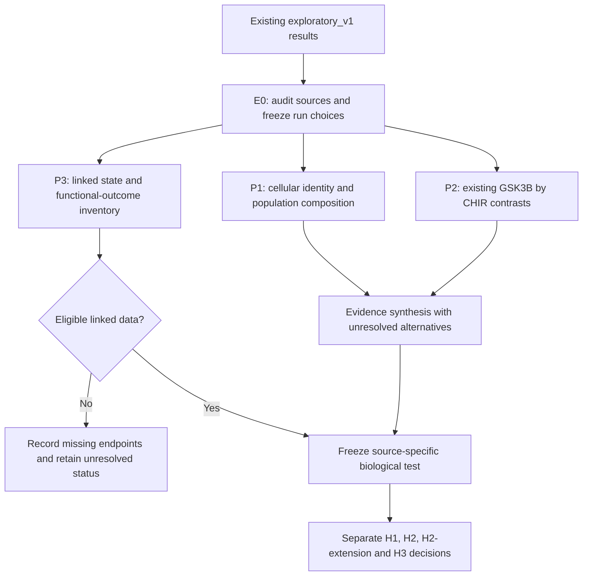

# A19 extension pipeline: lineage context and withdrawal response

**30 September 2026 · extension_v1 planning amendment · not executed or frozen.**
[Current results](RESULTS.md#hypothesis-refinement-and-discriminating-biological-outcomes) ·
[Parent investigation plan](PLAN.md) · [Draft execution specification](config/extension_pipeline_draft.json) ·
[Sources](SOURCES.md) · [External evidence review](EXTERNAL_EVIDENCE.md) ·
[Current figures](FIGURES.md).

## Biological focus and relationship to H1–H3

**Parent question:** Can transient Fzd signaling separate AT2 expansion from
later alveolar maturation while preserving a responsive AT2 reserve?

**Focused extension question:** Does acquisition of an airway-associated state
during expansion limit subsequent AT1 maturation after Fzd stimulation ends?

**Proposed hypothesis:** Establishment of a competing basal/airway programme
during expansion reduces the capacity of alveolar-derived progenitors to
produce mature AT1 descendants after withdrawal **under a specified maturation
environment and input**. The restriction may be modifiable; airway origin or a
basal-associated RNA state does not imply irreversible exclusion. Descendants that retain an
alveolar programme are predicted to show a larger maturation response to release
from stimulation. This is a post-analysis biological proposal, not a result of
the existing CHIR experiment. A mixed RNA state does not establish a stable
lineage commitment or a fate restriction.

The original H1–H3 remain separate. H1 keeps mature lineage-derived AT1 yield
and preserved AT2 capacity as joint requirements. H2 keeps its original question
about the state **before exposure**. The focused extension adds a state measured
**after expansion but before the withdrawal decision**, termed H2-extension
here; this is a local description, not a new registered research question.
The [external evidence review](EXTERNAL_EVIDENCE.md) adds two explicit constraints:
withdrawal alone may lack a required maturation cue, and input changes can modify
lineage stability. Compare these explanations with acquired state restriction;
none is established as the cause of the current A19 observations.

H3 still requires a receptor-level comparator and independent engagement
calibration. Additional Hippo mediation and broad pathway searches are deferred.

| Hypothesis | Current motivating observation | Extension contribution | Biological decision still required |
|---|---|---|---|
| H1: temporal separation with retained reserve | CHIR-absent cultures show mixed AT1/airway RNA changes; no measured fate or reserve | Priority 1 resolves the cellular organization of mixed identity; Priority 3 seeks linked withdrawal/fate/reserve data | Useful gain in absolute mature AT1 descendants after verified off-period, with retained AT2 capacity and later responsiveness; failure of either preservation or gain weakens the combined hypothesis |
| H2: initial-state competence | Alveolar-derived cultures and airway-derived cultures have different source responses | Priority 1 describes origin/culture-context associations; Priority 3 requires genuinely pre-exposure states | A useful initial-state-by-schedule interaction in independently measured mature output, with an uncertainty rule fixed before outcomes |
| H2-extension: state established during expansion | Early SFTPC induction fades in airway-derived cultures despite CHIR; airway markers increase in other CHIR-absent cultures | Priority 1 identifies candidate mixed or distinct states; Priority 3 tests state-dependent withdrawal response | A larger withdrawal benefit in independently defined alveolar-retaining states than in airway-associated states; precise equivalence or the opposite direction weakens this prediction |
| H3: input-dependent regulation | Knockdown and CHIR contexts show nonuniform RNA effects | Priority 2 summarizes existing background-by-CHIR contrasts; Priority 3 seeks a calibrated Fzd comparator | Input-dependent later fate/function, beyond an RNA-only difference; the present GSK3 data cannot establish Fzd specificity |

## State timing and causal interpretation

Use three explicitly linked times: **S0**, before any expansion input; **S1**,
after expansion but before assignment to withdrawal or continuation; and **Y**,
the later lineage/function endpoint. Define states independently of Y. A label
called "competent" cannot simply mean the cells later classified as mature.
Candidate alveolar/airway definitions must use an externally specified feature
set, with independent later fate/function measurements and source provenance.

If all units receive a common expansion phase and withdrawal/continuation is
assigned only after S1 is recorded, compare the withdrawal effect across the
S1 states. This can identify effect heterogeneity for the withdrawal decision
under a valid design, but does not by itself show that the state causes the
heterogeneity. A causal claim about establishment of the airway programme
requires its own state-directed perturbation or justified identification design.

If the complete schedule is assigned at S0, S1 can be treatment-induced.
Do not adjust H1's total schedule effect for S1, achieved growth or observed
post-treatment RNA activity, or relabel those variables as baseline modifiers.
Any mediation analysis needs a separate causal design. S0 effect modification,
S1 predictive heterogeneity and mediation are distinct targets; record which
a source can identify. The currently proposed single-cell controls identify
none of those longitudinal effects.

## Stages, priorities and dependencies

Priority is scientific value, not a requirement to delay inexpensive work.
The source inventory for Priority 3 may proceed alongside Priorities 1 and 2;
it does not depend on obtaining favorable exploratory results.

### E0. Source and analysis contract

Before new single-cell outcomes, record accession/file hashes, source cell and
sample metadata, donor identity evidence, culture origin, medium, passage,
assay timing, repeated preparations and count/annotation availability. Mark
prior exposure to the paper's single-cell narrative and figures; this analysis
is exploratory even if its execution choices are frozen before new calculations.
A `.rds` object or sample-name suffix is not itself proof of a biological unit.

Freeze the uninfected inclusion list, donor/preparation aggregation, external
reference/marker definitions, QC and coverage rules, contrasts, technical
sensitivity checks and figure plan before inspecting new biological contrasts.
Technical availability/QC inspection must be logged separately from outcome
inspection. Numerical cutoffs are intentionally unset in the draft specification;
choose and justify them from source characteristics or independent reference
material, not by maximizing the desired result. If independence cannot be
resolved, report source units and limit or stop the affected paired inference.

For Priority 2, the outputs are already exposed. Freeze only the new reporting
scope and retain the original numerical contract; do not call that a new
prospective discovery. For Priority 3, an eligible dataset receives its own
endpoint/model/margin/replication/validation contract before its new outcomes
are analyzed. The published literature search is bounded and recorded, not
represented as an exhaustive absence claim.

### Priority 1. Cellular organization of alveolar and airway identity

**Question.** Are the mixed RNA signals organized into separate epithelial
populations, into individual cells carrying both programmes, or both? This
characterizes candidate lineage states relevant to the focused hypothesis;
it cannot establish conversion, selective replacement, stability or fate.

**Starting material.** [GSE197949](https://www.ncbi.nlm.nih.gov/geo/query/acc.cgi?acc=GSE197949)
provides processed single-cell objects and H5 count files. The local source
metadata nominate these control comparisons, subject to donor/preparation
verification:

| Candidate donor code | Alveolar-derived control | Airway/pool-derived control |
|---|---|---|
| AO15 | GSM5934387 | GSM5934389 |
| AO16 | GSM5934392 | GSM5934394 |
| AO22 | GSM5934397 | GSM5934400 |

These are at most three candidate matched source units, not six independent
donors. Additional unpaired source controls may appear in a separate descriptive
appendix if their eligibility is documented; they do not augment the paired
sample size. Repeated captures from one source are not extra donors. The source
`16h` label is not a Fzd withdrawal interval. Alveolar-derived and airway-derived
samples differ in origin and culture context; this comparison cannot isolate
origin, CHIR, or initial-state effects. Restrict this run to the nominated
uninfected controls and their noninfectious identity phenotypes.

**Analysis sequence.**

1. Reconcile processed object metadata with sample-level GEO records and the
   source analysis code. If using external state references, audit the nominated
   Kathiriya datasets separately and record any overlap with prior A1 work or
   later publications. Reference reuse cannot become independent validation.
   Prefer existing curated counts/annotations when their
   provenance and units are recoverable; inspect counts before assuming an
   integrated assay is suitable for biological comparisons.
2. Identify epithelial populations with externally defined AT2, AT1-associated,
   basal, secretory and ciliated features. Preserve ambiguous and mixed states.
   An AT1-associated RNA label is not mature AT1 function. Use independent
   held-out features when checking state identity, rather than defining and
   confirming a state with the same expression score.
3. For each donor/context, report epithelial composition and the joint
   distribution of alveolar and basal/airway expression. Assess within-cell
   coexistence with multiple markers under frozen coverage/detection rules;
   do not nominate a new state from one ambient-prone marker alone.
4. Report every matched donor contrast for composition and mixed-identity
   prevalence. Within comparable source-defined states, summarize expression
   using donor/context/state pseudobulk only where coverage permits. These
   within-state summaries are descriptive, not adjusted causal treatment effects.
   Preserve counts/denominators and show all candidate pairs; do not use cells
   as independent replicates or infer a population distribution from three pairs.
5. Check the specific rivals for mixed expression: doublets, ambient RNA and
   detection depth. Display the main result and the prespecified conservative
   sensitivity result together. Embeddings are illustrations; unintegrated
   counts and donor-level summaries support contrasts. Do not infer an actual
   temporal path from pseudotime, source origin or a connected embedding.

**Decision.** Reproducible within-cell coexistence across eligible source units
supports a mixed-identity *description* and candidate states for future testing.
Signals confined to separate populations favor a mixture explanation for the
bulk result. A result lost under the nominated technical checks remains
unresolved. None of these outcomes confirms H2 or demonstrates that airway
programme acquisition causes loss of maturation capacity. Static mixed identity
cannot be called stable commitment, and the source paper's related observations
must be acknowledged rather than counted as independent validation.

### Priority 2. Input context, differentiation-associated RNA and growth

**Question.** Does the response to CHIR absence differ across GSK3B backgrounds
in a way that motivates testing fate regulation separately from proliferative
output?

Use the existing, exposed [program interactions](tables/exploratory_v1/bulk_response_interactions.tsv),
[gene effects](tables/exploratory_v1/bulk_marker_effects.tsv),
[expression values](tables/exploratory_v1/bulk_marker_expression.tsv) and
[normalization sensitivity](reports/verification.json). No new broad discovery
screen or refit of Nb2 is required.

For each block, retain the contrast
`(CHIR absent − present in knockdown) − (CHIR absent − present in control)`.
Display all eligible frozen panels, with nominated gene-level contributions
and the TMM/total-count alternatives. Keep GSK3B, EGF and FOXM1 as the original
sentinels; do not select mediators from their association with an outcome.
Use GSK3B RNA to describe the genetic background, not to infer complete protein
or activity loss.

The already-computed AT1-associated differences are +1.40 and +1.19 score units,
whereas proliferation differences are −0.17 and approximately 0.00. These are
leads for a differentiation-versus-growth question, not proof of decoupled
mechanisms or equivalence of proliferative responses. Program scales are not
calibrated to the same biological effect size; larger numerical change alone
cannot establish selective action. Do not regress out proliferation, match
post-treatment scores, or treat two blocks as a powered interaction experiment.
Hairpin differs by block, and the qPCR/bulk SFTPC discordance remains explicit.

**Decision.** Consistent block-level response differences, retained at the
individual-gene level and under the nominated normalization sensitivity,
justify a candidate input-context prediction. Inconsistent or sparse patterns
limit that prediction. Every outcome remains descriptive and cannot identify
Fzd specificity, off-target pharmacology or a mediator. The parent H3 awaits
independently calibrated receptor-level inputs and later fate/function data.

### Priority 3. Linked functional evidence and separate biological decisions

**Question.** Does a verified off-period yield mature alveolar descendants,
and is that benefit modified by a prospectively defined lineage state?

Inventory public candidate data by the following fields: independent source
unit and allocation, S0 and/or S1 measurement timing, lineage origin, exposure
history, verified engagement/off-period, later observation time, linked mature
AT1 outcome, airway-descendant outcome, survival and absolute counts, retained
AT2 capacity and later-bout response. Record maturation-promoting soluble cues, mechanical context and developmental
model alongside state and input; absence of a permissive cue is a rival to
intrinsic fate restriction. Where available, separate withdrawal-only from
combined-cue contrasts without inferring an absent factorial comparison.
Identify receptor/input comparators and independent engagement calibration
separately for H3. RNA-only data can remain
context evidence but cannot fill a missing functional field.

Record eligibility **per hypothesis**, not as one all-or-nothing source label:

| Decision | Required comparison and outcome | Evidence that weakens the stated prediction | Inconclusive case |
|---|---|---|---|
| H1 | Withdrawal versus continued Fzd stimulation; absolute mature lineage-descendant yield at a common time plus retained AT2 capacity/later response | A precise absence of useful mature-output gain, reliable reverse effect or failure of reserve preservation | Missing linked function/reserve, unverified off-period or imprecision |
| H2 | Schedule response across independently measured S0 states | A precise absence of a useful S0-by-schedule interaction or a reliable contrary interaction | States defined after treatment, inadequate overlap or missing later outcomes |
| H2-extension | Withdrawal/continuation assigned after a common expansion phase, with S1 independently recorded before that assignment; later AT1 and airway descendant outputs | Precise equivalence or larger withdrawal benefit in airway-associated S1 states than in alveolar-retaining S1 states | Cross-sectional RNA alone, S1 derived from Y, or post-treatment conditioning of the original schedule effect |
| H3 | Independently calibrated receptor-level and comparator inputs linked to later fate/function | Precise equivalence within a prospective margin weakens input-specificity; RNA-only differences do not establish it | No Fzd comparator, incompatible engagement or missing fate/function |

Use the [external dataset triage](EXTERNAL_EVIDENCE.md#public-data-triage) to
prioritize GSE150068 for basal-route reference and GSE246243/GSE221343 for
differentiation/input context, subject to their replication and intervention
limits. GSE221343 requires the corrected 2024 sample/file identities. These
resources are not prequalified for the complete functional test.

The functional endpoint must be independent of the RNA feature set defining
states. Report AT1 output per initial viable labeled population, airway output
and death/selection, rather than relying on proportions alone. Retained AT2
capacity remains necessary for the full H1 claim; a source missing it can test
only the mature-output component. Distinguish AT2 maturation from AT1 production.
Freeze meaningful gain/preservation margins, uncertainty and multiplicity rules,
unit structure, replication/power rationale and validation before new outcomes.
Do not select those parameters from the exposed two-block or three-line effects.

A missing dataset closes the affected execution stage with a precise missing-
evidence record. It does not disprove the biological hypothesis or justify
filling the gap with another marker score. Observational evidence may narrow
predictions; establishing that an acquired airway state causally restricts fate
requires additional state-directed causal evidence.

## Planned deliverables and figure sequence

These are **planned paths**, not existing results or promises that unavailable
endpoints can be computed. Use new `extension_v1` subdirectories; preserve the
existing `exploratory_v1` inputs, tables, four figures and numerical provenance.

| Stage | Planned deposited output | Planned figure and what it can show |
|---|---|---|
| E0 | `metadata/extension_v1/source_units.tsv`, `reports/extension_v1/ELIGIBILITY.md`, `config/extension_v1_frozen.json` | Unit/condition coverage diagram; no inferred treatment timeline |
| P1 | `tables/extension_v1/cell_state_composition.tsv`, `mixed_identity_by_source.tsv`, `within_state_pseudobulk.tsv`, `reports/extension_v1/CELLULAR_CONTEXT.md` | `A19_E1`: source-level state composition, joint identity expression and paired source contrasts; embedding supplementary only |
| P2 | `tables/extension_v1/input_context_contrasts.tsv`, `reports/extension_v1/INPUT_CONTEXT.md`, links to original exposed tables | `A19_E2`: both blocks' background-by-CHIR contrasts, individual nominated genes and normalization sensitivity; no population p-values |
| P3 inventory | `metadata/extension_v1/linked_endpoint_inventory.tsv`, `reports/extension_v1/FUNCTIONAL_ELIGIBILITY.md` | Endpoint coverage map; explicit missingness, no fabricated functional observations |
| P3 eligible execution | Source-specific frozen contract and `reports/extension_v1/FUNCTIONAL_RESULTS.md` only after eligibility | `A19_E3` only if real linked outcomes exist: mature output, airway outcome and reserve by schedule/state |
| Synthesis | `reports/extension_v1/SYNTHESIS.md`, input/output hashes and verification | Crosswalk from observed result to H1/H2/H2-extension/H3 status, including contrary and unresolved outcomes |

When real figures are generated, export PNG/PDF/SVG with full source/unit captions,
show biological units, preserve missing/contrary values, and visually review
exported PDFs. Planned figure numbers do not extend the current four-figure
result set. Keep public source metadata, selected derived tables, code and
provenance in the question workspace; full input payloads remain in ignored cache.

## Execution order and stopping boundary

1. Resolve E0 source identities and freeze the P1 run choices. In parallel with
   that audit, P2 can reuse existing verified values and P3 can inventory sources.
2. Execute P1 and the bounded P2 report, retaining limitations rather than
   broadening signatures or inclusion rules until a preferred result appears.
3. Synthesize which cellular-state predictions remain plausible. Do not require
   a positive P1/P2 result before reporting eligible P3 evidence.
4. Execute only the hypothesis components for which P3 supplies linked endpoints
   and a prospective contract. Record all others as unresolved and specify the
   missing evidence. Reserve the full H1–H3 interpretation for those decisions.

This amendment structures the next analyses. No new single-cell scores, fits,
figures, claims or confirmatory tests are reported as completed by this document.
The main README remains universal; this plan is discoverable through A19's
question card and workspace.
