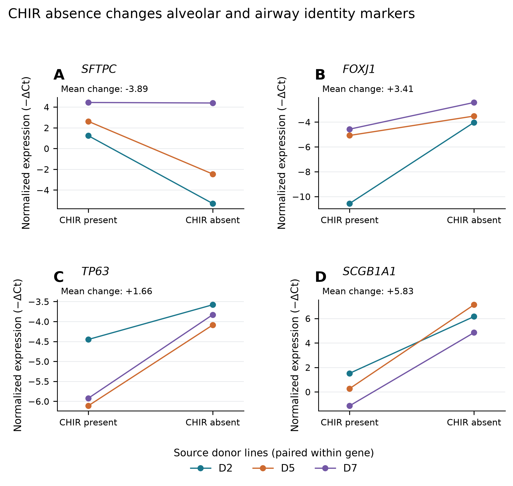
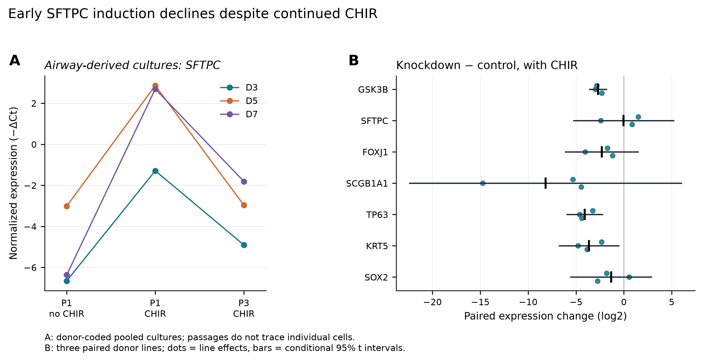
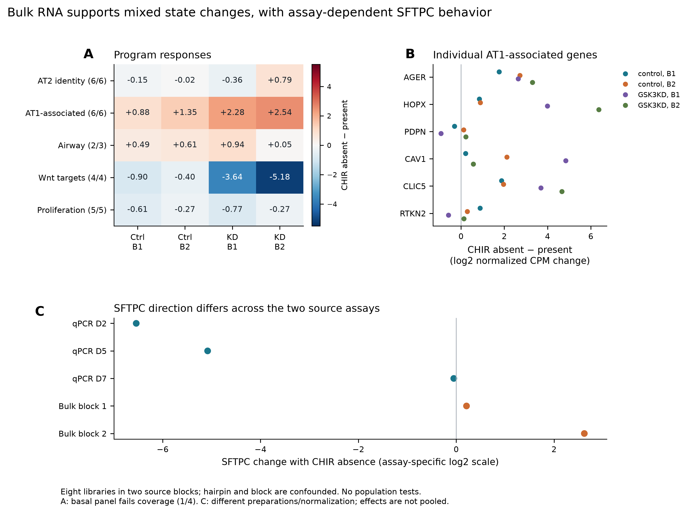
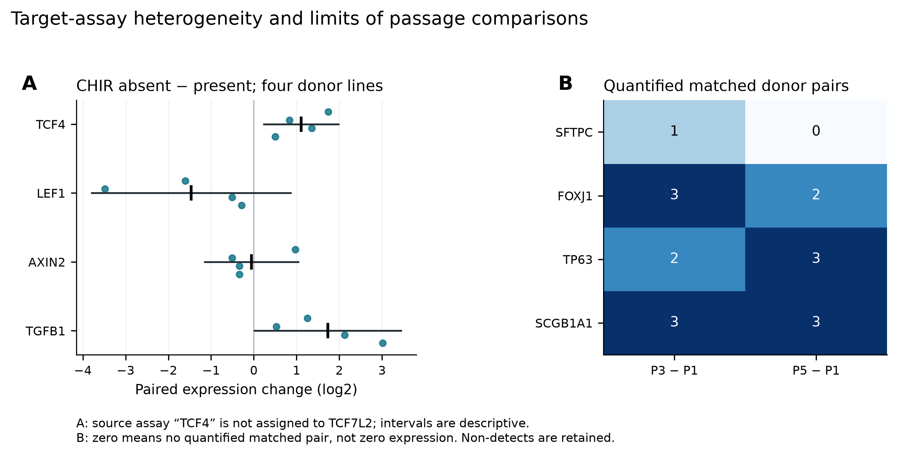

# A19 figure set: response, persistence and lineage context

**30 September 2026 · exploratory_v1.** Three main figures and one supplementary
figure, generated from observed source values. Each has a 300 dpi PNG, a vector
PDF and an editable-text SVG. [Results](RESULTS.md) · [Methods](METHODS.md) ·
[Source inventory](SOURCES.md) · [Render provenance](reports/figure_render.json).

All primary numerical inputs here come from the [2022 human organoid study](https://www.nature.com/articles/s42003-022-03828-5)
and its [GEO deposition](https://www.ncbi.nlm.nih.gov/geo/query/acc.cgi?acc=GSE197949).
These are new layouts and exploratory contrasts of published observations,
not independent biological replication. No simulated trajectories, inferred
fate fractions or significance stars are shown. Labels A–D identify panels;
colors distinguish source lines only where a legend names those lines.

## Figure 1

**CHIR absence is accompanied by a shift from alveolar toward airway marker
expression in human alveolar-derived organoids.** (A–D) Normalized qPCR
expression, plotted as −DeltaCt, for SFTPC, FOXJ1, TP63 and SCGB1A1 in
HTII-280-positive-derived organoids. Lines connect identical source donor codes
D2, D5 and D7 between CHIR-present and CHIR-absent media. All three SFTPC
contrasts decrease; all three contrasts for each airway marker increase.
Annotations give mean paired log2 change, absent minus present; individual
points are not technical-replicate means newly calculated here. Axes are
marker-specific, and absolute expression cannot be compared between genes.
Three source donor lines per panel; no hypothesis test is plotted. The narrow
SFTPC change in D7 and the full donor variation remain visible. Source: workbook
sheet `fig4b `, exact rows in the source table. The data establish a marker
balance in this culture context, not lineage conversion or mature AT1 function.

[PDF](figures/exploratory_v1/A19_F1_identity_context.pdf) ·
[SVG](figures/exploratory_v1/A19_F1_identity_context.svg) ·
[Source rows](tables/exploratory_v1/qpcr_source_rows.tsv) ·
[Effect summary](tables/exploratory_v1/qpcr_effect_summary.tsv).

## Figure 2

**Early SFTPC induction is not sustained through passaging of airway-derived
cultures; GSK3B knockdown has heterogeneous identity-marker consequences in
alveolar-derived cultures.** (A) Source `fig6a` SFTPC values for three donor-coded
pooled airway organoid cultures, D3, D5 and D7. P1 without CHIR and P1/P3 with
CHIR are connected by source code. Early induction (+6.77 mean log2 units) is
followed by lower SFTPC at P3 under continued CHIR (−4.65 versus P1). These
connections do not trace individual cells and do not establish an AT2 lineage
transition. (B) Source `fig5c`, GSK3B knockdown minus control **with CHIR in both
arms**, in three paired alveolar-derived donor lines (D24, D26, D5). Each point
is a donor-paired log2 expression contrast; black ticks are means and horizontal
segments are conditional two-sided 95% t intervals (df = 2). Points are offset
vertically for readability, not additional units. All seven measured markers
are included. SFTPC's broad interval does not establish equivalence; GSK3B RNA
reduction does not demonstrate complete loss of kinase activity. Intervals are
descriptive, unadjusted for multiple outcomes and conditional on source-line
independence/normality. Panels A and B are distinct origins/experiments and
cannot be combined into an initial-state interaction or a Fzd comparison.

[PDF](figures/exploratory_v1/A19_F2_persistence_and_input.pdf) ·
[SVG](figures/exploratory_v1/A19_F2_persistence_and_input.svg) ·
[Individual effects](tables/exploratory_v1/qpcr_paired_effects.tsv).

## Figure 3

**Bulk RNA combines differentiation-associated responses with a discordant
SFTPC direction across assays.** (A) CHIR-absent minus CHIR-present changes in
unweighted mean log2(TMM CPM + 1) for five eligible frozen panels. Columns
represent the two source blocks in control and GSK3B-knockdown backgrounds.
Parentheses report retained/nominated genes. The basal panel fails coverage
(1/4) and is omitted, not scored as zero. (B) Every individual AT1-associated
panel gene, with the same four within-block contrasts; one point per gene,
background and block. PDPN and RTKN2 include opposing directions despite the
positive panel means. (C) SFTPC effects from source Fig. 4b qPCR (three donor
lines) and the control-background bulk libraries (two blocks). The qPCR values
are paired −DeltaCt changes; bulk values are log2(CPM+1) changes. Their signs
can be inspected but scales/preparations are assay-specific; no pooled effect
or cross-assay test is calculated. Total-count normalization preserves 19 of
20 program-effect signs; the exception is the near-zero control-block-2 AT2
score. Eight libraries occupy two source blocks, with hairpin confounded with
block; no population-level tests or error bars are justified. RNA panels are
not measured pathway activities, cell fractions or mature functional endpoints.

[PDF](figures/exploratory_v1/A19_F3_bulk_response_context.pdf) ·
[SVG](figures/exploratory_v1/A19_F3_bulk_response_context.svg) ·
[Panel effects](tables/exploratory_v1/bulk_program_effects.tsv) ·
[Gene effects](tables/exploratory_v1/bulk_marker_effects.tsv) ·
[Coverage](tables/exploratory_v1/bulk_panel_membership.tsv).

## Supplementary Figure 1

**Target-assay responses differ, and passage-wise source labels limit paired
inference.** (A) CHIR-absent minus CHIR-present qPCR changes for four source
assays in `fig4e`, each with four paired donor lines (D2, D24, D5, D7). Points
are donor effects; ticks and segments give the mean and conditional 95% t
interval (df = 3), with the assumptions and multiplicity limits described for
Figure 2. TCF4 is the source-assay label; it is not assigned to TCF7L2 or pooled
into a canonical-activity score. (B) Number of exact donor-matched, quantified
pairs in source `fig6c` for each marker's P3–P1 and P5–P1 contrast. SFTPC has
one quantified P3 pair and no quantified P5 pair; all three P5 source rows are
undetected. Zero denotes absent quantified pairs, not zero expression or zero
biological response. Every incomplete pair remains in the audit. This panel
explains the limits on the passage evidence rather than adding a biological
endpoint.

[PDF](figures/exploratory_v1/A19_S1_target_and_pairing.pdf) ·
[SVG](figures/exploratory_v1/A19_S1_target_and_pairing.svg) ·
[Pairing audit](tables/exploratory_v1/qpcr_pairing_audit.tsv).
