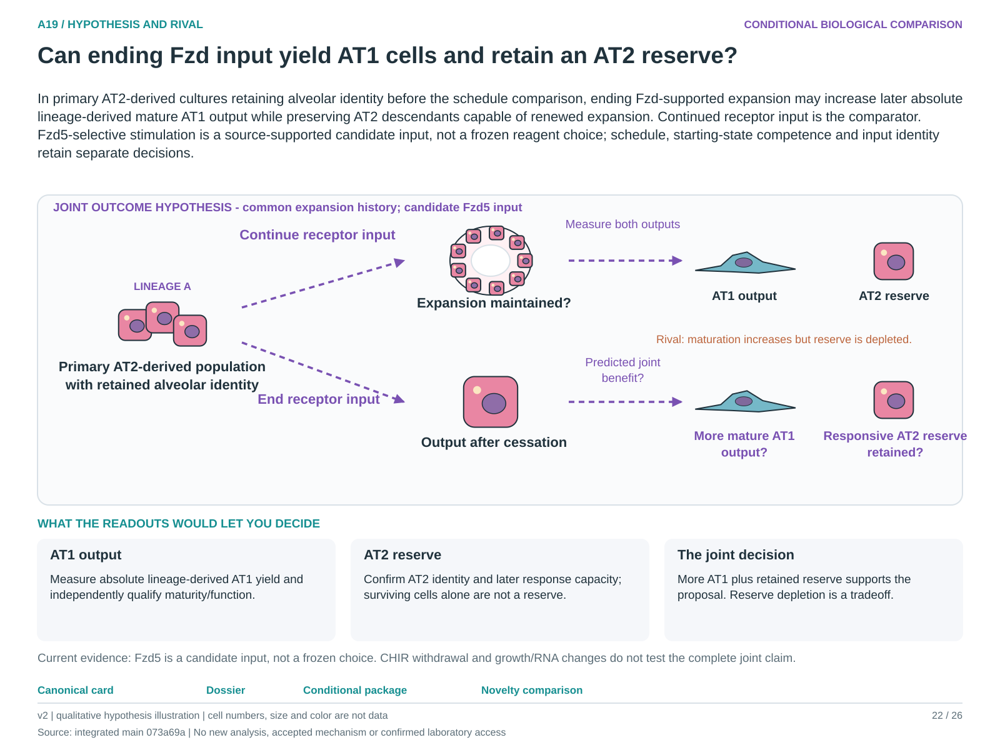

# A19: literature context and hypothesis schematic

Reviewed 3 October 2026. This note connects published findings to the current proposed question. It is a bounded synthesis, not novelty clearance or scientific acceptance.

## Published starting point

Compartment-specific Fzd signalling and human expansion/differentiation are published. CHIR-starvation comparisons do not constitute receptor-input withdrawal with a measured reserve.

| Primary source | Inspected locator and access record |
|---|---|
| [Nabhan 2023](https://pubmed.ncbi.nlm.nih.gov/37321220/) | Compartment-specific Fzd results; Figs. 3–4 for A19. [Access / prior review](../../docs/research_dossiers/NOVELTY_SPECIFICITY_APPLICATION_2026-10-03.md) |
| [Rochelle 2026](https://www.jci.org/articles/view/188701) | Figs. 6–8 and supporting-table headers. [Access / prior review](../../docs/research_dossiers/packages_2026-10-03/SOURCES.md) |

Sources above reuse the named review unless the update ledger explicitly records a fresh inspection. Published-source evidence and reanalysis of the same material are not independent replication.

## Repository observation

The Nb2-derived workspace and later extension narrow the question to withdrawal, mature output and reserve. Pre-withdrawal airway-like state is a candidate competence feature, not established causation.

Exact current result locators:

- [RQ_Specified/A19_fzd_response_reversibility/README.md](README.md)
- [RQ_Specified/A19_fzd_response_reversibility/RESULTS.md](RESULTS.md)
- [docs/research_dossiers/followup_2026-10-03/NOVELTY.md](../../docs/research_dossiers/followup_2026-10-03/NOVELTY.md)
- [docs/research_dossiers/followup_2026-10-03/OUTCOMES.md](../../docs/research_dossiers/followup_2026-10-03/OUTCOMES.md)
- [docs/research_dossiers/continuation_2026-10-03/SOURCE_LINKAGE.md](../../docs/research_dossiers/continuation_2026-10-03/SOURCE_LINKAGE.md)

## What this question could add

Assess mature lineage-derived AT1 output jointly with a functionally responsive AT2 reserve after ending a specified receptor input. A maturation/reserve tradeoff would also be informative; Fzd5 remains a candidate, not a frozen resource.

## Current hypothesis and rival

In primary AT2-derived cultures retaining alveolar identity before the schedule comparison, ending Fzd-supported expansion may increase later absolute lineage-derived mature AT1 output while preserving AT2 descendants capable of renewed expansion. Continued receptor input is the comparator. Fzd5-selective stimulation is a source-supported candidate input, not a frozen reagent choice; schedule, starting-state competence and input identity retain separate decisions.

**Strongest rival:** Observed differences follow survival, starting population mixture, expansion duration or a generic downstream pathway effect.

## What the comparison would teach

More mature AT1 output with a retained responsive AT2 reserve supports productive withdrawal in that context. More AT1 output with reserve depletion is a tradeoff; more area alone tests neither. Lineage-linked absolute counts address yield, independent identity/function addresses maturity, and later response capacity addresses reserve. CHIR withdrawal does not isolate Fzd5 withdrawal.

## Hypothesis schematic

[Editable hypothesis schematic](schematics/hypothesis_v2.svg). Original explanatory artwork. Dashed arrows denote the labelled proposal or rival; shapes, colours and cell counts are qualitative, not observations. The three readout cards explain which uncertainty a measurement could resolve. Missing features/endpoints remain marked.

A0–A23 artwork is preserved from the checked v2 atlas at source revision `073a69a758f25f988ecc18402477efa268c00927`. Its full hypothesis was compared with the current dossier. Later literature and scope context are supplied by this note.

## Next literature check

Planned query (not reported as newly executed): `Frizzled receptor withdrawal mature AT1 output retained responsive AT2 reserve 2026`. Expand to synonyms, nearest source references/citations and conflicting results using the [literature workflow](../../docs/LITERATURE_WORKFLOW.md). Recheck the exact population, comparison, timing, unit and endpoint before making a stronger contribution claim.

**Current unresolved specification:** Starting-state competence, input duration and input identity have not been separated using mature descendant and reserve outcomes.

**Interpretation limit:** Marker changes or expansion after stimulation do not demonstrate productive mature repair with retained reserve.

[Current dossier](../../docs/research_dossiers/A19.md) · [All-question context index](../../docs/research_dossiers/literature_context_2026-10-03/README.md)
