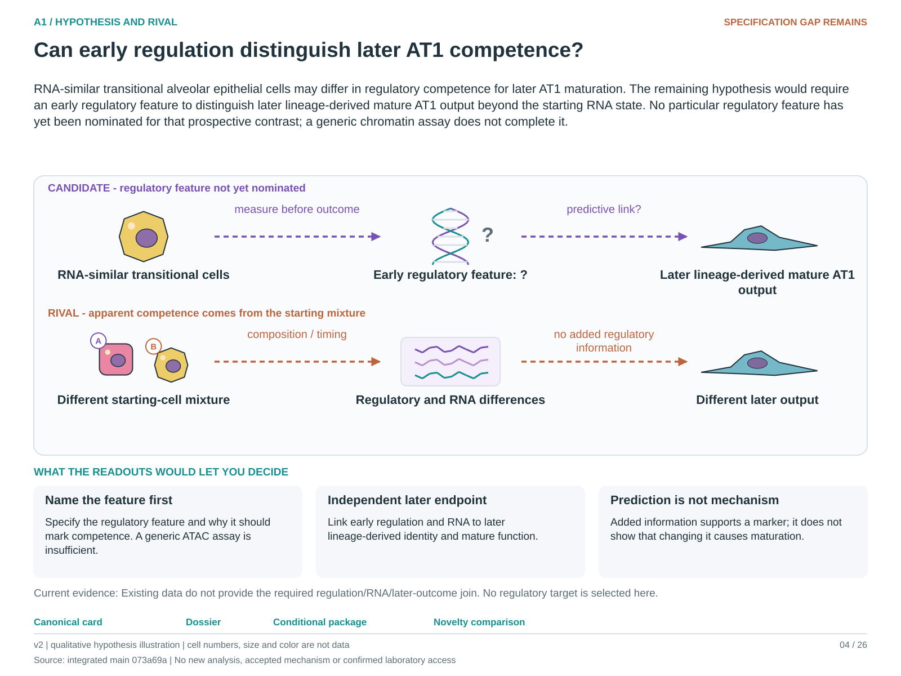

# A1: Distinguishing transitional epithelial states

**Proposed Wagner companion, 4 October 2026:** [Wg-P05](../../Research%20Article/gate2_W1_wagner_th17_autoimmunity/rq_derivation/P05.md) nominates early epithelial glycolytic relaxation after IL-1β withdrawal as a proposed biochemical feature for this existing question. It remains an article-local proposal; the canonical hypothesis, prior outcomes and registered illustration here are unchanged. Linked biochemical/output measurements and scientific adoption are not yet qualified.

<!-- current-rq-framing:start -->
## Current biological hypothesis and novelty boundary — 3 October 2026

RNA-similar transitional alveolar epithelial cells may differ in regulatory competence for later AT1 maturation. The remaining hypothesis would require an early regulatory feature to distinguish later lineage-derived mature AT1 output beyond the starting RNA state. No particular regulatory feature has yet been nominated for that prospective contrast; a generic chromatin assay does not complete it.

**What is already known, and what remains:** Regulatory heterogeneity and functional transitional states are published. Exact-feature novelty cannot be judged until the regulatory feature and mature endpoint are fixed. [Primary-source comparison](../../docs/research_dossiers/NOVELTY_SPECIFICITY_APPLICATION_2026-10-03.md#a1).

**What the measurements would decide:** Early regulatory information that improves prediction in independent biological units would support a competence marker. It would not establish a causal regulator; absent incremental information weakens the proposed marker. Current unlinked RNA/regulatory samples cannot perform this comparison.

**Current disposition:** Feature nomination required. This revision specifies proposed work; scientific acceptance, model access and assay qualification remain pending.

| Evidence and implementation | Current boundary |
|---|---|
| Biological unit and endpoint | Independent animal/donor preparations with justified assay/lineage linkage. Compare held-out unit prediction error for absolute mature descendants per starting AT2 input; protein identity, morphology and function need separate qualification. |
| Current evidence and limit | Regulatory and mature lineage endpoints exist, but no inspected cohort supplies the required early regulatory/RNA-to-later-outcome join. The regulatory predictor remains unspecified. |
| Next decision / hold | Scientific acceptance is pending; source recovery is closed at the current evidence limit (M07). Reopen for an explicit linked design and a justified feature/endpoint, not by pairing different animals through condition labels. |

**Read in this order:** [current evidence](COMPARISON_MATRIX.md),
[development dossier](../../docs/research_dossiers/A1.md),
[conditional hypothesis package](../../docs/research_dossiers/packages_2026-10-03/A1.md).
Source-mapping closeout: [M07 and reopening conditions](../../docs/research_dossiers/source_mapping_closeout_2026-10-03/README.md).
[Deferred work](../../docs/research_dossiers/REMAINING_WORK.md) and
[execution requirements](../../docs/RESEARCH_GOVERNANCE.md) govern any later
analysis. Draft completion does not establish assay validity, resource access,
meaningful effects, precision or scientific acceptance. Existing numerical
results and original plans below retain their recorded scope.
<!-- current-rq-framing:end -->

<!-- literature-visual-context:start -->
## Literature context and visual hypothesis

[What previous findings contribute, what remains, and what the readouts would decide](LITERATURE_CONTEXT.md).

*Explanatory proposal, not measured results. Read the linked context and caption; arrows do not certify a mechanism or novelty.*
<!-- literature-visual-context:end -->

**Conditional candidates reviewed 1 October 2026:** [Nb3 response-pattern
candidate and HLCA population-definition constraint](../../RESEARCH_QUESTIONS.md#a1-candidates-20261001).
These nominate comparisons; they supply no regulatory-to-fate linkage or new
A1 fit. The [cross-article review](../../docs/audits/2026-10-01-cross-article-rq-review/README.md)
records the source chronology and review decisions.

## Organizing biological question

> Do regulatory programmes distinguish RNA-similar transitional states and their functional responses?

The working hypothesis is that epithelia with overlapping injury-associated RNA
can differ in regulatory state and in their ability to mature, persist or respond
to a perturbation. Shared marker expression alone does not resolve those possibilities.

This folder compares source-defined transitional states using chromatin,
histone and methylation evidence alongside separately assessed lineage and
functional outcomes. It asks what supports a regulation-to-fate connection
without assuming that different state names imply either identical or distinct biology.

**Read first:** [question card](../../RESEARCH_QUESTIONS.md#a1),
[analysis plan](PLAN.md), [regulatory and outcome report](reports/REGULATORY_FATE_REPORT.md).

## Evidence and analysis history

**Comparison matrix, corrected 29 September 2026.** The
[comparison matrix](COMPARISON_MATRIX.md) separates a regulatory primary test from a
supporting RNA-to-outcome linkage. No eligible linked cohort has been identified,
and the regulatory predictor remains unspecified. The day-7 IRE1-alpha RNA and
day-14 AGER observations may guide sourcing, but joining them alone would not
meet the regulatory-and-RNA gate. The matrix explains the other branches'
supporting roles. Detail sits in the
[branch inventory](reports/A1_BRANCH_INVENTORY.md) (27 branches) and the
[outcome inventory](reports/A1_A8_A14_OUTCOME_INVENTORY.md) (29 outcome, contextual
and requirement records shared with A8 and A14). Documentation only; nothing
was rescored.

Updated 25 September 2026. **Status: three-avenue continuation completed for
usable public inputs.** Start with the
[regulatory and outcome report](reports/REGULATORY_FATE_REPORT.md). All 22 HPCS
aliases now resolve to mice; Hopx harvest timing is reconciled. AP-1 mouse-level
source measurements show opposite regional HOPX responses. Tsutsui's regulatory
library identities and culture endpoints are recovered, and TP53 source lists
are audited for direction. The causal same-cell regulation-to-fate question
remains open. Delivery branch: `codex/a1-regulatory-fate-linkage`; PR #73 merged.

The previous [closure report](reports/EVIDENCE_CLOSURE_REPORT.md) and
[the analysis-reference map](reports/ANALYSIS_REFERENCE_MAP.md). SRA original
filenames unlock all eight CD44 mice: paired contrasts and a direct genotype
interaction now run. HPCS biological labels are verified; stringent K12 changes
are confidence abstentions. The closure ledger separates finished work,
pruned analyses and precise external-input requirements. See also the
[robustness report](reports/ROBUSTNESS_REPORT.md),
[second-batch report](reports/SECOND_BATCH_REPORT.md), [figure gallery](figures/README.md)
and [job status](JOBS.md). Original numerical runs and presentation evidence are
preserved. The historical closure branch was `codex/a1-evidence-closure` (PR #73).

The preceding second batch adds checked IRE1α sensitivities, 24 native-assembly histone tracks
at 23 loci, a one-donor methylation-domain reference, and a newly recovered
HPCS descendant source-composition table (5,333 cells, 22 source labels).
H3 and window sensitivity qualify the histone patterns. HPCS mouse identities
are now verified by the new animal table; current mScarlet remains unavailable.
The results support specific follow-ups, not a universal state taxonomy.

First-batch baseline:
Measured-lineage source reconstruction, a ten-mouse IRE1α RNA contrast, two
descriptive sample PCAs and the histone-input audit have run. Direct epigenetic
state distinction remains unresolved; see the [batch report](reports/FIRST_BATCH_REPORT.md).
The scientific question is registered once, under [A1](../../RESEARCH_QUESTIONS.md).

The aim is to determine whether overlapping epithelial RNA programmes mark
the same regulatory state, distinct states, or successive stages with different
developmental origins and behaviours. Chromatin accessibility, histone marks
and DNA methylation are the central molecular measurements. Lineage tracing,
time-resolved trajectories, protein measurements, spatial morphology and
perturbation responses supply additional, separately assessed evidence.

DATP, PATS, Krt8 ADI, aberrant basaloid/ABI and HPCS retain their original
study definitions. They are not assumed to be synonyms or predetermined
classes. HPCS is a cancer-context state; a shared injury signature does not
make injured epithelium malignant.

- [Analysis plan and execution gates](PLAN.md)
- [Lineage evidence and stages 3–4 revision](LINEAGE_AUDIT.md)
- [Completed batch, findings and remaining work](reports/FIRST_BATCH_REPORT.md)
- [Verified regulatory follow-up and descendant reconstruction](reports/SECOND_BATCH_REPORT.md)
- [Further analyses and the gaps they can address](reports/REMAINING_ANALYSIS_OPTIONS.md)
- [Source/annotation robustness and alternate-TSS results](reports/ROBUSTNESS_REPORT.md)
- [Studies, usable assays and interpretation limits](STUDY_MAP.md)
- [Public metadata audit and conflicts](metadata/README.md)
- [Current preflight result](reports/PREFLIGHT.md)
- [Figure gallery and remaining figure plan](figures/README.md)
- `scripts/`: metadata retrieval and analysis entrypoints
- `config/`: prospective sample and contrast contracts
- `tables/`, `figures/`, `reports/`: real numerical outputs and execution evidence

The first batch links a measured PATS endpoint to separately analysed IRE1α
perturbation RNA, while preserving their different assays and experimental units.
PATS histone comparisons still need deposited-track scaling; ATAC/CD44 inferential
contrasts still need source-identity checks. The induced-cell histone comparison
is now quantified descriptively. Existing multiome figures remain
historical observations of RNA and accessibility, not the answer to this
expanded question. Full sequencing reprocessing is conditional on the
metadata gates and a measured storage/runtime estimate.
