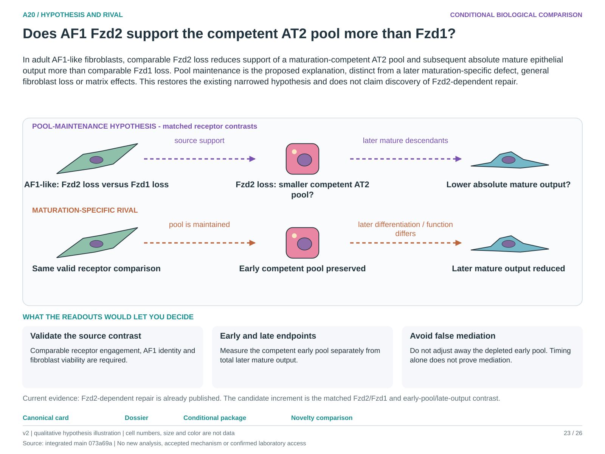

# A20: literature context and hypothesis schematic

Reviewed 3 October 2026. This note connects published findings to the current proposed question. It is a bounded synthesis, not novelty clearance or scientific acceptance.

## Published starting point

Fzd2-dependent mesenchymal identity and repair support are published. They justify a matched receptor comparison instead of a broad new Fzd2-to-repair claim.

| Primary source | Inspected locator and access record |
|---|---|
| [Nabhan 2023](https://pubmed.ncbi.nlm.nih.gov/37321220/) | Compartment-specific Fzd results; Figs. 3–4 for A19. [Access / prior review](../../docs/research_dossiers/NOVELTY_SPECIFICITY_APPLICATION_2026-10-03.md) |
| [Zhou 2025](https://link.springer.com/article/10.1186/s12964-025-02501-8) | Figs. 5–7 and Discussion. [Access / prior review](../../docs/research_dossiers/NOVELTY_SPECIFICITY_APPLICATION_2026-10-03.md) |

Sources above reuse the named review unless the update ledger explicitly records a fresh inspection. Published-source evidence and reanalysis of the same material are not independent replication.

## Repository observation

The owner-requested narrowing specifies the Fzd2-versus-Fzd1 contrast in an AF1-like context, absolute mature epithelial output and a pool-maintenance mechanism. Existing RNA results do not establish receptor dependence or identify a mediator. The narrowed hypothesis takes precedence over the first dossier's inverted mechanism.

Exact current result locators:

- [RQ_Specified/A20_fibroblast_fzd_context/README.md](README.md)
- [RQ_Specified/A20_fibroblast_fzd_context/RESULTS.md](RESULTS.md)
- [RQ_Specified/A20_fibroblast_fzd_context/NARROWED_HYPOTHESIS.md](NARROWED_HYPOTHESIS.md)
- [docs/research_dossiers/followup_2026-10-03/NOVELTY.md](../../docs/research_dossiers/followup_2026-10-03/NOVELTY.md)
- [docs/research_dossiers/followup_2026-10-03/OUTCOMES.md](../../docs/research_dossiers/followup_2026-10-03/OUTCOMES.md)

## What this question could add

Separate early competent AT2 pool maintenance from later mature output under matched AF1 Fzd2/Fzd1 contrasts. The comparison can distinguish support of the starting pool from a later defect without assuming a mediator.

## Current hypothesis and rival

In adult AF1-like fibroblasts, comparable Fzd2 loss reduces support of a maturation-competent AT2 pool and subsequent absolute mature epithelial output more than comparable Fzd1 loss. Pool maintenance is the proposed explanation, distinct from a later maturation-specific defect, general fibroblast loss or matrix effects. This restores the existing narrowed hypothesis and does not claim discovery of Fzd2-dependent repair.

**Strongest rival:** A maturation-specific support defect occurs despite a preserved early pool; fibroblast depletion or matrix changes alter support; perturbation validity differs between receptors.

## What the comparison would teach

A smaller early competent pool followed by reduced mature output is compatible with pool maintenance. Preserved early pool with reduced later output favors maturation-specific support. Unequal receptor engagement or fibroblast survival makes the receptor comparison ambiguous. Do not adjust away the post-treatment pool deficit or call timing alone mediation.

## Hypothesis schematic

[Editable hypothesis schematic](schematics/hypothesis_v2.svg). Original explanatory artwork. Dashed arrows denote the labelled proposal or rival; shapes, colours and cell counts are qualitative, not observations. The three readout cards explain which uncertainty a measurement could resolve. Missing features/endpoints remain marked.

A0–A23 artwork is preserved from the checked v2 atlas at source revision `073a69a758f25f988ecc18402477efa268c00927`. Its full hypothesis was compared with the current dossier. Later literature and scope context are supplied by this note.

## Next literature check

Planned query (not reported as newly executed): `AF1 Fzd2 Fzd1 matched receptor competent AT2 pool mature output`. Expand to synonyms, nearest source references/citations and conflicting results using the [literature workflow](../../docs/LITERATURE_WORKFLOW.md). Recheck the exact population, comparison, timing, unit and endpoint before making a stronger contribution claim.

**Current unresolved specification:** There is no qualified matched functional Fzd1/Fzd2 comparison establishing receptor-selective support of an early AT2 pool and its later mature descendants.

**Interpretation limit:** Receptor or support-ligand RNA rank is not functional dependence. Dividing by post-treatment survivors or adjusting for the early pool does not by itself identify a maturation mechanism.

[Current dossier](../../docs/research_dossiers/A20.md) · [All-question context index](../../docs/research_dossiers/literature_context_2026-10-03/README.md)
