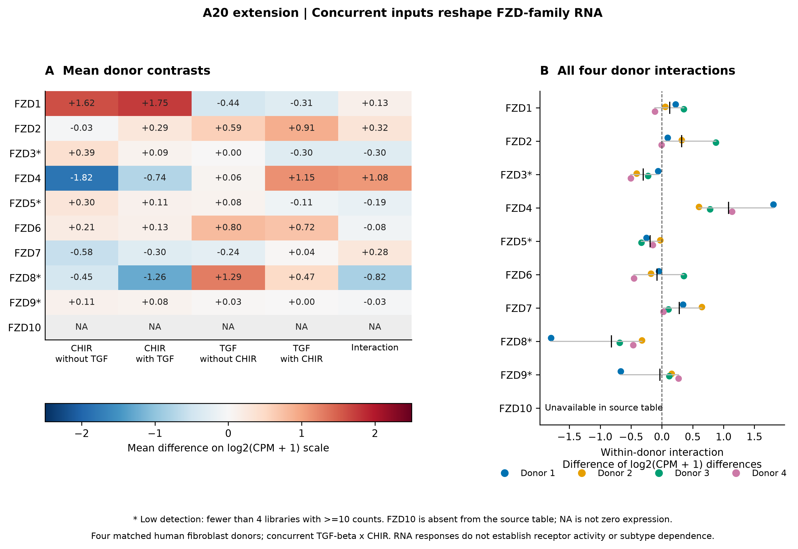
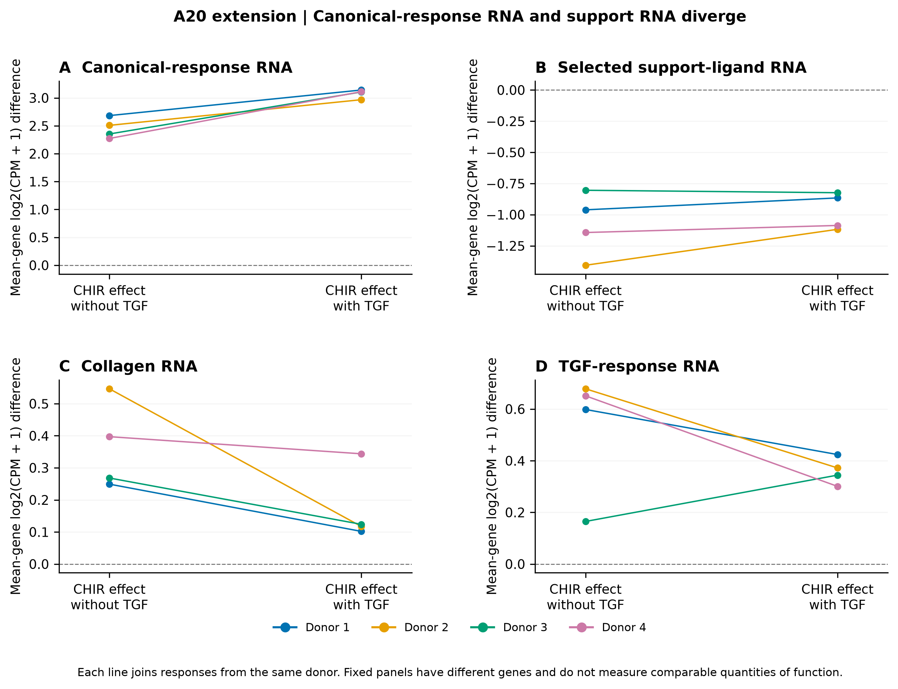
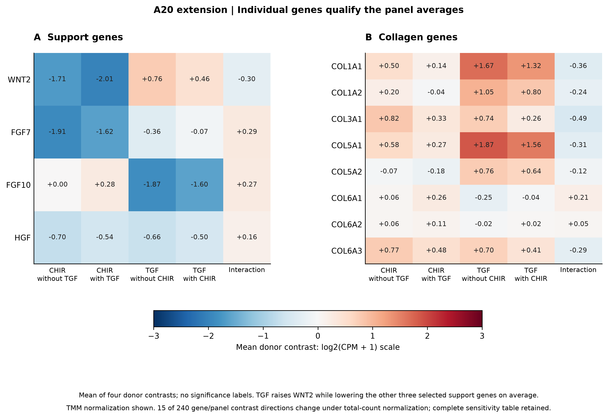

# A20 extension figures

Four matched human fibroblast donors, four conditions per donor. Each donor is
the biological unit. Figures show exploratory RNA differences, not receptor
engagement, secretion, mature epithelial output or population uncertainty.
[Results](RESULTS.md) · [Methods](METHODS.md) ·
[Export hashes](reports/figure_manifest.json).

## Figure 1. FZD family response depends on concurrent inputs

[PDF](figures/A20_EXT_F1_fzd_family.pdf) ·
[SVG](figures/A20_EXT_F1_fzd_family.svg).

Gene-wise within-donor effects use TMM-normalized log2(CPM+1). All four donor
values and their mean are shown. Low-detection FZD3/5/8/9 remain flagged;
FZD10 is unavailable, not zero. A positive interaction can reflect a less
negative response: CHIR lowers FZD4 RNA in both contexts. These expression
comparisons do not rank receptor function.

## Figure 2. Canonical-response and support-ligand RNA diverge

[PDF](figures/A20_EXT_F2_input_context.pdf) ·
[SVG](figures/A20_EXT_F2_input_context.svg).

Lines connect each donor's CHIR effect without and with concurrent TGF.
Canonical-response RNA increases while the selected support-ligand panel
decreases in every donor in both contexts. Collagen-panel RNA increases,
with a smaller mean response under TGF. The line slope is the direct
interaction, not a comparison of separate significance labels.
Panels contain different genes and do not measure comparable amounts of
biological function. No prior fibroblast state was experimentally identified.

## Supplementary figure 1. Individual genes qualify panel averages

[PDF](figures/A20_EXT_S1_gene_responses.pdf) ·
[SVG](figures/A20_EXT_S1_gene_responses.svg).

Individual ligand and collagen responses prevent interpreting an average
as a uniform program. For example, TGF alone increases WNT2 but decreases
FGF7/FGF10/HGF on average. No inference about deposited matrix, secreted
protein or mature epithelial function follows from these RNA differences.

All figures were exported as 300-dpi PNG plus vector PDF/SVG, and PDF
renders were checked for legibility and clipping. Source data, fixed panels,
donor contrasts and normalization sensitivity are deposited in tables.
