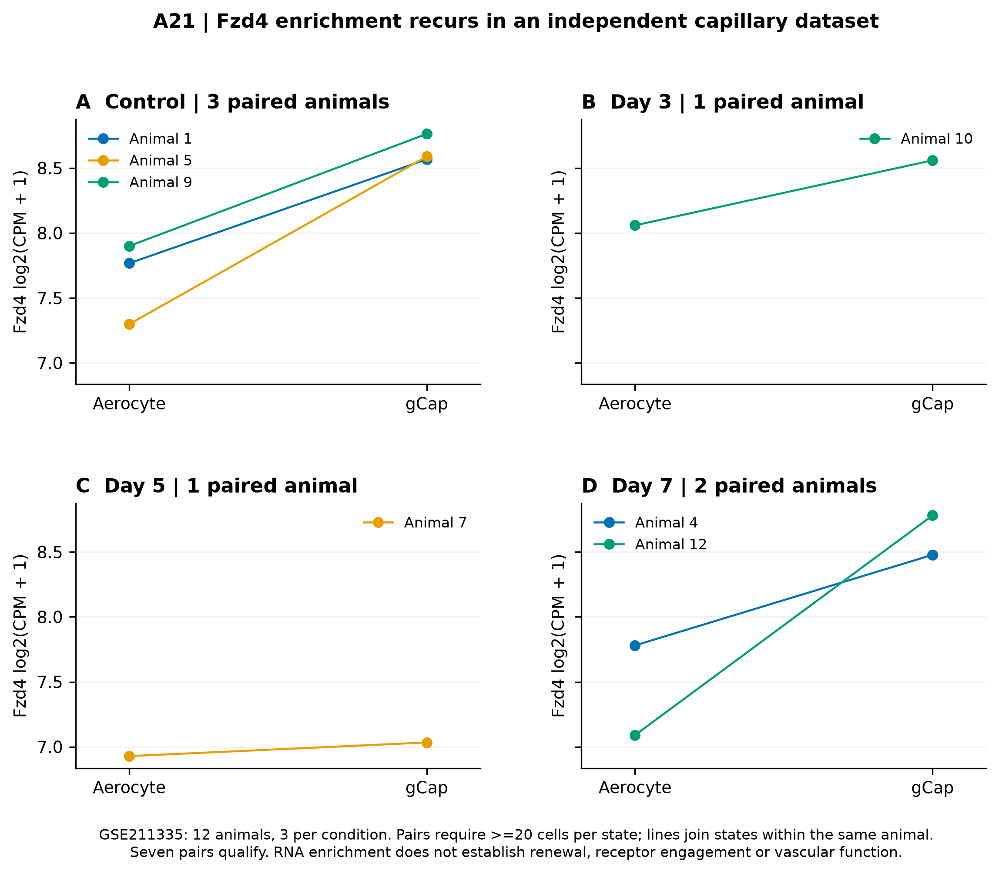
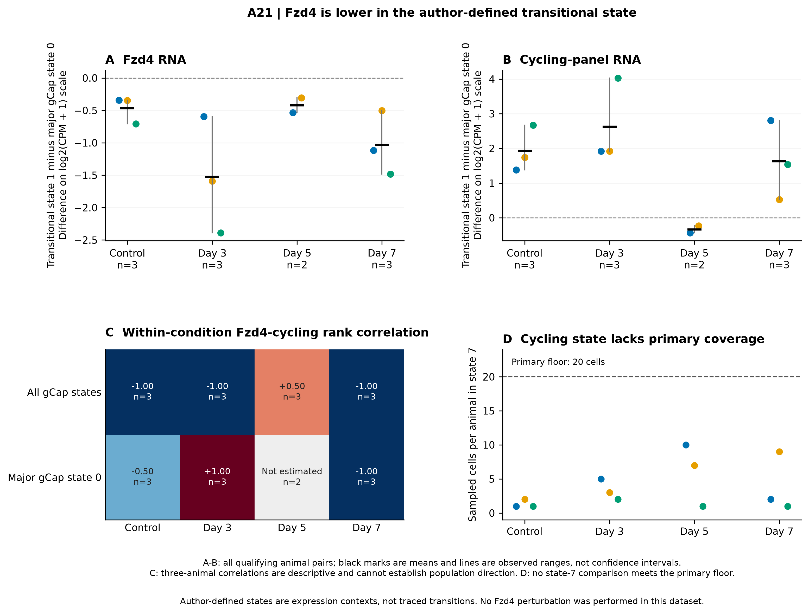
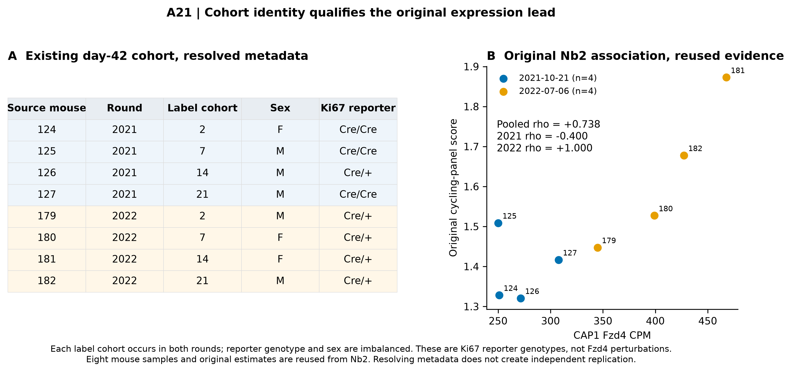

# A21 scientific figures

[Results](RESULTS.md) · [Methods](METHODS.md) · [Source audit](SOURCES.md).
Three figures, each as PNG, PDF and SVG. No population confidence intervals,
significance symbols or inferred receptor-dependent lineage effects are plotted.

## Figure 1. Independent capillary expression context

[PDF](figures/A21_F1_capillary_context.pdf) · [SVG](figures/A21_F1_capillary_context.svg).

Lines join aerocyte and aggregate gCap expression within the same animal.
Conditions contain distinct animals, not a longitudinally sampled cohort.
Seven of 12 possible pairs meet the fixed 20-cell floor: three control,
one day-3, one day-5 and two day-7 pairs. All seven differences are positive.
The 10-cell sensitivity includes a negative day-5 pair. Sparse injury coverage
limits generalization. RNA enrichment does not demonstrate receptor engagement,
renewal or vascular function.

## Figure 2. Substate expression and cycling are distinct

[PDF](figures/A21_F2_substate_and_cycling.pdf) · [SVG](figures/A21_F2_substate_and_cycling.svg).

A-B show transitional state 1 minus major gCap state 0 within each qualifying
animal; dots are animal values, black marks are means and grey lines are observed
ranges. Fzd4 is lower in all 11 pairs, whereas the cycling-panel direction differs
at day 5. States are author expression annotations, not traced transitions.
C shows within-condition rank correlations, with n printed in every cell.
Three-animal coefficients cannot establish population direction. D shows sampled
state-7 coverage for every animal; none reaches the primary 20-cell floor.
A plotted zero means no metadata-assigned state-7 cell in that sampled animal,
not biological absence of the population.

## Supplementary figure 1. Previously unresolved cohort metadata

[PDF](figures/A21_S1_prior_cohort.pdf) · [SVG](figures/A21_S1_prior_cohort.svg).

Eight original Nb2 day-42 CAP1 samples are joined to recorded round, label-cohort,
sex and reporter genotype. Label cohorts occur in both rounds; genotype and sex
are imbalanced. The right panel redraws the existing values and their recorded
coefficients. This is reused evidence, not a new replication. The reporter
genotypes do not perturb Fzd4, and no adjusted causal estimate is implied.

Figures were exported as 300-dpi PNG and vector PDF/SVG, and the exported PDFs
were rendered for visual review. [Hashes](reports/figure_manifest.json).

## Extension figures

The [extension gallery](extensions/extension_v1/FIGURES.md) adds three figures:
published vascular source outcomes, the complete Fzd-family state comparison,
and receptor/cofactor context. Each has PNG/PDF/SVG exports. The original three
figures above remain byte-identical.
