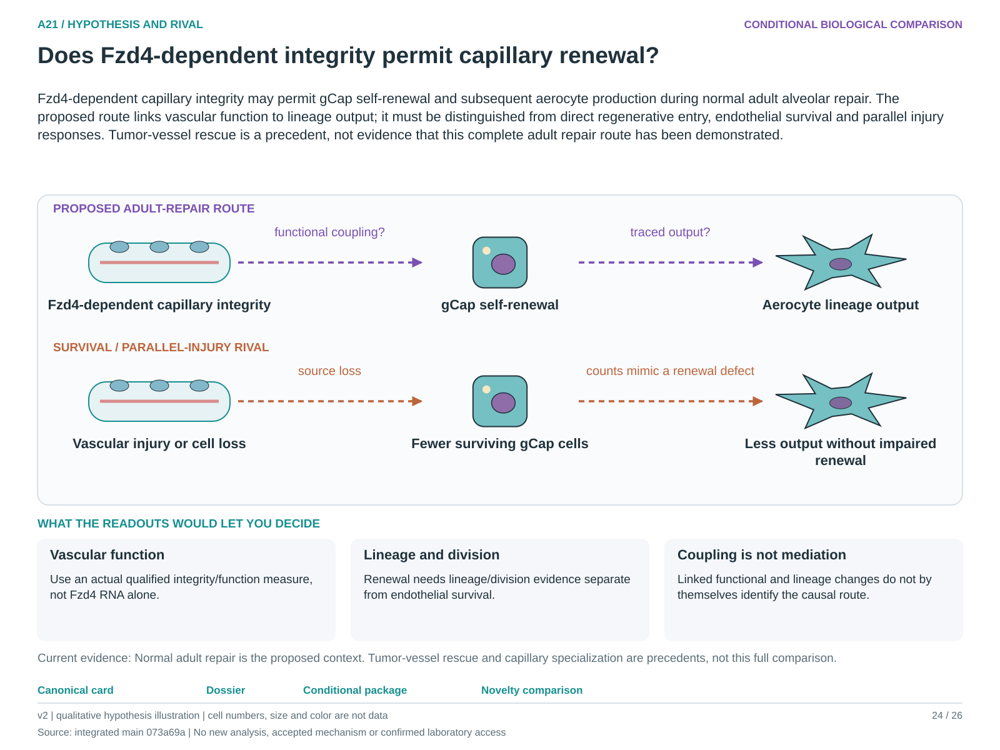

# A21: literature context and hypothesis schematic

Reviewed 3 October 2026. This note connects published findings to the current proposed question. It is a bounded synthesis, not novelty clearance or scientific acceptance.

## Published starting point

Compartment-specific Fzd biology supplies the vascular premise. Published vascular context does not automatically answer the complete normal adult repair comparison.

| Primary source | Inspected locator and access record |
|---|---|
| [Nabhan 2023](https://pubmed.ncbi.nlm.nih.gov/37321220/) | Compartment-specific Fzd results; Figs. 3–4 for A19. [Access / prior review](../../docs/research_dossiers/NOVELTY_SPECIFICITY_APPLICATION_2026-10-03.md) |
| [Gillich 2020](https://www.nature.com/articles/s41586-020-2822-7) | Capillary subtype/renewal findings; indexed primary abstract. [Access / prior review](../../docs/research_dossiers/review_2026-10-03/SOURCES.md#s17) |

Sources above reuse the named review unless the update ledger explicitly records a fresh inspection. Published-source evidence and reanalysis of the same material are not independent replication.

## Repository observation

Fzd4 RNA is lower in the transitional state in the current analysis. The workspace and extension do not provide direct lineage or functional vascular evidence for the proposed coupling.

Exact current result locators:

- [RQ_Specified/A21_fzd4_capillary_function/README.md](README.md)
- [RQ_Specified/A21_fzd4_capillary_function/RESULTS.md](RESULTS.md)
- [docs/research_dossiers/followup_2026-10-03/NOVELTY.md](../../docs/research_dossiers/followup_2026-10-03/NOVELTY.md)
- [docs/research_dossiers/followup_2026-10-03/OUTCOMES.md](../../docs/research_dossiers/followup_2026-10-03/OUTCOMES.md)

## What this question could add

Link actual capillary integrity, gCap renewal and aerocyte lineage output while accounting for survival. Coupled changes would motivate a route but still leave mediation to be established separately.

## Current hypothesis and rival

Fzd4-dependent capillary integrity may permit gCap self-renewal and subsequent aerocyte production during normal adult alveolar repair. The proposed route links vascular function to lineage output; it must be distinguished from direct regenerative entry, endothelial survival and parallel injury responses. Tumor-vessel rescue is a precedent, not evidence that this complete adult repair route has been demonstrated.

**Strongest rival:** Fzd4 marks a stable endothelial state; barrier change and lineage output are parallel consequences of injury or altered composition.

## What the comparison would teach

A Fzd4-dependent output difference with independently measured vascular function, division, lineage and survival supports functional coupling. An output difference explained by cell loss favors maintenance. Even matched function and lineage changes do not identify mediation without a further discriminating comparison.

## Hypothesis schematic

[Editable hypothesis schematic](schematics/hypothesis_v2.svg). Original explanatory artwork. Dashed arrows denote the labelled proposal or rival; shapes, colours and cell counts are qualitative, not observations. The three readout cards explain which uncertainty a measurement could resolve. Missing features/endpoints remain marked.

A0–A23 artwork is preserved from the checked v2 atlas at source revision `073a69a758f25f988ecc18402477efa268c00927`. Its full hypothesis was compared with the current dossier. Later literature and scope context are supplied by this note.

## Next literature check

Planned query (not reported as newly executed): `adult lung Fzd4 capillary integrity gCap renewal aerocyte lineage repair 2025 2026`. Expand to synonyms, nearest source references/citations and conflicting results using the [literature workflow](../../docs/LITERATURE_WORKFLOW.md). Recheck the exact population, comparison, timing, unit and endpoint before making a stronger contribution claim.

**Current unresolved specification:** A relationship between receptor-dependent integrity and alveolar endothelial renewal has not been distinguished from state composition or endothelial loss.

**Interpretation limit:** Lower transitional Fzd4 RNA does not establish reduced signaling, lineage restriction or a vascular repair mechanism.

[Current dossier](../../docs/research_dossiers/A21.md) · [All-question context index](../../docs/research_dossiers/literature_context_2026-10-03/README.md)
