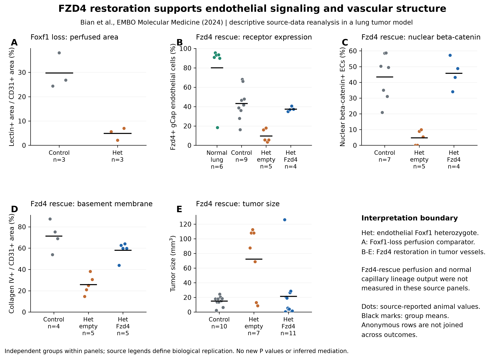
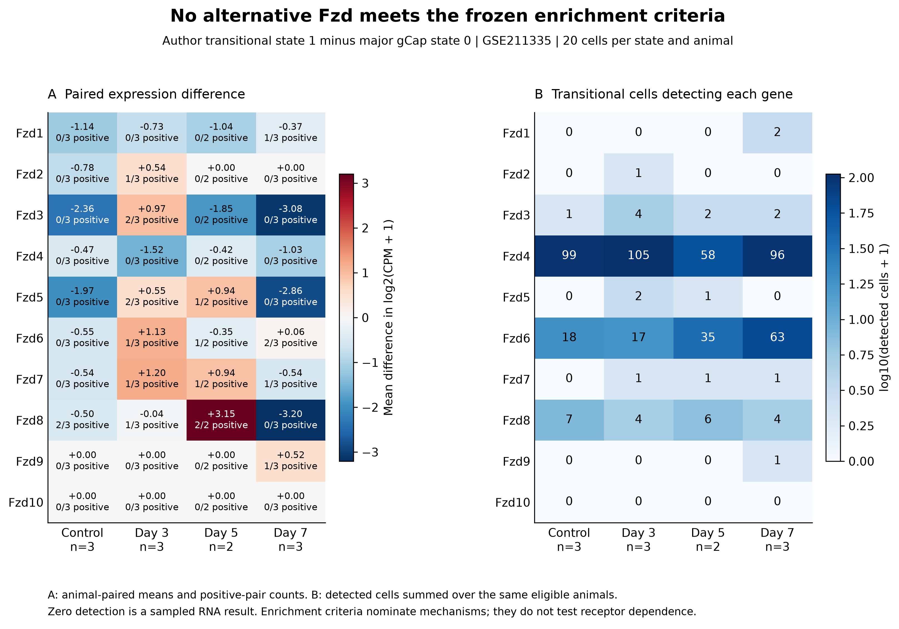
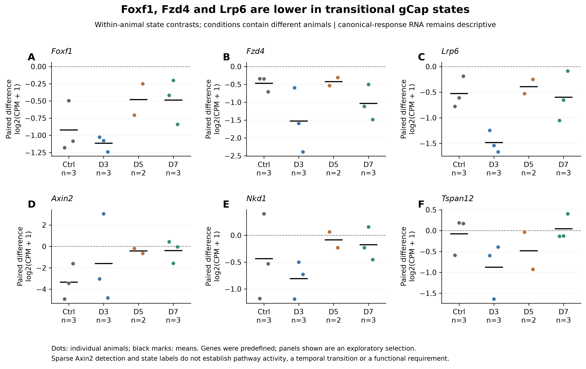

# A21 extension scientific figures

[Results](RESULTS.md) · [Methods](METHODS.md) · [Source eligibility](SOURCES.md).
Three figures, each exported as 300-dpi PNG and vector PDF/SVG. All observations
are real source data; no simulated outcomes, inferred lineage trajectories,
new significance symbols or population confidence intervals are plotted.

## Figure 1. Source reconstruction separates structure from function

[PDF](figures/A21E_F1_vascular_source_evidence.pdf) ·
[SVG](figures/A21E_F1_vascular_source_evidence.svg).

Panels A-E replot Bian Figures 3F, 7E, 7F, 7G and 7D respectively. Points are
source-reported biological replicate values; black marks are group means.
Het denotes endothelial Foxf1 heterozygous loss. Panel A measures lectin-positive
area relative to CD31-positive area after Foxf1 loss. B-E compare Fzd4 restoration
with empty vector in a tumor context, with their source control groups retained.
Group n is shown separately for each outcome. Anonymous source rows are not
joined across panels, and nested image fields are not counted as extra animals.
The source data support canonical engagement and structural restoration; no
Fzd4-rescue perfusion or normal gCap-lineage outcome is present. Figure 7E's
statistical-method discrepancy is not imported into a new significance test.

## Figure 2. Complete Fzd-family state comparison

[PDF](figures/A21E_F2_fzd_family_states.pdf) ·
[SVG](figures/A21E_F2_fzd_family_states.svg).

A shows mean within-animal differences in log2(CPM+1), transitional cluster 1
minus major gCap cluster 0, at the fixed 20-cell floor. Each tile also gives the
number of positive pairs; conditions contain 3, 3, 2 and 3 different animals.
B shows the number of transitional cells detecting the gene across those same
eligible animals; color is log10(count+1), with actual counts printed. These
cell counts qualify detection, not biological replication. All ten receptors
are shown, including mapped Fzd10 with zero observed counts. None of the nine
alternative receptors meets the full frozen nomination rule across injury
conditions at both 20- and 10-cell floors. This is not a test of receptor absence
or functional compensation. Full sensitivity results are tabulated.

## Figure 3. Receptor and canonical-response context

[PDF](figures/A21E_F3_receptor_context.pdf) ·
[SVG](figures/A21E_F3_receptor_context.svg).

Individual animal state differences and means are shown for six predefined genes,
selected for presentation after analysis. Foxf1 is newly extracted; Fzd4, Lrp6,
Axin2, Nkd1 and Tspan12 reproduce parent targets. All 11 primary pairs have lower
Foxf1, Fzd4 and Lrp6 in the transitional state. Sparse Axin2 observations and
mixed response-gene directions prevent an inference of canonical activity.
Conditions are cross-sectional, and author states are not lineage assignments.
No temporal regulation or causal Foxf1-Fzd4 relationship is inferred here.
