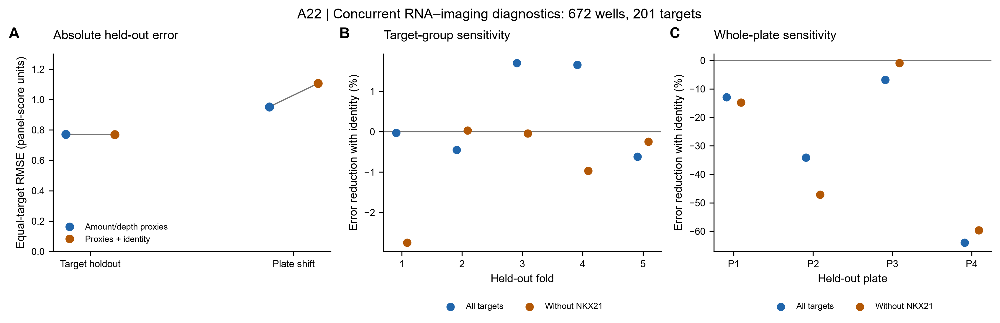

# A22 figure gallery

**1 October 2026.** One current question-specific figure from the P2 extension.
[Results](reports/identity_amount_v2/RESULTS.md) | [Analysis receipt](metadata/identity_amount_v2/run_record.json) | [Current rendering receipt](metadata/identity_amount_v2/figure_record_v2.json).

## Figure 1. Identity adds little transferable information beyond amount-related proxies

[PDF](figures/identity_amount_v2_layout_v2/F1_identity_amount.pdf) | [SVG](figures/identity_amount_v2_layout_v2/F1_identity_amount.svg)

A, equal-target root mean squared error for baseline and baseline plus identity.
Units are the inherited mean-log2(TMM CPM + 0.5) chemokine-panel score.
B, five target-group folds with assignments fixed across exclusion variants.
C, four whole-plate holdouts, also purging test targets from training. Positive
error reduction favors adding identity. Plates carry different target mixes;
this is a joint plate/target-distribution diagnostic. All values describe
concurrent RNA–imaging associations in 672 technical wells and 201 targets,
not independent biological replication, prospective prediction or a causal
identity effect. Baseline measures are proxies rather than viable cell counts.
Upstream whole-screen normalization is inherited. No inferential error bars
are shown. [Source metrics](tables/identity_amount_v2/metrics.tsv).

The [initial rendering receipt](metadata/identity_amount_v2/figure_record.json)
preserves an earlier layout whose legends crowded observations; layout v2
moves those legends. Numerical results are unchanged. Earlier Nb3 data figures
remain in the [paper gallery](../../Research%20Article/gate2_N2_nabhan_2026/FIGURES.md).
