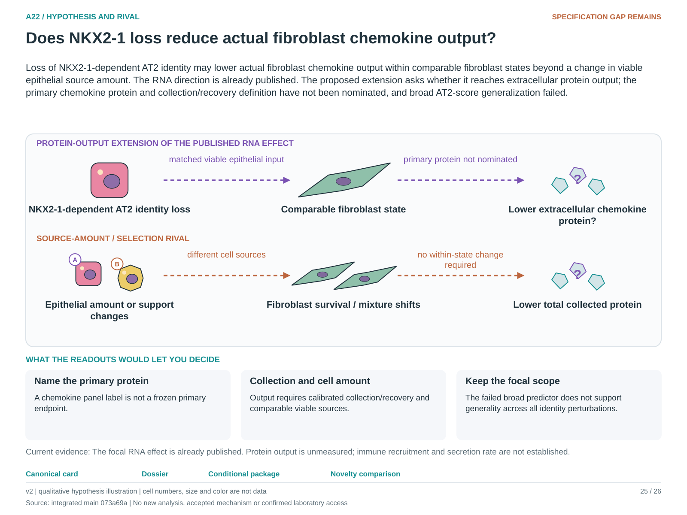

# A22: literature context and hypothesis schematic

Reviewed 3 October 2026. This note connects published findings to the current proposed question. It is a bounded synthesis, not novelty clearance or scientific acceptance.

## Published starting point

NKX2-1-dependent epithelial identity and a fibroblast chemokine RNA effect are source findings. A22 starts from that specific result rather than claiming a new niche programme.

| Primary source | Inspected locator and access record |
|---|---|
| [Nabhan 2026](https://doi.org/10.1073/pnas.2606113123) | Fig. 4/S7F and niche context; local primary PDF audit. [Access / prior review](../../docs/research_dossiers/NOVELTY_SPECIFICITY_APPLICATION_2026-10-03.md) |

Sources above reuse the named review unless the update ledger explicitly records a fresh inspection. Published-source evidence and reanalysis of the same material are not independent replication.

## Repository observation

The 672-well, 201-target analysis showed a 0.64% error improvement that became -0.97% without NKX21 and -35% on whole-plate holdout. This weakens a general predictor. Nb4 shows opposing C3/chemokine behavior across cohorts, so C3 is not a stable proxy.

Exact current result locators:

- [RQ_Specified/A22_epithelial_identity_niche_response/README.md](README.md)
- [RQ_Specified/A22_epithelial_identity_niche_response/reports/identity_amount_v2/RESULTS.md](reports/identity_amount_v2/RESULTS.md)
- [docs/research_dossiers/qualification_2026-10-03/RESULTS.md](../../docs/research_dossiers/qualification_2026-10-03/RESULTS.md)
- [docs/research_dossiers/followup_2026-10-03/NOVELTY.md](../../docs/research_dossiers/followup_2026-10-03/NOVELTY.md)
- [docs/research_dossiers/followup_2026-10-03/METADATA.md](../../docs/research_dossiers/followup_2026-10-03/METADATA.md)

## What this question could add

A named extracellular protein endpoint at comparable viable source amount could determine whether the RNA effect reaches measured output. It would not by itself measure secretion rate or immune recruitment.

## Current hypothesis and rival

Loss of NKX2-1-dependent AT2 identity may lower actual fibroblast chemokine output within comparable fibroblast states beyond a change in viable epithelial source amount. The RNA direction is already published. The proposed extension asks whether it reaches extracellular protein output; the primary chemokine protein and collection/recovery definition have not been nominated, and broad AT2-score generalization failed.

**Strongest rival:** Fibroblast selection, survival, epithelial amount or a target-specific effect unrelated to the proposed alveolar-identity route explains the output. The focal NKX2-1 contrast does not establish generality across epithelial perturbations.

## What the comparison would teach

Lower measured protein output within comparable recipient states at comparable viable epithelial input would support the extension. An amount/selection-only effect or unchanged protein weakens it. Calibrated collection/recovery is needed for secretion-rate language; the failed broad predictor cannot support all epithelial identity perturbations.

## Hypothesis schematic

[Editable hypothesis schematic](schematics/hypothesis_v2.svg). Original explanatory artwork. Dashed arrows denote the labelled proposal or rival; shapes, colours and cell counts are qualitative, not observations. The three readout cards explain which uncertainty a measurement could resolve. Missing features/endpoints remain marked.

A0–A23 artwork is preserved from the checked v2 atlas at source revision `073a69a758f25f988ecc18402477efa268c00927`. Its full hypothesis was compared with the current dossier. Later literature and scope context are supplied by this note.

## Next literature check

Planned query (not reported as newly executed): `NKX2-1 alveolar fibroblast chemokine extracellular protein output viable source`. Expand to synonyms, nearest source references/citations and conflicting results using the [literature workflow](../../docs/LITERATURE_WORKFLOW.md). Recheck the exact population, comparison, timing, unit and endpoint before making a stronger contribution claim.

**Current unresolved specification:** Within-state chemokine induction has not been separated from fibroblast abundance/selection, epithelial amount and a dominant perturbation-specific effect.

**Interpretation limit:** A score or C3 proxy does not establish secretion, recruitment or generalized epithelial identity control.

[Current dossier](../../docs/research_dossiers/A22.md) · [All-question context index](../../docs/research_dossiers/literature_context_2026-10-03/README.md)
