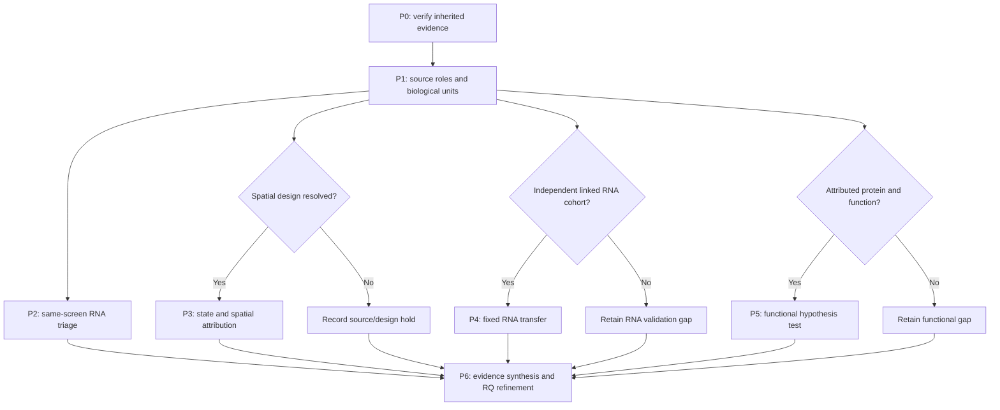

# A22 analysis pipeline: epithelial identity and fibroblast chemokine response

**1 October 2026.** Structured after inspection of Nb3; the numerical follow-up
and functional tests below are drafts. P0 is an executable evidence-intake audit,
not a new biological fit. [Current status](reports/intake_v1/INTAKE.md) |
[Draft stage specification](config/pipeline_draft.json) |
[Source eligibility](SOURCES.md) | [Biological plan](PLAN.md).

## Biological question and separate predictions

Does NKX2-1-dependent epithelial identity contribute to fibroblast chemokine
competence beyond epithelial amount alone? The screen motivates this question;
it does not identify the signal or demonstrate immune recruitment.

| Prediction | What would discriminate it | What the current screen supplies |
|---|---|---|
| H1: epithelial identity perturbation changes recipient chemokine output | Valid epithelial perturbation with separately attributed fibroblast secreted output in independent units | Lower human chemokine RNA after NKX21 perturbation; source-level protein loss is reported, while target RNA increases |
| H2: identity contributes beyond an amount-only explanation | Identity and viable amounts measured independently; a design that separates their contributions, with restoration or a distinct identity perturbation where available | Imaging and RNA proxies, no direct separation of identity, composition and amount |
| H3: altered output changes a defined recipient function | Linked secreted output and prespecified recruitment/migration, with viability and proliferation distinguished | No measured recruitment endpoint |

H1 is a total perturbation-effect question. NKX2-1 can affect processes other
than identity, so even a valid H1 result does not by itself establish H2.
Treat RNA, secreted protein and recipient function as separate outcome layers.
CCL2 is a candidate protein endpoint; the exposed seven-gene RNA panel is not
a validated functional composite. Wound markers are a secondary response,
not the inverse of chemokine competence or proof of fibrosis.

## Sequence and decision gates



The functional source search can proceed alongside RNA work. A favorable P2
result is neither an eligibility criterion nor a prerequisite for testing H1.
A negative RNA association does not automatically reject a protein-level mechanism.

### P0. Preserve the motivating evidence

Run the standard-library intake reader. It verifies hashes, checks the three
reported NKX21 contrasts, the seven individual chemokines, the saved omission
summaries and the paired-depth comparisons. It records source roles without
recomputing scores, differential expression or Hallmark tests.

The source numeric human S5 reproduction failure remains open. Verified
count-derived estimates are kept. Sensitivity ranges are not confidence
intervals; the original technical intervals are not biological uncertainty.
The paper's reported protein loss must not be contradicted using the increased
Nkx2-1 transcript alone.

### P1. Resolve sources before choosing models

Use [the source registry](config/source_registry.json) and
[sample schema](config/sample_manifest_schema.json). Record each accession's
role, prior exposure, reuse and the exact sample-to-unit evidence. Missing
animal, donor or preparation IDs remain unknown. A GEO sample, spatial section,
cell, target or well is not automatically an independent biological replicate.

The currently inspected deposits support inherited evidence and limited RNA
context. None is admitted to independent A22 RNA validation or to a functional
fit. That is a bounded eligibility finding, not a claim that suitable public
data do not exist. Seek paired epithelial/fibroblast measurements after a
verified epithelial perturbation; then examine protein/function availability.

### P2. Same-screen identity versus amount triage

**Purpose:** determine whether epithelial identity adds descriptive information
about fibroblast chemokine RNA beyond the recorded amount-related proxies.
This changes A10's outcome from organoid growth to recipient RNA; it must reuse
A10's design audit rather than repeat its growth-model question.

1. Audit one-to-one well/library/imaging joins, RNA/imaging timing, missingness,
   control membership and plate/target coverage. Use the common eligible paired
   population; compare models on identical observations. Imaging segmentation
   statistics and RNA species fractions are not direct viable-cell counts.
2. Keep the inherited mouse AT2 and human chemokine panels fixed. Audit overlap
   with perturbed genes and report a fixed exclusion sensitivity where needed;
   do not select markers or targets using the response. Preserve all eligible
   targets and an omit-NKX21 analysis, so the focal target cannot carry the
   general association alone.
3. Specify a baseline from recorded imaging and RNA-depth proxies and compare
   it with baseline plus the identity score. Report unadjusted and conditional
   descriptions together. Define one primary RNA response; wound-marker and
   individual-chemokine results are separately labeled secondary analyses.
4. Use target-group holdouts and a separate whole-plate-shift diagnostic,
   keeping a target's repeated wells together. Shared controls/reference
   construction and outcome centring must be audited for leakage. Learn all
   transformations and tuning within training folds. Four plates with different
   target mixes do not establish transfer across biological preparations.
5. Report absolute held-out error, the change relative to the same baseline,
   every plate's result and target influence. A gain over a weak baseline can
   still give poor prediction. Do not attach biological p-values or confidence
   intervals by resampling technical wells or treating targets as independent
   preparations. Training failures and low coverage remain visible.

Before fitting, deposit a new versioned exploratory contract for population,
scales, coverage, model family, fold/control treatment and evaluation rules.
These details are intentionally unset in the draft. Any numerical utility
margin must be justified for that descriptive task and cannot become a
biological effect margin. Avoid a high-dimensional mediator search here.

**Interpretation:** incremental RNA prediction supports further investigation;
a precise lack of incremental information under an adequate design narrows
this operational predictor. Neither result identifies an identity-specific
causal effect. Amount/state/RNA depth may be consequences of treatment; their
regression adjustment can block or distort causal pathways.

### P3. Within-state response versus composition and spatial context

GSE307128 remains conditional on animal/section nesting, perturbation/treatment
and timing reconciliation, physical bin/region mapping and fibroblast
attribution. Resolve those facts before downloading the large spatial bundle.
Four libraries and many bins cannot supply an invented biological sample size.

If admitted, define fibroblast states and regions independently of the tested
chemokines. Audit outcome-gene overlap in references/classifiers, mixed bins,
ambient signal, coverage and annotation uncertainty. Report composition and
within-state RNA contrasts separately, aggregated to actual animals with
section/bin nesting preserved. Use anatomical sampling and independently
measured density where available; captured cell fractions are compositional.
Show all animal-level observations and the limits of a small design.

State-standardized summaries are descriptive decompositions, not direct causal
effects. A within-state difference can still reflect unresolved substate
mixtures. Spatial association alone cannot distinguish induction of a state
from selective survival/expansion; E7 needs temporal or lineage evidence.

### P4. Independent RNA transfer

Admit a cohort only after verifying independence from the discovery screen and
its reference datasets, valid epithelial perturbation, matched controls,
recipient attribution and linked biological units. A healthy/fibrotic atlas
without the perturbation is context, not validation of NKX2-1 direction.

Freeze gene/ortholog mapping, assay compatibility, score/coverage rules,
biological-unit aggregation and uncertainty before scoring new outcomes.
Do not optimize the discovery signature in the transfer cohort or count a
shared annotation reference as replication. Predefine which prediction can be
tested if only part of the seven-gene human panel is compatible.

### P5. Secreted output and recipient function

The [existing biological plan](PLAN.md) governs this stage. It requires
independent epithelial and fibroblast preparation/donor identities, matched
controls, independently verified identity change, viable amounts, source
attribution of secreted output and a separately defined recipient endpoint.
Protein measured in a mixed system needs source attribution; it cannot simply
be called fibroblast-derived. No eligible deposited functional source has yet
been identified in this bounded inventory.

Estimate the total assigned-perturbation effect before any post-treatment
normalization. Report total output and viable amount separately; a ratio per
surviving fibroblast estimates a different quantity. H2 needs a design that
separates identity from amount/state and other NKX2-1 actions. Freeze the
endpoint, useful-effect margin, independent replication/power basis, model,
exclusions and multiplicity once the actual assay/source is selected. Do not
borrow a biological variance estimate from split technical wells.

A sufficiently precise absence despite a valid perturbation weakens the
corresponding prediction. Invalid exposure, missing attribution or broad
uncertainty is inconclusive. Altered RNA with no protein/function change may
weaken the proposed functional connection without erasing the RNA observation.

### P6. Synthesis and conditional branches

For each completed arm, record the prediction, source, unit, observation,
uncertainty, rival explanation and resulting decision. Keep `supported within
scope`, `weakened`, `inconclusive` and `not tested` separate. No automated rule
promotes a CLAIMS grade or changes the owner's retain/reject decision.

E7 state induction/selection stays distinct from A13's fibroblast-to-epithelium
prediction. E8 lung specificity requires multi-tissue evidence; PLIN2 alone
cannot establish it. Tumour immune recruitment and immunotherapy response
require separate cohort/endpoints. Pathway enrichment or ligand RNA can
nominate a mediator only after a separately justified analysis, not prove one.

## Outputs and figure plan

Follow the neighboring RQ hierarchy: `config/`, `metadata/<run>/`,
`tables/<run>/`, `reports/<run>/`, `scripts/` and, after eligible analyses,
`figures/<run>/`. Keep large inputs in ignored raw storage. Every run records
its contract, script/input hashes, eligible and excluded units and output hashes.
Use a new directory for each version; preserve old outputs and corrections.
The intake records exact bytes of its four JSON inputs and reader. Preserve
those versions; later source/design amendments use new named versions and a
new receipt. Recording draft bytes does not make the draft a confirmatory
contract.

| Future figure | Suitable display | Gate and caption requirement |
|---|---|---|
| F01: identity and recipient RNA | Per-target scatter plus per-plate held-out error comparisons | P2 only; distinguish target contrasts from biological replicates and technical uncertainty |
| F02: state and spatial attribution | Per-animal paired/dot displays, state proportions and representative annotated spatial panels | P3 only; show every animal, mixed-bin uncertainty and physical scale; no bin-level biological significance |
| F03: functional contrast | Independent-unit effect estimates and uncertainty, with separate amount, secreted output and recipient panels | P5 only; valid source attribution, endpoint and uncertainty rules |

Existing Nb3 figures remain in the paper gallery; do not relabel them as new
A22 validation. No new scientific data figure is generated by this scaffold.

## Run the intake

```bash
python RQ_Specified/A22_epithelial_identity_niche_response/scripts/00_intake.py
python RQ_Specified/A22_epithelial_identity_niche_response/scripts/00_intake.py --check
```

The first command refuses an existing output directory. The second verifies
the archived intake without rewriting it. It needs only tracked files and
Python's standard library; no raw-data download or scientific dependency stack.
The next numerical step is the P2 join/design audit and a frozen exploratory
contract. P3-P5 keep their own source gates and can proceed independently when
eligible evidence arrives.
