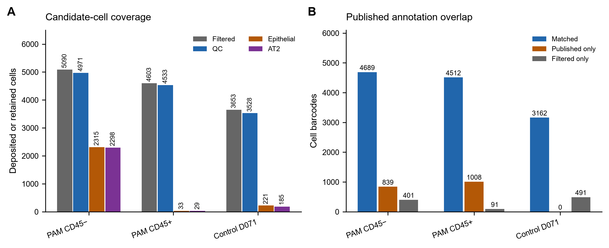
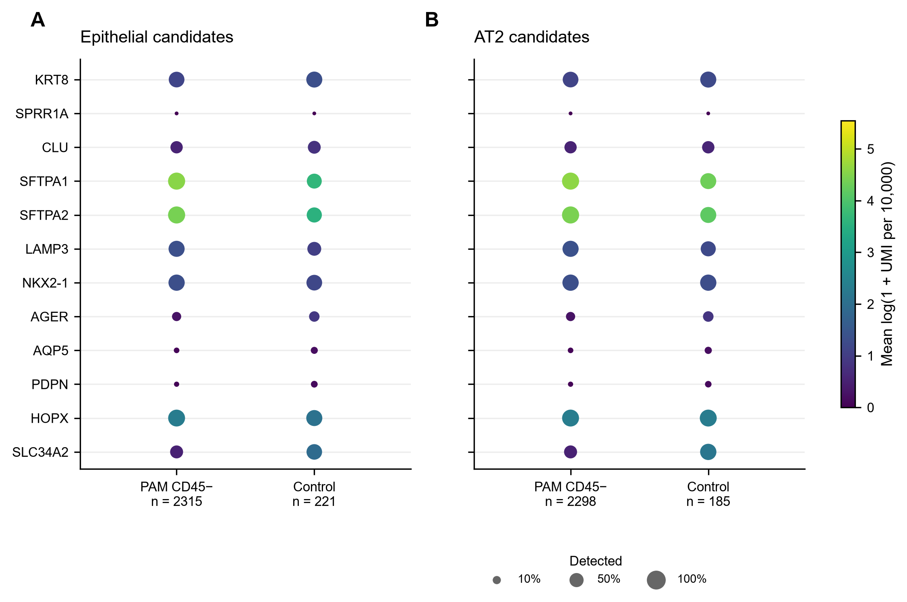
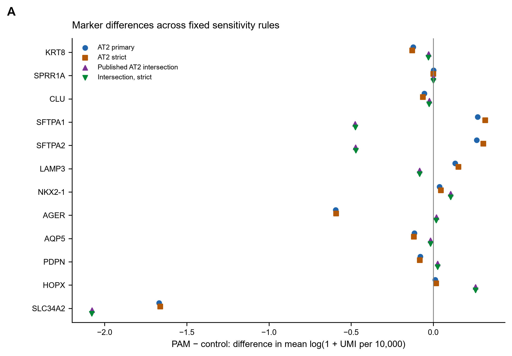
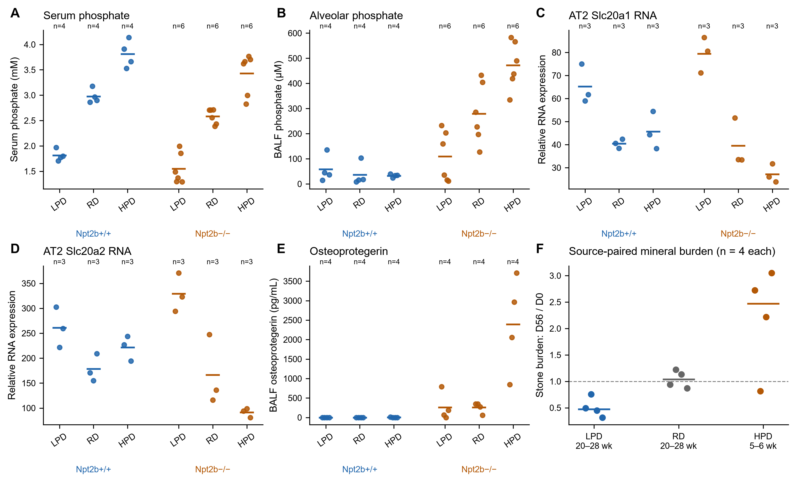
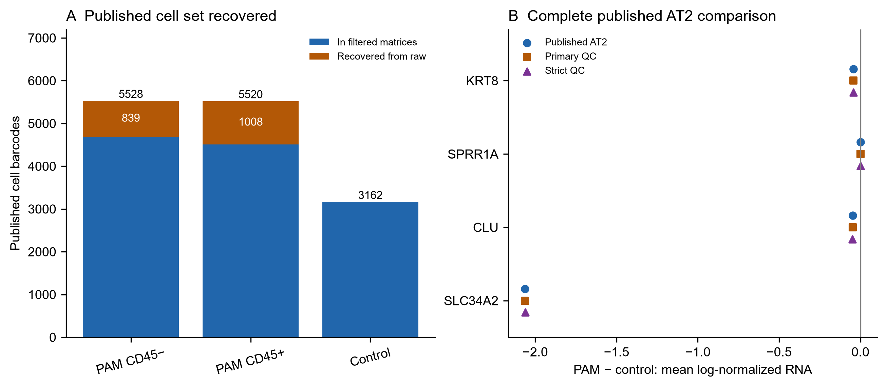
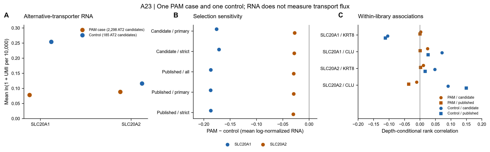

# A23 figure gallery

**1 October 2026.** Six current figures (five main and one supplementary) from the descriptive P2 pilot and P3
source-assay audit. [Results](reports/external_pilot_v2/RESULTS.md) |
[Analysis receipt](metadata/external_pilot_v2/run_record.json) |
[Rendering receipt](metadata/external_pilot_v2/figure_record.json) |
[F3 correction](metadata/external_pilot_v2/figure_correction_v2.json).

## Figure 1. Coverage and annotation overlap

[PDF](figures/external_pilot_v2/F1_coverage.pdf) | [SVG](figures/external_pilot_v2/F1_coverage.svg)

A, counts in the deposited filtered matrices, after primary QC, and in marker-
defined epithelial and AT2 candidates. Categories overlap and are not additive.
B, exact barcode overlap with published Fig 2a cell annotations. PAM fractions
are from one reported case; the control is one donor. These are sampling/coverage
counts, not whole-lung composition estimates or biological replicates. QC includes
a documented conservative amendment because PECAM1 is absent. Source:
[coverage](tables/external_pilot_v2/coverage.tsv),
[annotation coverage](tables/external_pilot_v2/annotation_coverage.tsv).

## Figure 2. Individual marker profiles

[PDF](figures/external_pilot_v2/F2_marker_profiles.pdf) | [SVG](figures/external_pilot_v2/F2_marker_profiles.svg)

A, epithelial candidates; B, AT2 candidates under primary QC. Color is the mean
natural-log(1 + UMI per 10,000) per cell; dot area follows detection fraction with
a small visible floor at zero. Labels show cells, not donors. The comparison has
one PAM subject and one control. Readouts are separate from selection features.
No composite transition score, population significance, transport activity or
lineage fate is inferred. NCBI supports the selected human-marker mapping; this
is not a full transferred Nb3 panel. Source:
[marker summaries](tables/external_pilot_v2/marker_summaries.tsv).

## Figure 3. Sensitivity to QC and published annotation

[PDF](figures/external_pilot_v2/F3_sensitivity_v2.pdf) | [SVG](figures/external_pilot_v2/F3_sensitivity_v2.svg)

PAM minus control differences in mean log-normalized expression across primary
QC, stricter QC and their intersections with published AT2 labels. Symbols show
alternative cell definitions, not confidence intervals or independent experiments.
KRT8/CLU remain lower, whereas several identity-marker signs depend on cell
selection. No precise null or preserved-identity conclusion is supported. Source:
[marker differences](tables/external_pilot_v2/marker_differences.tsv).
The original F3 rendering is retained as `F3_sensitivity.*`; its legend overlapped
SLC34A2 points. Version 2 changes only legend placement and is the current display.

## Figure 4. Distinct biochemical and mineral endpoints

[PDF](figures/external_pilot_v2/F4_biochemical_context.pdf) | [SVG](figures/external_pilot_v2/F4_biochemical_context.svg)

A–E, individual plotted values and arithmetic means from Uehara 2023 source sheets
6m, 6q, 6s, 6t and 7f; n follows source mouse groups. LPD/RD/HPD denote low,
regular and high phosphate diet. A–E are one-week endpoints; these are separate
assays without explicit cross-assay subject IDs. BALF phosphate is lavage-fluid
concentration, not intracellular phosphate. Relative transporter RNA is not flux.
F, source-paired D56/D0 stone-burden ratios from sheets 6d–f, with median bars;
dashed line marks no change. The HPD mineral cohort is younger, and mineral
series differ from biochemical series in age, duration and LPD formulation.
Do not pool them into one dose-response or epithelial recovery test. Pairing uses
the published design and row positions; subject IDs remain unknown. Sources:
[assay values](tables/external_pilot_v2/biochemical_values.tsv),
[stone pairs](tables/external_pilot_v2/stone_pairs.tsv),
[endpoint linkage](tables/external_pilot_v2/endpoint_linkage.tsv).

## Supplementary figure 1. Complete published cell set

[PDF](figures/published_cell_audit_v1/S1_published_cells.pdf) | [SVG](figures/published_cell_audit_v1/S1_published_cells.svg)

A, all published barcodes recovered from raw matrices, with the portion absent
from filtered matrices distinguished. These are coverage counts, not tissue
proportions. B, individual-marker differences in the complete published AT2 set,
with fixed technical-QC sensitivities. All-label n is 2,742 PAM CD45− and 211
control; primary-QC n is 2,740/211; strict-QC n is 2,721/211. One case and one
control underlie every symbol. This post-pilot completeness check retains the
lack of a coordinated transition-marker increase, but does not independently
validate the author annotations or establish absence of a biological effect.
[Differences](tables/published_cell_audit_v1/marker_differences.tsv) |
[Receipt](metadata/published_cell_audit_v1/run_record.json).

## Figure 5. Alternative-transporter context

[PDF](figures/transporter_context_v1_layout_v2/F5_transporter_context.pdf) | [SVG](figures/transporter_context_v1_layout_v2/F5_transporter_context.svg)

A, mean log-normalized transporter RNA in primary AT2 candidates from one PAM
case and one control. Counts in the legend are cells, not biological replicates.
B, PAM minus control differences under five overlapping selection rules.
C, within-library rank associations after conditioning both variables on total
UMI and detected-gene count; candidate means primary QC, published means the
complete published AT2 annotation. SPRR1A fails the detection gate and is not
plotted as zero. No p-values or biological confidence intervals are shown.
RNA abundance and conditional associations do not measure compensatory flux.

[Results](reports/transporter_context_v1/RESULTS.md) |
[Summaries](tables/transporter_context_v1/summaries.tsv) |
[Associations](tables/transporter_context_v1/associations.tsv) |
[Current rendering receipt](metadata/transporter_context_v1/figure_record_v2.json).
The [initial rendering receipt](metadata/transporter_context_v1/figure_record.json)
preserves a layout whose panel-B legend crowded observations. The current
layout moves it without changing numerical results.
