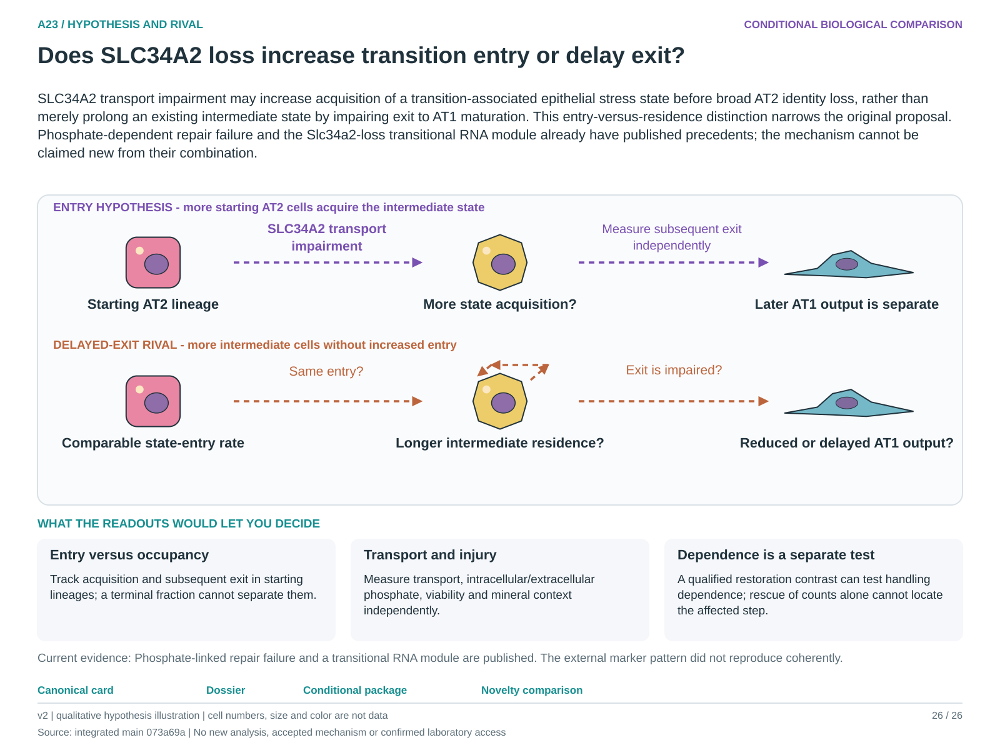

# A23: literature context and hypothesis schematic

Reviewed 3 October 2026. This note connects published findings to the current proposed question. It is a bounded synthesis, not novelty clearance or scientific acceptance.

## Published starting point

A transitional RNA module after identity perturbation and phosphate-linked alveolar regeneration failure are published. A generic transporter-to-repair claim is therefore too broad.

| Primary source | Inspected locator and access record |
|---|---|
| [Nabhan 2026](https://doi.org/10.1073/pnas.2606113123) | Fig. 4/S7F and niche context; local primary PDF audit. [Access / prior review](../../docs/research_dossiers/NOVELTY_SPECIFICITY_APPLICATION_2026-10-03.md) |
| [Lv 2023](https://pubmed.ncbi.nlm.nih.gov/37139431/) | Full-text XML Results 3.2 and Fig. 3–4 captions; pixels not inspected. [Access / prior review](../../docs/research_dossiers/NOVELTY_SPECIFICITY_APPLICATION_2026-10-03.md) |

Sources above reuse the named review unless the update ledger explicitly records a fresh inspection. Published-source evidence and reanalysis of the same material are not independent replication.

## Repository observation

The screen showed a +0.524 transition-marker contrast with three concordant markers. The external PAM case did not show coordinated marker increase; SLC20A1/2 RNA was lower, providing no transcriptional compensation evidence.

Exact current result locators:

- [RQ_Specified/A23_slc34a2_transition_homeostasis/README.md](README.md)
- [RQ_Specified/A23_slc34a2_transition_homeostasis/reports/external_pilot_v2/RESULTS.md](reports/external_pilot_v2/RESULTS.md)
- [RQ_Specified/A23_slc34a2_transition_homeostasis/reports/transporter_context_v1/RESULTS.md](reports/transporter_context_v1/RESULTS.md)
- [docs/research_dossiers/followup_2026-10-03/NOVELTY.md](../../docs/research_dossiers/followup_2026-10-03/NOVELTY.md)

## What this question could add

Distinguish increased acquisition of the transition-associated state from prolonged residence or failed exit in starting lineages. Keep independent transport/injury evidence and the adverse external marker result; endpoint occupancy cannot decide entry versus exit.

## Current hypothesis and rival

SLC34A2 transport impairment may increase acquisition of a transition-associated epithelial stress state before broad AT2 identity loss, rather than merely prolong an existing intermediate state by impairing exit to AT1 maturation. This entry-versus-residence distinction narrows the original proposal. Phosphate-dependent repair failure and the Slc34a2-loss transitional RNA module already have published precedents; the mechanism cannot be claimed new from their combination.

**Strongest rival:** An existing intermediate state persists because exit/maturation is impaired; generalized injury, extracellular mineral context, survival, division or starting-state composition changes endpoint abundance without increased state entry.

## What the comparison would teach

Lineage-linked acquisition and subsequent exit measured separately can distinguish increased entry from prolonged residence; endpoint state abundance cannot. Measure transport function, compartment-specific phosphate, injury and viability independently. A qualified restoration contrast can test transport dependence, but rescue of counts alone cannot identify the affected transition step. Preserve the external negative marker result.

## Hypothesis schematic

[Editable hypothesis schematic](schematics/hypothesis_v2.svg). Original explanatory artwork. Dashed arrows denote the labelled proposal or rival; shapes, colours and cell counts are qualitative, not observations. The three readout cards explain which uncertainty a measurement could resolve. Missing features/endpoints remain marked.

A0–A23 artwork is preserved from the checked v2 atlas at source revision `073a69a758f25f988ecc18402477efa268c00927`. Its full hypothesis was compared with the current dossier. Later literature and scope context are supplied by this note.

## Next literature check

Planned query (not reported as newly executed): `SLC34A2 phosphate alveolar transition entry residence exit lineage 2025 2026`. Expand to synonyms, nearest source references/citations and conflicting results using the [literature workflow](../../docs/LITERATURE_WORKFLOW.md). Recheck the exact population, comparison, timing, unit and endpoint before making a stronger contribution claim.

**Current unresolved specification:** The repository lacks linked state acquisition and exit observations with direct transport and compartment-specific phosphate measurements. Phosphate-linked repair failure is published; whether the proposed transition-step comparison adds a worthwhile contribution remains provisional. The external negative result constrains transfer.

**Interpretation limit:** Three markers are not a fate transition, RNA is not phosphate flux, and absence of a marker pattern is not absence of every identity change.

[Current dossier](../../docs/research_dossiers/A23.md) · [All-question context index](../../docs/research_dossiers/literature_context_2026-10-03/README.md)
