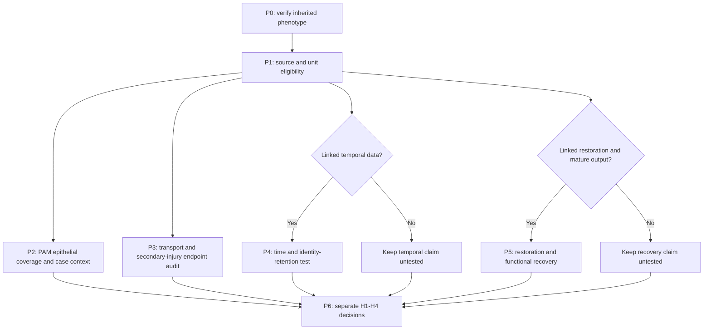

# A23 analysis pipeline: phosphate homeostasis and epithelial state

## Current extension structure and execution

1. **Freeze the candidate:** new readouts SLC20A1/SLC20A2, inherited
   SLC34A2/KRT8/SPRR1A/CLU context, and five unchanged archived AT2 selections.
2. **Recover and describe:** read raw-matrix counts for exact selected barcodes,
   check archived QC totals, and retain detection, mean log-normalized RNA and
   aggregate CPM as separate summaries. Keep the two case fractions separate.
3. **Depth sensitivity:** report each transporter–marker rank association within
   each library, with both variables conditioned on depth and detected-gene count.
   Apply the fixed coverage gate; missing associations are never zero.
4. **Strict review:** distinguish transporter RNA from flux, the mouse dietary
   assays from human case observations, and conditional plausibility from mechanism.

These steps are executed under [transporter_context_v1](config/transporter_context_v1.json).
[Results](reports/transporter_context_v1/RESULTS.md) | [Figure 5](FIGURES.md#figure-5-alternative-transporter-context).
The proposed RNA-surrogate explanation is unsupported by this case; functional
compensation itself remains untested. P4 timing and P5 restoration remain gated
by missing linked replicated measurements. No additional within-case fitting
can supply independent units or measured phosphate transport.


**1 October 2026 update.** P0/P1 intake and P2/P3 descriptive analysis are executed.
[External results](reports/external_pilot_v2/RESULTS.md) and [figures](FIGURES.md)
record the current evidence. P4/P5 remain gated. The stage design below preserves
the original prospective requirements; immutable draft configs retain history.
[Draft stage graph](config/pipeline_draft.json) | [Sources](SOURCES.md) |
[Intake results](reports/intake_v1/INTAKE.md) | [Biological test plan](PLAN.md).

## Predictions and the measurements that distinguish them

A23 asks whether SLC34A2-associated homeostasis constrains transition-associated
epithelial stress. It has four separable predictions, not one inference from KRT8.

| Prediction | Required discriminator | Current boundary |
|---|---|---|
| H1: SLC34A2 disruption changes epithelial state | Valid exposure and an independently defined within-state endpoint, with composition measured separately | Nb3 has bulk RNA; target transcript reduction does not measure transport |
| H2: the homeostatic defect contributes to that response | Transport and phosphate measured in the relevant compartment, with secondary mineral/inflammatory injury distinguished | RNA, soluble phosphate and mineral burden are different outcomes |
| H3: state change precedes broad identity loss | Linked sampling times and a separately specified identity-retention endpoint | A smaller simultaneous AT2 contrast than NKX21 does not establish order or preserved identity |
| H4: restoration reverses state and permits recovery | Verified normalization, linked state response and separately measured mature lineage/function | Reversal of a marker or removal of mineral is not mature AT1 recovery |

Intracellular phosphate, alveolar soluble phosphate, extracellular mineral and
systemic phosphate must remain separate variables. The draft does not assume
which compartment or direction mediates the state response. Low target RNA
in damaged cells can also be a consequence of lost AT2 identity.

## Stages and dependencies



P3-P5 do not depend on a favorable P2 result. Neither repeating the same screen
nor pooling unrelated atlases is the default next step.

### P0. Preserve the focal phenotype and its counterexamples

Verify source hashes, the three fixed RNA panels, individual transition markers,
control/gene/well omissions, paired-depth AT2 results and the targeted stable ID.
Keep these distinctions visible:

- Transition +0.524 is based on eight mouse-QC target wells on one plate.
- Paired-depth AT2 -0.219 uses seven target wells in a different eligible subset.
  Compare its paired baseline with the same population before discussing depth.
- One AT1 marker-omission case changes sign. The near-zero AT1 result does not
  demonstrate preserved function, and the smaller AT2 reduction is not absence.
- The existing depth follow-up did not fit the transition panel. Do not claim a
  depth-robust transition effect from the AT2-only sensitivity.
- Slc34a2 is excluded from identity/transition scoring; its RNA decrease is an
  exposure consistency check, not verified protein loss or transport failure.

This audit extracts existing evidence, without new model fitting. Technical
intervals and omission ranges are not independent biological uncertainty.
The source's human S5 issue remains recorded in Nb3; this A23 focal audit uses
mouse count-derived panels and does not claim to repair human source statistics.

### P1. Source roles, units and prior exposure

Use the [source registry](config/source_registry.json),
[sample requirements](config/sample_manifest_schema.json) and
[GSE199329 sample roles](metadata/external_source_v1/SAMPLE_ROLES.md).
Resolve subject/preparation identity, sampling fraction, age, perturbation,
collection time and exact endpoint links. Unknown fields stay unknown.

GSE199329 is a new external disease-context lead. Its three libraries do not
provide three independent patients: the two PAM libraries are CD45 fractions.
A reported PAM child and one adult donor cannot identify a population-level
disease, age or genotype effect. Keep the Uehara article's biochemical assays
and its RNA deposit in one study group when counting independent evidence.
Repair references and the source-reused NKX2-1 cohort remain contextual.

### P2. External PAM epithelial phenotype, conditional on coverage

**Executed:** processed-matrix coverage, marker summaries and published-label
intersection sensitivities are recorded in the external results. A subsequent raw-matrix sensitivity recovers every published barcode
and retains the main marker pattern. The original sequence below remains the design reference. Prefer processed counts and existing annotation
resources; do not rebuild raw sequencing for this first pass.

1. Verify files, stable gene IDs, raw versus filtered matrix semantics, sample
   origins and epithelial yield. Keep the CD45-negative PAM candidate separate
   from the CD45-positive fraction. A low epithelial yield or incompatible
   sampling can close the comparison rather than trigger an outcome-driven QC
   relaxation. Record cell counts as coverage, not biological replication.
2. Specify broad epithelial identity and eligible states with features separate
   from the tested SLC34A2/transition endpoint. Audit overlap, ambiguous states,
   ambient RNA and doublets. Do not select cells because SLC34A2 is low and then
   interpret their target-low phenotype as new evidence.
3. Resolve and freeze the human mapping and coverage of the mouse Krt8/Sprr1a/Clu
   seed and the separate AT2/AT1 features. Report each marker; missing genes are
   not zero and cannot be silently replaced or omitted to improve agreement.
   A partial transferable readout is labeled as such, not the full source panel.
4. Keep composition and within-state expression separate. Report per-library
   descriptive marker distributions and source-unit summaries. CD45 enrichment
   prevents unqualified whole-tissue cell-fraction comparisons without sampling
   weights. Normalization or integration cannot remove disease/donor confounding.
5. If coverage permits, describe whether transition-associated features occur
   with residual alveolar features, preserving mixed/ambiguous cases. This can
   motivate H1; it cannot establish causation, temporal progression, a trajectory,
   or mature function. No biological p-value, population confidence interval or
   differential-abundance significance is licensed by resampling cells.

Freeze sample inclusion, independent annotation features, ortholog map, QC,
coverage, scores, normalization, aggregation and display rules in a new
exploratory contract before scoring outcomes. The source narrative is already
exposed, so this cannot be represented as unseen-data confirmation. A negative
single-case observation would not refute a replicated causal hypothesis.

### P3. Transport-linked response versus secondary injury

Audit advertised source data from the SLC34A2/Npt2b homeostasis literature for
subject IDs, genotype validity, tissue specificity, measurement units and assay
linkage. The [source guide](SOURCES.md) records the 2015 model and the 2023
source-workbook lead. A book of plotted values does not automatically recover
paired animal-level measurements. Audit developmental versus acute exposure
and extra-pulmonary actions rather than assuming adult AT2-specific perturbation.

Map transport/protein, relevant soluble phosphate, extracellular mineral,
inflammatory context and epithelial state as distinct endpoints. Mark each
as observed, absent from the inspected source, or unresolved. Do not join
separate cohorts by genotype or correlate group means as if they were paired
subjects. A systemic phosphate intervention may change several pathways and
is not equivalent to restoring transporter function in an epithelial cell.

If a source lacks epithelial state/time data, biochemical reanalysis can inform
the rival mechanism but cannot establish H2 or the sequence in H3. Prioritize
an assay-linkage audit over another broad pathway enrichment: the Nb3 Hallmark
results are already assumption-sensitive and select no mediator.

### P4. Temporal ordering before broad identity loss

Only an eligible source with verified exposure/homeostasis, known time and
sampling relationships, state plus independent identity measures, and resolved
biological replication can test this arm. Define baseline, early and later
windows from the source design before inspecting outcomes; specify transport,
state and broad identity-loss endpoints separately.

Estimate unit-level condition-by-time contrasts with the actual sampling
structure. Destructive cross-sectional samples are not the same cells followed
through time; repeated subjects require their dependence to be modeled. Temporal
order cannot be inferred from the first significant p-value or from pseudotime.

The statement 'before broad identity loss' requires a justified identity-
retention/equivalence margin and sufficiently informative uncertainty at the
relevant earlier time, not an AT2 confidence interval crossing zero. Clinical
or biological margins and power are unset until an eligible assay/source exists.
Separate a total perturbation effect from analyses conditioning on treatment-
induced viability, state or mineral burden; those adjustments do not identify
mediation. A reference injury time course without SLC34A2 perturbation cannot
substitute for this design.

### P5. Restoration and mature epithelial recovery

Apply the [biological plan](PLAN.md) only after confirming normalization in the
relevant compartment and valid source/unit linkage. Separate transporter
restoration, correction of the phosphate environment and reduction of mineral
injury as distinct interventions or naturally observed contrasts. Verify what
changed rather than treating all of them as the same rescue.

State reversal, viability/proliferation and absolute lineage-linked mature
output remain separate endpoints. Lower KRT8 can reflect cell loss; more cells
or larger organoids need not mean mature AT1 recovery. A confirmed transport
correction with persistent state tests the reversible version, but does not by
itself prove irreversible fate. Restoration in a separate cohort cannot be
joined to a previous RNA time course as if the cells were traced.

Freeze primary contrasts, biological units, useful-effect and uncertainty
rules, covariates, exclusions and multiplicity for the actual design. Neither
technical-well variance nor single-case cell numbers provide a biological power
basis. Distinguish a precise contrary result from a failed exposure or an
uninformative interval.

### P6. Synthesis and refinement

For H1-H4, record source, unit, observation, uncertainty, rival and decision:
`not tested`, `inconclusive`, `supported within scope` or `weakened`. None is an
automatic claim-grade promotion. Keep A1's regulatory distinction and A8's
mature-output question as linked standards, not duplicate new RQs.

The source bulk response, a human disease-case pattern and a biochemical model
can be complementary evidence, but they do not form a measured causal chain
across different individuals, species and assays. Retain cell-mixture, generic
stress, developmental effects, off-target effects and secondary injury rivals.
No therapeutic recommendation or clinical prediction follows from this pipeline.

## Output hierarchy and figure plan

Use `config/`, `metadata/<run>/`, `tables/<run>/`, `reports/<run>/`, `scripts/`
and later `figures/<run>/`, matching other RQ folders. Raw matrices and source
workbooks stay in ignored storage. New results receive input/config/code hashes,
eligibility and exclusions, source units and output hashes. Never overwrite a
saved run. The intake's recorded JSON inputs and reader are archival versions;
later amendments use new filenames and a new receipt. A recorded draft is not
a frozen confirmatory scientific design.

| Future panel | Appropriate plot | Interpretation gate |
|---|---|---|
| P2 case phenotype | Per-library marker dot plots and joint-feature distributions, with annotation/coverage table | Show source fractions and sample counts; no cell-level biological significance; partial mapping explicit |
| P3 homeostasis evidence | Assay/subject linkage map and unit-level contrasts only where raw units are recovered | Separate phosphate compartments, mineral and state; do not draw a causal chain from unpaired assays |
| P4 temporal sequence | Actual unit-level condition/time contrasts with prespecified identity-retention bounds | Real sampling times, valid units and informative intervals; no pseudotime-as-fate |
| P5 restoration/recovery | Separate paired or unit-level panels for normalization, state and mature output | Verified correction, traced/functional outcome and viability distinctions |

The existing Nb3 figures retain their ownership and captions. Five new descriptive scientific figures are now in the [A23 gallery](FIGURES.md).

## Run the evidence intake

```bash
python RQ_Specified/A23_slc34a2_transition_homeostasis/scripts/00_intake.py
python RQ_Specified/A23_slc34a2_transition_homeostasis/scripts/00_intake.py --check
```

Only tracked files and Python's standard library are required. Creation refuses
existing output directories; checking does not rewrite evidence. The external analysis has separate [reproduction instructions](reports/external_pilot_v2/REPRODUCE.md).
