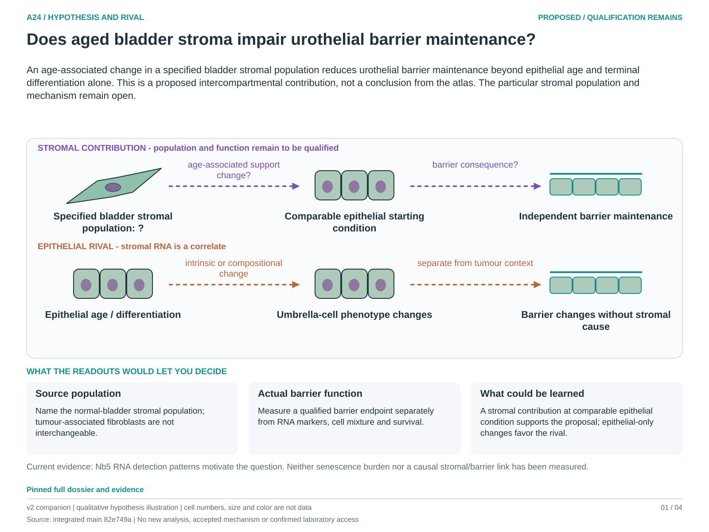

# A24: Bladder stromal ageing and urothelial barrier maintenance

Registered 3 October 2026 as **proposed**, following the owner-authorized
scientific review and instruction to preserve distinct biological focus and
cell/context heterogeneity. Codex supplied the bounded scientific review;
human retain/reject and scientific acceptance remain unrecorded. Registration
is not a claim of novelty, functional validation or permission to execute an
unfinished numerical design.

**Question:** Does the aged bladder stromal compartment contribute to loss of normal urothelial barrier maintenance independently of epithelial-intrinsic ageing and changing epithelial differentiation?

**Hypothesis:** An age-associated change in a specified bladder stromal population reduces urothelial barrier maintenance beyond epithelial age and terminal differentiation alone. This is a proposed intercompartmental contribution, not a conclusion from the atlas. The particular stromal population and mechanism remain open.

**Strongest rival:** Epithelial-intrinsic ageing or altered umbrella-cell differentiation explains the functional change, while stromal RNA and captured proportions merely covary with age. Differential survival, tissue sampling and immune or vascular changes can also explain an apparent stromal association.

**Current evidence:** The exposed Nb5 bladder decomposition has opposing Lmnb1 detection directions in broad urothelial and mesenchymal annotations, while captured-bladder Cdkn2a detection declines. Those RNA summaries do not identify a causal stromal population, absolute abundance, senescence burden or barrier dysfunction. Existing Figures 7 and 8 are contextual evidence only.

**Next decision:** Qualify normal-bladder stromal subpopulations and epithelial identities in source-independent material, then determine whether a valid barrier endpoint and independent animals are available. Keep cancer-selected fibroblasts and constitutive umbrella-cell phenotypes separate. Do not fit a senescence score as a substitute for the missing function.

[Dossier](../../docs/research_dossiers/A24.md) · [Development plan](PLAN.md) · [Canonical card](../../RESEARCH_QUESTIONS.md#a24) · [Review and routing](../../Research%20Article/gate2_N4_nabhan_aging_atlas_2020/rq_review/README.md).

This workspace owns future question-specific planning. Existing figures, tables,
failed runs and amendments remain in the article package. No new analysis has
been executed under this RQ; shared inputs remain shared biological evidence.

<!-- literature-visual-context:start -->
## Literature context and visual hypothesis

[What previous findings contribute, what remains, and what the readouts would decide](LITERATURE_CONTEXT.md).

*Explanatory proposal, not measured results. Read the linked context and caption; arrows do not certify a mechanism or novelty.*
<!-- literature-visual-context:end -->
