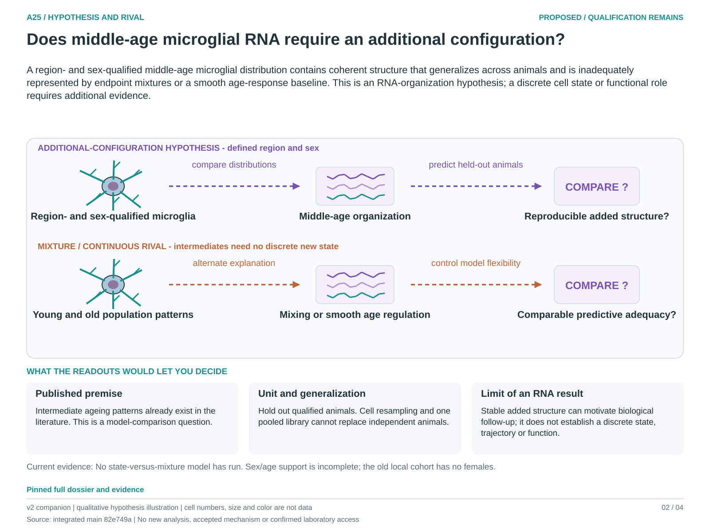

# A25: Regional microglial configuration during middle age

Registered 3 October 2026 as **proposed**, following the owner-authorized
scientific review and instruction to preserve distinct biological focus and
cell/context heterogeneity. Codex supplied the bounded scientific review;
human retain/reject and scientific acceptance remain unrecorded. Registration
is not a claim of novelty, functional validation or permission to execute an
unfinished numerical design.

**Question:** Within a specified brain region and sex, do middle-age microglia exhibit reproducible RNA organization that requires an additional configuration beyond redistribution of young/old populations or a continuous age response?

**Hypothesis:** A region- and sex-qualified middle-age microglial distribution contains coherent structure that generalizes across animals and is inadequately represented by endpoint mixtures or a smooth age-response baseline. This is an RNA-organization hypothesis; a discrete cell state or functional role requires additional evidence.

**Strongest rival:** Changing proportions of existing microglial populations, continuous or nonlinear regulation, regional sampling, processing and sex imbalance explain the apparent intermediate configuration. A mean-profile residual can arise under these alternatives without a new state.

**Current evidence:** Nb5 recovered count-valued official expression, four region labels and exact identities for 13,130 source-labelled microglia. The source has 6/4/4 mice at 3/18/24 months; all 24-month mice are male. No state-versus-mixture model has run. Source clusters and trajectories are outcome-exposed observations, not longitudinal transitions.

**Next decision:** Turn the existing Nb5 microglial design brief into a complete exploratory contract, with population/sex scope, feature set, observation scale, baseline flexibility and animal-level splits fixed before execution. Source availability is resolved; model choices and identifiability are unfinished. Qualify an external study separately.

[Dossier](../../docs/research_dossiers/A25.md) · [Development plan](PLAN.md) · [Canonical card](../../RESEARCH_QUESTIONS.md#a25) · [Review and routing](../../Research%20Article/gate2_N4_nabhan_aging_atlas_2020/rq_review/README.md).

This workspace owns future question-specific planning. Existing figures, tables,
failed runs and amendments remain in the article package. No new analysis has
been executed under this RQ; shared inputs remain shared biological evidence.

<!-- literature-visual-context:start -->
## Literature context and visual hypothesis

[What previous findings contribute, what remains, and what the readouts would decide](LITERATURE_CONTEXT.md).

*Explanatory proposal, not measured results. Read the linked context and caption; arrows do not certify a mechanism or novelty.*
<!-- literature-visual-context:end -->
