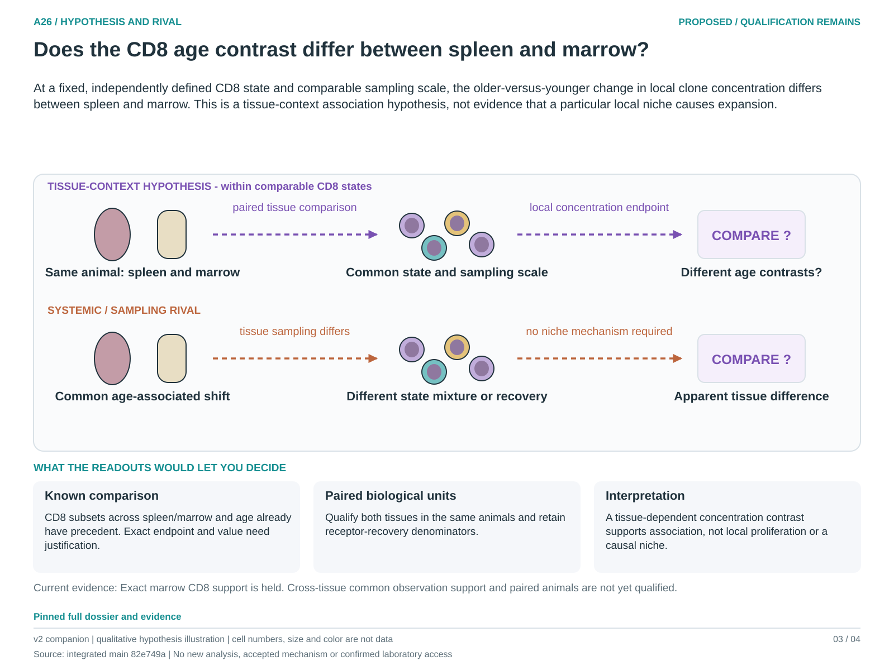

# A26: literature context and hypothesis schematic

Reviewed 3 October 2026. This note connects published findings to the current proposed question. It is a bounded synthesis, not novelty clearance or scientific acceptance.

## Published starting point

Mark already includes CD8 subsets, spleen/marrow and age. Multi-organ clonal CD8 ageing also has precedent; the earlier CD4-only contrast was too weak a novelty boundary.

| Primary source | Inspected locator and access record |
|---|---|
| [Mark 2022](https://doi.org/10.3389/fimmu.2022.939394) | Publisher Results, uninfected age/tissue/subset comparisons. [Access / prior review](../../docs/research_dossiers/literature_context_2026-10-03/SOURCE_UPDATE.md) |
| [Mogilenko 2021](https://pubmed.ncbi.nlm.nih.gov/33271118/) | Clonal GZMK-positive CD8 ageing population. [Access / prior review](../../docs/research_dossiers/literature_context_2026-10-03/SOURCE_UPDATE.md) |

Sources above reuse the named review unless the update ledger explicitly records a fresh inspection. Published-source evidence and reanalysis of the same material are not independent replication.

## Repository observation

Nb5 broad T-cell results differ across spleen, marrow and thymus. Tissue-specific common depths preclude direct ranking. The later exact CD4/CD8 follow-up supports spleen only; absent exact marrow CD8 support remains a hold. This proposed spleen/marrow contrast was chosen after exposure to those results, not preregistered.

Exact current result locators:

- [RQ_Specified/A26_tissue_context_cd8_ageing/README.md](README.md)
- [RQ_Specified/A26_tissue_context_cd8_ageing/PLAN.md](PLAN.md)
- [Research Article/gate2_N4_nabhan_aging_atlas_2020/EXTENSION_COMPLETION.md](../../Research%20Article/gate2_N4_nabhan_aging_atlas_2020/EXTENSION_COMPLETION.md)
- [Research Article/gate2_N4_nabhan_aging_atlas_2020/EXTENSION_RESULTS.md](../../Research%20Article/gate2_N4_nabhan_aging_atlas_2020/EXTENSION_RESULTS.md)
- [Research Article/gate2_N4_nabhan_aging_atlas_2020/rq_review/README.md](../../Research%20Article/gate2_N4_nabhan_aging_atlas_2020/rq_review/README.md)
- [Research Article/gate2_N4_nabhan_aging_atlas_2020/rq_review/OVERLAP_MATRIX.md](../../Research%20Article/gate2_N4_nabhan_aging_atlas_2020/rq_review/OVERLAP_MATRIX.md)
- [Research Article/gate2_N4_nabhan_aging_atlas_2020/rq_review/LITERATURE.md](../../Research%20Article/gate2_N4_nabhan_aging_atlas_2020/rq_review/LITERATURE.md)

## What this question could add

A26 could estimate a paired-organ age difference in clone concentration at a common CD8 state and scale. Its proposed older-age window and estimand differ from the inspected study, but their biological value still needs justification and qualified marrow support.

## Current hypothesis and rival

At a fixed, independently defined CD8 state and comparable sampling scale, the older-versus-younger change in local clone concentration differs between spleen and marrow. This is a tissue-context association hypothesis, not evidence that a particular local niche causes expansion.

**Strongest rival:** Systemic age effects plus differing differentiation states, recirculating populations and receptor recovery explain the apparent organ difference. A few highly sampled clones or animal-selection differences can produce the same pattern.

## What the comparison would teach

The target is an age contrast of within-animal spleen-minus-marrow differences at a common state and observation scale. A reproducible tissue-dependent contrast supports context dependence; compatible contrasts support a shared association only with useful precision. Cross-tissue receptor sharing alone does not prove movement or local proliferation.

## Hypothesis schematic

[Editable hypothesis schematic](schematics/hypothesis_v1.svg). Original explanatory artwork. Dashed arrows denote the labelled proposal or rival; shapes, colours and cell counts are qualitative, not observations. The three readout cards explain which uncertainty a measurement could resolve. Missing features/endpoints remain marked.

New companion to the v2 atlas; source revision `82e749aba099172583447beb26a27365ccf80772`. This figure depicts a proposed question, not a completed analysis.

## Next literature check

Planned query (not reported as newly executed): `CD8 spleen bone marrow paired age clone concentration differentiation state 2025 2026`. Expand to synonyms, nearest source references/citations and conflicting results using the [literature workflow](../../docs/LITERATURE_WORKFLOW.md). Recheck the exact population, comparison, timing, unit and endpoint before making a stronger contribution claim.

**Current unresolved specification:** Paired animals with comparable spleen/marrow CD8 states, receptor ascertainment and common observation support have not been qualified. The local failure of exact subtype support cannot be repaired by treating an absent label as zero or relaxing the historical gate.

**Interpretation limit:** No tissue-local concentration estimate establishes migration direction, growth rate, organ residency or a systemic/local causal mechanism. Missing exact marrow support remains explicit. Shared animals across organs are pairing, not extra biological replication.

[Current dossier](../../docs/research_dossiers/A26.md) · [All-question context index](../../docs/research_dossiers/literature_context_2026-10-03/README.md)
