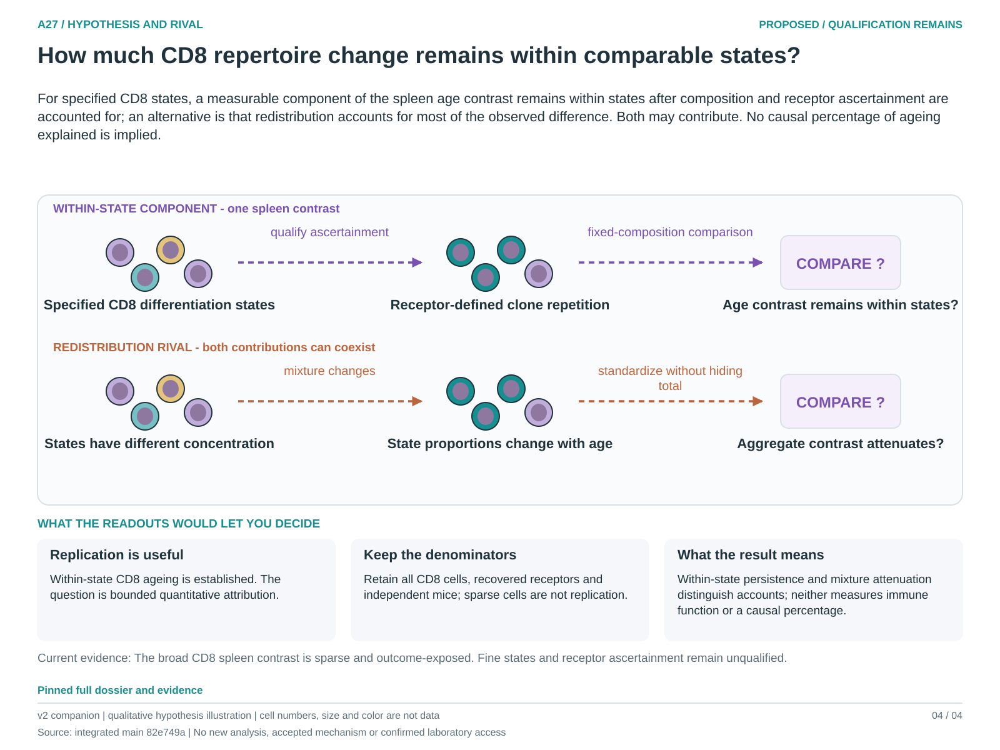

# A27: Within-state and compositional CD8 repertoire ageing

Registered 3 October 2026 as **proposed**, following the owner-authorized
scientific review and instruction to preserve distinct biological focus and
cell/context heterogeneity. Codex supplied the bounded scientific review;
human retain/reject and scientific acceptance remain unrecorded. Registration
is not a claim of novelty, functional validation or permission to execute an
unfinished numerical design.

**Question:** In spleen CD8 cells, does the older repertoire concentration primarily reflect redistribution among differentiation states, or a change in concentration within comparable states under qualified receptor ascertainment?

**Hypothesis:** For specified CD8 states, a measurable component of the spleen age contrast remains within states after composition and receptor ascertainment are accounted for; an alternative is that redistribution accounts for most of the observed difference. Both may contribute. No causal percentage of ageing explained is implied.

**Strongest rival:** Age-dependent abundance of already concentrated states, annotation shifts, differential receptor reconstruction and sparse sampling produce the apparent within-CD8 contrast without a reproducible within-state change.

**Current evidence:** The Nb5 broad CD8 restriction retains a higher older spleen mean at a conditional depth of only five reconstructed cells per mouse, with 4/3/4 mice at 3/18/24 months. CD4 has no 24-versus-3 difference; its 18-month result depends on one mouse. Neither outcome resolves finer states or receptor recovery.

**Next decision:** Qualify finer labels without using clone size or age-selected genes, retain all CD8 and receptor-recovered denominators, and identify independent animals in an external source. Fix clone definition, state set, standardization and sampling support in a new contract; do not relax failed strata after seeing effects.

[Dossier](../../docs/research_dossiers/A27.md) · [Development plan](PLAN.md) · [Canonical card](../../RESEARCH_QUESTIONS.md#a27) · [Review and routing](../../Research%20Article/gate2_N4_nabhan_aging_atlas_2020/rq_review/README.md).

This workspace owns future question-specific planning. Existing figures, tables,
failed runs and amendments remain in the article package. No new analysis has
been executed under this RQ; shared inputs remain shared biological evidence.

<!-- literature-visual-context:start -->
## Literature context and visual hypothesis

[What previous findings contribute, what remains, and what the readouts would decide](LITERATURE_CONTEXT.md).

*Explanatory proposal, not measured results. Read the linked context and caption; arrows do not certify a mechanism or novelty.*
<!-- literature-visual-context:end -->
