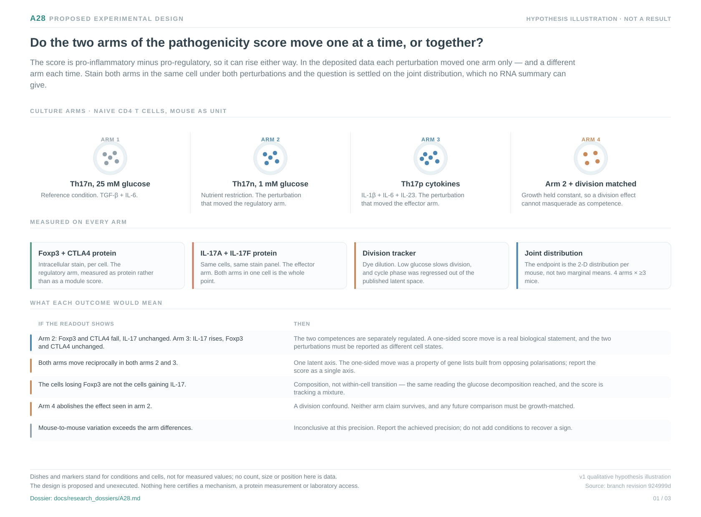

# A28: literature context and hypothesis schematic

Reviewed 5 October 2026. This note connects published findings to the current
proposed question. It is a bounded synthesis, not novelty clearance and not
scientific acceptance. The searches actually executed, their hit counts and
their coverage limits are recorded in the
[package literature update](../../Research%20Article/gate2_W2_wagner_Th17_PGAM/rq_derivation/LITERATURE_UPDATE.md).

## Published starting point

Th17-lineage plasticity in both directions is established, and the two gene modules this question concerns are published. Both are premises here, not findings.

| Primary source | Inspected locator and access record |
|---|---|
| [Gaublomme et al. 2015, *Cell* 163:1400](https://doi.org/10.1016/j.cell.2015.11.009) (PMID 26607794) | Abstract inspected 5 October 2026; the source of the pro-inflammatory and pro-regulatory modules scored throughout the Wp package. Module membership and `is_HVG` flags were recovered from the source's Table S1. |
| [Front Immunol 2026, 1767639](https://doi.org/10.3389/fimmu.2026.1767639) (PMID 42131332) | Abstract inspected 5 October 2026; helminth exposure shifts IL-17-fate-reporter cells toward Tr1/Treg-like rather than Th1-like function. |
| [Immunity 2025](https://doi.org/10.1016/j.immuni.2025.09.007) (PMID 41043415) | Abstract inspected 5 October 2026; Notch3-DLL1 subverts Treg cells into Th17 cells in MS and EAE. |

Abstract-level inspection is not a figure and methods audit. Published-source evidence and reanalysis of the same material are not independent replication.

## Repository observation

At 1 mM versus 25 mM glucose the score rises in 4/4 animal-paired comparisons through the pro-regulatory arm falling, with the pro-inflammatory arm flat; the two arms are anti-correlated across 15,830 cells at Spearman −0.389 to −0.503. In ten paired human donors the CSF-minus-blood contrast moves the opposite arm (pro-inflammatory +0.061, 10/10 donors, empirical p 0.003) while the pro-regulatory arm does not move (p 0.394 and 0.931). The mouse evidence rests on two animals.

Exact current result locators:

- [A28 workspace](README.md) and [development plan](PLAN.md)
- [Derivation card](../../Research%20Article/gate2_W2_wagner_Th17_PGAM/rq_derivation/Q1_arm_asymmetry.md)
- [Overlap screen against A0 to A27](../../Research%20Article/gate2_W2_wagner_Th17_PGAM/rq_derivation/OVERLAP_MATRIX.md)
- [Grounding and exposure record](../../Research%20Article/gate2_W2_wagner_Th17_PGAM/rq_derivation/SOURCES_AND_GROUNDING.md)
- [Reproduction scope and claim-by-claim outcome](../../Research%20Article/gate2_W2_wagner_Th17_PGAM/REPRODUCTION_SCOPE.md)

## What this question could add

Establish whether the two arms of a widely used pathogenicity score move independently under different perturbation classes. If they do, perturbations producing identical score changes produce functionally different cells, and the score must be reported arm-wise. A reproducible answer is useful either way and claims no new mechanism.

## Current hypothesis and rival

Regulatory and effector competence are separately regulated within the same Th17 cell rather than two ends of one axis, so a perturbation can remove one without adding the other. Nutrient restriction is predicted to lower per-cell Foxp3 and CTLA4 protein with IL-17 unchanged, and a pathogenic cytokine condition to raise IL-17 with Foxp3 and CTLA4 unchanged. A single latent axis predicts that both perturbations move both proteins reciprocally. No causal claim about which competence is upstream is implied.

**Strongest rival:** One latent axis: the two modules are anti-correlated by construction, so a one-sided move may be a property of the gene lists rather than of the cells. Composition rather than within-cell state, proliferation differences, and (in the human leg) local activation are the further rivals.

## What the comparison would teach

A per-cell joint protein readout — Foxp3, CTLA4, IL-17A, IL-17F with a division tracker, mouse as unit — separates the hypotheses on the joint distribution rather than two marginal means. Falling Foxp3 with flat IL-17 under glucose restriction, and the converse under pathogenic cytokines, supports separate regulation; reciprocal movement under both supports one latent axis; disjoint cell populations indicate composition; loss of effects under matched division indicates the proliferation confound.

## Hypothesis schematic

[Editable hypothesis schematic](schematics/hypothesis_v1.svg). Original
explanatory artwork. Dashed arrows denote the labelled proposal or rival;
shapes, colours and any counts are qualitative, not observations. The readout
cards explain which uncertainty a measurement could resolve. Missing features
and endpoints remain marked. This figure depicts a proposed question, not a
completed analysis.

## Next literature check

Planned, not reported as newly executed: forward citations of the closest
inspected primary sources above, and the queries recorded as pending in the
[package literature update](../../Research%20Article/gate2_W2_wagner_Th17_PGAM/rq_derivation/LITERATURE_UPDATE.md).
Expand to synonyms and contrary findings using the
[literature workflow](../../docs/LITERATURE_WORKFLOW.md). Recheck the exact
population, comparison, timing, unit and endpoint before making any stronger
contribution claim.

**Current unresolved specification:** Run the per-cell joint protein readout — Foxp3, CTLA4, IL-17A and IL-17F co-stained with a division tracker, under glucose restriction and under pathogenic cytokines, mouse as unit. No further analysis of the deposited RNA is warranted; the arms are anti-correlated by construction in every available summary of it.

**Interpretation limit:** Module scores are RNA, not protein, secretion or
function. Reanalysis of the source deposits shares one evidence lineage with
the source paper and never becomes independent replication. No search
certifies novelty and no absence of a hit is evidence of a first.

[Current dossier](../../docs/research_dossiers/A28.md) · [Canonical card](../../RESEARCH_QUESTIONS.md#a28)
