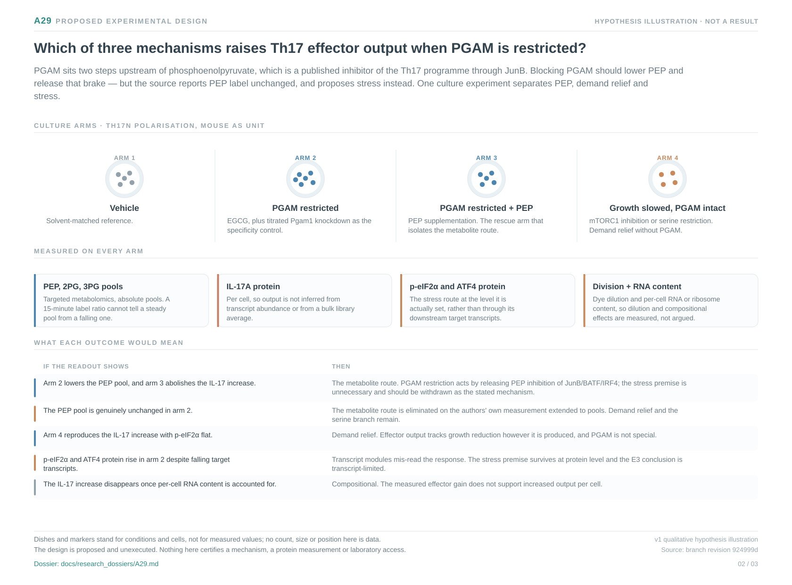

# A29: Which mechanism raises Th17 effector output under PGAM restriction

Registered 5 October 2026 as **proposed**, derived from the executed Wp
reproduction ladder, branch cards, metadata phenotypes and extension analyses
of Wang et al. 2025. The derivation supplied a bounded scientific review; human
retain/reject and scientific acceptance remain unrecorded. Registration is not
a claim of novelty, functional validation or permission to execute an
unfinished numerical design.

**Question:** Does restriction of glycolysis at PGAM raise Th17 effector output by lowering phosphoenolpyruvate and relieving PEP-mediated inhibition of the JunB/BATF/IRF4 complex, by relieving biosynthetic and proliferative demand, or by inducing a stress response?

**Hypothesis:** PGAM restriction raises Th17 effector output by lowering the phosphoenolpyruvate pool and relieving PEP-mediated inhibition of the JunB/BATF/IRF4 complex, rather than by inducing a stress response; relief of biosynthetic and proliferative demand is a third, separable possibility. The PEP route predicts that the PEP pool falls under PGAM inhibition and that PEP supplementation abolishes the effector gain; the demand route predicts that matched growth slowing without PGAM inhibition reproduces it. No mechanism here is proposed as new, and a transcript-level observation cannot establish any of them.

**Strongest rival:** PEP is genuinely unchanged, as the source's own ¹³C labelling would imply, which eliminates the primary route. Further rivals: ISR-independent stress through sustained cytoplasmic calcium that no transcript module sees; a per-cell-RNA-content compositional effect; division-rate dilution; and off-target action of EGCG.

**Current evidence:** Against an expression-decile-matched null, EGCG in Th17n raises the Th17 effector programme (+0.544, p 0.000) while histones, serine/one-carbon, cell cycle and ribosomal proteins fall and the integrated stress response is the most downward-shifted set (−0.491, p 0.000); UPR, NRF2 and heat shock do not move. A frozen sensitivity shows the ISR result is not carried by the two genes shared with the serine set. ATF4 output falls while ATF4 itself does not move and SESN2 rises.

**Next decision:** Measure absolute PEP, 2PG and 3PG pools — not label ratios — under PGAM inhibition, with a PEP-supplementation rescue arm, a matched growth-slowing arm, and phospho-eIF2α/ATF4 protein. The pool measurement is the one quantity that separates the candidate mechanisms and the published labelling ratio cannot supply it.

[Dossier](../../docs/research_dossiers/A29.md) · [Development plan](PLAN.md) · [Canonical card](../../RESEARCH_QUESTIONS.md#a29) · [Derivation and overlap screen](../../Research%20Article/gate2_W2_wagner_Th17_PGAM/rq_derivation/README.md).

This workspace owns future question-specific planning. The executed reproduction
runs, frozen tables, receipts and branch cards remain in the article package and
keep their article-run ownership. No analysis has been executed under this RQ;
shared inputs remain shared biological evidence and never become independent
replication.

<!-- literature-visual-context:start -->
## Literature context and visual hypothesis

[What previous findings contribute, what remains, and what the readouts would decide](LITERATURE_CONTEXT.md).

*Explanatory proposal, not measured results. Read the linked context and caption; arrows do not certify a mechanism or novelty.*
<!-- literature-visual-context:end -->
