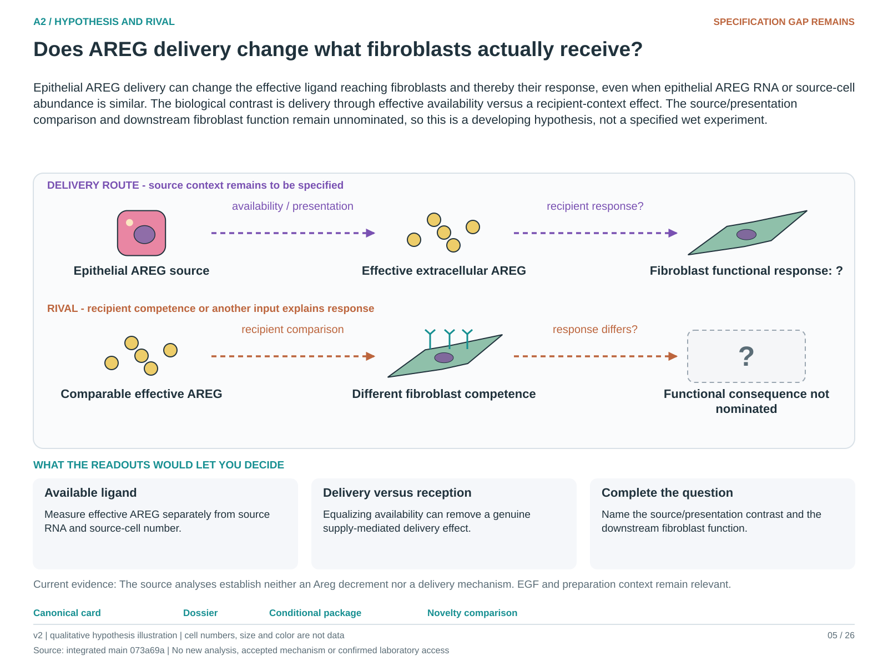

# A2: does the fibroblast response to AREG depend on delivery or on abundance

<!-- current-rq-framing:start -->
## Current biological hypothesis and novelty boundary — 3 October 2026

Epithelial AREG delivery can change the effective ligand reaching fibroblasts and thereby their response, even when epithelial AREG RNA or source-cell abundance is similar. The biological contrast is delivery through effective availability versus a recipient-context effect. The source/presentation comparison and downstream fibroblast function remain unnominated, so this is a developing hypothesis, not a specified wet experiment.

**What is already known, and what remains:** AREG/EGFR support and recipient-dependent ligand responses are precedents. A new contribution requires a justified delivery contrast and an actual recipient consequence; another source-RNA association is redundant. [Primary-source comparison](../../docs/research_dossiers/NOVELTY_SPECIFICITY_APPLICATION_2026-10-03.md#a2).

**What the measurements would decide:** Measure available AREG and the nominated fibroblast response separately. A response change following altered availability is compatible with delivery through supply; equalizing availability can remove that route. A remaining response difference points to recipient competence or other inputs, not automatically a delivery-specific mechanism.

**Current disposition:** Delivery contrast and functional endpoint required. This revision specifies proposed work; scientific acceptance, model access and assay qualification remain pending.

| Evidence and implementation | Current boundary |
|---|---|
| Biological unit and endpoint | Identified source and recipient donors/preparations with shared-source nesting. Measure a validated recipient consequence per starting recipient input, alongside availability, engagement and viable yield. |
| Current evidence and limit | The corrected RNA association is inconclusive. Supplied EGF, source Itgb6 observations and common-preparation split wells restrict delivery attribution; lack of association does not establish absence of AREG supply. |
| Next decision / hold | Review is deferred. M01 holds population inference without animal/pool/preparation maps; delivery attribution additionally needs ligand exposure, engagement and a validated consequence assay. |

**Read in this order:** [current evidence](reports/INTERPRETATION_AUDIT_2026-09-27.md),
[development dossier](../../docs/research_dossiers/A2.md),
[conditional hypothesis package](../../docs/research_dossiers/packages_2026-10-03/A2.md).
Source-mapping closeout: [M01 and reopening conditions](../../docs/research_dossiers/source_mapping_closeout_2026-10-03/README.md).
[Deferred work](../../docs/research_dossiers/REMAINING_WORK.md) and
[execution requirements](../../docs/RESEARCH_GOVERNANCE.md) govern any later
analysis. Draft completion does not establish assay validity, resource access,
meaningful effects, precision or scientific acceptance. Existing numerical
results and original plans below retain their recorded scope.
<!-- current-rq-framing:end -->

<!-- literature-visual-context:start -->
## Literature context and visual hypothesis

[What previous findings contribute, what remains, and what the readouts would decide](LITERATURE_CONTEXT.md).

*Explanatory proposal, not measured results. Read the linked context and caption; arrows do not certify a mechanism or novelty.*
<!-- literature-visual-context:end -->

**Conditional source-state branch reviewed 1 October 2026:** [Cardoso source
decomposition and England coordinated outputs](../../RESEARCH_QUESTIONS.md#a2-candidates-20261001)
specify an upstream rival already relevant to A2. They do not establish ligand
release, controlled delivery or recipient activation. Existing A2 fits and
contracts remain unchanged.

## Organizing biological question

> Does the fibroblast response to AREG depend on delivery or on abundance?

The working hypothesis is that amphiregulin (AREG) acts according to where it is
released and the recipient's capacity to respond. Ranking compartments by AREG
RNA is therefore only one part of the biological question about fibroblast activation.

This folder examines epithelial perturbations in a mixed-species organoid screen
and donor-level source/recipient associations in fibrosis. These analyses provide
leads about source contribution and recipient context; the available measurements
do not directly distinguish spatial delivery from ligand abundance.

**Read first:** [question card](../../RESEARCH_QUESTIONS.md#a2),
[biological rationale](RATIONALE.md), [plan](PLAN.md),
[current interpretation](reports/INTERPRETATION_AUDIT_2026-09-27.md).

## Evidence and analysis history

**New source evidence from roadmap P1:** the [recovered methods](../../docs/roadmap_runs/2026-09-27/P1_SCREEN_DESIGN.md) show four wells split from a common cell mixture and recombinant EGF in regular medium. Repeat wells do not provide four independent preparations. Per-library preparation/lot mapping and quantitative ligand conditions remain unresolved. Frozen results below are preserved.

**Current interpretation, 27 September 2026:** both descriptive legs and the
depth sensitivity are complete. Read the [audit correction](reports/INTERPRETATION_AUDIT_2026-09-27.md)
before the historical [synthesis](reports/STAGE5_SYNTHESIS.md) and
[depth report](reports/LEG2_DEPTH_STANDARDISED_RESULTS.md). The donor estimate is
positive and inconclusive (rho 0.293, nominal p 0.186), not no coupling. The
ITGB6 association remains a lead; no zero AREG contribution or causal route is
established. The correction also removes the claimed necessity of a 100-molecule
rerun. Original reports, estimates and frozen records remain unchanged.

**Earlier status, before the legs ran: audited, then narrowed by its own audit. Nothing
scored.** No endpoint has been computed in either dataset named below, and no claim row
has changed. A three-lens review and the covariate pass it prompted showed that the
first freeze declared an inference this design cannot support, so **it is withdrawn and
preserved**: read [STAGE2_WITHDRAWN.md](reports/STAGE2_WITHDRAWN.md) first, then
[`config/a2_stage2_freeze_v2.json`](config/a2_stage2_freeze_v2.json), which is the
authority on what stage 3 may do. The [stage 1 audit](reports/STAGE1_AUDIT.md), the
[first freeze](reports/STAGE2_FREEZE.md) and the original contract are all preserved
unedited. The second freeze is provisional pending owner review, and stage 3 is not
authorized.

**Measurement constraint.** Recipient AREG RNA is present in this screen.
Its protein supply and activity were not measured, and separately normalized
compartment RNA cannot quantify relative ligand supply. Partial source perturbation
and potential recipient supply leave the epithelial contribution unresolved.

This analysis replaces A2's abundance question with a delivery question. The
register card is [A2](../../RESEARCH_QUESTIONS.md#a2); the biology and the closed
abundance record are in [RATIONALE.md](RATIONALE.md); the stages and their stop
rules are in [PLAN.md](PLAN.md); the frozen decisions are in
[`config/a2_delivery_contract.json`](config/a2_delivery_contract.json).

## The hypothesis in one sentence

AREG's contribution to a fibroblast response is set by where the ligand is
released relative to a competent recipient, not by which compartment transcribes
the most of it.

## Why the previous question is closed

Seven register rows answer the abundance version, and none establishes a
depth-independent epithelial hierarchy: C37, C39, C45, C40, C48, C49 and C50. C45
records a ranking in the opposite direction, with dendritic cells and monocytes at or
above the epithelial states. C51 records why a donor-level correlation on these
variables is hard to read at all: the one significant pair in that trial tracked
sequencing depth and a frozen rule refused it. The rationale lists each row with the
register's own wording and its status. None of them is re-graded here.

## What makes the question testable now

The mechanism is short-range and recipient-licensed. Amphiregulin activates
integrin alphaV on mesenchymal stromal cells and releases bioactive TGF-beta from
latent complexes, driving myofibroblast differentiation
([Minutti 2019](https://doi.org/10.1016/j.immuni.2019.01.008)), downstream of the
recipient's own EGFR, and the fibroblast arm of TGF-beta signalling needs amphiregulin
([Zhou 2012](https://doi.org/10.1074/jbc.M112.356824)). A ligand that converts a store
the recipient already holds does not require tissue-level abundance to be
rate-limiting, which is consistent with the nulls C49 and C50 recorded without being
evidence for this framing.

Two legs follow, each able to fail alone:

| Leg | Prediction | Data | Unit |
|---|---|---|---|
| 1 | Removing the epithelial source lowers a frozen fibroblast activation programme; removing epithelial reception does not | GSE307112 organoid knockout screen | 4 units of one repeated plate layout |
| 2 | The fibroblast response tracks the recipient's post-receptor integrin and latent-complex genes better than it tracks epithelial ligand; now exploratory | GSE136831, the trial E6 instrument reused | donor |

## What the screen can and cannot separate

The screen perturbs the mouse epithelium only and leaves the human fibroblasts
unedited, with reads assigned by species. Targeting mouse Areg challenges a candidate
epithelial ligand source while recipient AREG remains unperturbed. Egfr/Erbb2 and
Erbb3/Erbb4 arms target distinct receptor machinery; they are not interchangeable
tests of AREG reception. Undetected Erbb4 RNA does not prove absent receptor protein.
Targeting epithelial ITGB6 perturbs a candidate activator; TGF-beta activation
was not measured in this screen.

The arms distinguish targeted genes and compartments, but do not directly quantify
source protein supply, receptor engagement or TGF-beta activation. They also do not
separate delivery from abundance: the design provides no controlled spatial variation.
A positive result is equally consistent with the abundance version. The five remaining
axis targets sit on plate 3 with one well per target in each of its four units, which
is forced by the design rather than chosen.

## What the gate found

Stage 1 passed all seven stop rules, so the test can run, and it constrained the
freeze in four ways. Erbb4 RNA was not detected by the screened measure, so it is
dropped from the discriminating set. Egfr sits near the detection floor, so its
contrast is weaker than Erbb2 or Erbb3. Fibroblast depth spans four orders of
magnitude across the 240 plate-3 wells, and all four Areg wells sit above their unit
median in it, so two depth-restricted sensitivities are declared and a 100,000-count
floor governs the reading of any single well. Four of the eight control wells fall
below that floor, so they became descriptive context rather than an anchor.

Power is exact rather than estimated. The Areg well must average the 27th percentile
of its unit for the primary to clear alpha 0.05, and being just below the median in
all four units does not reach it.

## Layout

| Path | Contents |
|---|---|
| `RATIONALE.md` | the biological argument, the closed abundance record, the other-layer verdicts |
| `PLAN.md` | six stages, their stop rules and the order of work |
| `config/a2_delivery_contract.json` | endpoints, adjustment, statistic, thresholds, prohibitions |
| `config/a2_stage2_freeze.json` | the first freeze, withdrawn and preserved unchanged |
| `config/a2_stage2_freeze_v2.json` | the freeze leg 1 obeyed: effect size against the screen's controls, eligibility floor, no p-value |
| `config/a2_leg2_spec.json` | the leg 2 specification, declared and committed before leg 2 ran |
| `config/a2_leg2_depth_spec.json` | the depth-standardised second pass, declared before its measure ran |
| `scripts/` | `01_stage1_audit.py` and `02_stage2_freeze.py`, standard library only, hash-verified inputs, refusing to overwrite |
| `tables/` | stage 1 outputs and their run record |
| `reports/` | [synthesis](reports/STAGE5_SYNTHESIS.md), [leg 1](reports/STAGE3_LEG1_RESULTS.md), [leg 2](reports/STAGE4_LEG2_RESULTS.md), [leg 2 standardised](reports/LEG2_DEPTH_STANDARDISED_RESULTS.md), [stage 1 audit](reports/STAGE1_AUDIT.md), the [first freeze](reports/STAGE2_FREEZE.md) and its [withdrawal](reports/STAGE2_WITHDRAWN.md) |

## Three things a later session must not do

1. **Do not compute either endpoint by target before stage 2 is committed.** The
   pre-registration is the only thing that makes four wells per target readable,
   and stage 1 includes a precedent check that records whether any such contrast
   already exists.
2. **Do not read a null as absence.** The Areg knockout lowers the mouse
   transcript by 1.042 log2 CPM and leaves it at 6.226. The contract declares
   precise absence unavailable at this design, before any test.
3. **Do not upgrade either leg past its evidence.** Leg 1 is a within-screen
   descriptive association while preparation independence is unresolved, and leg
   2 is correlational with no direction and no proximity, and may be refused by
   its own depth control.
