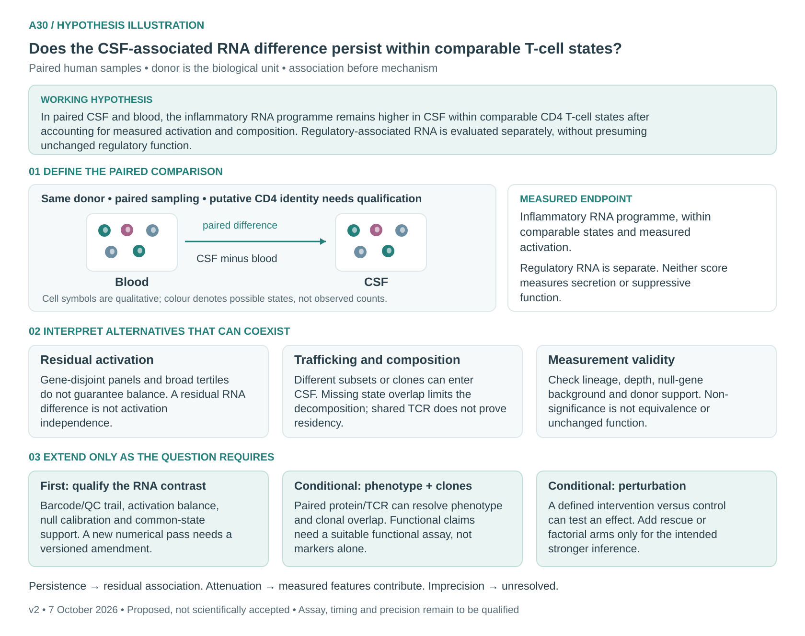

# A30: Inflammatory RNA programmes in paired CSF and blood CD4 T cells

**Question:** Does the CSF-associated inflammatory RNA difference persist within
comparable CD4 T-cell states after accounting for measured activation and composition?

**Working hypothesis:** In paired CSF and blood, the inflammatory RNA programme
remains higher in CSF within comparable CD4 T-cell states after accounting for
measured activation and composition. Regulatory-associated RNA is evaluated
separately, without presuming unchanged regulatory function.

Residual activation, selective trafficking and subset or clonal composition can
coexist. Technical and lineage-gating effects also need assessment. This is an
observational association question; it does not establish that CSF induces a
state or that the cells are tissue-resident.

## Current evidence and audit

The [v3 denominator erratum](../../Research%20Article/gate2_W2_wagner_Th17_PGAM/A30_ERRATUM.md)
corrects the earlier subset-based CP10K denominator. Saved v3 pro-inflammatory
contrasts are **+0.0558, +0.0498 and +0.0570**, with 9, 10 and 9 eligible donors
and empirical BH values **0.0321, 0.0368 and 0.0321** across six primary tests.
These are exploratory results against the implemented size-only gene-set null.

The [PR140 artifact audit](../../docs/audits/2026-10-07-pr140/REPORT.md) verifies
saved arithmetic but changes the interpretation:

- Activation remains different within the broad tertiles; it is **not excluded**.
- Regulatory-module BH 0.8174 is not equivalence or preserved regulatory function.
- The 38.8% composition summary is a **ratio of donor medians**; the median donor
  fraction is 33.3%. Neither estimates a causal fraction. Missing state support
  makes the split dependent on an imputation convention.
- The putative CD4 gate, restricted null universe and missing barcode-level QC
  export need qualification before a stronger conclusion.

Article-owned runs contain 35,928 cells from 22 retained libraries; the paired
contrast uses ten donors, with fewer donors in two strata. Cells are not
independent replicates. GSE138266 is shared with Wang and Schafflick et al.; this
is not independent replication. The separate Wp-R2 Compass direction error does
not change A30 arithmetic but cannot support a metabolic interpretation of it.

## Next investigation

Use the [revised extension baseline](EXTENSION_BASELINE_V2.md): qualify lineage,
activation balance, null construction and common-state support before another
governed sensitivity analysis. Protein/TCR measurements are conditional
extensions, not prerequisites for reporting the bounded RNA association.
Feasibility, functional endpoints and precision remain unspecified.

[Dossier](../../docs/research_dossiers/A30.md) · [Canonical card](../../RESEARCH_QUESTIONS.md#a30)
· [Source derivation](../../Research%20Article/gate2_W2_wagner_Th17_PGAM/rq_derivation/README.md)

Registered as **proposed**. No human retain/reject decision, claim promotion,
novelty certification or new numerical execution is recorded by this revision.

<!-- literature-visual-context:start -->
## Literature context and visual hypothesis

[Primary studies, rationale and interpretation limits](LITERATURE_CONTEXT.md).

*Qualitative proposal, not measured results. Sample symbols do not encode observed
counts. Extensions require their own qualified designs.*
<!-- literature-visual-context:end -->

## Historical records

[Original plan](PLAN.md), [v2 result record](RESULTS.md),
[v2 measured figure](../../analysis/research/runs/wp_a30_figure_v2/figure_a30_activation_and_composition.png)
and [v1 hypothesis illustration](schematics/hypothesis_v1.svg) are preserved.
The measured figure uses superseded normalization and is not the current v3 plot.
The v2 schematic supersedes the earlier causal and regulatory-function framing.
