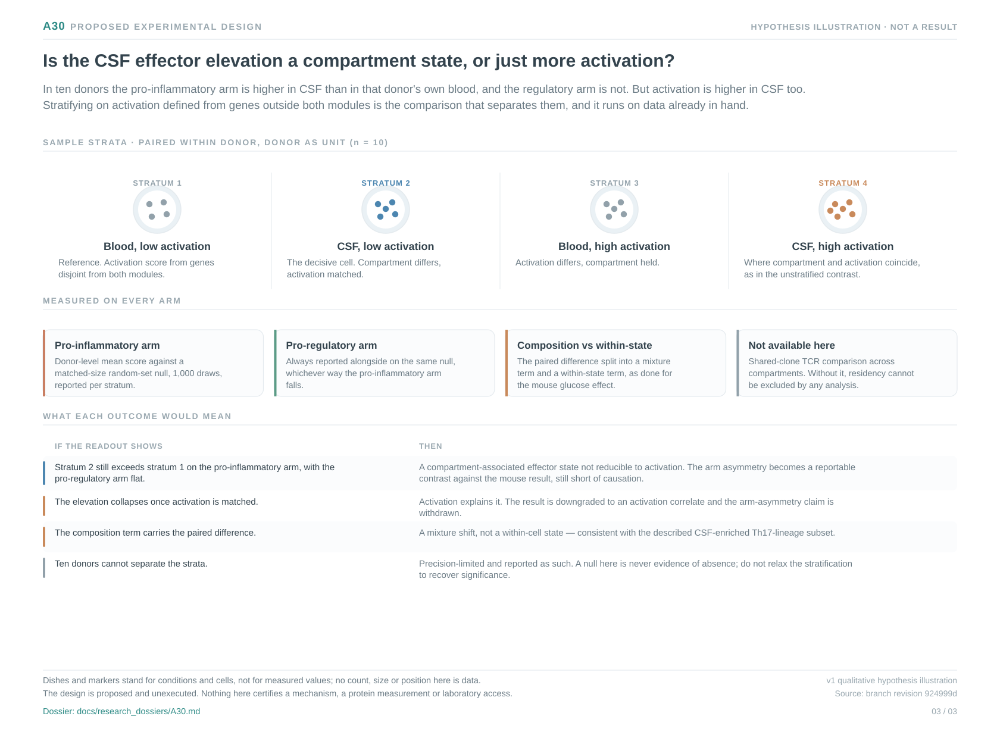

# A30: Compartment-specific effector state versus local activation in CSF T cells

Registered 5 October 2026 as **proposed**, derived from the executed Wp
reproduction ladder, branch cards, metadata phenotypes and extension analyses
of Wang et al. 2025. The derivation supplied a bounded scientific review; human
retain/reject and scientific acceptance remain unrecorded. Registration is not
a claim of novelty, functional validation or permission to execute an
unfinished numerical design.

**Question:** In human CNS autoimmunity, is the elevated pro-inflammatory programme in CSF T cells a compartment-specific state, or a correlate of local activation that any activation-adjacent gene set would show?

**Hypothesis:** The cerebrospinal fluid compartment imposes an effector state on CD4-lineage T cells that is not reducible to local activation, with regulatory competence unchanged rather than suppressed. The prediction is that within matched activation strata the paired CSF-minus-blood elevation of the pro-inflammatory module persists while the pro-regulatory arm still does not move; an activation-only explanation predicts the elevation collapses. Compartment association is not evidence that the compartment caused the state.

**Strongest rival:** Local activation, which exceeds its own matched null in the same direction (+0.109, p 0.013) and is therefore a measured competitor rather than a hypothetical one. Tissue residency or recirculation, and composition — now with a named candidate in the CSF-enriched CCR5-high Th17.1 cluster.

**Current evidence:** The source's published disease comparison does not reproduce: nothing separates the disease groups in CSF at BH ≤ 0.05, and in blood matched-size random gene sets separate the cohorts as well as the modules do (p 0.29). The surviving contrast is paired within donor: pro-inflammatory +0.061 in 10/10 donors (p 0.003), pro-regulatory +0.007 (p 0.394) and +0.022 (p 0.931), activation +0.109 (p 0.013). No donor covariate fields exist in the deposit.

**Next decision:** Repeat the paired contrast within independently defined activation strata, reporting both arms against the same matched null and decomposing the paired difference into composition and within-state terms, with the stratification fixed before any value is inspected. This leg is executable in the package; the residency question needs paired samples with protein and TCR readouts that this project does not hold.

[Dossier](../../docs/research_dossiers/A30.md) · [Development plan](PLAN.md) · [Canonical card](../../RESEARCH_QUESTIONS.md#a30) · [Derivation and overlap screen](../../Research%20Article/gate2_W2_wagner_Th17_PGAM/rq_derivation/README.md).

This workspace owns future question-specific planning. The executed reproduction
runs, frozen tables, receipts and branch cards remain in the article package and
keep their article-run ownership. No analysis has been executed under this RQ;
shared inputs remain shared biological evidence and never become independent
replication.

<!-- literature-visual-context:start -->
## Literature context and visual hypothesis

[What previous findings contribute, what remains, and what the readouts would decide](LITERATURE_CONTEXT.md).

*Explanatory proposal, not measured results. Read the linked context and caption; arrows do not certify a mechanism or novelty.*
<!-- literature-visual-context:end -->
