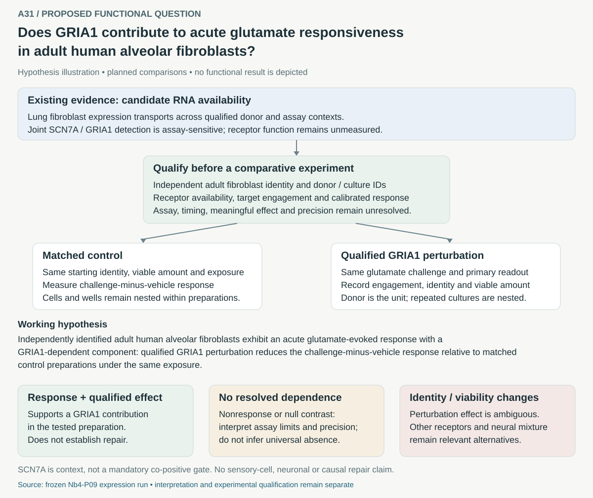

# A31: GRIA1-dependent acute glutamate response in adult alveolar fibroblasts

**Proposed — 7 October 2026.** This question follows an exposed Nb4-P09
expression-specificity analysis. It is not an established sensory phenotype or
an executed functional experiment.

[Canonical card](../../RESEARCH_QUESTIONS.md#a31) ·
[Dossier](../../docs/research_dossiers/A31.md) · [Development plan](PLAN.md) ·
[Primary-source context](LITERATURE_CONTEXT.md) ·
[Measured source evidence](../../docs/portfolio_extensions/2026-10-07/g2_niche/RESULTS.md)

## Biological question

Does GRIA1 contribute to a measurable acute glutamate response in independently
identified adult human alveolar fibroblasts? The atlas expression pattern makes
this a testable possibility; it does not supply the response measurement.

The drawing is a qualitative proposal. Its arrows are planned comparisons;
no cell counts, effect sizes or functional results are depicted. SCN7A is
expression context, not a mandatory double-positive gate. Existing source
donors and repeated assays are not counted as new experimental replicates.

## Current status and next step

The article-local RNA run is complete and preserved. The functional test is
unexecuted. Qualify cell identity independently of the candidate genes, adult
anatomical source, surface receptor/target engagement, acute assay validity and
independent donor structure with repeated preparations nested. Then select the primary response,
timing, meaningful effect and precision before freezing a numerical design.
Keep all calibrated nonresponses and ambiguous perturbation outcomes.

No other canonical question is retired. This folder owns the proposed functional
question; Nb4-P09 continues to own its source expression result.
