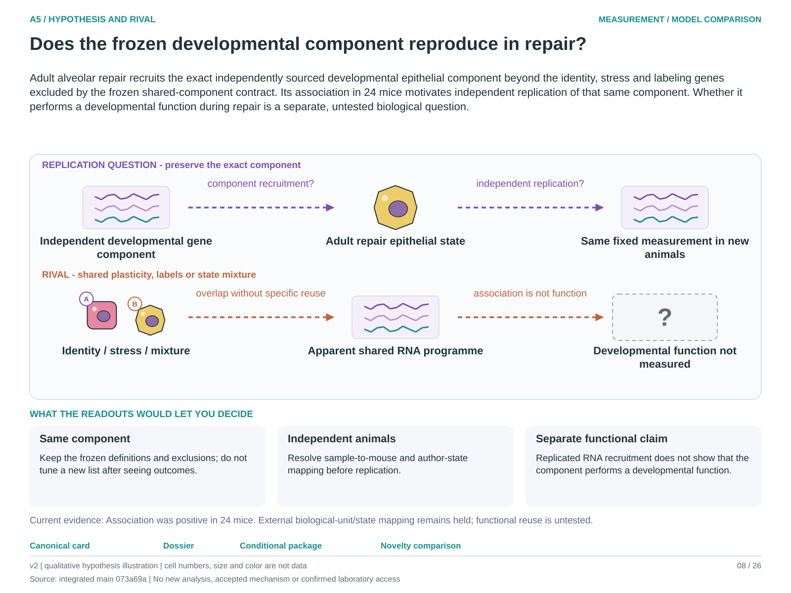

# A5: developmental-gene recruitment in adult repair

<!-- current-rq-framing:start -->
## Current biological hypothesis and novelty boundary — 3 October 2026

Adult alveolar repair recruits the exact independently sourced developmental epithelial component beyond the identity, stress and labeling genes excluded by the frozen shared-component contract. Its association in 24 mice motivates independent replication of that same component. Whether it performs a developmental function during repair is a separate, untested biological question.

**What is already known, and what remains:** Developmental-programme reuse is established broadly. The current contribution is reproducibility of a fixed measurement; replication is useful without being a new mechanism. [Primary-source comparison](../../docs/research_dossiers/NOVELTY_SPECIFICITY_APPLICATION_2026-10-03.md#a5).

**What the measurements would decide:** Reproduction in independent, source-qualified animals supports transport of the fixed component. Failure or loss after valid state/identity comparison weakens that generalization. Functional reuse requires a separately justified endpoint and intervention; gene overlap alone cannot supply it.

**Current disposition:** Fixed-component replication; mapping held. This revision specifies proposed work; scientific acceptance, model access and assay qualification remain pending.

| Evidence and implementation | Current boundary |
|---|---|
| Biological unit and endpoint | Author-defined transitional and activated AT2 states within independent biological mice. Retain the frozen paired detection-probability contrast, gene definitions, UMI budget and eligibility rules. |
| Current evidence and limit | The original positive recruitment result across 24 primary mice survives the specified exclusions. The 56-library/55-mouse distinction and per-cell author-state mapping remain unresolved for the external candidate. |
| Next decision / hold | External replication stays held at M02. Reopen for the authentic barcode/library/mouse/author-state and pool/split export, then qualify count alignment; no new classifier or relaxed threshold substitutes for it. |

**Read in this order:** [current evidence](../A5_A11_shared_component_contract/reports/REVISED_TEST_RESULTS.md),
[development dossier](../../docs/research_dossiers/A5.md),
[conditional hypothesis package](../../docs/research_dossiers/packages_2026-10-03/A5.md).
Source-mapping closeout: [M02 and reopening conditions](../../docs/research_dossiers/source_mapping_closeout_2026-10-03/README.md).
[Deferred work](../../docs/research_dossiers/REMAINING_WORK.md) and
[execution requirements](../../docs/RESEARCH_GOVERNANCE.md) govern any later
analysis. Draft completion does not establish assay validity, resource access,
meaningful effects, precision or scientific acceptance. Existing numerical
results and original plans below retain their recorded scope.
<!-- current-rq-framing:end -->

<!-- literature-visual-context:start -->
## Literature context and visual hypothesis

[What previous findings contribute, what remains, and what the readouts would decide](LITERATURE_CONTEXT.md).

*Explanatory proposal, not measured results. Read the linked context and caption; arrows do not certify a mechanism or novelty.*
<!-- literature-visual-context:end -->

## Organizing biological question

> Does adult alveolar repair reuse part of a developmental epithelial programme?

The working hypothesis is that development and repair recruit a shared component
of epithelial remodelling, with context-specific additions contributing to
different outcomes. Developmental-gene enrichment would support partial reuse;
it would leave shared ancestry and repair function as separate questions.

This folder tests an externally sourced developmental signature in transitional
versus activated alveolar type 2 (AT2) cells within injured mice, with identity,
stress and cycling exclusions. It also records the eligibility of an independent
repair cohort. A0 asks about transfer across epithelial transitions more broadly;
A5 focuses on developmental reuse in adult alveolar repair.

**Read first:** [question card](../../RESEARCH_QUESTIONS.md#a5),
[biological rationale](../A5_A11_shared_component_contract/BIOLOGICAL_LOGIC.md),
[plan](PLAN.md), [revised results](../A5_A11_shared_component_contract/reports/REVISED_TEST_RESULTS.md).

## Evidence and analysis history

**Latest recovery, 28 September 2026:** the [independent-cohort report](replication_gate_20260928/REPORT.md)
recovers author state labels and library records, but the barcode/state/mouse map
and library-to-animal reconciliation remain missing. No new external score was
produced. The [earlier candidate audit](../../docs/roadmap_runs/2026-09-27-followthrough/EXPANDED_CANDIDATE_AUDIT.md)
and numerical results below retain their original scope.

Read the [biological rationale](../A5_A11_shared_component_contract/BIOLOGICAL_LOGIC.md)
and [prospective plan](PLAN.md). **The revised test is complete.** All 24 primary mice have positive paired
changes: mean +0.735 detection percentage points (95% CI 0.579–0.892).
The external identity- and identity/control-excluded modules remain positive
under the declared Holm family. This supports partial signature recruitment,
not shared lineage or repair function. Read the
[full results](../A5_A11_shared_component_contract/reports/REVISED_TEST_RESULTS.md).

The primary compares an external Guo 99-gene signature in transitional versus
activated AT2 cells of the same injured mouse. External identity exclusions leave
57 genes, then stress/cycling exclusions leave 53. These address distinct rivals.
The original Strunz-filtered 94/51-gene variants remain descriptive.

All 24 primary-reference mice and 26 resting-reference mice retain eligibility
after the fixed 500-UMI depth filter. The test uses days 2–21 and at least 30 cells per arm.
See [the corrected cohort audit](DATA_AUDIT.md).

- `config/strunz_test_contract.json`: fixed design.
- `tables/external_test_modules.json`: additional source-defined modules.
- `scripts/02_freeze_external_test.py`: source freeze, no counts.
- `tables/external_freeze_run.json`: provenance and hashes.

Original audit outputs remain in `tables/`; completed scores, gates and inference
are in `tables/test_v1/`.

## Reproduce the completed test

Use the repository Python launcher with a compatible scientific environment.
Run `scripts/02_freeze_external_test.py --source-root SOURCE --data-root DATA`
only in a clean output directory; the tracked frozen definitions already exist.
`scripts/03_score_external_test.py --source-root SOURCE` reads metadata from
SOURCE and the downloaded matrix/barcodes from this folder's ignored `cache/`.
Then run `Rscript scripts/04_inference.R REPO_ROOT`.
The scripts refuse to overwrite results. Source URLs/hashes are recorded in
`tables/audit_run.json`, `tables/external_freeze_run.json` and `tables/count_retrieval.json`.
