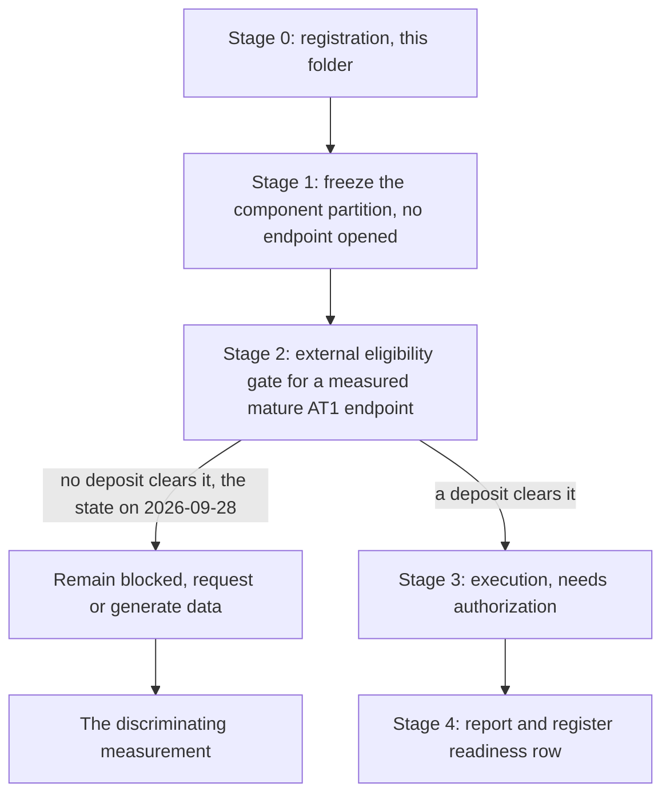

# A8 analysis plan: the partition is frozen first, the endpoint decides nothing until it exists

Written 28 September 2026, before any A8 endpoint has been computed. A8 is a registered question
whose blocking input is a measurement, so this plan is short by design: it fixes what must be
written down before an endpoint is opened, and it states the gate that a candidate dataset would
have to clear. No stage of it can run on the data currently in the repository.

## Structure

## Stage 0: registration, which is what this folder contains

The question, its [rationale](RATIONALE.md), this plan and the
[contract](config/a8_question_contract.json). A8 is already in the canonical register, so this
folder adds no identifier; it replaces a card-only presence with a workspace. No endpoint scored,
no dataset opened for A8, no claim row.

## Stage 1: freeze the component partition, before any endpoint is opened

This is the step the founding observation actually licenses. It is specification, not computation.

**What must be written down.** A disjoint partition of the source-derived lists into a
shared-transition component and a maturation-specific component, with the 119 overlapping genes
assigned explicitly and by a stated rule rather than case by case; the exclusion of the
seed-unstable four-gene late-AT1 panel from any primary role, with its instability recorded; a
minimum component size below which a component is declared unusable rather than scored; and the
normalization and depth conventions, fixed in advance.

**Why it is frozen before the endpoint.** Under the measurement rival, the partition itself
determines the answer. A partition chosen after an increment is visible cannot distinguish a
maturation component from a favourable assignment of shared genes.

**What Stage 1 may not conclude.** Nothing biological. A frozen partition is an instrument. Its
existence is not evidence that the components measure different processes, and the overlap
arithmetic that motivated it stays a property of two gene lists.

## Stage 2: the eligibility gate, frozen now so it cannot be relaxed later

A deposit or experiment is eligible only if it satisfies all five conditions **simultaneously**.

1. **Mature AT1 contribution measured independently of RNA** — protein, morphology, or a traced
   descendant yield. An RNA score of AT1 identity is not the endpoint, whatever its gene list.
2. **An early epithelial RNA measurement in the same biological units** as the endpoint, so the
   frozen components can be computed where the outcome was measured.
3. **Predictor timing earlier than the endpoint**, documented. Concurrent predictor and outcome
   do not meet this condition; this is the condition A10's organoid endpoint fails.
4. **Biological replication at the animal, donor or preparation level**, at least three
   independent units per arm, with unit identities deposited. Repeat wells split from one
   mixture are not independent preparations.
5. **The endpoint's definition independent of the predictor's genes**, so that an increment
   cannot be produced by shared membership.

**Stop rules.** If conditions 1 to 3 do not co-occur, no transfer is attempted and the search is
recorded as a negative result. A deposit meeting 1 and 2 but failing 4 may be used for a
descriptive, explicitly non-inferential transfer, labelled as such, and may not change the
readiness row. No condition is relaxed to obtain a testable dataset.

**State on 28 September 2026.** No candidate has been identified, and **no public-data search has
been performed under this gate**. The
[shared outcome inventory](../A1_transitional_epithelial_state_distinction/reports/A1_A8_A14_OUTCOME_INVENTORY.md)
records A8's requirement as row O27 and finds it unavailable across the surveyed A1 evidence, and
records at row O29 that no EdU, BrdU or label-retention assay is named anywhere in that evidence.
That survey covered the A1 documents, not the public archives, so the absence of a candidate here
is a statement about what has been examined and not a claim that no such deposit exists.

## Stage 3: execution, not authorized

Stage 3 needs an eligible dataset and a separate owner authorization. Nothing to execute exists
at present, so no authorization is sought.

## Stage 4: report and register

One report per executed stage with a run record carrying input hashes, the script hash and the
seed. The register effect is bounded in advance: an executed stage may change the A8 readiness row
in [RESEARCH_QUESTIONS.md](../../RESEARCH_QUESTIONS.md#a8) and may add a negative result, and may
not add a graded claim row without the owner's decision.

## The discriminating measurement, for completeness

In one cohort of animals, measure an early epithelial RNA profile and, at a later documented
timepoint, mature AT1 contribution by protein or by traced descendant yield. The frozen
maturation component is then tested for added information over the frozen shared component. The
decision rule is the register card's: added information that transports supports the nominated
component; a precise absence of a meaningful increment weakens it; missing endpoints or
imprecision is inconclusive.

## What this plan refuses to do

- To score both the predictor and the mature outcome from RNA, in any form, including two
  different panels drawn from overlapping source lists.
- To use the four-gene late-AT1 panel as a primary instrument while its direction depends on the
  technical seed.
- To treat A10's organoid size, a cycling score or a transitional score as the later outcome.
- To pool preparations, relax the three-unit floor, or reassign the 119 shared genes after an
  increment has been seen.
- To interpret a shrinking increment after disjointification as evidence against a maturation
  component, or a persisting one as evidence for a mechanism.

## Order of work

1. Write the partition freeze of Stage 1. It requires no data and it is the prerequisite for
   everything else.
2. Perform the Stage 2 search under the frozen gate, and record it as a dated negative result if
   nothing clears.
3. If a deposit clears, seek authorization for Stage 3; otherwise the next action is not an
   analysis but a data request or the measurement itself.