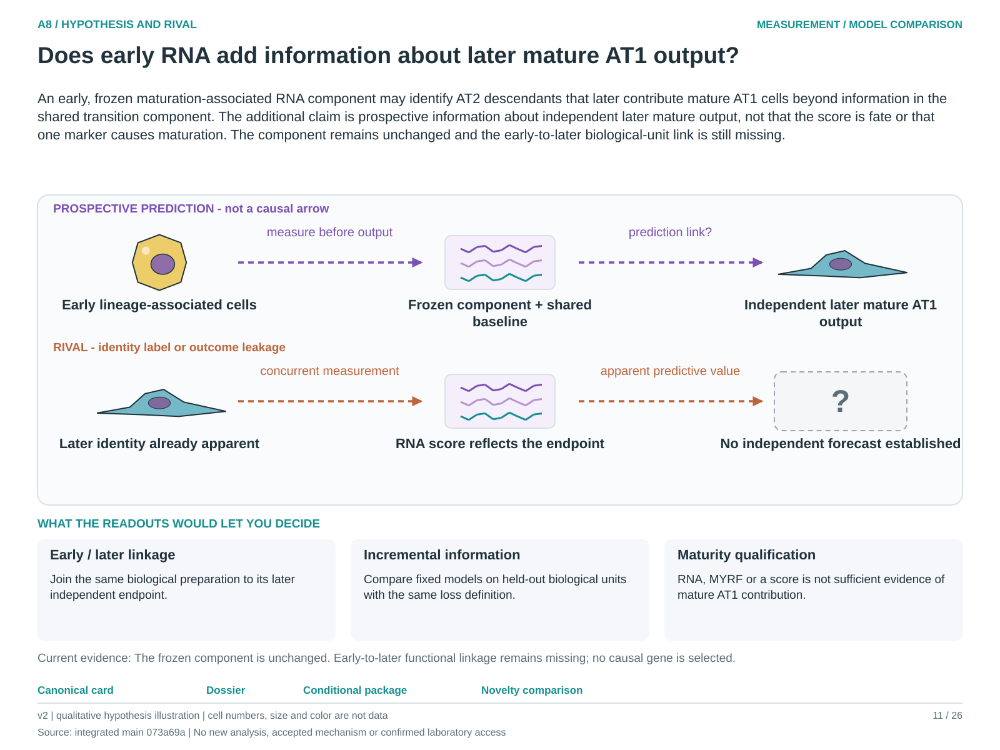

# A8: does a maturation component add information about mature AT1 contribution?

<!-- current-rq-framing:start -->
## Current biological hypothesis and novelty boundary — 3 October 2026

An early, frozen maturation-associated RNA component may identify AT2 descendants that later contribute mature AT1 cells beyond information in the shared transition component. The additional claim is prospective information about independent later mature output, not that the score is fate or that one marker causes maturation. The component remains unchanged and the early-to-later biological-unit link is still missing.

**What is already known, and what remains:** Transition and AT1 differentiation programmes are established. The fixed component needs an independently linked incremental prediction test; a differently named score is not biological novelty. [Primary-source comparison](../../docs/research_dossiers/NOVELTY_SPECIFICITY_APPLICATION_2026-10-03.md#a8).

**What the measurements would decide:** Improved prediction of later mature output on held-out biological units supports the component as an early indicator. No stable increment weakens it. Identity, lineage and function require independent endpoints; contemporaneous RNA or MYRF expression cannot substitute for mature AT1 contribution.

**Current disposition:** Prediction question; linked endpoint held. This revision specifies proposed work; scientific acceptance, model access and assay qualification remain pending.

| Evidence and implementation | Current boundary |
|---|---|
| Biological unit and endpoint | Independent lineage-defined animal/donor preparations. Evaluate held-out prediction error for absolute mature descendants per starting AT2 input, with survival and total yield separate; RNA alone cannot define the mature outcome. |
| Current evidence and limit | The 119-gene overlap analysis is a measurement diagnostic. MYRF is not AT1-specific. Rochelle donor/stage and scaffold library labels improve provenance but do not establish the missing early-to-later functional join. |
| Next decision / hold | Scientific acceptance is pending; M09 retains the linkage hold. Reopen for verified preparation/lineage and timing relationships with an independent mature endpoint. A concurrent association needs its own narrower scope. |

**Read in this order:** [current evidence](../A1_transitional_epithelial_state_distinction/reports/A1_A8_A14_OUTCOME_INVENTORY.md),
[development dossier](../../docs/research_dossiers/A8.md),
[conditional hypothesis package](../../docs/research_dossiers/packages_2026-10-03/A8.md).
Source-mapping closeout: [M09 and reopening conditions](../../docs/research_dossiers/source_mapping_closeout_2026-10-03/README.md).
[Deferred work](../../docs/research_dossiers/REMAINING_WORK.md) and
[execution requirements](../../docs/RESEARCH_GOVERNANCE.md) govern any later
analysis. Draft completion does not establish assay validity, resource access,
meaningful effects, precision or scientific acceptance. Existing numerical
results and original plans below retain their recorded scope.
<!-- current-rq-framing:end -->

<!-- literature-visual-context:start -->
## Literature context and visual hypothesis

[What previous findings contribute, what remains, and what the readouts would decide](LITERATURE_CONTEXT.md).

*Explanatory proposal, not measured results. Read the linked context and caption; arrows do not certify a mechanism or novelty.*
<!-- literature-visual-context:end -->

**Nb4 follow-through, 3 October 2026:** [scoped sequential analyses](../../Research%20Article/gate2_N3_travaglini_nabhan_lung_atlas_2020/reports/RQ_SEQUENCE_RESULTS.md) and [pipelines](../../Research%20Article/gate2_N3_travaglini_nabhan_lung_atlas_2020/reports/RQ_PIPELINES.md). Article-local diagnostics preserve this question’s existing evidence and biological endpoint gates; no claim grade or acceptance decision changes.

**Conditional candidates reviewed 1 October 2026:** [Nb3 and England maturation branches](RELATED_CANDIDATES_2026-10-01.md) retain the missing predictor-to-outcome linkage as a gate.

## Organizing biological question

> Does a maturation-specific programme add information about measured mature AT1
> contribution beyond shared transition?

Alveolar type 2 cells that enter a transitional state can go on to contribute
mature AT1 cells, and the RNA programmes used to describe the transition and the
mature endpoint overlap heavily. The question asks whether anything specific to
maturation carries information about how much mature AT1 contribution actually
occurs, once the shared transitional component is accounted for.

This workspace exists to keep two things apart that are easy to conflate: a
**measurement problem** in how the programmes are defined, which is established,
and a **biological claim** about a maturation-specific mechanism, which is not.

**Read first:** [question card](../../RESEARCH_QUESTIONS.md#a8),
[rationale](RATIONALE.md), [plan](PLAN.md),
[shared outcome inventory](../A1_transitional_epithelial_state_distinction/reports/A1_A8_A14_OUTCOME_INVENTORY.md).

## Evidence and analysis history

**Status, 29 September 2026: registered; blocked on an eligible linked dataset;
nothing computed for A8.** This folder was created on the owner's instruction to
give A8 its own workspace rather than a card alone. It adds no new question
identifier, no claim row and no grade, and it does not change the register card.

A8 has not analyzed an endpoint of its own. Its founding observation is owned by
another package: claim C168 records that the source-derived ADI and AT1 holdout
lists share **119 genes**, and that the four-gene late-AT1 panel changes direction
across technical seeds 17 and 29 at 2,000 UMIs in several injured wells and in the
one eligible external mouse
([module_overlap.csv](../../Research%20Article/epithelial_state_specificity/results/module_overlap.csv)).
The supporting diagnostics are in the register's cross-question gallery
([A8 panels](../../analysis/figures/rq/README.md#a8)); they are diagnostics of the
definitions, not evidence for a mechanism.

## The question in one sentence

Conditional on a frozen shared-transition component, does a frozen
maturation-specific component add information about an independently measured
mature AT1 contribution, in independent animals?

Two routes preserve the register's scope: **incremental association** can use a
concurrent, independently measured endpoint; **prospective prediction** requires
the RNA measurement to precede that endpoint. Both require documented timing,
compatible biological-unit linkage and a noncircular mature AT1 measurement.

## What it stands on, and what that is worth

It stands on a definitional dependence, not on a biological result. The 119-gene
overlap and the seed-sensitive panel show that any analysis scoring "transitional"
and "mature AT1" from these lists scores some of the same genes twice. That is a
reason to check the measurement before trusting any increment; it is not evidence
that a maturation-specific programme exists, and it is equally not evidence that
mature AT1 identity is merely an extension of the transition. The
[rationale](RATIONALE.md) sets out why the inference runs in neither direction.

## Register readiness: blocked, and honest about why

The blocking input is an eligible predictor–outcome linkage, and the component
partition still needs to be frozen. The shared
[outcome inventory](../A1_transitional_epithelial_state_distinction/reports/A1_A8_A14_OUTCOME_INVENTORY.md)
records A8's linkage requirement as row O27. Mature non-RNA endpoints already
exist in the examined evidence, including O2/O3; no dataset linking a suitable
endpoint to the required RNA measurements with verified biological units has
been identified for A8. This is a limit of the examined evidence, not a claim
that no eligible dataset exists. A bounded search or author-provided data can
satisfy the contract. The lack of documented EdU, BrdU or label-retention assays
in O29 does not erase the genetic lineage-labelled endpoints in O2/O3.

A10's organoid endpoint does not substitute. Its
[endpoint statement](../A10_organoid_growth_outcome/reports/ENDPOINT_TIMING_UNITS_2026-09-28.md)
records an organoid-size endpoint rather than measured mature AT1 contribution,
with wells not verified as independent preparations. Those limitations exclude
it from either route. Its concurrent RNA and imaging additionally prevent a
prospective-prediction interpretation; concurrency alone does not exclude an
otherwise eligible association design.

## Layout

| Path | Role |
|---|---|
| [RATIONALE.md](RATIONALE.md) | Why signature overlap motivates a measurement check and not a maturation mechanism; rivals; what is open |
| [PLAN.md](PLAN.md) | Stage 0 registration, the component-partition freeze, the eligibility gate, and what execution would require |
| [config/a8_question_contract.json](config/a8_question_contract.json) | Machine-readable scope, prohibitions and the declaration that nothing is scored |
| [A1 lineage audit](../A1_transitional_epithelial_state_distinction/LINEAGE_AUDIT.md) | Sourcing guide named by the register card |
| [A1 comparison matrix](../A1_transitional_epithelial_state_distinction/COMPARISON_MATRIX.md) | Where A8's endpoint requirement sits among A1's branches |

## Five things a later session must not do

1. **Do not define the predictor and the "mature" outcome from the same RNA
   panel.** This is the register card's own instruction and the reason A8 exists.
   A score-versus-score comparison cannot meet A8's requirement.
2. **Do not read the 119-gene overlap as evidence for or against a maturation
   mechanism.** It is a property of two gene lists.
3. **Do not treat a shrinking increment after disjointification as a negative
   result.** Removing shared genes can remove real biology; the direction of that
   bias is not known here.
4. **Do not substitute organoid size, a cycling score or any RNA score for
   measured mature AT1 contribution.** Concurrent measurement may serve the
   association route, but it cannot establish prospective prediction.
5. **Do not open A8's endpoint before the component partition is frozen in
   writing.** The partition must not be chosen after seeing an increment.
