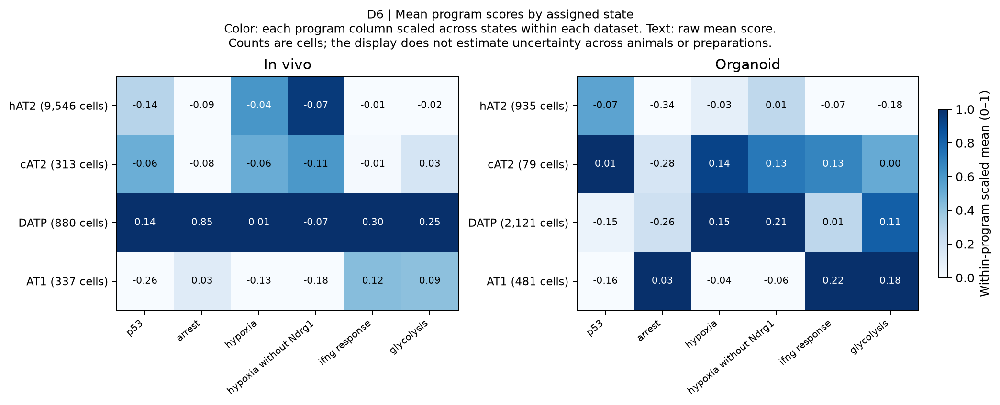

# D6 presentation correction — 2026-09-29

The original caption incorrectly said rows were scaled. The code and saved means
scale each **program column across states**, separately within each dataset.
The corrected panel labels this transformation, identifies counts as cells, adds
a color scale and removes overlapping headings. Raw means are unchanged.

This is a descriptive state-mean comparison. The stored tables cannot provide
animal/preparation uncertainty; obtaining it would require a verified biological
unit crosswalk and scores aggregated at those units. No cell-level uncertainty
was substituted. Original figures and trial records remain preserved.

Inputs: [in vivo means](../d6_scores_invivo.csv),
[organoid means](../d6_scores_organoid.csv).
Reproduce using [the presentation-only script](../../plot_d6_presentation_20260929.py).
See [the hash manifest](figure_run.json).
