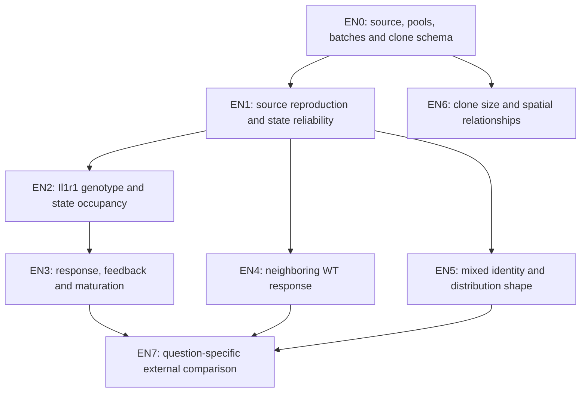

# England re-analysis and further-analysis plan

**Date:** 2026-09-27. **Status:** structured proposal; source/design intake partly complete; no new biological analysis executed. This is not a retrospective preregistration. Existing C3 outcomes and the paper were inspected. Freeze each computational contract, software environment and source hashes before its new endpoint is evaluated. [Source/design evidence](SOURCE_AUDIT.md) governs feasibility.

## Central question and discriminating predictions

**Working hypothesis:** mutant and neighboring WT AT2-derived populations can share an early regenerative expression component while differing in feedback-associated RNA, maintenance of mixed identity, and acquisition of AT1 features. These differences may be expressed in the shape and occupancy of distributions, not simply their mean. Clonal measurements provide a separate way to study growth heterogeneity and the spatial coupling of growth and differentiation.

Three distinctions organize the work:

- **Entry:** does Il1r1 loss change how many recovered cells occupy reprogrammed states?
- **State behavior:** among sufficiently represented states, do response, feedback and maturation distributions differ? A conditional within-state effect is not the total genotype effect.
- **Fate and growth:** do traced clones support different growth/differentiation patterns? These measurements cannot be joined to sequenced cells without a verified identifier.

An informative negative outcome is possible at each stage. For example, a genotype difference explained by state occupancy narrows the mechanism to entry/composition; it does not establish weaker feedback within a shared state. An AT1-like RNA shift without a mature endpoint remains a molecular phenotype. A clone mixture that predicts no better than a continuous-rate model does not support discrete founder classes uniquely.

## Execution order and ownership

Start with EN0 and EN1, then EN2 and EN3. Inspect the clone schema during EN0 so EN6 can proceed independently of RNA annotation. EN4 and EN5 follow only after state/depth reliability is known. EN7 begins with one owning research question, not an indiscriminate integration of every lung atlas. This sequencing reuses existing tables and avoids a full-atlas refit before resolving decision-changing design facts.

| Trial | Question / contrast | Main output | Decision / stopping condition |
|---|---|---|---|
| EN0 | What are the independent units and available modalities? | Pool/batch/pair map, missing-field ledger, clone-array schema, exposure record | Missing identity limits analysis to descriptive libraries; no inferred animals from r1/r2 |
| EN1 | Can the source states and principal proportions be reconstructed? | Per-library state fractions, abstentions, source-versus-repository QC comparison | Stop phenotype interpretation for unsupported states; no forced six-cluster solution |
| EN2 | Does Il1r1 deletion alter reprogramming entry and/or within-state identity? | Two separate time-specific genotype contrasts; composition and within-state estimates | Report genotype-associated distribution or uncertainty; a missing state has no within-state estimate |
| EN3 | Are response, feedback-associated RNA and AT1 maturation coupled differently? | Gene-disjoint joint distributions and per-library summaries | A robust RNA association motivates a functional test; no sustained-activity claim from snapshot RNA |
| EN4 | How does WT epithelium in oncogenic lungs differ from control WT and contemporaneous mutant cells? | Reporter/time-specific effects; epithelial ligand/recipient RNA compatibility | Separate reporter/batch confounding and unsupported pairing; no RNA-derived spatial claim |
| EN5 | Is mixed identity a reproducible distribution beyond cycling/stress and doublets? | Independent AT2/AT1 axis plots, tail occupancy, discordance diagnostics | Rare supported cells nominate a phenotype; disagreement or technical dependence leaves it unresolved |
| EN6 | What explains the clone-size tail, and do growth and differentiation have different distance associations? | Mouse-level tail/model comparison and joint spatial analysis | Stop stronger claims if mouse/clone identities or sampling support fail |
| EN7 | Which England observations transfer to repair, fibrosis or other oncogenic contexts? | One fixed, within-study contrast per eligible external source | Already used data are descriptive transfer; independent validation needs a new suitable cohort |

## EN0: complete the design contract

The current manifest records 20 GSMs, two experiments, deposited dimensions and unknown pool identities. Extend it with biological pool, number of animals when available, pooled-lung meaning, processing day, library batch, reporter-pair identity, technical split and author annotation location. Reconcile the source's 13 Experiment-1 libraries with 10 deposited Experiment-1 GSMs. Use explicit `unknown` fields when evidence is absent.

Confirm integer raw-count semantics, gene identifiers, duplicate symbols, feature/barcode joins and reporter-feature presence. Fluorescent sort labels remain metadata if reporter features are absent. Reuse existing validated readers; keep primary counts read-only. Check resource/runtime availability before expensive processing. No FASTQ rebuild is justified by this plan alone.

For clones, decode the MAT arrays in a validated MATLAB or compatible reader and construct mouse -> lobe/section -> reporter -> clone tables, plus a pair table for mutant-WT distances. Determine whether the same neighboring WT clone appears for multiple central mutant clones. Retain original estimated sizes before any rounding. An audit should independently reconstruct at least one source summary from these tables before model extensions.

**EN0 deliverable:** `metadata/analysis_unit_map.csv`, `metadata/clone_schema.json`, `reports/EN0_DESIGN.md` and an explicit run-ready/limited/blocked verdict for each trial. These paths are planned outputs, not existing results.

## EN1: bounded source reproduction

Reproduce Fig.3B-F and Fig.7C-D at the level supported by the deposit. Run experiments separately. Use a clearly labeled source-QC track from the [extracts](england_2025_extracts.json), alongside a separately specified repository-QC sensitivity. Differences from published totals and C3 are explained through a retention waterfall, not erased.

Keep AT2 identity, priming, transition, cycling, mixed identity and AT1 features as separately inspectable dimensions. Cycling can occur across biological states; the paper's cycling cluster should not become the only container of proliferating cells. Primed AT2 involves loss/redistribution of identity as well as induced genes. State labels need negative as well as positive evidence, including the DATP-versus-AT1 distinction established in the Choi work.

Use author labels as reproduction targets if available; disclose their use. For phenotype discovery, separate annotation features from tested genes, allow ambiguous calls, and report library-specific confusion/abstention. A UMAP is a display, not proof of state identity or a transition path. Do not integrate genotype effects away to obtain a visually mixed embedding. Differential expression and pseudobulks use original counts, not integrated coordinates or corrected expression.

**Primary display:** one row per library with absolute recovered-cell counts and state fractions, supplemented by QC/depth and confidence. Investigate the C3 4-day 1.16% versus 28.16% difference by technical quality, processing/batch, label stability and biological variation. Pool disagreement must remain visible in every downstream plot.

## EN2: prioritize the Il1r1 perturbation contrast

Compare Experiment-2 Il1r1 homozygous deletion against heterozygous controls separately at 2 and 12 weeks. The time interaction is secondary and cross-sectional. Do not use ordinary Red2Kras Experiment-1 cells as an exchangeable genotype control.

Estimate two distinct quantities:

1. **Composition:** library fraction of supported reprogrammed states, with a denominator of all eligible lineage-sorted epithelial cells. Show DATP-like, Cd177-mixed, AT2 and unassigned fractions separately. This measures captured-cell composition, not absolute clone expansion.
2. **Within-state expression:** library-by-state raw-count pseudobulk of independently defined identity/transition/feedback modules. If knockout libraries contain too few comparable cells, declare the conditional question unavailable rather than borrowing mutant-state cells from another condition or coding an absent state as zero expression.

Potential phenotype: persistent AT2 identity with a reduced reprogrammed tail after Il1r1 deletion. An alternative is a transient distribution shift that is no longer present at the later time. Another is a residual, technically robust rare reprogrammed population. These are predictions, not findings. Rare escape candidates require inspection of genotype/recombination uncertainty, doublets and state ambiguity; RNA alone cannot confirm genetic escape.

Conditioning on a state altered by the intervention can select different surviving populations. Present composition first, conditional expression second; do not describe their difference as causal mediation or specifically NF-kB-dependent differentiation.

## EN3: feedback-associated RNA versus maturation

Use two nested comparisons: Experiment-1 RFP versus YFP at each time (paired only if EN0 verifies shared pools), followed by the eligible Experiment-2 genotype comparisons. A repair comparator from GSE145031 is a separate descriptive transfer because its condition libraries lack within-condition replication.

Keep at least four measurements separate:

| Axis | Candidate information | Exclusion / interpretation rule |
|---|---|---|
| NF-kB downstream-response RNA | Externally sourced, versioned response/regulon set fixed before scoring | Remove feedback-panel and identity/annotation genes from the test set; quantify overlap with TNF, stress and cell cycle; response is not a direct activity assay |
| Feedback-associated expression | Nfkbia and Tonsl as individual source-reported genes; any expanded panel needs independent provenance | No unvalidated two-gene ratio or assumption that high Nfkbia means low NF-kB activity; report detection and conditional abundance separately |
| AT2 and AT1 identity | Disjoint paper/reference panels, with held-out endpoint genes | Ager alone does not define mature AT1; retain mixed-identity cells |
| Cycling and stress | Separate prespecified control panels | Test stratified/sensitivity views; do not remove cycling and then claim equal proliferation |

**Distribution-focused output:** per-library joint density/hexbin plots of response versus feedback and AT2 versus AT1 identity, with each library's medians, quantiles and cell counts. Define any quadrant/tail thresholds from independent controls or a declared discovery rule before looking at group differences. Apply fixed thresholds to other libraries; do not define a top decile separately in each group and compare the resulting fixed 10% fractions.

The candidate phenotype is an excess of response-associated, feedback-low, mixed-identity cells in a particular context. Test whether it remains visible within a supported state and on a common molecule budget. A pattern driven only by changing mixture should be named as a compositional phenotype. Short-lived feedback oscillations and unknown exposure timing remain alternative explanations even for a robust RNA pattern.

## EN4: neighboring WT cells and candidate communication

Contrast Red2Kras YFP with Confetti YFP, and compare RFP/YFP at the same time as a second contrast. At 2 weeks, the Confetti control timing is compatible; the 4-day comparison lacks a deposited time-matched Confetti arm. A single Confetti-YFP library prevents a replicated baseline-condition inference. Confetti RFP is a reporter sensitivity, not an extra mouse.

Separate WT expansion-related RNA, transition occupancy, feedback-associated RNA and AT1-like identity. Spp1 and Dlk1 are source-motivated candidates, not an open-ended ligand ranking contest. If an LR analysis is useful, freeze receptor/resource definitions and summarize compatibility by available pool/library; include receptor detection and unrelated-pathway controls. Sorted epithelial data cannot adjudicate the whole macrophage-fibroblast niche or measure ligand delivery. The source's Spp1 perturbation observations motivate candidates; repository LR scores do not reproduce those experiments.

**Spatial extension belongs to EN6:** RNA libraries carry no distances. Do not treat YFP as a measured near-neighbor label for each cell.

## EN5: mixed identity and distribution shape

Examine AT2/AT1 coexpression and Cd177-associated profiles within each library, distinguishing zero detection, positive abundance and broad tails. Use independent identity genes for labeling when Cd177/Itga2 expression is an endpoint. Inspect joint detection against a depth-matched null, cell complexity and doublet evidence. If ambient estimation is impossible with the deposited matrix, say so and use bounded sensitivities rather than claiming contamination is removed.

Ask whether heterogeneity remains within cell-cycle strata, whether a small subgroup drives a mean, and whether that subgroup recurs across libraries. Rare fractions need raw numerator/denominator and uncertainty attributable to sampling; these intervals do not establish between-pool uncertainty. Avoid Gaussian-mixture claims on sparse two-gene scores: a detection spike can manufacture two components.

A reproducible mixed-identity tail can inform A11/A8. It cannot establish two founder lineages, a reversible state-transition rate, senescence bypass or metastatic potential. An Itga2-positive state in a different Kras/Trp53 model is not automatically the same state or the same biological question.

## EN6: clonal distribution and spatial analyses

**EN6a, reproduction.** Reconstruct source clone-size CCDFs and size/pro-Sftpc summaries from the deposited measurements, preserving mouse nesting, channel-combination rules, lobe/section structure and the source's size >=2 proliferative-clone restriction. Report singlets separately. Match source measurement units; do not assume volume-derived cell estimates are integer counts. Recover censoring, clone-merger and area normalization details before comparing absolute densities.

**EN6b, further distribution analysis.** Compare a source two-component model with a simpler single-population model and a plausible continuous-heterogeneity model on the same observed support. Validate likelihood/measurement assumptions and truncation explicitly. Use held-out mice or mouse-resampled uncertainty where the actual sample size permits; compare predictive calibration in the upper tail and across times, not only in-sample cumulative-curve fit. Multiple time points are different sampled mice unless proven otherwise. Report parameter identifiability and dependence on removal of large/merged clones. If models are indistinguishable, retain growth heterogeneity while withholding a uniquely discrete F/S interpretation.

**EN6c, spatial decoupling.** Use clone pair distances and WT clone size/pro-Sftpc loss to compare distance associations jointly. Model or summarize at mouse level, account for repeated appearances of a clone, and check central clone size, tissue area/section and WT clone-size denominator effects. Pro-Sftpc-negative fraction and number answer different questions; show both with source measurement limits. Use a common support range and prespecified distance functional form or bins. A flat differentiation estimate with wide uncertainty does not show distance independence; directly estimate the difference between the relevant associations on a defined scale.

Candidate phenotype: spatially localized WT growth with a broader differentiation-associated response. That remains a proximity association, not proof of neighbor-driven elimination or tumor suppression. Neither RNA nor these snapshot clonal tables alone establishes whether WT changes promote tumor progression.

## EN7: one question-specific transfer at a time

Use Choi GSE145031 for source-faithful repair comparison; its single-library condition design is descriptive. Use the existing focused Niethamer injury cohorts only after checking time, state and animal eligibility; whole-atlas integration is not the control. Existing shared A5/A11 modules must retain their original membership/normalization or carry an explicitly named amendment. England genes cannot be selected and evaluated as an independent discovery on the same C3-exposed samples.

For A11, compare context-associated additions beyond shared transition and cycling within each study, then compare directions on supported scales. For A12/A14, treat feedback/timing as motivation until activity, withdrawal or linked outcome data are available. Mouse-to-human transfer needs a declared one-to-one orthology policy, coverage check and study-specific controls. Late time, IPF and tumor samples do not define a single progression axis. Avoid a generic injury-versus-cancer batch comparison with biology perfectly confounded with study.

## Common numerical contract and reporting

Before each run, save input hashes, source exposure, inclusion rules, exact gene lists and universes, normalization, biological unit, primary endpoint, exclusions, sensitivities and multiplicity family. Numerical choices below are proposed operational defaults, not paper-derived facts or frozen biological thresholds:

- A within-library/state summary needs at least 30 retained cells; list lower-coverage states without estimating its primary programme contrast. Assess rare-state occupancy using the whole eligible denominator, so rare states are not erased by this expression gate.
- A module needs at least 70% mapped gene coverage, with all essential features specified beforehand. Coverage is not detectability; sparse genes require detection/positive-abundance displays. Freeze a molecule budget from QC alone and report retained fractions under that budget.
- Library/state pseudobulk comes from raw counts with a fixed normalization convention; cell-level log-normalized scores serve distribution displays. Do not compare effect sizes across these scales as if identical.
- Verify pool independence before biological uncertainty. With this design, library estimates and sensitivity ranges remain primary; neither larger cell numbers nor simulated subsampling fixes small or unidentified pool replication. Bootstrap cells estimates sampling noise only. Formal external tests require an independently justified unit count, model and correction for prespecified endpoint families.
- Use common-depth controls for both variables in an association, plus cell-cycle/stress, annotation and per-library omission sensitivities that could change the interpretation. State changes caused by genotype are outcomes; adjustment for them changes the question.
- A nonsignificant result is unresolved without an appropriate equivalence margin and adequate precision. Do not tune gates, genes, labels or scales after inspecting outcomes to rescue a positive result.

## Figure and artifact contract

| Figure | Main message to inspect | Required companion table |
|---|---|---|
| EN-F01 | Experiment/pool/time design and retained-cell coverage | Library/pool map and exclusions |
| EN-F02 | Per-library state occupancy and genotype contrasts | Absolute counts, denominators and abstentions |
| EN-F03 | Response-feedback and AT2-AT1 distributions | Per-library quantiles, detection and fixed-tail occupancy |
| EN-F04 | WT versus mutant contextual response | Reporter/time-specific contrasts and pairing status |
| EN-F05 | Clone-size tails and predictive model comparison | Mouse-level fit/calibration and truncation sensitivity |
| EN-F06 | Growth and differentiation versus distance | Clone-pair identity, mouse-specific effects and uncertainty |

Every figure is **planned**, not a gallery result. Use the shared palette, readable library/mouse labels, denominators, and captions distinguishing molecular proxies from outcomes. Save paper outputs under `trials/ENxx/` with parameters, compact tables, run record and report. Large objects remain ignored. A promoted cross-question analysis belongs in its existing `RQ_Specified` folder and links back here, without relocating C3 or duplicating raw data.

**First checkpoint:** finish EN0, state exactly which contrasts are eligible, and freeze EN1/EN2. **Second checkpoint:** review state reliability and genotype/composition effects before selecting a feedback or rare-tail claim. **Third checkpoint:** compare RNA observations and clonal evidence without joining unlinked units. The end product is a ranked set of supported phenotypes and discriminating next measurements, including failures and uncertainty, rather than a catalogue of significant marker genes.
