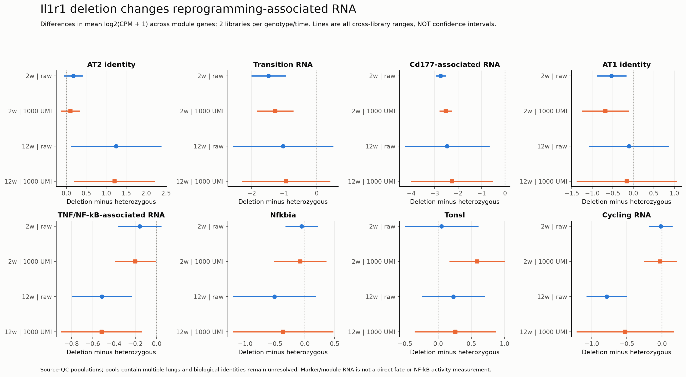

# England 2025: first re-analysis results

**Completed 28 September 2026 (Asia/Seoul); run timestamps are UTC.** The owner requested actual analysis after the study plan. The [frozen contract](BATCH1_CONTRACT.md) was recorded at `c82b0e05c47106ac745f2f90a59414f381480988` before the new outcomes were evaluated. These are descriptive, source-exposed re-analysis results. Existing claim grades are unchanged.

**Main finding:** the Il1r1 genotype contrast separates reprogramming-associated RNA from an AT1-maturation interpretation. Clone sizes also show a strong redistribution of cells into a small upper tail, but that distribution does not uniquely support two immutable founder populations. Feedback-associated RNA and spatial measurements retain substantial interpretation limits.

## What actually ran

| Input / analysis | Completed scope |
|---|---|
| GSE247505 | All 20 libraries; 59,581 deposited barcodes; 44,196 cells pass source-style QC: 32,698 in Experiment 1 and 11,498 in Experiment 2 |
| Expression | Whole-library and eligible marker-supported-group raw-count pseudobulks; eight prespecified panels plus individual genes; overlapping proxy occupancies |
| Sensitivities | Exact 1,000-UMI sampling with two seeds; automatic Scrublet removal; removal of prespecified non-epithelial flags |
| Clonal data | 164,453 clone measurements across 44 source-indexed mice; size/pro-Sftpc summaries and CCDFs |
| Model comparison | 246 held-out-mouse predictions: three models, 12 condition/reporter groups, full and within-mouse upper-1% trimming |
| Spatial | Source-bin pooled profiles at 50-micrometre spacing; inferential mouse/clone-pair analysis failed its identity gate |
| Verification | 6,489 numerical/provenance checks; direct rereads of four source matrices; every held-out likelihood independently recomputed |

This is not an exact Seurat reproduction or recovery of the paper's six cell-state labels. The [implementation amendment](BATCH1_CONTRACT.md) declared that limitation before analysis. The proxy groups require at least two detected genes, can overlap, and are not interchangeable with the paper's DATP-like or Cd177-mixed clusters.

## 1. Reprogramming-associated RNA decreases without a demonstrated maturation rescue

Experiment 2 compares Il1r1 homozygous deletion with heterozygous mutant controls at each time. Values below are differences in the library mean of gene-level log2(CPM + 1), averaged over each prespecified panel. A panel difference is not a fold change in total RNA or a cell fraction. There are two libraries per genotype/time; independent pool identities remain unverified.

| Endpoint | 2-week raw difference | 12-week raw difference | Reading |
|---|---:|---:|---|
| Cd177-associated RNA | -2.740 | -2.468 | Lower under deletion in every cross-library comparison; direction survives both depth seeds and both removal sensitivities |
| Transition RNA | -1.474 | -1.033 | Clear descriptive separation at 2 weeks; 12-week cross-library range spans zero |
| AT2 identity | +0.172 | +1.248 | Early libraries overlap; later deletion libraries retain higher identity-panel expression |
| AT1 identity | -0.528 | -0.106 | No positive maturation shift; later library comparisons overlap |
| TNF/NF-kB-associated RNA | -0.159 | -0.515 | Early separation depends on library/technical draw; late lower expression is directionally consistent across sensitivities |
| Nfkbia | -0.053 | -0.510 | Cross-library ranges span zero; no consistent increase in this feedback-associated transcript |
| Tonsl | +0.052 | +0.231 | Sparse/depth-sensitive; no robust two-time feedback pattern |

At a fixed molecule budget, Cd177-associated differences are -2.526 and -2.260 for the first seed, and -2.565 and -2.616 for the second. The 12-week TNF/NF-kB-associated differences are -0.518 and -0.474. Removing non-epithelial flags retains the 12-week AT2 (+1.116), Cd177-associated (-2.675), and response-panel (-0.480) directions. These checks address specified alternatives; they do not establish pool independence or a pure epithelial compartment.

**Biological interpretation:** preventing Il1r1-dependent state entry and restoring maturation after entry are different hypotheses. These recovered-cell RNA distributions are compatible with reduced entry/reprogramming and retention of AT2 features. They do not reproduce a post-entry NF-kB inhibition experiment or show functional repair. State occupancy, survival and selection of recovered cells remain alternatives to a within-cell regulatory change.

[All library contrasts and cross-library ranges](trials/batch1/rna/library_contrasts.csv). The ranges are sensitivity descriptions, **not confidence intervals**.

## 2. Library heterogeneity matters, and feedback is not a one-score phenotype

Nfkbia and Tonsl do not supply a uniform genotype-wide feedback switch. The TNF/NF-kB panel is deliberately gene-disjoint from the feedback and identity panels and is still a transcriptional association, not a direct NF-kB activity measurement or an IL-1-specific signature. Of 163 retained response genes, 160 are mapped; the P53 control maps 194/200. Other panels have complete gene coverage.

At 12 weeks, the two heterozygous libraries have AT2-supported proxy fractions of 53.7% versus 6.3% at 1,000 UMIs. The latter library, GSM7890846, also carries 446/1,528 non-epithelial flags (29.2%). These are not author-validated contaminant assignments. The disparity makes a pooled mean insufficient to describe the sample population. The removal sensitivity is informative but cannot replace annotation recovery.

The independent AT2/AT1 co-detection proxy also occurs in control libraries (about 2-3% at the chosen budget). It cannot be labeled an oncogenesis-exclusive mixed state. Cd177 RNA, multi-gene identity co-detection and the paper's experimentally characterized mixed state are different measurements. Most thinned transition-supported groups are too small for a complete within-group comparison; absent or low-coverage groups are not coded as zero expression.

The visual horizontal bands arise in part from discrete molecule detection in a short AT1 panel. They are not evidence of distinct biological modes. A zero expression value is not evidence that the pathway is inactive.

[Proxy counts and denominators](trials/batch1/rna/phenotype_occupancy.csv), [library QC](trials/batch1/rna/QC_by_library.csv), and [expression/detection summaries](trials/batch1/rna/library_expression.csv) allow every plotted comparison to be inspected. Automatic Scrublet called few doublets and sometimes none; that does not validate the mixed-identity candidates as singlets.

## 3. Mutant-versus-WT context does not isolate feedback or mature fate

In Experiment 1 at 2 weeks, mutant RFP libraries exceed contemporaneous WT YFP libraries in Cd177-associated RNA (+3.862), the response panel (+0.252), and AT1-panel RNA (+0.794), on the first fixed-depth draw. The latter is a useful example of why AT1-marker RNA cannot by itself certify mature AT1 differentiation: this is the mutant context in which the paper describes mixed identity and differentiation bypass.

Nfkbia (+0.447) and Tonsl (-0.065) cross-library ranges include both signs. Thus the whole-library readout does not reproduce a clean inhibitory-feedback distinction. This does not refute the paper's state-specific or perturbational evidence. It instead prioritizes verified state annotation and independent mature endpoints before interpreting a generic RNA score as a feedback mechanism. The RFP/YFP comparisons remain unpaired library contrasts; same-r suffixes were not converted into mouse identities.

No ligand-receptor causal inference, Spp1 delivery analysis, or matched immune/fibroblast model was run. Ligand transcripts in the saved table remain candidate expression measurements.

## 4. Mutant growth is concentrated in a small clone-size tail

The fraction of measured clonal cells accounted for by the largest 10% of clones is calculated separately in each mouse, including singlets in this descriptive statistic. Group entries below are means of the mouse-specific fractions.

| Time | Mutant RFP | WT YFP in oncogenic tissue |
|---|---:|---:|
| 4 days | 23.3% | 19.5% |
| 1 week | 42.9% | 32.4% |
| 2 weeks | 91.1% | 33.0% |
| 4 weeks | 97.9% | 38.5% |

The 2-week mutant mouse range is 88.1-94.5%, and the 4-week range is 97.5-98.2%. This is a concentration statistic on deposited imaging-derived clone estimates, not proof that the upper decile is a distinct founder lineage. Large mutant regions and clone merging are especially relevant by 4 weeks, as acknowledged in the paper. Changes in the observed tail can therefore combine growth and segmentation/merger effects. Distinct harvest cohorts are not longitudinal measurements of the same mice.

**What this adds:** the mean clone size alone conceals that most of the observed cell mass is carried by relatively few measured clones/regions. This motivates scrutinizing the upper tail, merger handling and founder-class identifiability before mapping a transcriptomic subpopulation onto fast clonal growth.

[Mouse-level summaries](trials/batch1/clones/clone_summary_by_mouse.csv), [conditional CCDFs](trials/batch1/clones/clone_CCDF_by_mouse.csv), and [source-indexed mouse schema](trials/batch1/clones/mouse_schema.csv).

## 5. A two-component distribution is not uniquely favored in late mutant clones

Three statistical distributions were fitted on the same support, n >= 2, using x = n - 2: a single shifted geometric, a two-geometric mixture, and a shifted negative binomial. Fits give each training mouse equal weight; scores are average negative log likelihood (NLL) in each held-out mouse. These are distributional competitors, **not a rerun of the source's stochastic two-compartment simulation**. All recorded optimization fits converged.

| Mutant condition | Single geometric NLL | Two-component NLL | Negative-binomial NLL | Descriptive comparison |
|---|---:|---:|---:|---|
| 1 week | 2.8231 | 2.4806 | 2.5170 | Mixture predicts better on average |
| 2 weeks | 5.4142 | 4.0425 | 4.0015 | Negative binomial predicts better on average; 3/4 held-out mice |
| 4 weeks | 6.4348 | 4.1260 | 4.0361 | Negative binomial predicts better on average; 3/3 held-out mice |

The average late-mutant ranking remains after removing each mouse's upper 1% tail, although individual mouse rankings can differ. The mixture has lower average NLL in all six evaluated later homeostatic cohorts and all three WT-in-oncogenic-tissue cohorts. Gains are small in some controls. These data support growth heterogeneity; they do not uniquely identify two stable cell types or establish their interconversion behavior. The alternative also does not prove a continuous biological hierarchy.

[All held-out comparisons and parameters](trials/batch1/clones/model_LOMO_by_mouse.csv), [condition summaries](trials/batch1/clones/model_LOMO_summary.csv). The plotted tail fraction uses all valid clones; the distributional fits condition on size >=2. Their denominators intentionally differ.

## 6. Spatial profiles can be reproduced, but the decisive test remains blocked

The deposited pooled profiles show larger WT clones close to mutant regions. The pro-Sftpc-negative profiles have different shapes and are particularly unstable in distant bins with few pair rows. The figure marks bins with fewer than ten pair rows as hollow points; this is a display-support annotation, not a statistical eligibility revision.

The distance arrays lack mouse IDs and unique neighboring-clone identities. A neighbor may appear repeatedly in the pair list. Therefore the analysis cannot estimate a mouse-level distance effect, compare growth and differentiation slopes inferentially, or establish distance independence from a nonsignificant test. The raw spatial profiles are compatible with the paper's contextual question but do not resolve causality or tumor-promoting versus tumor-suppressing WT behavior.

[Bin counts and profiles](trials/batch1/clones/spatial_pooled_bin_profiles.csv), [failed identity gate](trials/batch1/clones/spatial_identity_gate.csv).

## Stage status and next decision

| Trial | Current status | Remaining scientific requirement |
|---|---|---|
| EN0 | Intake and clone nesting decoded; descriptive route complete | Pool independence/pairing, 13-versus-10 Experiment-1 accounting and spatial IDs remain unresolved |
| EN1 | Source-style QC and prospective proxy amendment executed | Author/barcode labels and batch accounting for exact six-state source reproduction |
| EN2 | Whole-library genotype and eligible proxy contrasts executed | Validated states and independent pools for stronger biological inference |
| EN3 | Separate feedback/response/identity measurements and distributions executed | Activity/history and linked fate evidence; no feedback mechanism established |
| EN4 | Mutant-WT RNA contrasts executed | Verified pairing; ligand delivery and niche-recipient evidence not supplied by this run |
| EN5 | Multi-gene detection, identity proxies, depth and doublet sensitivities executed | Orthogonal state/doublet validation; no rare escape or reversible-state identity established |
| EN6 | Clone summaries, held-out distribution models and pooled spatial profiles executed | Original simulation reproduction, merger adjudication and identified spatial pairs for stronger tests |
| EN7 | Not run as external validation | Freeze one compatible question-specific transport contract; old Choi/England data are already exposed and do not become independent confirmation |

The first execution batch is complete. The broader plan is deliberately not labeled fully completed. The highest-value continuation is annotation/library-map recovery and inspection of the late-mutant clone tail's merger handling. These can change interpretation of the observed signals. An external A11 comparison should follow with an independently fixed population and measurement, rather than treating proxy co-detection or CD177 as cancer specificity. No author contact or wet experiment was performed.

## Verification and reproducibility

[Verification record](trials/batch1/verification.json): 6,489 checks passed; maximum arithmetic discrepancy 3.11e-14. The verifier independently reread four genotype source matrices, reconstructed raw pseudobulks and proxy counts, checked all contrast ranges, and used scipy.stats to recompute all 246 held-out likelihoods. It checks the saved optimization outputs, not independent optimization/global optimality. The first verifier attempt incorrectly averaged absent genes as zeros; it was corrected to the frozen mapped-gene denominator. Analysis results were not changed to pass that check.

The per-cell distribution renderer likewise uses the mapped-gene denominator: its original cache of declared-list cell means is rescaled by declared/mapped membership, recorded in [render provenance](trials/batch1/figures/render_record.json). All four final figures were visually reviewed. No molecular interpretation is inferred from the color scale.

[RNA run record](trials/batch1/rna/run_record.json), [clone run record](trials/batch1/clones/run_record.json), [RNA implementation](scripts/run_rna_batch1.py), [clone implementation](scripts/run_clone_batch1.py), [verification](scripts/verify_batch1.py), and [plotting](scripts/plot_batch1.py) preserve input hashes, contracts, versions and output hashes. Raw matrices stay in the original ignored cache; large per-cell and clone tables are regenerable under this worktree's ignored `processed/batch1/`.

Run each analysis script with an explicit `--data-root` pointing to the checkout holding `raw_data/` and the existing scientific packages. The clone and verification scripts also take `--archive` for Zenodo v1.1 (SHA-256 in the source manifest). Use the bundled AMD64 Python 3.12 interpreter recorded in this session; the old virtual-environment launcher itself is stale. Scripts refuse to overwrite completed analysis runs. Plotting and verification operate on the completed outputs. Scientific gates remain as recorded even though numerical verification passed.
