# England 2025: complete figure gallery

[Study overview](README.md) · [Claims and evidence](EVIDENCE_REVIEW.md) ·
[A16 current results](../../RQ_Specified/A16_cd177_state_attribution/README.md)

All **15 generated figures** are retained: four first-batch figures, six
continuation figures and five follow-up figures. The first-batch IDs deliberately
skip EN_F01/EN_F04. A16 Stage 1 has tables but adds no figure to this gallery.

Read by biological question below. Each caption identifies the analysis stage,
unit, measurement and inference limit. The 29 September figure audit updates
EN_F02, EN_C02/04/06 and FU_F02-F05 from the tracked tables, with separate SMD and
rank-biserial scales in FU_F02 and corrected attribution language throughout.
Scientific tables and frozen analysis records are unchanged; render records identify
which assets were regenerated. EN_F03 and FU_F01 still require unavailable processed
cell-level inputs to reproduce their existing displays.

| Question | Figures | Current claim reading |
|---|---|---|
| [State and maturation](#state-and-maturation) | EN_C01, EN_C02, FU_F01, FU_F04 | [Evidence](EVIDENCE_REVIEW.md#state-and-maturation) |
| [CD177 attribution](#cd177-attribution) | EN_C03, FU_F02, FU_F03 | [Evidence](EVIDENCE_REVIEW.md#cd177-attribution) |
| [Il1r1 and genotype context](#il1r1-and-nf-kb) | EN_F02, EN_F03, EN_C04 | [Evidence](EVIDENCE_REVIEW.md#il1r1-and-nf-kb) |
| [Clone growth and model implementation](#clone-growth) | EN_F05, EN_C05 | [Evidence](EVIDENCE_REVIEW.md#clone-growth) |
| [WT neighbours and distance](#wild-type-neighbours) | EN_F06, FU_F05 | [Evidence](EVIDENCE_REVIEW.md#wild-type-neighbours) |
| [Repair-state comparison](#repair-transfer) | EN_C06 | [Evidence](EVIDENCE_REVIEW.md#repair-transfer) |

## State and maturation

### EN_C01: State occupancy under exclusive RNA gates

**Stage:** Continuation. **Unit:** Library; cells are nested within pooled captures.

**What it shows:** The proportions assigned to the frozen state gates across contexts.

**Current limit:** Gate-defined occupancy is not the paper's exact author annotation, cell fate or a biological replicate count.

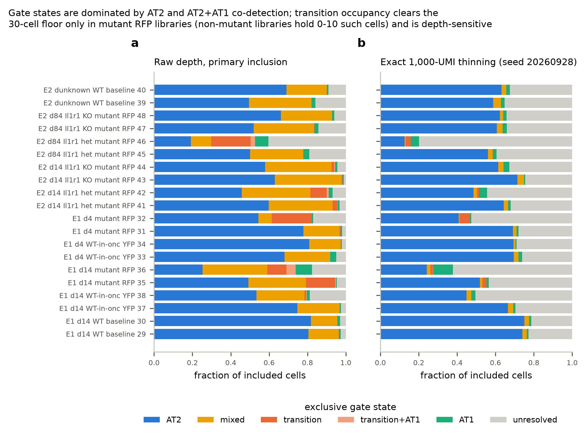

[Composition](trials/continuation/EN2_5/EN2_composition.csv) · [Plotting script](scripts/plot_continuation.py) · [Render record](trials/continuation/figures/render_record.json)

### EN_C02: RNA gates versus unsupervised clusters

**Stage:** Continuation. **Unit:** Library/experiment-defined clusters; pooled biological identities unresolved.

**What it shows:** The transition gate is concentrated in a few clusters. AT1-gated cells occur in 8/8 top-AT2 clusters in Experiment 1 and 5/7 in Experiment 2. The earlier PR118 assertion of AT1 detection wherever AT2 is detected was false: four Experiment-2 clusters have positive AT2 and zero AT1 gate fractions.

**Current limit:** This motivates classifier sensitivity analysis. It does not establish mature AT1 cells inside every gate-positive cluster.

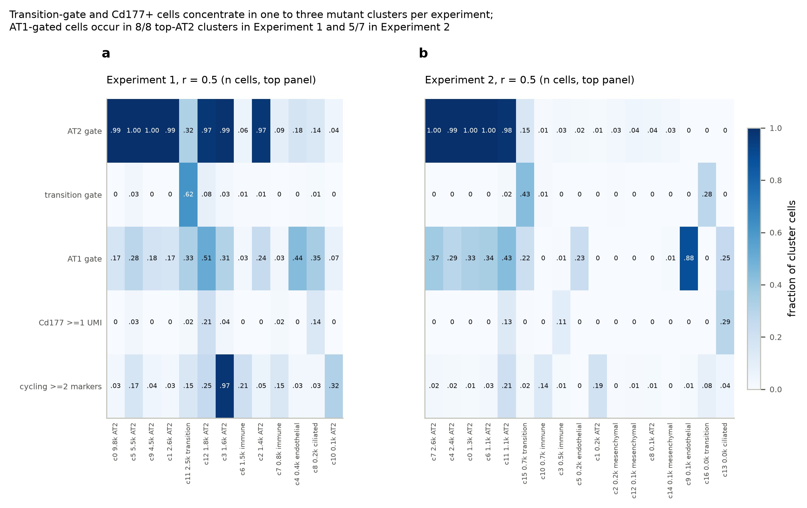

[Cluster/gate table](trials/continuation/EN1/cluster_gate_crosstab.csv) · [Plotting script](scripts/plot_continuation.py) · [Render record](trials/continuation/figures/render_record.json)

### FU_F01: Round-2 RNA embedding

**Stage:** Follow-up. **Unit:** Cells displayed within experiment; not independent animals.

**What it shows:** Neighbourhoods, state-marker overlays and the structure used in follow-up comparisons.

**Current limit:** A reconstructed embedding is not an exact recovery of author states, a transition trajectory or independent validation.

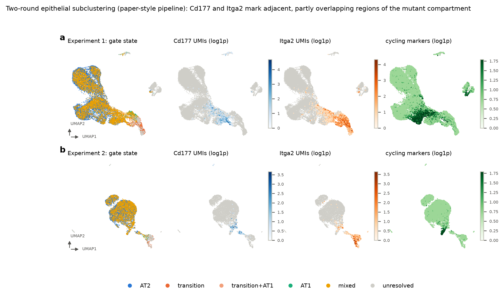

[Round-2 clusters](trials/followup/FU_E_round2_clusters.csv) · [Plotting script](scripts/plot_followup.py) · [Render record](trials/followup/figures/render_record.json) · [Analysis run](trials/followup/run_record.json)

### FU_F04: Gate calibration, cycling contrasts and library quality

**Stage:** Follow-up. **Unit:** Reference cells for calibration; libraries for cycling and quality comparisons.

**What it shows:** Panel a compares RNA gate definitions; b shows cycling-score contrasts; c fits response spread using library quality.

**Current limit:** Cycling-score contrasts are not an equivalence test. The reported 0.99/0.99 calibration uses the same reference cells for threshold selection and evaluation. Quality associations do not quantify a causal technical share.

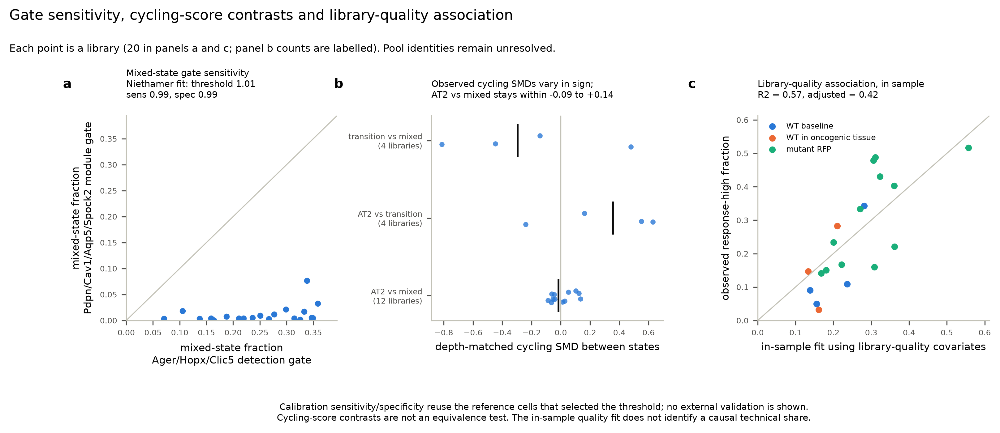

[Calibration](trials/followup/FU_B_at1_gate_calibration.csv) · [Cycling contrasts](trials/followup/FU_T4_cycling_equipotency.csv) · [Quality-model summary](trials/followup/FU_D_model_summary.csv) · [Plotting script](scripts/plot_followup.py) · [Render record](trials/followup/figures/render_record.json) · [Analysis run](trials/followup/run_record.json)

## CD177 attribution

### EN_C03: CD177-positive versus negative transitional cells

**Stage:** Continuation. **Unit:** Two eligible libraries; not two identified mice.

**What it shows:** Priming and identity RNA are higher in the original marginal contrasts; cycling differs between libraries.

**Current limit:** These are marker-associated RNA differences. Depth/composition attribution and stable functional priming require the later checks and independent evidence.

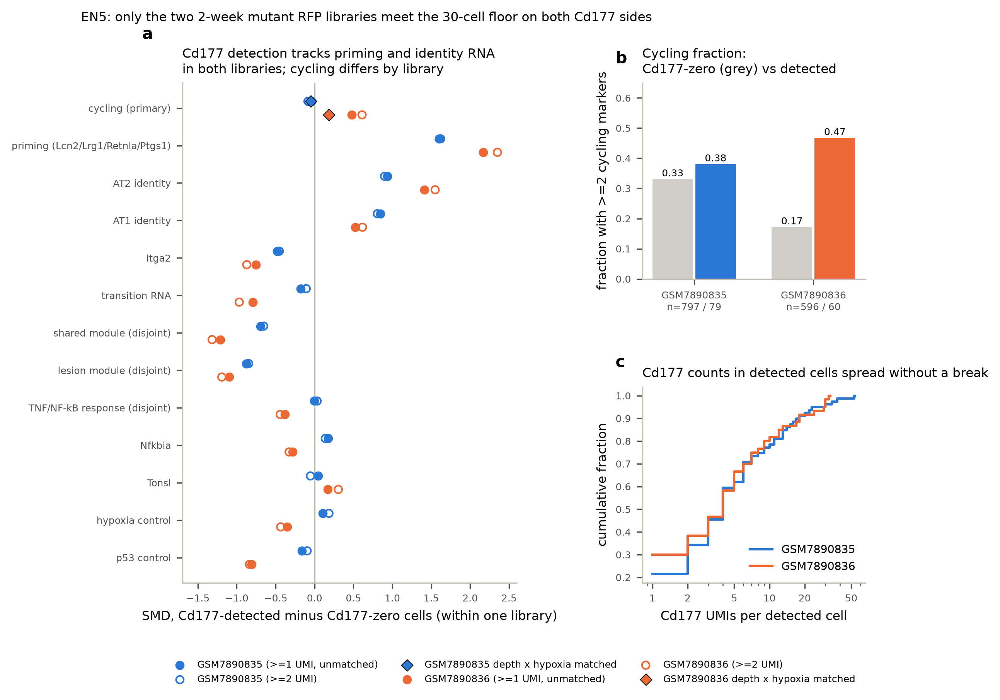

[CD177 contrasts](trials/continuation/EN2_5/EN5_cd177_contrasts.csv) · [Matched contrasts](trials/continuation/EN2_5/EN5_cd177_matched.csv) · [Plotting script](scripts/plot_continuation.py) · [Render record](trials/continuation/figures/render_record.json)

### FU_F02: CD177 depth-control sensitivity

**Stage:** Follow-up. **Unit:** Within-library cell comparisons; biological pool identities unresolved.

**What it shows:** Original and adjusted SMDs in the upper row and rank-biserial correlations on their own bounded scale in the lower row. The rank statistic is neither an SMD nor an adjustment for sequencing depth.

**Current limit:** The frozen FU_A verdict is inconclusive: one 3,000-UMI arm retains only 26 positives, below 30. Preserved directions and ratios of standardized effects do not exclude depth artefacts or measure a percentage of biological signal retained.

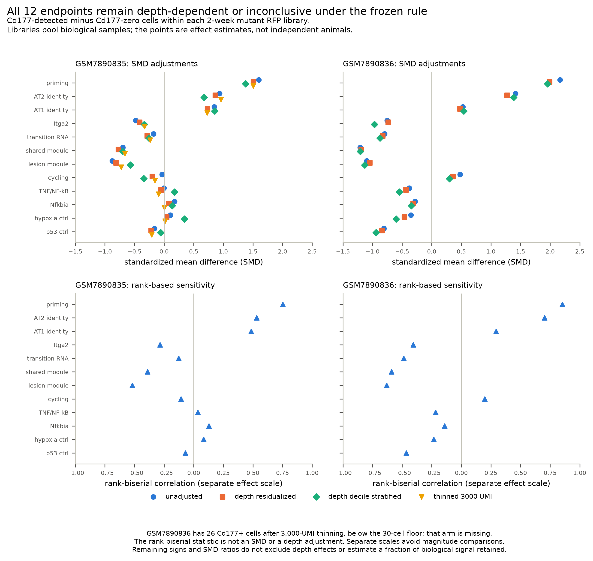

[Depth-control table](trials/followup/FU_A_depth_control.csv) · [Frozen verdicts](trials/followup/FU_A_verdicts.csv) · [Plotting script](scripts/plot_followup.py) · [Render record](trials/followup/figures/render_record.json) · [Analysis run](trials/followup/run_record.json)

### FU_F03: Graph connectivity, projected density and subcluster contrasts

**Stage:** Follow-up. **Unit:** Experiment-pooled cells/subclusters; no animal-level inference.

**What it shows:** Undirected connectivity, projected cell positions and the original FU_C contrasts.

**Current limit:** FU_C changes both the population and library pooling. Off-axis cells can fill middle projection bins; graph connectivity and the heatmap do not establish transitions or a predominantly positional phenotype. Use the same-population audit and A16 review.

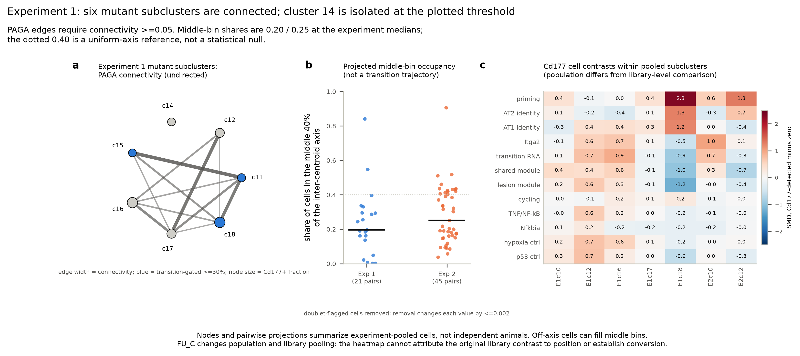

[PAGA connectivity](trials/followup/FU_T1_paga_connectivity.csv) · [Projected density](trials/followup/FU_T2_intermediate_density.csv) · [Original subcluster contrasts](trials/followup/FU_C_within_subcluster_cd177.csv) · [Plotting script](scripts/plot_followup.py) · [Render record](trials/followup/figures/render_record.json) · [Analysis run](trials/followup/run_record.json)

## Il1r1 and genotype context

### EN_F02: Il1r1 genotype-associated RNA contrasts

**Stage:** Batch 1 RNA. **Unit:** Sequencing library; unresolved biological pools.

**What it shows:** Mean expression contrasts with the range of all cross-library differences, not confidence intervals. Cd177-associated RNA is lower in deletion libraries in all four time/depth contrasts; 17 of the 32 displayed endpoint contrasts have ranges spanning zero.

**Current limit:** Il1r1-associated state entry is a different comparison from post-entry NF-kB inhibition. RNA scores are not a measured pathway-activity or functional repair endpoint.

[Library contrasts](trials/batch1/rna/library_contrasts.csv) · [Occupancy](trials/batch1/rna/phenotype_occupancy.csv) · [Plotting script](scripts/plot_batch1.py) · [Render record](trials/batch1/figures/render_record.json) · [Analysis run](trials/batch1/rna/run_record.json)

### EN_F03: Per-library RNA distributions

**Stage:** Batch 1 RNA. **Unit:** Library; distributions contain nested cells.

**What it shows:** Within-library score distributions and variation between libraries in the same condition.

**Current limit:** Distributional spread does not identify its technical or biological cause; ranges are not animal-level confidence intervals.

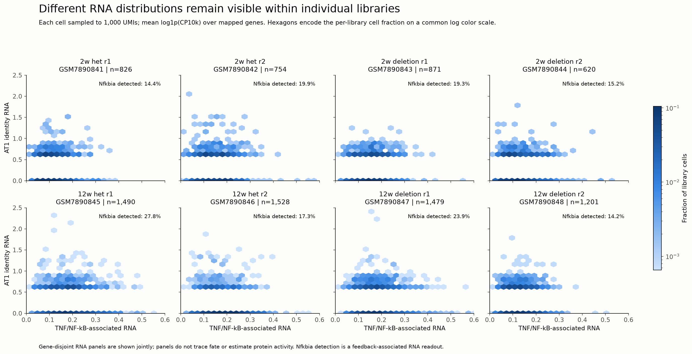

[Library expression](trials/batch1/rna/library_expression.csv) · [Plotting script](scripts/plot_batch1.py) · [Render record](trials/batch1/figures/render_record.json) · [Analysis run](trials/batch1/rna/run_record.json)

### EN_C04: Genotype and reporter-context contrasts

**Stage:** Continuation. **Unit:** Library/context; reporter pairing and pools unresolved.

**What it shows:** Genotype-associated differences under the continuation's phenotype definitions.

**Current limit:** Condition contrasts do not separate altered entry, survival and recovery of cells. They do not reproduce the source's post-entry inhibition arm.

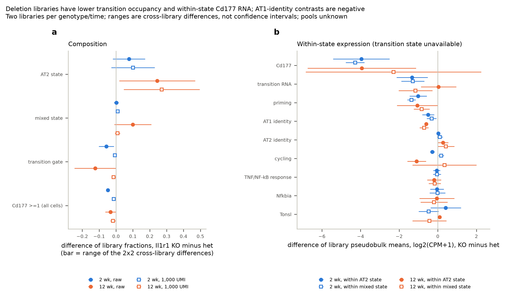

[Composition contrasts](trials/continuation/EN2_5/EN2_composition_contrasts.csv) · [Plotting script](scripts/plot_continuation.py) · [Render record](trials/continuation/figures/render_record.json)

## Clone growth and model implementation

### EN_F05: Clone distributions and held-out model comparisons

**Stage:** Batch 1 clones. **Unit:** Source-indexed mice; clones nested within mouse/lobe.

**What it shows:** Deposited clone-size distributions and leave-one-mouse-out comparisons of statistical model families.

**Current limit:** Mouse identities are available here. Predictive fit does not identify immutable founders, and this comparison is not the deferred corrected stochastic refit.

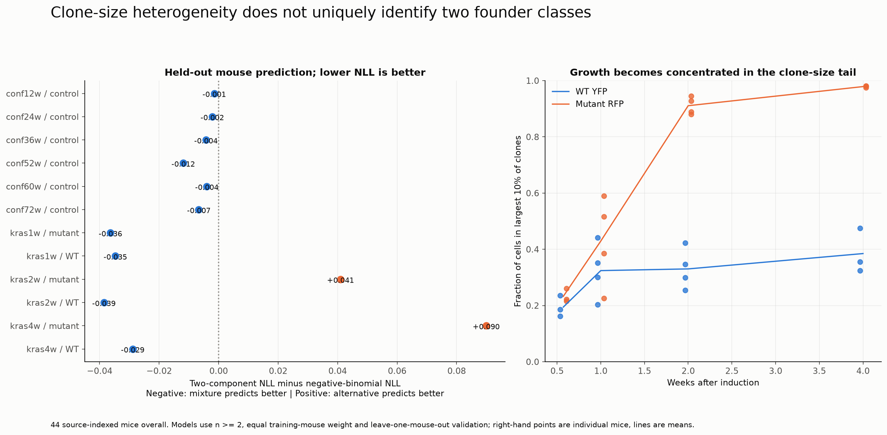

[CCDF by mouse](trials/batch1/clones/clone_CCDF_by_mouse.csv) · [Held-out fits](trials/batch1/clones/model_LOMO_by_mouse.csv) · [Plotting script](scripts/plot_batch1.py) · [Render record](trials/batch1/figures/render_record.json) · [Analysis run](trials/batch1/clones/run_record.json)

### EN_C05: Deposited and corrected simulator implementations

**Stage:** Continuation. **Unit:** Simulated clones and Monte Carlo replicates; not biological replication.

**What it shows:** The literal, branch-corrected and Gillespie reference distributions differ in the audited q=0.7 setting.

**Current limit:** This confirms a code-path sensitivity. It does not identify which code generated the published curves or refute the paper's analytical fits and lineage evidence.

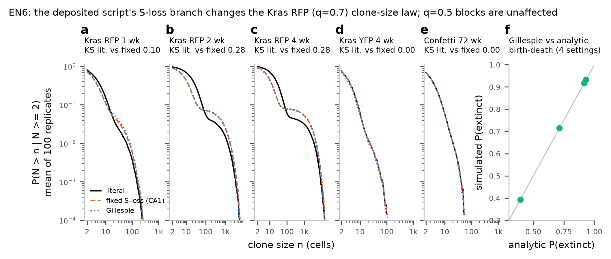

[Simulation CCDFs](trials/continuation/EN6/simulation_ccdf.csv) · [Analytical check](trials/continuation/EN6/analytic_birth_death_check.csv) · [Implementation differences](trials/continuation/EN6/implementation_differences.csv) · [Plotting script](scripts/plot_continuation.py) · [Render record](trials/continuation/figures/render_record.json)

## WT neighbours and distance

### EN_F06: Pooled spatial profiles

**Stage:** Batch 1 clones. **Unit:** Pooled pair rows; mouse/clone IDs missing and neighbours may recur.

**What it shows:** Clone-size and pro-Sftpc-loss summaries by distance, including sparse distal bins.

**Current limit:** These are descriptive spatial measurements. Nonspatial mouse identifiers cannot be assigned to the exported pair rows.

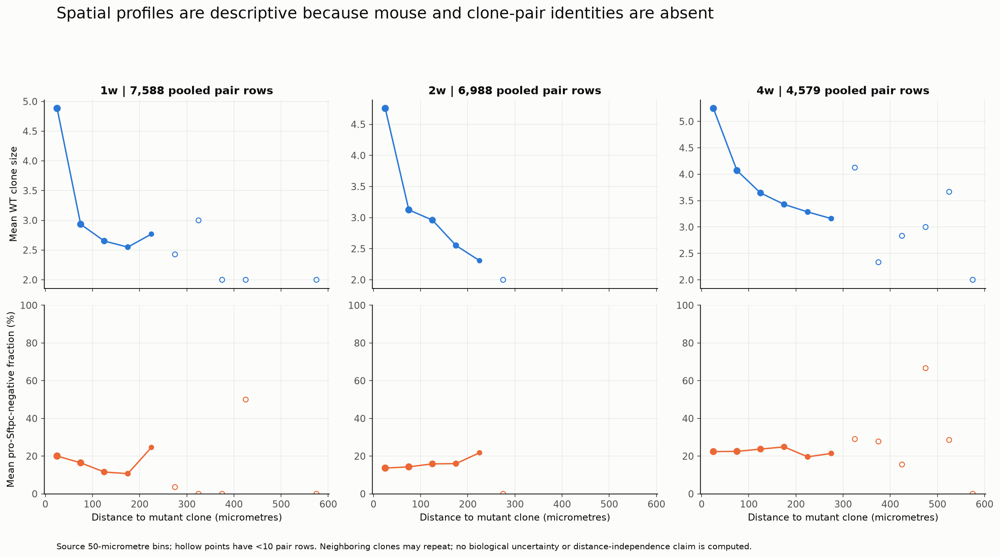

[Spatial bin profiles](trials/batch1/clones/spatial_pooled_bin_profiles.csv) · [Plotting script](scripts/plot_batch1.py) · [Render record](trials/batch1/figures/render_record.json) · [Analysis run](trials/batch1/clones/run_record.json)

### FU_F05: WT growth and identity-loss distance patterns

**Stage:** Spatial follow-up. **Unit:** The same pooled pair arrays; not an independent cohort.

**What it shows:** Pooled clone-size and pro-Sftpc-loss profiles; the frozen relative slope is negative for size in 12/13 datasets, while the identity-loss proxy has 8 positive and 5 negative slopes.

**Current limit:** Different slope signs do not establish distance-independent differentiation. A noisy slope does not establish independence, separate mediators or a tumour-promoting/protective WT effect.

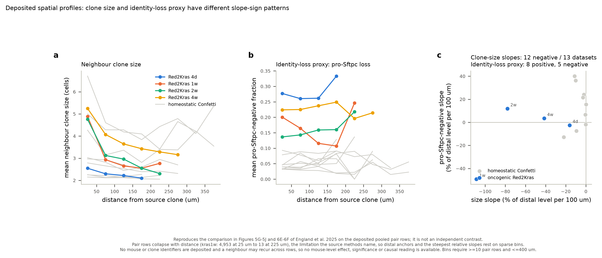

[Distance slopes](trials/followup/FU_W_distance_slopes.csv) · [Spatial profiles](trials/batch1/clones/spatial_pooled_bin_profiles.csv) · [Plotting script](scripts/run_spatial_decoupling.py) · [Render-only record](trials/followup/figures/FU_F05_render_record.json) · [Frozen analysis record](trials/followup/FU_W_run_record.json)

## Repair-state comparison

### EN_C06: RNA programmes in external repair data

**Stage:** Continuation. **Unit:** Recorded study samples/animals; use each source's coverage.

**What it shows:** Repair-state and time-point distributions of the fixed RNA panels in Choi and Niethamer.

**Current limit:** The CD177 contrast lacks eligible coverage and remains unassessed. Snapshot changes do not trace the same cells, establish reversal, or rule out CD177 in repair.

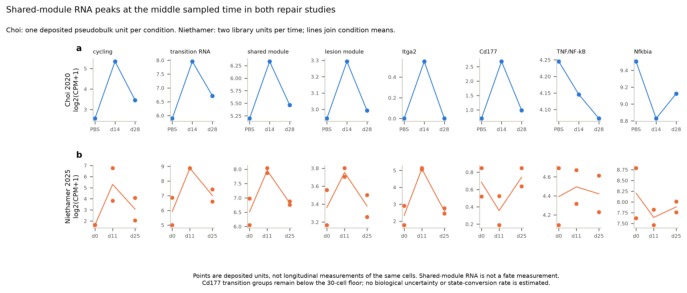

[Pseudobulk](trials/continuation/EN7/EN7_pseudobulk.csv) · [Composition](trials/continuation/EN7/EN7_composition.csv) · [Author-state cross-tab](trials/continuation/EN7/EN7_author_state_crosstab.csv) · [Plotting script](scripts/plot_continuation.py) · [Render record](trials/continuation/figures/render_record.json)
