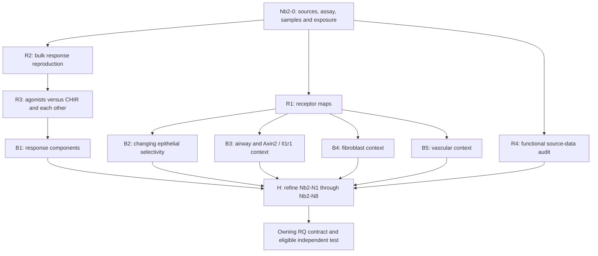

# Three-track Nabhan 2023 analysis pipeline

**29 September 2026. Original pre-execution plan, retained as design history.**
The accessible first pass is now executed; see [results](RESULTS.md),
[execution guide](EXECUTION.md) and [current ledger](metadata/stage_status.tsv). This plan answers the owner's three requests: reproduce the paper's
accessible claims, surface informative biology, and derive hypotheses from its
unresolved statements. The main [README workflow](../../README.md#how-it-works)
governs promotion from a paper observation to a question-specific test.

## Order and deliverables



Use `Nb2-` as the paper namespace; it differs from Niethamer N1, Nabhan 2018 Nb1,
Yu N1 and the reading-position N1 in this folder's name.

| Stage | Decision to resolve | Planned output | Gate at initial planning |
|---|---|---|---|
| Nb2-0 | Which assays, units and contrasts really exist? | Sample map, source hashes, discrepancy ledger | SOFT and PDF inspected; preparation identities, count schema and atlas releases unresolved |
| Nb2-R1 | Is receptor selectivity reproduced within biological units? | Source-style dot plots, per-unit receptor profiles, study-stratified estimates | Original atlas releases/annotations required |
| Nb2-R2 | Are Figure 4 transcriptional directions reproducible? | Bulk gene effects, exact-panel displays, threshold reconciliation | Counts/gene model/design freeze required |
| Nb2-R3 | Which response components differ by activation route? | Direct agonist contrasts, uncertainty, Figure 4 Hippo comparison | R2 and valid biological-unit design |
| Nb2-R4 | Which functional claims have recoverable sample-level evidence? | Figure-to-assay/unit ledger and separately reconstructed eligible panels | Original numeric/imaging/lineage evidence not yet recovered |
| Nb2-B1 | What distinguishes receptor activation from downstream activation? | Ranked component cards and gene/GO sensitivity | R3; original findings remain reproduction, newly selected components exploratory |
| Nb2-B2 | Does epithelial receptor selectivity change in disease states? | Per-donor epithelial receptor gradients, occupancy and within-state estimates | R1; consistent state definitions and depth checks |
| Nb2-B3 | Do airway and Wnt/IL-1-responsive AT2 contexts suggest different competence? | Receptor/co-receptor profiles and existing-A4 crosswalk | R1; reuse prior artifacts, no inferred ancestry |
| Nb2-B4 | Does Fzd1 track fibroblast subtype or within-subtype remodeling? | Per-unit receptor/ECM summaries and source-reuse audit | R1; independent units and appropriate stromal sampling |
| Nb2-B5 | Is Fzd4 specifically associated with regenerative capillary states? | Endothelial-state profiles and competing-identity explanation | R1 plus vascular atlas recovery |
| Nb2-H | Which candidates deserve the next discriminating test? | Updated Nb2 hypothesis cards and one owning RQ per promoted test | Requires actual evidence, rivals and eligible endpoint; proposals alone cannot pass |

## Nb2-0: establish the design before calculating an effect

The [metadata parser](scripts/00_intake.py) makes a reproducible 18-library manifest
from the public SOFT. Preserve `rep1`–`rep3` only as deposited labels. Paper methods
support biological replicates from animals or independent cultures, but not a
particular preparation map. Do not fabricate pairing, independence or a time course.
Reconcile the [source discrepancies](SOURCE_AUDIT.md#corrections-and-unresolved-source-differences).

Before any expression endpoint, create a versioned run contract containing input
hashes, count columns, gene model, sample exclusions, verified blocks, normalization,
module membership/aliases, contrasts, multiplicity family, practical-effect criteria
and software versions. The current [pipeline JSON](config/pipeline.json) fixes the
intended comparisons and exact source panels, but is not a completed run freeze.
If preparation identity remains unresolved, source-style library descriptions may
proceed with that ceiling; population-level inference must remain explicitly gated.

## Track 1: reproduce accessible source findings

### Nb2-R1 — Receptor geography, Figure 1/S1

Start with source author labels and original atlas versions. Quantify Fzd1–10
separately, with Lrp5/6 as co-receptor context. For each animal/donor × compartment
or prespecified subtype, report number of captured cells, RNA depth, detection
fraction and count-derived abundance. Show distributions across units, not only
a pooled-cell dot plot. Never compare absolute mouse and human expression scales.

Reconstruct the reported epithelial/stromal/endothelial ordering, then assess
exceptions in basaloid/transition and disease-associated fibroblast populations.
Show healthy and disease within a study; do not treat study, technology and diagnosis
as exchangeable. Sensitivities: depth-standardized detection, author versus marker-
supported labels, rare-state coverage and removal of ambiguous/doublet-like cells.
Set coverage rules from technical eligibility before examining receptor effects;
report excluded/unsupported populations. Report effect direction, magnitude,
heterogeneity and donor uncertainty. Receptor RNA is not surface protein or dependency.

### Nb2-R2 — Bulk transcriptomic reproduction, Figure 4

Use the six deposited conditions separately. Primary source contrasts are CHIR,
Fzd5 agonist and Fzd6 agonist **each versus 48-hour withdrawal**. Secondary source
contrasts are Wnt versus 48-hour withdrawal and 24- versus 48-hour withdrawal.
Read raw counts for the inferential route; do not input RPKM into a count likelihood.
For source reconstruction recover the limma preprocessing; a modern count-based
normalization/voom implementation is a declared adaptation if source details are missing.
Fit only verified design terms and keep technical replicates nested/collapsed.

Reproduce the five exact Figure 4D panels recorded in JSON: Wnt, proliferation,
AT2, AT1 and Hippo-associated genes. Preserve original gene-dot displays as source
reconstructions, then add **per-culture** panel summaries; genes are not biological
replicates. Pin Ensembl-to-symbol/alias mapping and report unmapped genes. Preserve
the paper's DE thresholds as separate settings rather than selecting the setting
that yields its stated totals. Report gene-level log2 fold changes, uncertainty and
adjusted p-values over the tested-gene universe when biological inference is admissible.

Passing reproduction means recovering a stated measurement/direction with known
inputs and differences documented. Disagreement is an output, not a reason to
change labels, filtering or thresholds after looking. An exact numerical match is
not required for an explicitly labeled adaptation, and must not be claimed for one.

### Nb2-R3 — Direct contrasts, not comparisons of significance

Predefine Fzd5–CHIR, Fzd6–CHIR, Fzd6–Fzd5 and each agonist–Wnt. Separate overall
activation amplitude from pathway-associated composition. For the Hippo panel show
each gene and culture; also assess independent response sets with declared version
and coverage. Remove Birc5 from the Wnt panel in a specificity sensitivity because
of its proliferation association. Report effect sizes rather than merely comparing
lists of significant genes.

The primary Fzd5/Fzd6 question estimates their difference with uncertainty. An
equivalence claim needs a justified, endpoint-specific useful-effect margin fixed
before fitting and enough precision; otherwise report similarity as unresolved.
No sample-level model can reveal rare responder fractions within these bulk libraries.

### Nb2-R4 — Keep functional reproduction in scope but assay-specific

For every Nb2-P2/P3/P4/P7/P8/P9/P10 panel, record source file, treatment, experimental
unit, nested observations, denominator, time and endpoint. Admit a reproduction only
when those records are available. If digitizing a figure is the only option, label
it an approximate figure reconstruction; do not invent raw animals, censoring times
or image-to-animal mappings. Do not merge independent experiments to create RNA–growth
or injury–survival pairs. Survival and fibrosis require their original distinct
cohorts; fields and organoids stay nested within animals/cultures.

## Track 2: surface biologically informative observations

These branches generate candidates. Freeze the discovery universe and analysis
before opening new endpoint tables; record prior exposure and any post-hoc changes.

| Branch | Biological lead and measurements | Rival explanation and discriminating check |
|---|---|---|
| B1 | Shared Wnt/AT2 maintenance versus receptor-specific Hippo, ligand (e.g. Tgfb2), regulatory (e.g. Zbtb16) and metabolic (e.g. Ca2) components | The named genes already appear in the source; novel combinations remain hypotheses. Check growth/stress, gene-set overlap and activation amplitude; bulk mixtures cannot prove hybrid cells |
| B2 | FZD1 gain relative to epithelial FZD5/6 in disease-associated states; is selectivity eroded or retained? | Keep FZD1 and FZD5/6 components visible rather than relying on unstable ratios. Distinguish occupancy, within-state change, ambient RNA and doublets; no claim of actual epithelial-to-stromal conversion |
| B3 | Airway FZD6 enrichment and receptor/co-receptor context in Axin2/Il1r1-associated AT2 states | Sparse RNA detection, unequal depth and selected state labels can create apparent subsets. Reuse existing A4 detection analyses; treat lineage as unmeasured unless directly recorded |
| B4 | Fzd1/2/7 context with Cthrc1/Lrrc15-associated fibroblast remodeling and epithelial support | Cell mixture versus within-subtype changes; ECM RNA is not collagen deposition or transmission of a signal |
| B5 | Fzd4 across capillary states and repair contexts | Broad endothelial identity versus a progenitor-specific response; no inferred vascular function from a receptor dot plot |

For every nominated observation, produce a short evidence card containing the
effect and unit, full tested universe, cross-unit direction, uncertainty, strongest
rival, sensitivity outcomes, prior exposure and next discriminating measurement.
Prioritize repeated within-unit patterns, a meaningful effect and a decision-changing
follow-up; preserve negative/inconclusive cards. Do not filter the report to only
the smallest p-values. GO is annotation using expressed/tested genes as background,
with redundant terms and multiple testing handled explicitly. Motif work requires
actual regulatory regions with suitable GC/accessibility/length backgrounds; RNA
gene-set enrichment is not an ATAC motif analysis or a measurement of flux.

## Track 3: develop and route hypotheses

Use the [eight owner-ordered cards](HYPOTHESIS_REGISTER.md#nabhan-branch), then add
results to the relevant premise or rival. Each promotion must specify population,
biological unit, intervention/comparator, measured endpoint, alternative explanation,
failure criterion, discovery exposure and independent-data requirement. A study
already used in discovery or in an atlas cannot become independent by renaming it.

Nb2-N2 has the nearest computational entry through R3; Nb2-N3/N6 follow the atlas
branches. Nb2-N1 needs schedule and mature-outcome data; Nb2-N4 needs verified
perturbation identity; Nb2-N7 needs vascular functional evidence; Nb2-N8 needs direct
engagement evidence. This is readiness ordering, not a biological importance ranking.
Connect N1/N3 to A4/A8, N2 to A1/A5/A8/A10, and N6 to A13/A15 while keeping distinct
assays and mechanisms. New cross-paper execution goes under the owning
`RQ_Specified/` contract. Keep unregistered vascular/ligand questions here until a
separate global scope is justified. No automatic A-series or C-grade promotion.

<a id="replay-and-next-action"></a>
## Replay and next action

From the repository root, with Python 3.12+:

```bash
python "Research Article/gate2_N1_nabhan_2023/scripts/00_intake.py" --check
python "Research Article/gate2_N1_nabhan_2023/scripts/verify_plan.py"
```

The intake script can retrieve missing public metadata with `--download`, and
regenerate `metadata/samples.tsv`/`metadata/intake_summary.json` without `--check`.
It never downloads expression matrices or runs a biological comparison. The verifier
checks hashes, metadata/sample agreement, stage dependencies, source panels and
roadmap/register links; it does not validate any hypothesis.

**Original next action (now superseded by the execution guide):** finish Nb2-0 count-schema/preparation/timing recovery, then freeze
one R2 run and one R1 source-atlas contract. Record a failed gate if identity cannot
be resolved. The planned scientific scripts will be implemented against those actual
schemas; no placeholder analyzer claims to reproduce a figure now.

Every later run belongs in `trials/<run_id>/`, with immutable `contract.json`,
`run.json`, `tables/`, `figures/` and `REPORT.md`. The report links every displayed
effect to its input and unit, and the stage ledger records completed, failed or
blocked endpoints. Keep raw inputs and processed objects ignored. Generate a gallery
only when figures exist; the executed [gallery](FIGURES.md) now contains six figures.
